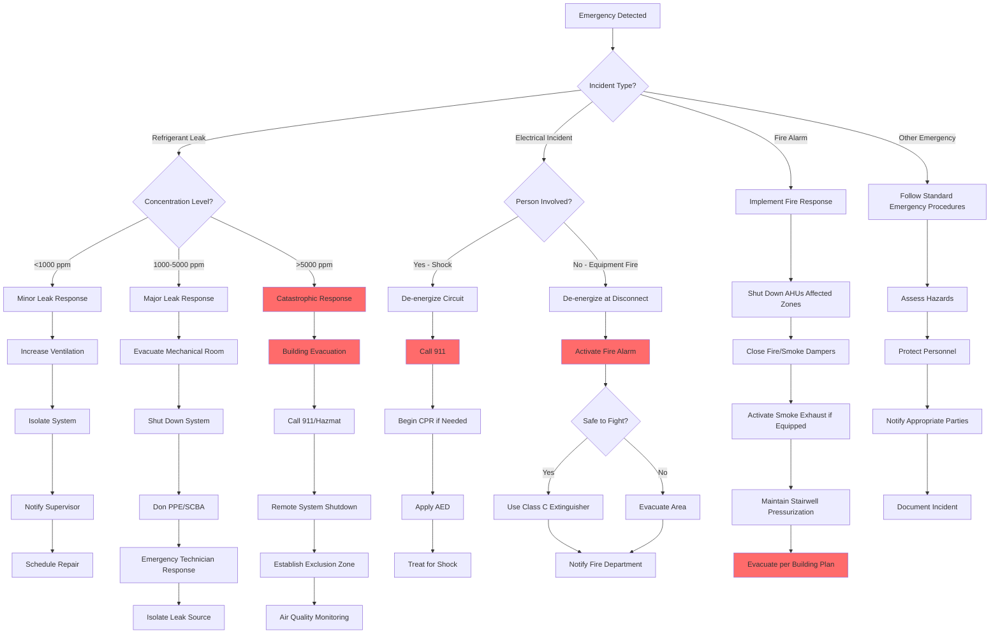

## Emergency Action Plan Requirements

OSHA 29 CFR 1910.38 mandates written emergency action plans for workplaces where HVAC operations present potential hazards. The plan must address evacuation procedures, emergency reporting, rescue operations, and employee accountability. HVAC facilities require specialized protocols due to refrigerant toxicity, electrical hazards, and fire risks from flammable refrigerants.

### Key Elements of HVAC Emergency Plans

**Emergency Coordinator Designation**
Every HVAC facility must designate trained emergency coordinators responsible for implementing response procedures, coordinating with emergency services, and conducting post-incident reviews. Coordinators must maintain current knowledge of refrigerant properties, electrical safety protocols, and fire suppression systems.

**Communication Systems**
Emergency communication requires redundant systems including alarm panels, two-way radios, emergency phones, and visual alarms for high-noise areas. Mechanical rooms housing refrigeration equipment require local alarms for refrigerant detection with notification to building management systems.

**Evacuation Routes and Assembly Points**
Primary and secondary evacuation routes must be clearly marked with photoluminescent signage. Assembly points should be located upwind from mechanical equipment rooms at distances exceeding 150 feet to avoid refrigerant exposure. Routes must avoid electrical rooms and areas containing flammable materials.

## Emergency Response by Incident Type

The following table provides immediate response actions for common HVAC emergencies:

| Incident Type | Immediate Actions | Secondary Response | Notification Requirements |
|---------------|-------------------|-------------------|---------------------------|
| **Refrigerant Leak (Small)** | Ventilate area, evacuate non-essential personnel, isolate system | Don PPE (SCBA if needed), locate leak source, close isolation valves | Facility manager, refrigerant supplier |
| **Refrigerant Leak (Large)** | Activate emergency alarm, evacuate building, shut down HVAC from remote location | Contact hazmat team, establish exclusion zone (100+ ft), monitor air quality | Emergency services (911), EPA, OSHA |
| **Electrical Fire** | De-energize equipment at main disconnect, activate fire alarm, evacuate area | Use Class C extinguisher only if safe, do not use water | Fire department, electrical utility, facility management |
| **Electrical Shock** | Do not touch victim, shut off power source, call 911 | Administer CPR/AED if qualified, treat for shock | Emergency medical services, OSHA (if hospitalization required) |
| **Ammonia Release** | Sound alarm, evacuate upwind, activate emergency ventilation | Don SCBA, isolate leak, apply water fog to absorb vapors | Fire department, hazmat team, OSHA, EPA |
| **Compressor Failure** | Emergency shutdown, check for oil leaks/fire, ventilate | Inspect for mechanical damage, refrigerant loss, electrical faults | Equipment manufacturer, insurance carrier |
| **Thermal Burn** | Remove from heat source, cool with water (15-20 min), remove jewelry | Cover with sterile dressing, treat for shock, monitor vitals | Medical services if 2nd/3rd degree or >3% body area |
| **Chemical Exposure** | Move to fresh air, remove contaminated clothing, flush affected areas | Administer oxygen if available, reference SDS for specific treatment | Poison control, medical services, OSHA |

## Refrigerant Leak Response Protocols

### Detection and Assessment

Refrigerant detectors must be installed in mechanical rooms at floor level (dense refrigerants) or ceiling level (ammonia) with alarm setpoints at 25% TLV-TWA. Upon alarm activation:

1. Acknowledge alarm and note refrigerant type
2. Review system operating conditions via BMS
3. Determine leak severity based on detector concentration readings
4. Initiate appropriate response level (minor, major, or catastrophic)

### Leak Classification Criteria

**Minor Leak:** Detector reading <1000 ppm for halocarbons, <25 ppm for ammonia. System remains operational with increased ventilation. Technician response within 4 hours.

**Major Leak:** Detector reading 1000-5000 ppm halocarbons, 25-150 ppm ammonia. Immediate system shutdown required. Evacuation of mechanical room. Emergency technician response within 1 hour.

**Catastrophic Leak:** Reading >5000 ppm halocarbons, >150 ppm ammonia. Building evacuation, emergency services notification, hazmat response. Refrigerant may displace oxygen creating asphyxiation hazard.

### Personal Protective Equipment Requirements

| Refrigerant Type | Respiratory Protection | Eye Protection | Skin Protection | Additional Requirements |
|------------------|----------------------|----------------|-----------------|------------------------|
| R-410A, R-134a, R-404A | NIOSH-approved respirator for >1000 ppm | Safety glasses, face shield for liquid contact | Insulated gloves for liquid refrigerant | Self-contained breathing apparatus (SCBA) for >10,000 ppm |
| Ammonia (R-717) | Full-face SCBA for >50 ppm | Full-face respirator includes eye protection | Neoprene or rubber gloves, chemical-resistant suit | Escape-only respirator for <300 ppm evacuation |
| CO₂ (R-744) | SCBA required (CO₂ displaces oxygen) | Face shield for high-pressure releases | Insulated gloves for cold burns | Oxygen monitoring equipment mandatory |
| Flammable (R-290, R-32) | Respirator plus explosion-proof equipment | Safety glasses, face shield | Flame-resistant clothing | Non-sparking tools, explosion-proof lighting |

## Electrical Incident Response

### Shock and Electrocution Protocol

Electrical current path through the body causes cardiac arrest, respiratory paralysis, and severe burns. Response sequence:

1. **De-energize the circuit** using nearest disconnect switch or circuit breaker. Do not approach victim while energized.
2. **Call 911 immediately** for all electrical shock incidents regardless of apparent severity.
3. **Begin CPR** if victim is unresponsive and not breathing. Continue until medical personnel arrive.
4. **Apply AED** (automated external defibrillator) following voice prompts.
5. **Treat for shock** by elevating legs, maintaining body temperature, and monitoring consciousness.
6. **Document electrical parameters** including voltage, current path, and contact duration for medical treatment.

### Electrical Fire Suppression

Electrical fires in HVAC equipment require specific suppression methods:

**Energized Equipment:** Use only Class C fire extinguishers (CO₂ or dry chemical). Water-based extinguishers create electrocution hazard. De-energize at main disconnect before applying extinguishing agent.

**De-energized Equipment:** Class A or ABC extinguishers appropriate. Water fog may be used after confirming complete de-energization and lockout/tagout completion.

**Fire in Electrical Room:** Activate fixed suppression system (FM-200, CO₂, or water mist). Evacuate immediately. Close fire-rated doors. Do not re-enter until fire department clearance.

## Fire Emergency Response

### HVAC System Fire Response Actions

When fire occurs in building areas, HVAC systems require specific control sequences:

**Smoke Detection Activation**
- Shut down air handling units serving affected zones
- Close fire/smoke dampers in ductwork penetrating fire barriers
- Activate smoke exhaust systems (if designed for smoke control)
- Maintain stairwell pressurization systems for egress protection
- Continue operation of systems serving non-affected areas

**Sprinkler Flow Alarm**
- Shut down all air handling units to prevent smoke/water migration
- Close all fire dampers
- De-energize electrical equipment in affected areas
- Activate emergency ventilation for post-fire smoke removal
- Maintain operation only for fire-rated smoke control systems

### Fire Extinguisher Selection for HVAC Applications

| Fire Class | Fuel Type | Appropriate Extinguisher | HVAC Applications | Discharge Range |
|------------|-----------|-------------------------|-------------------|-----------------|
| A | Ordinary combustibles (wood, paper, insulation) | Water, ABC dry chemical, foam | Storage areas, offices, insulation fires | 15-20 feet |
| B | Flammable liquids (oil, grease, refrigerant oils) | CO₂, dry chemical, foam | Compressor oil fires, fuel oil systems | 8-12 feet |
| C | Energized electrical equipment | CO₂, dry chemical (non-conductive) | Electrical panels, motors, control systems | 8-10 feet |
| D | Combustible metals (magnesium, titanium) | Class D powder agents | Specialty applications, metal fabrication | 6-8 feet |
| K | Cooking oils and fats | Wet chemical agents | Commercial kitchen exhaust systems | 10-12 feet |

## Emergency Action Plan Flowchart

The following diagram illustrates the emergency response decision tree for HVAC operations:

## Training and Drills

### Required Emergency Training

**Initial Training:** All HVAC personnel must complete emergency action plan training before beginning work. Training covers evacuation routes, alarm systems, emergency equipment locations, and role-specific responsibilities.

**Annual Refresher:** Conduct emergency procedure reviews annually or when plan elements change. Include tabletop exercises simulating refrigerant leaks, electrical incidents, and fire scenarios.

**Evacuation Drills:** Perform unannounced drills quarterly. Drills must include mechanical room evacuations, assembly point procedures, and accountability verification. Document drill performance and corrective actions.

**Specialized Training:** Refrigerant response team members require HAZWOPER training (29 CFR 1910.120). Electrical incident responders need first aid/CPR/AED certification. Designated fire brigade members require specialized fire suppression training.

## Incident Reporting and Documentation

### OSHA Recordkeeping Requirements

**Reportable Events:** Incidents requiring emergency medical treatment beyond first aid, hospitalizations, amputations, loss of consciousness, or fatalities must be reported to OSHA within specified timeframes (8 hours for fatalities, 24 hours for hospitalizations).

**Incident Documentation:** Record incident details including date, time, location, personnel involved, incident type, emergency actions taken, equipment involved, and outcome. Preserve evidence including refrigerant detector logs, alarm system records, and equipment data.

**Root Cause Analysis:** Conduct investigations within 48 hours to identify contributing factors, equipment failures, procedural deficiencies, and training gaps. Implement corrective actions to prevent recurrence.

## Components

- Fire Emergency Response
- Fire Extinguisher Types Training
- Evacuation Routes Procedures
- Assembly Points
- Emergency Communication Systems
- First Aid Training
- Spill Response Procedures
- Material Spill Containment
- Emergency Equipment Location
- Incident Reporting Procedures
