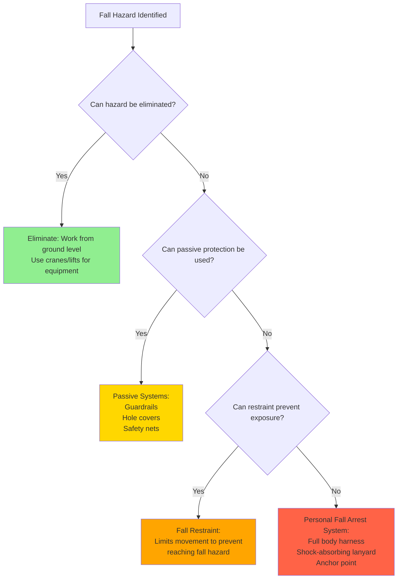

Fall protection represents the most critical safety concern for HVAC technicians, as falls from elevation remain the leading cause of fatalities in construction and maintenance operations. HVAC work frequently involves rooftop equipment installation, servicing condensers, accessing air handling units, and working from ladders—all activities that expose workers to fall hazards.

## Regulatory Framework

OSHA establishes fall protection requirements through two primary standards:

**OSHA 1926 Subpart M (Construction):** Applies to installation, alteration, and major repair of HVAC systems. Requires fall protection at 6 feet or greater.

**OSHA 1910 Subpart D (General Industry):** Applies to routine maintenance and service operations. Specific height triggers vary by activity type.

State-specific OSHA plans may impose more stringent requirements. California's Cal/OSHA, for example, requires fall protection at 7.5 feet for certain applications but 6 feet for others. Always verify local requirements.

## Fall Protection Requirements by Height

| Work Activity | OSHA Standard | Height Trigger | Protection Required |
|--------------|---------------|----------------|---------------------|
| Rooftop equipment installation | 1926.501(b)(10) | 6 feet | Guardrails, safety nets, or PFAS |
| Roof edge work (unprotected sides) | 1926.501(b)(1) | 6 feet | Guardrails, safety nets, or PFAS |
| Ladder climbing (fixed vertical) | 1910.27 | 24 feet | Ladder safety system or PFAS |
| Scaffold work | 1926.451 | 10 feet | Guardrails or PFAS |
| Aerial lift platforms | 1926.453 | Any height | Body harness attached to boom/basket |
| Walking/working surfaces | 1910.28 | 4 feet | Guardrails or PFAS |
| Servicing rooftop units | 1910.28(b)(13) | 4 feet | Guardrails or PFAS |

## Hierarchy of Fall Protection Controls

The hierarchy prioritizes methods from most protective (elimination) to least (personal fall arrest). While personal fall arrest systems (PFAS) are commonly used in HVAC work, passive systems like guardrails provide superior protection when feasible.

## Rooftop Equipment Work

Rooftop HVAC installations present unique fall hazards due to:

- **Perimeter exposure:** Equipment often sits near roof edges during rigging operations
- **Penetrations:** Roof access hatches, skylights, and mechanical openings
- **Weather conditions:** Wind affects stability, ice creates slip hazards
- **Equipment size:** Large RTUs may block sight lines to edge conditions

### Rooftop Protection Methods

**Permanent Guardrail Systems:**
- Install per 1910.29: 42-inch top rail, mid-rail, toe board
- Must withstand 200 lbs applied within 2 inches of top edge
- Ideal for frequently accessed equipment
- Requires structural engineering for attachment

**Warning Line Systems (Low-Slope Roofs Only):**
- Permitted on roofs with slope less than 4:12 (1926.502(f))
- Must be erected 6 feet from roof edge
- Requires designated monitor when workers cross warning line
- Not permitted as sole protection during mechanical equipment work—must combine with other methods

**Personal Fall Arrest Systems:**
- Required when working within 6 feet of unprotected edge
- Anchor points must support 5,000 lbs per attached worker (1926.502(d)(15))
- Total fall distance must not exceed clearance to lower level
- Requires rescue plan

## Personal Fall Arrest System Components

A complete PFAS consists of three elements working together:

### 1. Anchorage/Anchor Point
- Must support 5,000 lbs per attached worker or maintain 2:1 safety factor under supervision of qualified person
- Common HVAC anchor points: structural steel, parapet walls (engineered), roof anchors
- Portable anchor systems available for temporary installations
- **Never attach to:** HVAC equipment, conduit, ductwork, piping, or non-rated structural elements

### 2. Body Harness
- Only full-body harnesses permitted (body belts prohibited since 1998)
- D-ring positioned between shoulder blades for dorsal attachment
- Must fit properly: harness straps should not be twisted, torso straps snug
- Inspect before each use for cuts, abrasions, chemical damage, or stretched hardware

### 3. Connecting Device
- **Shock-absorbing lanyards:** Limit maximum arrest force to 1,800 lbs
- **Self-retracting lifelines:** Automatically adjust length, lock during fall
- **Rope grabs:** Slide freely on vertical lifeline, lock under sudden load
- Maximum free fall distance: 6 feet
- Total fall arrest distance calculation: free fall + lanyard deceleration + harness/body elongation + safety factor

### Fall Distance Calculation Example

For 6-foot lanyard with shock absorber on flat roof:

- Free fall: 6 feet (lanyard length)
- Deceleration distance: 3.5 feet (shock absorber deployment)
- Harness/body stretch: 1 foot
- Safety margin: 2 feet
- **Total fall clearance required: 12.5 feet minimum**

This calculation demonstrates why PFAS may not be suitable for low-elevation work without proper planning.

## Ladder Safety for HVAC Applications

Ladders provide access to rooftop equipment, elevated condensers, and air handling units. HVAC-specific ladder hazards include:

**Extension Ladders:**
- Must extend 3 feet above landing surface
- 1:4 ratio (1 foot out for every 4 feet up)
- 3-point contact during climbing
- Secure top and bottom to prevent shifting
- Rated for load: Type I (250 lbs industrial) minimum

**Fixed Vertical Ladders:**
- Cages required for 20-30 feet travel distance (1910.27)
- Ladder safety systems or PFAS required above 24 feet
- Side rails must extend 42 inches above landing
- Rungs spaced 12 inches on center

**Step Ladders:**
- Never use top two steps
- Maintain 3-point contact
- Set up on level surface
- Face ladder when ascending/descending

## Training and Competent Person Requirements

OSHA requires fall protection training before employees are exposed to fall hazards (1926.503). Training must cover:

- Nature of fall hazards in work area
- Correct procedures for erecting, maintaining, and dismantling fall protection systems
- Proper use, inspection, and storage of equipment
- Role and function of each PFAS component
- Limitations of equipment
- Rescue procedures

A **competent person** must be present on jobsites where fall protection is required. This individual must be capable of identifying fall hazards and have authority to take corrective action. For HVAC contractors, this is typically a foreman or project supervisor with specialized training.

## Inspection and Maintenance

Fall protection equipment must be inspected before each use and removed from service if defective:

**Harness Inspection Points:**
- Webbing: fraying, cuts, chemical burns, excessive wear
- D-rings: cracks, distortion, sharp edges
- Buckles: distortion, cracks, proper function
- Stitching: pulled or cut stitches, loose threads

**Lanyard/SRL Inspection:**
- Housing cracks or damage
- Corrosion on components
- Activation indicator (shock absorber)
- Label legibility

**Anchor Points:**
- Structural integrity of attachment
- Corrosion or deterioration
- Proper installation per manufacturer specifications

Equipment involved in a fall event must be immediately removed from service and inspected by qualified person or manufacturer before returning to use.

## Emergency Rescue Planning

OSHA requires employers to provide prompt rescue of fallen workers or means of self-rescue (1926.502(d)(20)). Suspension trauma can cause unconsciousness or death within minutes as blood pools in legs.

Rescue plan elements:

1. Identify rescue equipment (rescue ladder, rope systems, aerial lift access)
2. Train designated rescue personnel
3. Establish communication protocols
4. Coordinate with local emergency services
5. Conduct rescue drills
6. Provide suspension relief straps in harnesses for self-rescue

## Components

- Roof Edge Protection
- Guardrail Systems
- Personal Fall Arrest Systems
- Anchor Points Fall Protection
- Full Body Harness
- Lifeline Systems
- Ladder Safety
- Scaffold Safety
- Aerial Lift Safety
