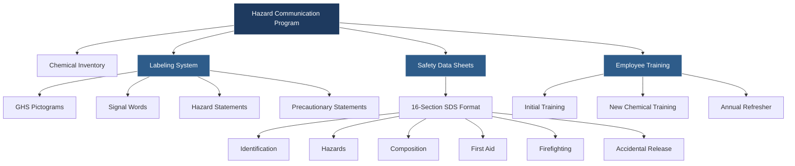

OSHA's Hazard Communication Standard (HazCom 2012, 29 CFR 1910.1200) mandates that employers provide information about hazardous chemicals used in HVAC operations. This "right to know" standard requires a comprehensive program addressing chemical identification, hazard assessment, protective measures, and emergency response for all chemicals present in the workplace.

## OSHA HazCom Standard Requirements

The standard applies to all chemicals with known physical or health hazards. For HVAC technicians, this encompasses refrigerants, brazing materials, solvents, cleaning agents, oils, acids, and combustion products. The standard requires three primary elements: a written hazard communication program, proper labeling of all chemical containers, and maintenance of Safety Data Sheets (SDS) accessible to all employees.

Employers must develop a written program describing how the workplace meets HazCom requirements. This document identifies the responsible person, lists all hazardous chemicals, explains labeling systems, details SDS locations and accessibility, and outlines employee training protocols. The program must be available to employees and updated whenever new chemicals are introduced.

## Globally Harmonized System (GHS)

The GHS provides standardized criteria for classifying chemical hazards and a uniform format for labels and Safety Data Sheets. Adopted by OSHA in 2012, GHS alignment ensures consistent hazard communication across international boundaries, particularly important for HVAC equipment and chemicals sourced globally.

## Common HVAC Chemical Hazards

HVAC technicians encounter numerous hazardous materials requiring proper communication and handling protocols.

### Refrigerants and Hazard Classifications

| Refrigerant | ASHRAE Safety Group | Primary Hazards | GHS Pictograms |
|-------------|---------------------|-----------------|----------------|
| R-410A | A1 | Simple asphyxiant, high pressure | Gas cylinder, exclamation mark |
| R-22 | A1 | Simple asphyxiant, ozone depletion | Gas cylinder |
| R-134a | A1 | Simple asphyxiant, high pressure | Gas cylinder |
| R-32 | A2L | Mildly flammable, asphyxiant | Flame, gas cylinder |
| R-290 (Propane) | A3 | Extremely flammable, asphyxiant | Flame, gas cylinder |
| R-717 (Ammonia) | B2 | Toxic, flammable, corrosive | Flame, skull and crossbones, corrosion |
| R-744 (CO₂) | A1 | Asphyxiant, high pressure | Gas cylinder, exclamation mark |

### Brazing and Soldering Materials

| Material | Hazards | Exposure Limits | PPE Required |
|----------|---------|-----------------|--------------|
| Silver brazing alloys | Metal fume fever, cadmium exposure | Cadmium: 5 μg/m³ TWA | Respirator, ventilation |
| Brazing flux | Corrosive, irritant | Varies by composition | Gloves, eye protection |
| Lead-tin solder | Lead poisoning, neurological effects | Lead: 50 μg/m³ TWA | Respirator, gloves |
| Phosphorus-copper | Phosphine gas generation | STEL: 0.3 ppm | Local exhaust ventilation |

### Solvents and Cleaning Agents

| Chemical | Use | Health Effects | Flash Point |
|----------|-----|----------------|-------------|
| Acetone | Parts cleaning, degreasing | CNS depression, eye irritation | 0°F (-18°C) |
| Trichloroethylene | Coil cleaning | Carcinogen, liver/kidney damage | Non-flammable |
| Mineral spirits | General degreasing | Aspiration hazard, dermatitis | 105°F (41°C) |
| MEK (methyl ethyl ketone) | Adhesive, cleaning | CNS depression, respiratory irritation | 16°F (-9°C) |
| Isopropyl alcohol | Electronic cleaning | Flammable, eye irritation | 53°F (12°C) |

### Acids and Corrosives

| Chemical | HVAC Application | pH | Specific Hazards |
|----------|------------------|-----|------------------|
| Hydrochloric acid (muriatic) | Condenser cleaning | <1 | Severe burns, corrosive fumes |
| Sulfuric acid | Battery maintenance | <1 | Severe burns, exothermic reactions |
| Phosphoric acid | Rust removal | 1-2 | Moderate burns, corrosive |
| Citric acid | Scale removal | 2-3 | Mild irritant, safer alternative |

## Safety Data Sheets (SDS)

The 16-section SDS format provides comprehensive chemical information. Section 1 identifies the chemical and supplier. Section 2 details hazard classification and GHS label elements. Section 3 lists composition and ingredient information. Section 4 describes first aid measures. Section 5 covers firefighting measures. Section 6 addresses accidental release procedures.

Section 7 explains handling and storage requirements. Section 8 specifies exposure controls and personal protection. Section 9 provides physical and chemical properties. Section 10 discusses stability and reactivity. Section 11 details toxicological information. Section 12 covers ecological information.

Section 13 addresses disposal considerations. Section 14 provides transport information. Section 15 lists regulatory information. Section 16 includes the preparation date and revision history.

Employers must maintain current SDS for all hazardous chemicals in the workplace. These documents must be readily accessible during each work shift, available in electronic or paper format. Many HVAC contractors maintain digital SDS libraries accessible via smartphone or tablet for field technicians.

## Chemical Labeling Requirements

Every chemical container must display a GHS-compliant label containing six elements. The product identifier matches the SDS. Signal words indicate hazard severity—"Danger" for severe hazards, "Warning" for less severe. Standardized hazard statements describe the nature and degree of hazard using specific phrases like "Extremely flammable aerosol" or "Harmful if inhaled."

Precautionary statements recommend protective measures, storage conditions, and emergency response actions. GHS pictograms provide visual hazard warnings through standardized symbols: flame (flammable), gas cylinder (compressed gas), corrosion (skin/eye damage), skull and crossbones (acute toxicity), exclamation mark (irritant), health hazard (systemic effects), environment (aquatic toxicity), exploding bomb (explosive), and flame over circle (oxidizer).

The supplier identification section provides the manufacturer's name, address, and emergency phone number. Secondary containers used during the work shift must be labeled with the chemical identity and hazard warnings unless the chemical remains under the direct control of the employee who transferred it.

## Employee Training Requirements

Employers must provide HazCom training before initial work assignment and whenever new hazards are introduced. Training covers the HazCom standard requirements, hazardous chemical operations in the work area, physical and health hazards of chemicals, protective measures including PPE and emergency procedures, SDS location and interpretation, and label reading including GHS pictograms.

Documentation of training includes the training date, employee names, instructor name, and topics covered. Annual refresher training reinforces procedures and updates employees on new chemicals or revised procedures. Technicians must demonstrate understanding of label information, SDS navigation, appropriate PPE selection, and emergency response for chemicals they handle.

Effective training emphasizes practical applications. For refrigerant handling, this includes cylinder identification, pressure gauge interpretation, leak detection procedures, and response to refrigerant releases. For brazing operations, training covers flux hazards, metal fume fever symptoms, ventilation requirements, and respirator use.

## Refrigerant-Specific Considerations

Refrigerants present unique hazards requiring specific communication protocols. A2L refrigerants like R-32 and R-454B introduce mild flammability concerns in concentrations above the Lower Flammability Limit (LFL). Technicians must understand concentration limits, detection methods, and ignition source control.

Thermal decomposition of refrigerants exposed to flames or hot surfaces produces toxic gases including hydrogen fluoride, carbonyl fluoride, and phosgene. SDS information on decomposition products guides emergency response during fires or brazing incidents near refrigerant leaks.

Asphyxiation hazards arise when refrigerant concentrations displace oxygen in confined spaces. The Refrigerant Concentration Limit (RCL) based on ASHRAE Standard 15 determines safe concentration thresholds. Technicians must recognize symptoms of oxygen deficiency: increased breathing rate, headache, dizziness, poor coordination, and loss of consciousness.

## Chemical Storage and Segregation

Proper storage prevents dangerous reactions between incompatible materials. Acids must be separated from bases, oxidizers from flammables, and water-reactive materials from moisture sources. Compressed gas cylinders require upright storage with caps installed and restraints preventing falls.

Storage areas must provide adequate ventilation, appropriate temperature control, containment for spills, and access restrictions. Secondary containment for liquid chemicals prevents environmental contamination. Storage cabinets for flammable materials limit fire spread and provide organization.

Labels on storage areas identify contents and hazards. Inventory management ensures older chemicals are used first and outdated materials are properly disposed. Regular inspections check container integrity, label legibility, and storage condition compliance.

## Implementation Best Practices

Successful HazCom programs integrate chemical management into daily operations. Conduct a comprehensive chemical inventory identifying every hazardous material in the workplace, including service vehicle contents. Obtain current SDS for all chemicals, verifying they reflect current GHS format.

Develop clear labeling procedures for secondary containers, particularly in service vehicles where chemicals may be transferred to smaller, more portable containers. Establish SDS accessibility in multiple formats—wall-mounted binders at shop locations, digital libraries for field access, and backup systems ensuring availability during internet outages.

Create chemical-specific training modules addressing the hazards technicians actually encounter. Generic training lacks the practical context needed for effective hazard recognition. Use actual product labels and SDS from your inventory during training sessions.

Regular program audits verify compliance and identify improvement opportunities. Check that all chemicals have current SDS, all containers are properly labeled, training documentation is complete, and employees can demonstrate understanding of the program requirements.

## Conclusion

Hazard communication protects HVAC technicians by ensuring they understand chemical hazards and appropriate protective measures. Compliance with OSHA's HazCom Standard requires systematic implementation of written programs, labeling protocols, SDS management, and comprehensive training. The integration of GHS provides consistent hazard information regardless of chemical origin, particularly important in an industry utilizing globally-sourced equipment and materials. Effective programs translate regulatory requirements into practical procedures that protect workers while maintaining operational efficiency.
