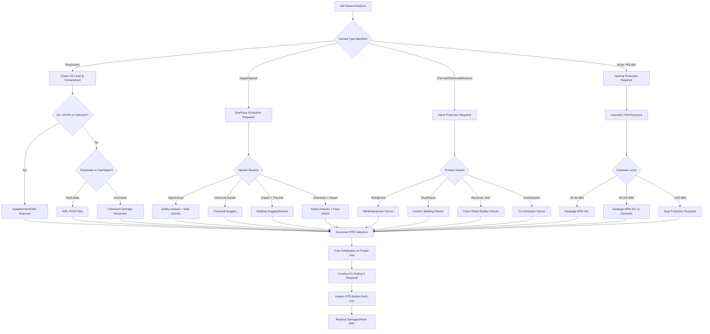

Personal protective equipment represents the final barrier between HVAC technicians and workplace hazards. OSHA requires employers to assess workplace hazards and provide appropriate PPE at no cost to employees per 29 CFR 1910.132. HVAC work presents unique exposure risks including refrigerant contact, brazing operations, confined space entry, noise exposure, and electrical hazards that demand task-specific protection strategies.

## Respiratory Protection Requirements

OSHA's Respiratory Protection Standard (29 CFR 1910.134) mandates a comprehensive program when respiratory hazards cannot be eliminated through engineering controls. HVAC technicians encounter respiratory hazards during refrigerant handling, confined space work, and exposure to particulates.

**Refrigerant exposure** requires specific protection based on concentration and refrigerant type. R-410A and R-134a create asphyxiation hazards in confined spaces where concentrations exceed 1000 ppm. Air-purifying respirators prove ineffective against asphyxiation; supplied-air respirators or self-contained breathing apparatus become necessary when oxygen levels drop below 19.5% or refrigerant concentrations exceed safe limits.

**Particulate exposure** during filter changes, duct cleaning, and demolition requires N95 or higher filtration efficiency. Mold remediation work necessitates P100 filters providing 99.97% filtration efficiency against oil and non-oil particulates. Half-face or full-face elastomeric respirators with appropriate cartridges offer reusable protection for extended operations.

**Fit testing** represents a critical OSHA requirement for tight-fitting respirators. Quantitative fit testing measures actual leakage, while qualitative testing uses taste or smell detection. Annual fit testing and user seal checks before each use ensure proper protection factors.

## Eye and Face Protection

ASHRAE Standard 15 and OSHA 29 CFR 1910.133 require eye protection during refrigerant handling and brazing operations. Protection selection depends on specific hazard characteristics.

| Hazard Type | Required Protection | Impact Rating | Additional Requirements |
|-------------|-------------------|---------------|------------------------|
| Refrigerant handling | Chemical splash goggles | N/A | Indirect vents, liquid-tight seal |
| Brazing/welding | Shade 3-5 welding goggles | Z87.1 | UV/IR filtration, minimum shade 3 |
| Grinding/cutting | Safety glasses with side shields | Z87+ | Impact-rated, minimum 1 mm polycarbonate |
| Overhead work | Safety glasses + face shield | Z87+ | Chin protection, anti-fog coating |
| Confined space entry | Full-face respirator | N/A | Provides combined respiratory/eye protection |

**Polycarbonate lenses** provide superior impact resistance compared to standard plastic, meeting ANSI Z87.1+ high-impact requirements. Anti-fog coatings maintain visibility in humid conditions common during startup and commissioning. Prescription safety glasses must meet the same impact standards as non-prescription variants.

**Face shields** supplement but never replace safety glasses. Brazing operations above shoulder height demand both safety glasses and face shields to protect against molten metal droplets that can deflect around single-layer protection.

## Hand Protection Selection

HVAC work demands task-specific glove selection based on mechanical, thermal, chemical, and electrical hazards. No single glove provides universal protection.

| Task Category | Glove Type | Protection Standard | Limitations |
|--------------|-----------|-------------------|-------------|
| Refrigerant handling | Neoprene or nitrile | Chemical resistance | Not for thermal hazards |
| Brazing operations | Leather welding gloves | ASTM F1060 heat resistance | Remove when handling refrigerants |
| Electrical work >50V | Class 00-4 rubber insulating | ASTM D120, IEC 60903 | Inspect before each use, retest every 6-12 months |
| Sheet metal fabrication | Cut-resistant (ANSI A4+) | ANSI/ISEA 105 | Does not prevent punctures |
| General handling | Mechanics gloves | ANSI abrasion level 3+ | Not chemical or heat resistant |

**Electrical insulating gloves** require leather protectors to prevent physical damage. Class 00 gloves protect up to 500V AC, while Class 4 gloves provide protection to 36,000V AC. Visual inspection before each use and periodic electrical testing at intervals specified by ASTM D120 ensure continued protection.

**Chemical resistance** varies by refrigerant type. Nitrile gloves provide excellent resistance to mineral oils and many refrigerants but degrade rapidly when exposed to aromatic hydrocarbons. Neoprene offers broader chemical resistance including resistance to refrigerants, oils, and mild acids.

## Hearing Protection

OSHA requires hearing protection when 8-hour time-weighted average noise exposure exceeds 85 dBA (29 CFR 1910.95). HVAC equipment generates significant noise hazards during operation, testing, and installation.

**Noise exposure levels** common in HVAC work:

| Equipment/Activity | Typical Sound Level | Maximum Duration (85 dBA) | Protection Required |
|-------------------|-------------------|------------------------|-------------------|
| Reciprocating compressors | 95-105 dBA | 2-4 hours | Yes |
| Large centrifugal chillers | 85-95 dBA | 4-8 hours | Yes |
| Pneumatic tools | 95-110 dBA | 15 minutes - 2 hours | Yes |
| Duct fabrication shop | 90-100 dBA | 1-8 hours | Yes |
| Rooftop unit startup | 80-90 dBA | Full shift - 8 hours | Recommended |

**Noise Reduction Rating (NRR)** indicates the decibel reduction provided under ideal laboratory conditions. Real-world protection equals approximately 50% of the labeled NRR. Disposable foam earplugs typically provide NRR 29-33 dB, while earmuffs range from NRR 21-31 dB. Dual protection (plugs and muffs) provides maximum attenuation for extreme noise environments exceeding 105 dBA.

**Communication requirements** during team operations may necessitate electronic earmuffs with talk-through features or custom-molded musicians' earplugs that attenuate uniformly across frequencies while preserving speech intelligibility.

## PPE Selection Process

The hierarchy of hazard identification and PPE selection follows a systematic evaluation:

## Additional Protection Equipment

**Hard hats** meeting ANSI Z89.1 Type I (top impact) or Type II (top and lateral impact) protect against falling objects and overhead hazards common during equipment rigging and rooftop work. Class E hard hats provide electrical protection up to 20,000V.

**Steel-toe boots** conforming to ASTM F2413 protect against compression and impact hazards from dropped equipment and materials. Electrical hazard (EH) rated boots provide secondary protection against open circuits up to 600V in dry conditions.

**Arc-rated clothing** becomes mandatory when performing electrical work on energized equipment exceeding 50V with available incident energy levels requiring protection. NFPA 70E tables specify minimum arc rating based on calculated incident energy and working distance.

## Maintenance and Inspection

OSHA requires employers to ensure PPE remains in serviceable condition. Inspection protocols vary by equipment type:

**Respiratory equipment** demands daily user inspection of straps, valves, and sealing surfaces. Quarterly inspections of emergency-use respirators and monthly inspections of supplied-air systems by qualified personnel ensure reliability.

**Electrical gloves** require air inflation testing before each use to detect punctures or cracks. Certified laboratory testing occurs every 6 months for gloves in regular use, annually for occasional-use gloves.

**Fall protection** equipment serving rooftop technicians requires inspection before each use and formal documented inspection at least annually by a competent person per ANSI Z359.

Proper PPE selection, maintenance, and use represent non-negotiable elements of comprehensive HVAC safety programs. Training employees on limitations, proper donning and doffing procedures, and maintenance requirements ensures PPE provides intended protection throughout its service life.
