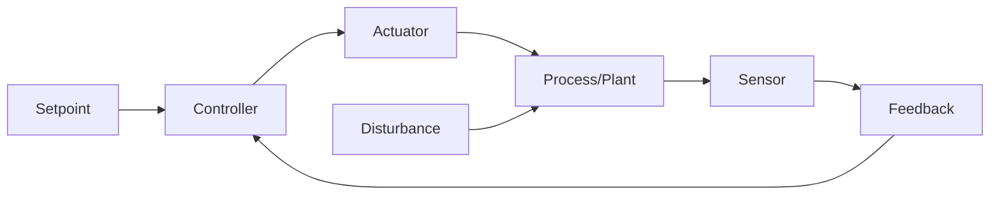
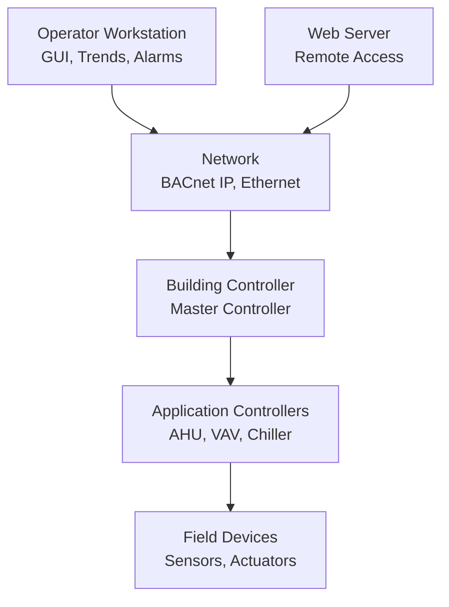

# Controls & Automation

Building automation and control systems optimize HVAC performance, reduce energy consumption, maintain occupant comfort, and enable remote monitoring. This section covers control theory fundamentals, sensor and actuator technologies, control strategies, building automation system architectures, and cybersecurity for connected buildings.

## Control Theory Fundamentals

### Feedback Control

**Closed-loop control:** Measure controlled variable, compare to setpoint, adjust manipulated variable to eliminate error.

**Control error:**

$$e(t) = SP - PV$$

Where:
- $SP$ = setpoint
- $PV$ = process variable (measured value)

**Controller output:**

$$CO(t) = f(e(t))$$

### PID Control

**Proportional-Integral-Derivative (PID) control algorithm:**

$$CO(t) = K_p \cdot e(t) + K_i \int_0^t e(\tau) d\tau + K_d \frac{de(t)}{dt}$$

Where:
- $K_p$ = proportional gain
- $K_i$ = integral gain
- $K_d$ = derivative gain

**Control actions:**

1. **Proportional (P):** Output proportional to error
   - Fast response
   - Offset (steady-state error) remains
   - Throttling range = 1/$K_p$

2. **Integral (I):** Output based on accumulated error
   - Eliminates offset
   - Slow response, can cause overshoot/oscillation

3. **Derivative (D):** Output based on rate of error change
   - Anticipates future error
   - Reduces overshoot, improves stability
   - Sensitive to noise

**Tuning methods:**
- **Ziegler-Nichols:** Empirical rules based on system response
- **Trial and error:** Adjust until satisfactory performance
- **Autotuning:** Controller performs step test, calculates gains

**Typical HVAC applications:**
- Discharge air temperature control (cooling/heating valve modulation)
- Supply air pressure control (fan VFD modulation)
- Room temperature control (VAV damper position)

### Advanced Control Strategies

**Cascade control:**
- Master controller sets setpoint for slave controller
- Example: Room temperature (master) → discharge air temperature (slave)
- Improved disturbance rejection

**Feedforward control:**
- Measures disturbance, compensates before affecting process
- Example: Outdoor air temperature → preheat valve position
- Faster response than feedback alone

**Ratio control:**
- Maintains ratio between two flows
- Example: Outdoor air damper position vs. return air damper (constant ventilation fraction)

**Adaptive control:**
- Controller parameters adjust based on system performance
- Useful for nonlinear systems or time-varying dynamics

## Sensors and Measurement

### Temperature Sensors

**Resistance Temperature Detector (RTD):**
- Platinum element (Pt100, Pt1000)
- Linear resistance vs. temperature
- Accuracy: ±0.1°F (Class A RTD)
- Range: -200 to 850°F
- Applications: Critical measurement (laboratories, pharmaceuticals)

**Thermistor:**
- Negative temperature coefficient (NTC) typical
- Nonlinear, high sensitivity
- Accuracy: ±0.2°F
- Range: -40 to 200°F
- Applications: Room sensors, duct sensors (HVAC standard)

**Thermocouple:**
- Voltage generated at junction of dissimilar metals
- Type T (copper-constantan): -200 to 700°F, ±1.8°F
- Type J (iron-constantan): 32 to 1,400°F
- Applications: Flue gas, high temperature processes

**Calibration:** Annual verification at two points (ice bath 32°F, boiling water 212°F)

### Pressure Sensors

**Differential pressure transmitter:**
- Measures pressure difference across coil, filter, duct section
- Diaphragm deflection → capacitance or strain gauge
- Range: 0-0.1" w.c. to 0-50 psi
- Applications: Filter status, airflow measurement, duct static pressure

**Absolute pressure sensor:**
- Measures pressure relative to vacuum
- Applications: Barometric pressure, refrigerant pressure

**Gauge pressure sensor:**
- Measures pressure relative to atmosphere
- Applications: Hydronic system pressure

### Humidity Sensors

**Relative humidity (RH) sensors:**
- **Capacitive:** Dielectric constant changes with moisture
- **Resistive:** Electrical resistance varies with humidity
- Accuracy: ±2-5% RH typical
- Applications: Room humidity, outdoor air, duct humidity

**Dewpoint sensors:**
- Chilled mirror (most accurate, ±0.3°F)
- Capacitive polymer (±3°F dewpoint)
- Applications: Compressed air dryers, critical processes

**Calibration:** Salt solutions (33% RH, 75% RH standards)

### Airflow Measurement

**Differential pressure (DP) airflow:**
- Measure pressure drop across flow element
- Averaging Pitot tubes, flow grids, venturi sections

$$CFM = K \sqrt{\Delta P}$$

Where $K$ = flow coefficient (depends on duct size, element type)

**Thermal dispersion:**
- Heated element, measure cooling effect (mass flow)
- Applications: Low velocity (fume hood face velocity)

**Vortex shedding:**
- Frequency of vortices proportional to velocity
- Applications: Water flow, steam flow

**Ultrasonic:**
- Transit time difference (upstream vs. downstream)
- Applications: Chilled water flow (non-invasive clamp-on)

### Occupancy and Air Quality Sensors

**Passive infrared (PIR):**
- Detect motion via thermal radiation
- Applications: Demand-controlled ventilation, lighting control

**CO₂ sensors:**
- Non-dispersive infrared (NDIR) sensor
- Range: 0-2,000 ppm typical
- Applications: Demand-controlled ventilation (ASHRAE 62.1)

**Volatile organic compounds (VOC):**
- Metal oxide semiconductor (MOS) sensor
- Detects formaldehyde, cleaning chemicals, off-gassing
- Applications: IAQ monitoring, demand ventilation

**Particulate matter (PM2.5, PM10):**
- Laser scattering sensor
- Applications: IAQ monitoring, filter change indication

## Actuators

### Pneumatic Actuators

**Operating pressure:** 8-15 psi (typical)

**Types:**
- **Spring return:** Spring closes/opens valve on air failure (fail-safe)
- **Double-acting:** Air pressure both directions (requires constant signal)

**Applications:** Dampers, control valves (legacy systems, still common in industrial)

**Advantages:** Intrinsically safe (no spark hazard), rugged
**Disadvantages:** Requires compressed air, slower response than electric

### Electric Actuators

**Modulating actuators:**
- Motor drives valve/damper to position based on 0-10 VDC or 4-20 mA signal
- Positioning feedback: potentiometer or encoder
- Actuation time: 30-90 seconds typical
- Applications: VAV dampers, control valves, economizer dampers

**Two-position actuators:**
- Open or closed only (on/off control)
- Applications: Isolation dampers, on/off valves

**Spring return vs. non-spring return:**
- **Spring return:** Fail-safe position (closed or open) on power loss
- **Non-spring return:** Maintains position on power loss

### Hydraulic Actuators

**High force applications:**
- Large dampers (> 10 ft²)
- High-pressure valves
- Applications: Rare in HVAC, common in industrial process control

## Control Strategies

### Heating and Cooling Sequences

**Single-zone VAV with reheat:**
1. Cooling demand: Increase airflow (open damper), modulate cooling valve
2. Minimum airflow: Close damper to minimum ventilation
3. Heating demand: Modulate reheat coil valve

**Dual-duct system:**
- Separate hot and cold duct
- Mixing dampers at zone: modulate to maintain zone temperature
- Energy inefficient (simultaneous heating and cooling)

**Outdoor air reset:**
- Supply water/air temperature varies with outdoor temperature
- Reduces energy consumption, improves comfort

$$T_{supply} = T_{min} + (T_{max} - T_{min}) \times \frac{OAT_{max} - OAT}{OAT_{max} - OAT_{min}}$$

**Example (heating water reset):**
- Outdoor 20°F → Supply water 180°F
- Outdoor 60°F → Supply water 120°F

### Economizer Control

**Air-side economizer:** Use outdoor air for free cooling when conditions favorable

**Control strategies:**

1. **Fixed drybulb:** Enable when OAT < 55°F (simple, no enthalpy calculation)
2. **Differential drybulb:** Enable when OAT < return air temperature
3. **Fixed enthalpy:** Enable when outdoor enthalpy < 28 Btu/lb (prevents high humidity intake)
4. **Differential enthalpy:** Enable when outdoor enthalpy < return enthalpy (most efficient)

**Integrated economizer + DX cooling:**
- 100% outdoor air when OAT favorable
- Modulate to minimum outdoor air as OAT rises
- Enable mechanical cooling when outdoor air insufficient

### Demand-Controlled Ventilation (DCV)

**CO₂-based DCV:**
- Measure zone CO₂ concentration
- Modulate outdoor air damper to maintain < 1,000 ppm (ASHRAE 62.1 guideline)
- Energy savings in variable-occupancy spaces (conference rooms, auditoriums)

**Ventilation calculation:**

$$CFM_{OA} = \frac{N \cdot G}{C_{space} - C_{outdoor}}$$

Where:
- $N$ = number of occupants
- $G$ = CO₂ generation rate (0.005 cfh/person typical)
- $C_{space}$ = space CO₂ setpoint (1,000 ppm)
- $C_{outdoor}$ = outdoor CO₂ (400 ppm)

### Variable Flow Pumping

**Primary-only variable flow:**
- Single loop, variable speed pump
- Modulate pump speed to maintain differential pressure setpoint
- Most efficient for variable loads

**Differential pressure (DP) setpoint reset:**
- Measure DP at critical (farthest) coil
- Reduce pump speed until one valve is 90-95% open (minimum DP required)
- Energy savings: pump power ∝ flow³

## Building Automation System (BAS) Architecture

### System Components

**Building controller:**
- Central supervisory control
- Global scheduling, alarming, trending
- Energy optimization algorithms

**Application controllers:**
- Dedicated to equipment (AHU, VAV box, chiller)
- Local control loops (PID)
- Standalone operation if network fails

**Field devices:**
- Sensors, actuators, zone sensors
- Communicating (BACnet MS/TP, LonWorks) or hardwired (0-10V, 4-20mA)

### Communication Protocols

**BACnet (Building Automation and Control Networks):**
- ASHRAE/ANSI Standard 135
- Open protocol, interoperability between manufacturers
- Physical layers: BACnet/IP (Ethernet), BACnet MS/TP (RS-485)
- Data models: Objects (Analog Input, Binary Output, Schedule, etc.)

**LonWorks:**
- Echelon protocol
- Peer-to-peer architecture
- Legacy systems, less common in new construction

**Modbus:**
- Industrial protocol (PLCs, meters, VFDs)
- Simple, widely supported
- Modbus TCP (Ethernet) or Modbus RTU (RS-485)

### Integration and Interoperability

**BTL (BACnet Testing Laboratory) certification:**
- Verifies BACnet compliance
- Ensures interoperability between manufacturers

**Gateway integration:**
- Translates between protocols (BACnet ↔ Modbus, BACnet ↔ LonWorks)
- Connects legacy systems to modern BAS

## Cybersecurity for Building Controls

### Threat Landscape

**Risks:**
- Unauthorized access (hackers, insiders)
- Malware/ransomware
- Denial of service (DoS)
- Data exfiltration (occupancy patterns, building schedules)

**Vulnerabilities:**
- Unencrypted communications
- Default passwords
- Unpatched software
- Direct internet exposure

### Security Best Practices

**Network segmentation:**
- Separate BAS network from IT network (VLAN, firewall)
- No direct internet access to controllers
- VPN for remote access (not port forwarding)

**Access control:**
- Strong passwords (12+ characters, complexity)
- Multi-factor authentication (MFA)
- Role-based access (operators, administrators, viewers)
- Audit logging (who changed what, when)

**Patch management:**
- Regular firmware updates
- Test patches on non-critical systems first
- Documented patching procedure

**Encryption:**
- BACnet/SC (Secure Connect) for encrypted communications
- TLS/SSL for web interfaces

## Browse Topics

Explore detailed subtopics within controls and automation:

- **[Control Theory](./control-theory/)** - PID control, cascade, feedforward, stability
- **[Sensors](./sensors/)** - Temperature, pressure, humidity, flow, IAQ sensors
- **[Actuators](./actuators/)** - Pneumatic, electric, hydraulic actuators
- **[Control Strategies](./control-strategies/)** - Sequences, reset schedules, optimization
- **[BAS Architecture](./bas-architecture/)** - Controllers, networks, protocols
- **[BACnet Protocol](./bacnet-protocol/)** - Objects, services, integration
- **[Cybersecurity](./cybersecurity/)** - Threats, vulnerabilities, best practices
- **[Energy Optimization](./energy-optimization/)** - Demand response, load shedding, optimal start/stop

## Reference Standards

- **ASHRAE Guideline 13:** Specifying Building Automation Systems
- **ASHRAE Standard 135 (BACnet):** Data Communication Protocol
- **ASHRAE Guideline 36:** High-Performance Sequences of Operation
- **NIST Cybersecurity Framework:** Identify, Protect, Detect, Respond, Recover
- **IEC 62443:** Industrial Automation and Control Systems Security

---

*Advanced control systems transform buildings into intelligent, efficient, and responsive environments that adapt to occupant needs while minimizing energy consumption.*
