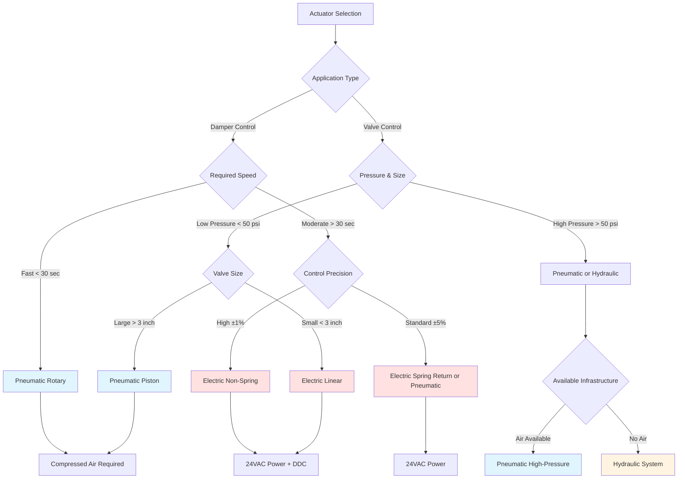

# HVAC Actuators: Electric, Pneumatic & Hydraulic Systems

Actuators convert control signals into mechanical motion to position dampers and valves throughout HVAC systems. Selection depends on required force, response time, control precision, and available energy sources. This analysis examines the three primary actuator technologies and their application-specific performance characteristics.

## Fundamental Operating Principles

### Force and Torque Requirements

Actuator sizing begins with calculating the forces opposing motion. For dampers, the pressure differential creates a force:

$$F_{damper} = \Delta P \times A_{blade}$$

where $\Delta P$ is the air pressure difference across the damper blade (typically 1-4 inches w.c. for HVAC applications) and $A_{blade}$ is the effective blade area. The required torque at the damper shaft becomes:

$$T_{required} = F_{damper} \times \frac{L_{blade}}{2} \times \cos(\theta)$$

where $L_{blade}$ is the blade length from the pivot axis and $\theta$ is the blade angle. Maximum torque occurs at 45° where aerodynamic forces peak.

For control valves, the stem force must overcome both fluid pressure and packing friction:

$$F_{stem} = P_{inlet} \times A_{plug} + F_{friction}$$

Standard practice applies a 1.5-2.0 safety factor to calculated values per ASHRAE Guideline 13-2020.

## Electric Actuators

Electric actuators use AC or DC motors with gear reduction to provide positioning force. Modern units incorporate either spring return or non-spring return mechanisms.

**Performance Characteristics:**

| Parameter | Spring Return | Non-Spring Return |
|-----------|---------------|-------------------|
| Torque Range | 35-300 in-lb | 35-4,000 in-lb |
| Travel Time | 30-150 sec/90° | 15-90 sec/90° |
| Power Consumption | 4-20 W running | 2-15 W running, 0.5 W holding |
| Control Signal | 0-10 VDC, 2-10 VDC, 4-20 mA | Same plus modulating |
| Position Accuracy | ±2-5% | ±1-2% |

The electrical power required for continuous modulation is:

$$P_{electric} = \frac{T_{load} \times \omega}{\eta_{motor} \times \eta_{gear}}$$

where $\omega$ is angular velocity and $\eta$ values represent motor and gearbox efficiency (typically 0.45-0.65 combined). Non-spring return actuators consume minimal holding power since the gearbox self-locks.

**Advantages:**
- Precise proportional control with position feedback
- Low operating cost and maintenance
- Direct integration with DDC systems
- Available with battery backup for critical applications

**Limitations:**
- Slower response than pneumatic (typically 60-150 seconds full stroke)
- Requires electrical wiring infrastructure
- Heat generation in continuous modulation

## Pneumatic Actuators

Pneumatic actuators convert compressed air pressure (typically 13-15 psig) into linear or rotary motion through a diaphragm or piston mechanism.

The output force from a diaphragm actuator follows:

$$F_{output} = (P_{signal} - P_{atmospheric}) \times A_{diaphragm} - F_{spring}$$

For a standard 8-inch diameter diaphragm with 3-15 psig signal range:

$$F_{max} = (15 - 3) \text{ psi} \times \pi \times (4 \text{ in})^2 = 603 \text{ lbf}$$

**Performance Specifications:**

| Actuator Type | Force/Torque | Response Time | Air Consumption |
|---------------|--------------|---------------|-----------------|
| Diaphragm (damper) | 100-2,000 lbf | 10-30 sec | 0.1-0.5 scfm |
| Piston (valve) | 200-5,000 lbf | 5-15 sec | 0.2-1.0 scfm |
| Rotary vane | 150-1,500 in-lb | 15-45 sec | 0.15-0.6 scfm |

Air consumption during stroking is:

$$V_{air} = \frac{A_{diaphragm} \times S_{stroke} \times (P_{max} + 14.7)}{14.7}$$

expressed in cubic feet at atmospheric pressure, where $S_{stroke}$ is the stroke length.

**Advantages:**
- Fast response time (10-30 seconds typical)
- High force-to-weight ratio
- Intrinsically fail-safe with spring return
- Immune to electrical interference

**Limitations:**
- Requires compressed air infrastructure (15-20 psig supply)
- Air compressor energy consumption (0.15-0.25 kW per scfm)
- Temperature sensitivity affects spring characteristics
- Hysteresis typically 0.5-2% of span

## Hydraulic Actuators

Hydraulic actuators use pressurized fluid (typically 500-3,000 psig) for applications requiring extreme force in confined spaces. Rarely used in commercial HVAC but common in large industrial dampers and chilled water isolation valves.

The force output is:

$$F_{hydraulic} = P_{hydraulic} \times A_{piston}$$

A 2-inch diameter piston at 1,000 psig generates:

$$F = 1000 \text{ psi} \times \pi \times (1 \text{ in})^2 = 3,142 \text{ lbf}$$

This force capability in a compact package makes hydraulic actuation suitable for large dampers (>10 ft²) where pneumatic systems would require impractically large diaphragms.

**Typical Applications:**
- Large isolation dampers in industrial processes
- High-pressure steam valve control (>300 psig)
- Emergency shutdown systems requiring rapid closure
- Extreme temperature environments (-40°F to 300°F)

## Actuator Type Selection Flowchart

## Control Signal Compatibility

Modern building automation systems interface with actuators through standardized signals per ASHRAE Guideline 13:

**Analog Control Signals:**
- 0-10 VDC: Most common for electric actuators
- 2-10 VDC: Provides fault detection capability below 2V
- 4-20 mA: Current loop for long runs with electrical noise
- 3-15 psig: Standard pneumatic signal range

**Digital Communication:**
- BACnet MS/TP: Direct integration with DDC controllers
- Modbus RTU: Common in retrofit applications
- 0-10V with position feedback: Enables closed-loop control verification

The control resolution achievable depends on actuator design. Electric actuators with potentiometer feedback typically resolve to 0.5-1.0% of stroke, while pneumatic systems with positioners achieve 1-2% due to mechanical hysteresis in the diaphragm and spring assembly.

## Maintenance and Lifecycle Considerations

Electric actuators generally require minimal maintenance beyond periodic inspection of mounting hardware and electrical connections. Pneumatic systems require air supply quality per ASHRAE Standard 188 to prevent diaphragm degradation. Install air dryers and filters to maintain dew point below -40°F and filtration to 5 microns.

Expected service life under normal conditions:
- Electric actuators: 15-20 years (50,000-100,000 cycles)
- Pneumatic actuators: 10-15 years (200,000-500,000 cycles)
- Hydraulic actuators: 20-25 years (1,000,000+ cycles)

Proper selection based on application requirements, available infrastructure, and control precision needs ensures reliable HVAC system operation throughout the design life.

