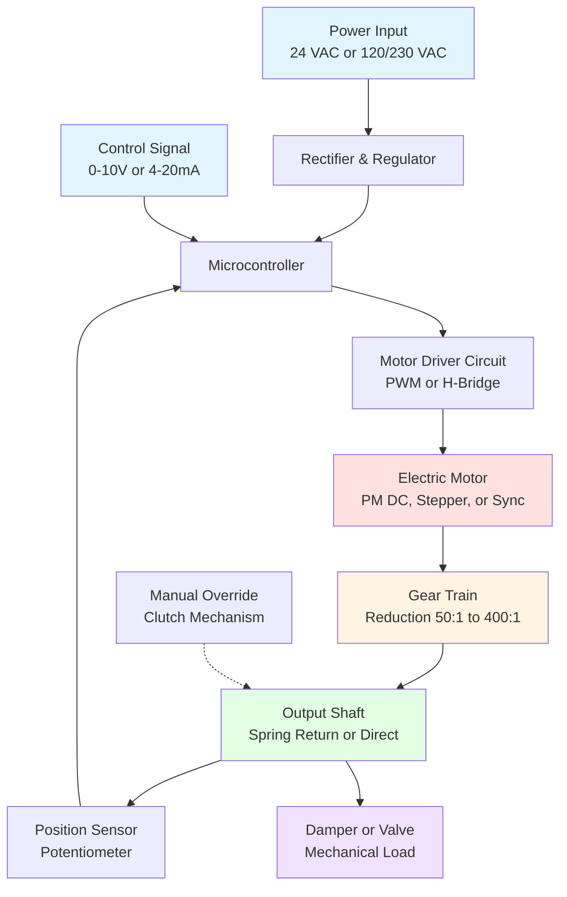

Electric actuators convert electrical signals into mechanical motion to position dampers and valves in HVAC systems. These devices provide precise control over airflow and water flow, enabling automation of temperature control, ventilation, and energy management.

## Motor Technologies

Electric actuators utilize different motor types based on control requirements and application demands.

**Synchronous Motors**

Synchronous motors operate at fixed speeds determined by line frequency and pole count. These motors provide consistent positioning speed and high reliability for two-position and floating control applications. Speed = (120 × frequency) / poles.

**Shaded-Pole Motors**

Shaded-pole motors are simple, low-cost motors suitable for small actuators. They feature copper rings on stator poles that create a rotating magnetic field. Typical efficiency ranges from 15-30%, making them appropriate for low-duty-cycle applications.

**Stepper Motors**

Stepper motors rotate in discrete angular increments, typically 0.9° to 1.8° per step. This provides excellent positioning accuracy without feedback devices. Holding torque maintains position when de-energized, eliminating drift in modulating applications.

**Permanent Magnet DC Motors**

PM DC motors offer high torque-to-weight ratios and efficient operation. Electronic commutation eliminates brushes, extending service life beyond 60,000 hours in continuous-duty applications. These motors enable proportional control with fast response times.

## Actuator Configurations

### Spring Return Actuators

Spring return actuators incorporate a mechanical spring that returns the actuator to a predetermined fail-safe position upon power loss. The spring stores energy during powered rotation, providing emergency positioning capability critical for life safety systems.

**Spring Return Operation:**

1. Motor energizes and compresses return spring while rotating output shaft
2. Electronic controller maintains position against spring force
3. Power loss releases spring energy
4. Spring drives actuator to fail-safe position (typically 0° or 90°)

Spring return actuators require higher torque motors to overcome spring resistance during normal operation. Available torque at the shaft equals motor torque minus spring opposing force.

### Non-Spring Return Actuators

Non-spring return actuators lack fail-safe springs, relying entirely on motor power for positioning. These units provide higher effective output torque since the motor does not work against spring resistance. Gearbox efficiency typically reaches 40-60%, compared to 25-40% for spring return designs.

Non-spring return actuators maintain last position during power interruption. Battery backup modules enable emergency positioning when fail-safe operation is required without the torque penalty of mechanical springs.

### Modulating Actuators

Modulating actuators provide continuous positioning throughout their rotation range in response to analog control signals (0-10 VDC, 2-10 VDC, 4-20 mA). Integral controllers compare feedback signals with command signals, adjusting motor operation to minimize position error.

**Control Loop Components:**

- Position sensor (potentiometer or Hall-effect device)
- Electronic comparator circuit
- PWM motor driver
- Feedback signal conditioner

Position accuracy typically achieves ±1-2% of span. Deadband adjustments prevent hunting in stable conditions.

## Torque Requirements and Calculations

Actuator sizing requires calculating the maximum torque imposed by the controlled device under worst-case conditions.

**Damper Torque Calculation:**

For opposed-blade dampers:
T = (A × ΔP × L) / (2 × η)

For parallel-blade dampers:
T = (A × ΔP × L × k) / (2 × η)

Where:
- T = required torque (lb-in or N-m)
- A = damper face area (in² or m²)
- ΔP = maximum differential pressure (in. w.c. or Pa)
- L = blade length (in or m)
- k = parallel blade coefficient (1.5-2.0)
- η = mechanical efficiency (0.85-0.95)

**Safety Factor Application:**

Select actuators with available torque exceeding calculated requirements by 25-50% to account for:
- Bearing friction increase over service life
- Blade linkage binding
- Seal drag forces
- Ice formation in outdoor air applications
- Voltage variations reducing motor torque

## Actuator Selection Tables

### Damper Actuator Sizing

| Damper Size (in) | Max ΔP (in. w.c.) | Damper Type | Min Torque (lb-in) | Recommended Actuator |
|------------------|-------------------|-------------|-------------------|---------------------|
| 12 × 12 | 2.0 | Opposed Blade | 35 | 44 lb-in SR |
| 24 × 24 | 2.0 | Opposed Blade | 140 | 175 lb-in SR |
| 36 × 36 | 2.0 | Opposed Blade | 315 | 400 lb-in NSR |
| 48 × 48 | 2.0 | Opposed Blade | 560 | 700 lb-in NSR |
| 24 × 24 | 4.0 | Parallel Blade | 420 | 530 lb-in NSR |
| 36 × 36 | 4.0 | Parallel Blade | 1,260 | 1,600 lb-in NSR |

### Valve Actuator Selection

| Valve Size (in) | Valve Type | Close-off ΔP (psi) | Required Torque (lb-in) | Actuator Type |
|-----------------|------------|--------------------|------------------------|---------------|
| 1/2 to 2 | Ball | 50 | 35-90 | 90 lb-in SR |
| 2-1/2 to 3 | Ball | 50 | 160-265 | 310 lb-in SR |
| 4 to 6 | Butterfly | 150 | 350-900 | 1,000 lb-in NSR |
| 8 to 10 | Butterfly | 150 | 1,400-2,800 | 3,000 lb-in NSR |

SR = Spring Return, NSR = Non-Spring Return

## Technical Specifications

### Electrical Ratings

| Parameter | Common Values | Notes |
|-----------|--------------|-------|
| Input Voltage | 24 VAC, 120 VAC, 230 VAC | ±10% tolerance |
| Control Signal | 0-10 VDC, 2-10 VDC, 4-20 mA | Modulating types |
| Power Consumption | 3-25 W | Varies with torque rating |
| Positioning Time | 30-240 seconds | For 90° rotation |

### Performance Characteristics

| Characteristic | Typical Range | Application Impact |
|----------------|---------------|-------------------|
| Rotation Range | 90°, 95°, 180° | Match to device requirements |
| Position Accuracy | ±1-2% of span | Modulating control |
| Feedback Signal | 0-10 VDC, 4-20 mA | For DDC integration |
| Operating Temperature | -40°F to 130°F | Standard duty |
| Service Life | 60,000-100,000 cycles | Electronic motor types |

## Standards and Compliance

Electric actuators for HVAC applications must comply with relevant standards:

**NEMA ICS 2** - Industrial Control Devices, Controllers, and Assemblies. Defines construction, performance, and testing requirements for control equipment including electric actuators.

**UL 873** - Standard for Temperature-Indicating and Regulating Equipment. Covers safety requirements for actuators used in temperature control systems.

**ASHRAE Standard 135 (BACnet)** - Specifies communication protocols for building automation, including actuator control and feedback signal formats.

**IEC 60534-6-1** - Industrial Process Control Valves, Part 6-1: Positioning Systems for Control Valve Actuators. Provides performance specifications and testing methods for modulating actuators.

Actuator selection must account for environmental conditions, control accuracy requirements, fail-safe positioning needs, and integration with building automation systems. Proper sizing with adequate safety factors ensures reliable operation throughout the expected service life.
