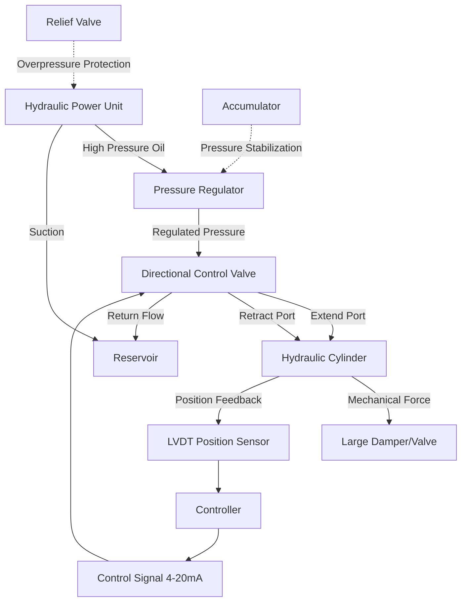

## Overview

Hydraulic actuators convert hydraulic pressure into mechanical force and motion for controlling large HVAC dampers, valves, and other equipment requiring substantial actuation force. These actuators utilize Pascal's law—pressure applied to a confined fluid transmits undiminished throughout the fluid—to generate forces ranging from 500 lbf to over 10,000 lbf, far exceeding pneumatic or electric actuator capabilities.

## Hydraulic Actuator System Architecture

## Force and Pressure Calculations

The fundamental relationship between hydraulic pressure and actuator force follows:

**F = P × A**

Where:
- F = Force output (lbf or N)
- P = Hydraulic pressure (psi or Pa)
- A = Piston area (in² or m²)

### Calculation Example

For a double-acting hydraulic cylinder with 3-inch bore diameter operating at 1,500 psi:

**Piston Area:** A = π × (D/2)² = π × (3/2)² = 7.07 in²

**Extension Force:** F = 1,500 psi × 7.07 in² = 10,605 lbf

**Retraction Force:** Reduced by rod area. For 1-inch rod diameter:
- Rod area = π × (1/2)² = 0.785 in²
- Effective area = 7.07 - 0.785 = 6.285 in²
- F_retract = 1,500 psi × 6.285 in² = 9,428 lbf

## HVAC Applications

| Application | Typical Force Range | Pressure Range | Actuator Type |
|-------------|---------------------|----------------|---------------|
| Large industrial dampers (>48 in) | 2,000-8,000 lbf | 1,000-2,000 psi | Linear cylinder |
| Emergency smoke dampers | 1,500-4,000 lbf | 1,500-3,000 psi | Spring-return cylinder |
| Large isolation valves (>12 in) | 3,000-10,000 lbf | 1,500-2,500 psi | Linear or rotary vane |
| Inlet guide vanes (chillers) | 500-2,000 lbf | 1,000-1,500 psi | Rotary actuator |
| Louver control (cooling towers) | 1,000-3,000 lbf | 1,000-1,500 psi | Linear cylinder |

## Electrohydraulic Actuators

Electrohydraulic actuators integrate the hydraulic power unit, control valve, and cylinder into a self-contained system with electronic control. These units provide:

**Advantages:**
- Proportional control via 0-10 VDC or 4-20 mA signals
- Integrated position feedback (potentiometric or LVDT)
- Fail-safe positioning through accumulators
- Modulating control with 0.1% positioning accuracy
- Factory-sealed systems requiring minimal maintenance

**Control Configuration:**
The servo valve modulates hydraulic flow based on error signal between commanded position and actual position feedback. A PID control loop maintains positioning accuracy under varying loads. Spring-loaded accumulators provide emergency fail-safe positioning during power loss.

## Hydraulic System Specifications

| Parameter | Standard Range | High-Performance Range |
|-----------|---------------|------------------------|
| Operating pressure | 1,000-2,000 psi | 2,000-3,000 psi |
| Hydraulic fluid | ISO VG 32-46 | Synthetic ester (fire-resistant) |
| Operating temperature | 32-150°F | -40-200°F |
| Response time (full stroke) | 10-30 seconds | 3-10 seconds |
| Positioning accuracy | ±1-2% | ±0.1-0.5% |
| Cycle life | 500,000 cycles | 1,000,000+ cycles |

## System Design Considerations

**Hydraulic Fluid Selection:**
Use petroleum-based hydraulic oils (ISO VG 32 or 46) for standard applications. Fire-resistant fluids (phosphate ester, water glycol) are required near heat sources or in occupied spaces per NFPA 90A.

**Pressure Requirements:**
Size hydraulic pressure based on maximum damper torque during emergency closure plus 25% safety margin. Calculate damper breakaway torque at maximum differential pressure (typically 4-8 in w.g. for smoke control applications).

**Accumulator Sizing:**
For fail-safe operation, accumulator volume must provide full stroke movement with pressure drop not exceeding 20% of operating pressure. Use the equation:

**V = (V_cyl × P_op) / (P_op - P_final)**

Where V_cyl is cylinder volume for full stroke, P_op is operating pressure, and P_final is minimum acceptable pressure.

**Temperature Compensation:**
Hydraulic fluid viscosity changes approximately 10% per 10°F temperature change. Size pumps and filtration for worst-case (coldest startup) viscosity. Include heaters for systems operating below 40°F ambient.

## Standards and Codes

**NFPA 92:** Smoke control systems requiring rapid actuator response
**ASHRAE Guideline 36:** Control sequences for critical dampers
**ISO 4413:** General rules and safety requirements for hydraulic systems
**ANSI/NFPA 70:** Electrical installation of electrohydraulic controls
**AMCA 500-D:** Laboratory methods of testing dampers for performance including torque requirements

## Maintenance Requirements

- Inspect hydraulic fluid level and condition quarterly
- Replace filters at 2,000-hour intervals or when differential pressure exceeds manufacturer limits
- Test emergency fail-safe operation annually
- Verify position calibration semi-annually
- Check for external leakage monthly (acceptable rate <1 drop/minute at fittings)
- Perform full-stroke functional test during each HVAC system seasonal startup
