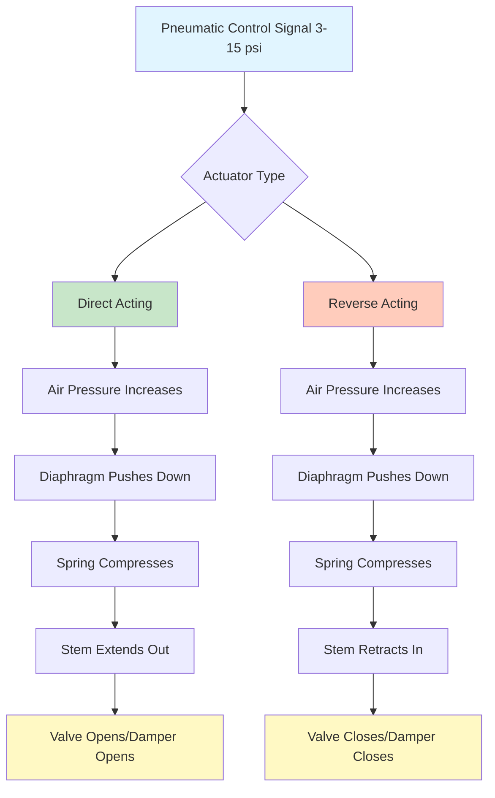

## Pneumatic Actuator Fundamentals

Pneumatic actuators convert compressed air pressure signals into mechanical motion for controlling dampers and valves in HVAC systems. These devices operate on basic force balance principles where air pressure acting on a diaphragm area generates force opposing spring tension.

### Operating Principle

The fundamental equation governing pneumatic actuator operation is:

**F = P × A - F_spring**

Where:
- F = Net output force (lbf)
- P = Air pressure (psi)
- A = Effective diaphragm area (in²)
- F_spring = Spring force (lbf)

Standard pneumatic control signals range from 3 to 15 psi per ASHRAE Standard 135 and ISA-20 specifications. This 12 psi span provides the control authority for proportional positioning.

## Direct Acting vs. Reverse Acting Configurations

| Configuration | Air Pressure Increases | Spring Compressed | Typical Application |
|--------------|------------------------|-------------------|---------------------|
| Direct Acting | Stem extends | During operation | Normally closed valves, cooling control |
| Reverse Acting | Stem retracts | During operation | Normally open valves, heating control |

**Direct Acting Actuators** push the stem outward as air pressure increases. At 3 psi (minimum signal), the spring holds the actuator at minimum stroke. At 15 psi (maximum signal), air pressure compresses the spring fully, extending the stem completely.

**Reverse Acting Actuators** pull the stem inward as air pressure increases. The spring extends the stem at low pressure and air pressure overcomes spring tension at high pressure.

## Diaphragm Area and Force Calculations

### Sizing Example

Calculate required diaphragm area for an actuator that must produce 100 lbf at 15 psi with a spring force of 40 lbf.

**Step 1:** Determine net required force
- F_net = F_output + F_spring = 100 + 40 = 140 lbf

**Step 2:** Calculate diaphragm area
- A = F_net / P_max = 140 / 15 = 9.33 in²

**Step 3:** Select standard actuator size
- Standard size: 10 in² effective area (provides design margin)

### Verification

At 15 psi with 10 in² diaphragm:
- F_available = (15 × 10) - 40 = 110 lbf (10% margin above 100 lbf requirement)

## Spring Range Selection

Spring ranges define the pressure span over which the actuator strokes from fully closed to fully open. Common ranges include:

| Spring Range | Start Pressure | End Pressure | Application |
|--------------|----------------|--------------|-------------|
| 3-8 psi | 3 psi | 8 psi | Low-force dampers, fail-safe spring return |
| 8-13 psi | 8 psi | 13 psi | Split-range control, sequencing |
| 3-15 psi | 3 psi | 15 psi | Standard proportional control |
| 5-10 psi | 5 psi | 10 psi | Custom applications |

**Spring Constant Calculation:**

k = (P_max - P_min) × A / Stroke

For a 10 in² actuator with 2-inch stroke and 3-15 psi range:
- k = (15 - 3) × 10 / 2 = 60 lbf/in

## Spring Return Operation

Spring return actuators automatically return to a fail-safe position on air supply loss. The spring must store sufficient energy to overcome friction and move the controlled device fully.

**Spring Energy Requirement:**

E = (F_load + F_friction) × Stroke + Safety_margin

Where safety margin typically equals 20-30% of calculated energy.

## Positioner Applications

Pneumatic positioners improve actuator accuracy and response by comparing actuator position feedback to control signal input. Positioners eliminate offset errors caused by:

- Varying load forces
- Supply pressure fluctuations
- Friction variations
- Hysteresis effects

### Positioner Sizing Table

| Actuator Size | Positioner Air Consumption | Supply Pressure Required | Response Time |
|---------------|---------------------------|-------------------------|---------------|
| 5-15 in² | 0.5-1.0 scfm | 20-25 psi | 2-4 seconds |
| 20-40 in² | 1.5-3.0 scfm | 25-35 psi | 3-6 seconds |
| 50-100 in² | 3.0-6.0 scfm | 35-50 psi | 5-10 seconds |
| >100 in² | 6.0-12.0 scfm | 50-80 psi | 8-15 seconds |

## Air Supply Requirements

Compressed air supply must meet quality standards per ISA-7.0.01 (Instrument Air):

- **Pressure:** 20-100 psi supply (typically 40-60 psi)
- **Dew Point:** -40°F at line pressure
- **Oil Content:** <1 ppm
- **Particle Size:** <3 microns
- **Quality Class:** Per ISO 8573-1 Class 1.4.1

### Volume Booster Applications

Volume boosters increase actuator stroking speed by supplying high air flow rates during position changes. Install boosters when:

- Actuator volume >50 in³
- Control line length >50 feet
- Response time requirements <3 seconds
- Multiple actuators controlled from single signal

## Pneumatic Relay Configurations

Pneumatic relays provide signal amplification, reversal, and logic functions:

| Relay Type | Function | Pressure Ratio | Application |
|------------|----------|----------------|-------------|
| Direct | Amplification | 1:1 | Signal boosting |
| Reversing | Inversion | 1:1 | Action reversal (DA to RA) |
| Averaging | Mean calculation | N/A | Multiple sensor averaging |
| High/Low Select | Logic | N/A | Override control |

## Actuator Sizing for Torque Applications

For rotary dampers and butterfly valves, calculate required torque:

**T = F × r**

Where:
- T = Required torque (lbf-in)
- F = Actuator force (lbf)
- r = Effective moment arm (in)

Add 50-100% margin for damper sealing force and bearing friction.

### Torque Sizing Table

| Damper Size | Breakaway Torque | Running Torque | Recommended Actuator |
|-------------|------------------|----------------|---------------------|
| 12" × 12" | 25-50 lbf-in | 15-30 lbf-in | 10 in², 3-15 psi |
| 24" × 24" | 100-200 lbf-in | 60-120 lbf-in | 25 in², 3-15 psi |
| 36" × 36" | 300-600 lbf-in | 180-360 lbf-in | 60 in², 3-15 psi |
| 48" × 48" | 600-1200 lbf-in | 360-720 lbf-in | 120 in², 3-15 psi |

## Standards and References

- ASHRAE Standard 135: BACnet Protocol (pneumatic signal specs)
- ISA-20: Specification Forms for Process Measurement and Control Instruments
- ISA-7.0.01: Quality Standard for Instrument Air
- ANSI/NFPA 70: National Electrical Code (hazardous location requirements)
- ISO 8573-1: Compressed Air Quality Classes
