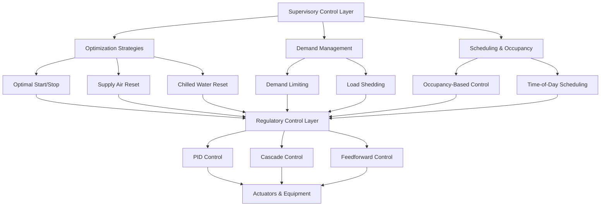

## Control Strategy Hierarchy

Modern HVAC systems implement multiple layers of control strategies to optimize energy efficiency, occupant comfort, and equipment reliability. The hierarchy progresses from basic regulatory control to advanced supervisory and optimization algorithms.

## Regulatory Control Algorithms

### PID Control Fundamentals

Proportional-Integral-Derivative control forms the foundation of HVAC regulatory control. The controller output is calculated as:

$$u(t) = K_p e(t) + K_i \int_0^t e(\tau) d\tau + K_d \frac{de(t)}{dt}$$

Where:
- $u(t)$ = controller output at time $t$
- $e(t)$ = error signal (setpoint - process variable)
- $K_p$ = proportional gain
- $K_i$ = integral gain
- $K_d$ = derivative gain

In discrete form for digital implementation:

$$u_n = K_p e_n + K_i \sum_{k=0}^{n} e_k \Delta t + K_d \frac{e_n - e_{n-1}}{\Delta t}$$

### Cascade Control Architecture

Cascade control employs a primary (outer) loop controlling the desired variable and a secondary (inner) loop controlling an intermediate variable. The primary controller output becomes the setpoint for the secondary controller:

$$SP_{secondary}(t) = u_{primary}(t)$$

The secondary loop equation:

$$u_{secondary}(t) = K_{p,s} e_s(t) + K_{i,s} \int_0^t e_s(\tau) d\tau$$

Where $e_s(t) = SP_{secondary}(t) - PV_{secondary}(t)$

## Advanced Control Strategies

### Reset Strategies

Reset strategies dynamically adjust setpoints based on system demand, reducing energy consumption while maintaining comfort.

**Supply Air Temperature Reset:**

$$T_{SA,SP} = T_{SA,min} + (T_{SA,max} - T_{SA,min}) \times \frac{\sum_{i=1}^{n} max(0, VLV_i - VLV_{trim})}{n}$$

Where:
- $T_{SA,SP}$ = supply air temperature setpoint
- $VLV_i$ = valve position for zone $i$
- $VLV_{trim}$ = trim threshold (typically 0.95)
- $n$ = number of zones

**Static Pressure Reset (ASHRAE Guideline 36):**

$$SP_{static} = SP_{min} + (SP_{max} - SP_{min}) \times R_{requests}$$

Where $R_{requests}$ represents the fraction of zones requesting increased airflow.

### Optimal Start/Stop Algorithms

Optimal start calculates the minimum pre-occupancy runtime required to achieve comfort conditions at occupancy time:

$$t_{start} = t_{occupancy} - \frac{T_{current} - T_{setpoint}}{R_{heat}}$$

Where $R_{heat}$ is the measured heating rate (°F/hour or °C/hour) determined through adaptive learning:

$$R_{heat,n} = \alpha \times R_{measured} + (1-\alpha) \times R_{heat,n-1}$$

The learning factor $\alpha$ typically ranges from 0.1 to 0.3.

**Optimal stop** extends into unoccupied periods using thermal mass:

$$t_{stop} = t_{unoccupancy} + \frac{T_{comfort,max} - T_{setpoint}}{R_{drift}}$$

### Demand Limiting and Load Shed

Demand limiting prevents peak demand charges by temporarily reducing equipment capacity when approaching demand thresholds:

$$P_{limit}(t) = P_{target} - P_{current}(t) - P_{safety\_margin}$$

When $P_{limit}(t) < 0$, the system initiates staged load reduction:

1. **Stage 1:** Increase temperature setpoints by 1-2°F (0.5-1°C)
2. **Stage 2:** Reduce outdoor air to minimum code requirements
3. **Stage 3:** Cycle non-critical equipment
4. **Stage 4:** Disable or reduce capacity of selected zones

## Control Strategy Comparison

| Strategy | Application | Energy Savings | Complexity | Response Time |
|----------|-------------|----------------|------------|---------------|
| **PID** | Temperature, pressure, flow | Baseline | Low | Fast (seconds) |
| **Cascade** | Supply air temp, duct pressure | 5-10% vs single loop | Medium | Medium (minutes) |
| **Supply Air Reset** | VAV systems, AHUs | 10-20% | Low | Slow (hours) |
| **Chilled Water Reset** | Central plants | 15-25% | Medium | Slow (hours) |
| **Optimal Start/Stop** | All scheduled systems | 10-30% | Medium | N/A (scheduling) |
| **Demand Limiting** | Peak demand reduction | Cost reduction | Medium | Fast (seconds) |
| **Predictive/MPC** | Complex multi-zone systems | 20-40% | High | Variable |

## Tuning Parameters and Performance

| Control Type | Typical Proportional Band | Integral Time | Derivative Time | Update Interval |
|--------------|---------------------------|---------------|-----------------|-----------------|
| **Space Temperature** | 3-6°F (1.5-3°C) | 10-20 min | Not used | 1-5 min |
| **Discharge Air Temp** | 2-4°F (1-2°C) | 3-10 min | 0.5-2 min | 15-60 sec |
| **Duct Static Pressure** | 0.3-0.6 in. w.c. | 1-5 min | Not used | 5-30 sec |
| **Chilled Water Supply** | 2-4°F (1-2°C) | 5-15 min | 1-3 min | 30-120 sec |

## ASHRAE Guideline 36 Integration

ASHRAE Guideline 36 provides standardized high-performance control sequences for HVAC systems. Key elements include:

**Trim and Respond Logic:** Adjusts setpoints based on zone requests rather than individual sensor feedback, providing stable system operation.

**Freeze Protection:** Multi-stage protection using temperature sensors and differential pressure monitoring to prevent coil freezing.

**Economizer Control:** Integrated differential enthalpy or dry-bulb control with relief fan coordination.

**Demand Control Ventilation:** CO₂-based outdoor air flow adjustment to maintain IAQ while minimizing conditioning loads.

Implementation of Guideline 36 sequences typically yields 10-30% energy savings compared to conventional control strategies, with improved comfort through reduced temperature swings and better humidity control.

## Implementation Considerations

**Control Loop Interaction:** When implementing multiple reset strategies, verify that loops do not conflict. Supply air temperature reset and chilled water reset should operate on different time constants to prevent instability.

**Sensor Placement:** Accurate control requires properly located sensors. Space temperature sensors should avoid direct sunlight, supply air diffusers, and exterior walls. Duct sensors require adequate straight run lengths for representative measurements.

**Commissioning Requirements:** All advanced control strategies require functional testing to verify proper operation. Document baseline performance before enabling optimization sequences to quantify energy savings.

**Maintenance Impact:** Advanced strategies reduce equipment runtime and cycling, extending equipment life. Monitor savings persistence over time as sensor drift and fouled equipment can degrade performance.
