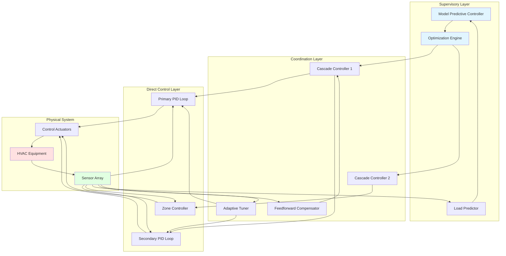

Advanced control strategies extend beyond basic PID control to address complex HVAC system dynamics, disturbance rejection, and multi-loop interactions. These techniques improve stability, reduce energy consumption, and enhance occupant comfort by accounting for system interactions, anticipated disturbances, and time-varying operating conditions.

## Cascade Control Architecture

Cascade control employs nested control loops where the output of a primary (master) controller becomes the setpoint for a secondary (slave) controller. This configuration isolates fast inner-loop disturbances before they affect the primary controlled variable.

### Implementation Physics

The cascade structure provides superior disturbance rejection for processes with multiple time constants. The inner loop responds to disturbances within its faster dynamics, preventing propagation to the slower outer loop.

**Primary Loop (Outer):**

$$C_1(s) = K_{p1}\left(1 + \frac{1}{T_{i1}s} + T_{d1}s\right)$$

**Secondary Loop (Inner):**

$$C_2(s) = K_{p2}\left(1 + \frac{1}{T_{i2}s}\right)$$

The overall closed-loop transfer function becomes:

$$\frac{Y(s)}{R(s)} = \frac{C_1(s)C_2(s)G_1(s)G_2(s)}{1 + C_2(s)G_2(s) + C_1(s)C_2(s)G_1(s)G_2(s)}$$

Where $G_1(s)$ represents the primary process and $G_2(s)$ the secondary process.

### Typical HVAC Applications

**Chilled Water Temperature Control:**
- Primary: Supply air temperature
- Secondary: Cooling coil valve position or water flow rate
- Benefit: Fast rejection of water temperature fluctuations

**VAV Zone Control:**
- Primary: Space temperature
- Secondary: Airflow rate
- Benefit: Improved response to pressure variations

## Feedforward Control

Feedforward control measures disturbances directly and applies corrective action before the controlled variable deviates from setpoint. Unlike feedback control which reacts to errors, feedforward anticipates and compensates.

### Mathematical Foundation

The ideal feedforward controller inverts the disturbance transfer function:

$$C_{ff}(s) = -\frac{G_d(s)}{G_p(s)}$$

Where $G_d(s)$ is the disturbance-to-output transfer function and $G_p(s)$ is the manipulated-variable-to-output transfer function.

For practical implementation with lead-lag compensation:

$$C_{ff}(s) = K_{ff}\frac{1 + T_1s}{1 + T_2s}$$

### Energy Recovery Applications

In air-side economizers, outdoor air temperature serves as the feedforward signal:

$$\dot{m}_{OA} = f(T_{OA}, T_{RA}, Q_{sensible})$$

The damper position adjusts based on anticipated cooling load rather than waiting for supply air temperature deviation.

## Model Predictive Control (MPC)

MPC solves an optimization problem at each control interval, predicting future system behavior over a receding horizon and determining optimal control actions subject to constraints.

### Optimization Formulation

$$\min_{u(k)} J = \sum_{i=1}^{N_p} ||y(k+i|k) - r(k+i)||_Q^2 + \sum_{i=0}^{N_c-1} ||\Delta u(k+i)||_R^2$$

Subject to:
- $u_{min} \leq u(k+i) \leq u_{max}$
- $y_{min} \leq y(k+i|k) \leq y_{max}$
- $\Delta u_{min} \leq \Delta u(k+i) \leq \Delta u_{max}$

Where:
- $N_p$ = prediction horizon
- $N_c$ = control horizon
- $Q$ = output error weight matrix
- $R$ = control effort weight matrix
- $y(k+i|k)$ = predicted output at time $k+i$
- $\Delta u(k+i)$ = control action change

### HVAC MPC Applications

MPC excels in building thermal management by:
1. Exploiting thermal mass for load shifting
2. Optimizing precooling/preheating strategies
3. Coordinating multiple zones with coupled dynamics
4. Satisfying comfort constraints while minimizing energy cost

## Adaptive and Self-Tuning Control

Adaptive controllers modify their parameters in real-time to accommodate changing system dynamics, degraded components, or varying operating conditions.

### Gain Scheduling

Controller gains vary as a function of operating point:

$$K_p(\theta) = K_{p,0} + \sum_{i=1}^{n} a_i\theta^i$$

Where $\theta$ represents the scheduling variable (load, outdoor temperature, etc.).

### Model Reference Adaptive Control (MRAC)

The controller adjusts to force the plant output to track a reference model:

$$\frac{d\theta}{dt} = -\Gamma e y$$

Where $\Gamma$ is the adaptation gain matrix and $e$ is the tracking error.

## Control Strategy Comparison

| Strategy | Disturbance Rejection | Complexity | Tuning Effort | Energy Savings | Best Application |
|----------|----------------------|------------|---------------|----------------|------------------|
| Cascade | Excellent (inner loop) | Medium | Moderate | 10-15% | Fast secondary disturbances |
| Feedforward | Excellent (measurable) | Medium | High | 15-25% | Known, measurable disturbances |
| Ratio Control | Good | Low | Low | 5-10% | Proportional flows/temperatures |
| MPC | Excellent | High | High | 20-40% | Thermal mass optimization |
| Adaptive | Good | High | Low (self-tuning) | 15-20% | Time-varying systems |
| Fuzzy Logic | Good | Medium | Medium | 10-20% | Nonlinear, poorly modeled systems |

## Advanced Control System Architecture

## Standards and Guidelines

**ASHRAE Standards:**
- **ASHRAE Guideline 36-2021:** High-Performance Sequences of Operation for HVAC Systems specifies advanced control sequences including trim-and-respond, demand-controlled ventilation, and optimal start/stop
- **ASHRAE Standard 90.1:** Requires deadband controls, optimum start, and demand ventilation for energy efficiency

**Control Performance Metrics:**
- Overshoot: < 5% of setpoint change (ASHRAE Guideline 36)
- Settling time: < 15 minutes for temperature control
- Steady-state error: ± 0.5°F for space temperature
- Control valve minimum position: 5% to prevent stiction

## Implementation Considerations

Advanced control strategies require:

1. **Accurate System Models:** MPC and feedforward depend on process understanding
2. **Quality Instrumentation:** Sensors must provide reliable disturbance measurements
3. **Computational Resources:** MPC optimization requires appropriate processing power
4. **Commissioning:** Proper tuning and verification of hierarchical loops
5. **Maintenance:** Ongoing model validation and parameter adaptation

The selection of advanced control techniques should balance performance improvement against implementation complexity. Cascade and feedforward strategies offer immediate benefits with moderate effort, while MPC provides maximum optimization for large commercial buildings with significant thermal mass and time-of-use energy rates.
