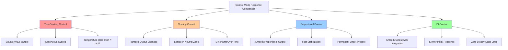

Basic control modes form the foundation of HVAC automation systems. Understanding their operational characteristics, mathematical representations, and practical applications is essential for designing effective temperature, humidity, and pressure control strategies in building systems.

## Two-Position (On-Off) Control

Two-position control is the simplest control mode where the actuator occupies one of two discrete states. The controller output switches between minimum and maximum values based on whether the measured variable is above or below the setpoint.

### Control Equation

The control output u(t) is defined as:

```
u(t) = u_max  when e(t) < -d/2
u(t) = u_min  when e(t) > +d/2
```

Where:
- e(t) = error signal (setpoint - measured value)
- d = differential gap (deadband)
- u_max = maximum output (100% or ON)
- u_min = minimum output (0% or OFF)

### Characteristics

**Advantages:**
- Simple implementation requiring minimal computational resources
- Low cost sensors and actuators
- Highly reliable with few failure modes
- No steady-state error concerns

**Disadvantages:**
- Continuous cycling around setpoint
- Mechanical wear from frequent switching
- Temperature swings equal to differential gap
- Potential for short cycling without proper deadband

**Applications:**
- Residential thermostats controlling single-stage equipment
- Freeze protection controls
- Safety limit switches
- Small package units under 5 tons

## Floating Control

Floating control positions an actuator through timed pulses without direct feedback of actuator position. The controller issues raise or lower commands based on the error magnitude, and the actuator integrates these pulses over time.

### Control Equation

The rate of change of control output is:

```
du/dt = K_f  when e(t) > d/2
du/dt = -K_f when e(t) < -d/2
du/dt = 0    when |e(t)| ≤ d/2
```

Where:
- K_f = floating rate constant (percent per second)
- d = neutral zone width

### Characteristics

**Advantages:**
- Lower cost than proportional control (no feedback required)
- Eliminates continuous cycling of two-position control
- Compatible with standard 24VAC actuators
- Smooth control action compared to on-off

**Disadvantages:**
- No knowledge of actual actuator position
- Drift over time without position feedback
- Slower response than proportional control
- Requires periodic recalibration

**Applications:**
- Damper control in VAV systems
- Valve positioning in hydronic systems
- Economizer dampers
- Mixing applications with 3-point actuators

## Proportional (P) Control

Proportional control generates an output signal directly proportional to the control error. The actuator position varies continuously between 0% and 100% as the measured variable deviates from setpoint.

### Control Equation

```
u(t) = K_p × e(t) + u_bias
```

Where:
- K_p = proportional gain (dimensionless)
- e(t) = error signal
- u_bias = bias or offset term (typically 50%)

The proportional band (PB) is the inverse of gain:

```
PB = 100% / K_p
```

### Throttling Range

The throttling range defines the span of measured variable over which the actuator moves from 0% to 100%:

```
Throttling Range = Proportional Band × Sensor Span
```

Example: A 10°F throttling range with a 70°F setpoint means the valve is fully closed at 65°F and fully open at 75°F.

### Offset (Droop)

Proportional control inherently produces steady-state error called offset. At equilibrium:

```
e_ss = Q_load / K_p
```

Where Q_load is the system load. Higher gain reduces offset but increases oscillation risk.

### Characteristics

**Advantages:**
- Smooth continuous control action
- Fast response to load changes
- Stable operation with proper tuning
- Minimal mechanical wear

**Disadvantages:**
- Always produces steady-state offset
- Requires careful gain tuning
- Potential for oscillation if gain is too high
- More expensive sensors and actuators required

**Applications:**
- Chilled water valve control
- Hot water valve control
- VFD speed control
- Discharge air temperature control

## Proportional-Integral (PI) Control

PI control eliminates steady-state offset by adding an integral term that accumulates error over time. This is the most common control mode in HVAC applications, providing both stability and accuracy.

### Control Equation

```
u(t) = K_p × e(t) + (K_p/T_i) × ∫e(τ)dτ + u_bias
```

Where:
- T_i = integral time or reset time (seconds)
- K_i = K_p/T_i = integral gain

In discrete form (digital controllers):

```
u(n) = K_p × e(n) + K_i × Σe(k) × Δt
```

### Reset Action

The integral term continuously adjusts the bias until error reaches zero. Reset time T_i defines how quickly the integral acts:
- Smaller T_i = faster integral action = faster offset elimination
- Larger T_i = slower integral action = more stable response

### Characteristics

**Advantages:**
- Eliminates steady-state offset completely
- Maintains accurate setpoint control under varying loads
- Superior performance for most HVAC applications
- Well-established tuning methods available

**Disadvantages:**
- Integral windup during saturation conditions
- More complex tuning than P-only control
- Potential for overshoot with aggressive settings
- Requires anti-windup logic in digital implementations

**Applications:**
- Primary air handling unit discharge air control
- Space temperature control in critical areas
- Pressure control in VAV systems
- Boiler and chiller sequencing

## Control Mode Comparison

| Control Mode | Steady-State Error | Response Speed | Complexity | Typical Cost | Best Application |
|--------------|-------------------|----------------|------------|--------------|------------------|
| Two-Position | ±(d/2) | Fast | Very Low | $ | Residential, simple loads |
| Floating | Small drift | Moderate | Low | $$ | Dampers, valves without feedback |
| Proportional | Offset = Q/K_p | Fast | Moderate | $$$ | Stable processes, offset acceptable |
| PI Control | Zero | Moderate | High | $$$$ | Critical spaces, varying loads |

## Control Response Characteristics



## Selection Criteria

**Choose Two-Position Control when:**
- Equipment has inherent two-stage operation (compressors, pumps)
- Cost minimization is critical
- Temperature tolerance exceeds ±2°F
- Load is relatively constant

**Choose Floating Control when:**
- Budget constraints preclude proportional control
- Actuator position feedback is unavailable
- Response time is not critical
- Simple damper or valve positioning is required

**Choose Proportional Control when:**
- Fast response is essential
- Small steady-state offset is acceptable
- Process has significant capacitance
- Integral windup could be problematic

**Choose PI Control when:**
- Zero steady-state error is required
- Loads vary significantly
- Tight setpoint tolerance is specified
- Equipment can respond to continuous modulation

## Reference to Control Fundamentals

These basic control modes build upon fundamental control theory concepts including feedback loops, error signals, and actuator responses. For deeper understanding of control system architecture, sensor selection, and signal types, refer to the control fundamentals section. Proper implementation requires consideration of sensor accuracy, actuator response time, process lag, and system capacitance when selecting and tuning control modes.

## Components

- Two Position On Off
- Floating Control
- Proportional Control P
- Proportional Integral Pi
- Proportional Integral Derivative Pid
- Gain Tuning
- Reset Time Tuning
- Derivative Time Tuning
- Anti Windup Techniques
- Bumpless Transfer
