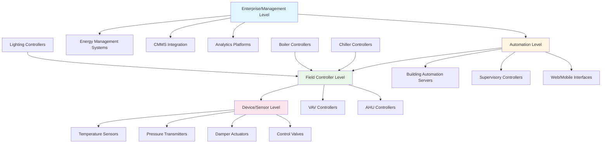

## Overview

Building automation system (BAS) architectures define how control devices, networks, and software layers interact to manage HVAC equipment, lighting, security, and other building systems. The architecture selection impacts system scalability, reliability, installation costs, and long-term maintainability. Modern BAS designs follow hierarchical structures with standardized communication protocols, primarily BACnet (ASHRAE 135) for interoperability.

## Architecture Classification

### Centralized Architecture

Centralized systems concentrate control logic and processing in a single supervisory controller or central plant controller. Field devices function as remote I/O points, transmitting sensor data to the central controller and receiving command outputs.

**Characteristics:**
- Single point of control and programming
- All control algorithms execute at central processor
- Field devices operate as data collectors and actuator drivers
- Simplified commissioning and updates
- Higher vulnerability to central controller failure

**Typical Applications:**
- Small to medium buildings (under 100,000 sq ft)
- Single-facility campuses
- Retrofit projects with legacy pneumatic systems
- Applications requiring tight central coordination

### Distributed Architecture

Distributed systems distribute intelligence across multiple field controllers. Each controller executes local control loops independently while communicating peer-to-peer for coordinated sequences.

**Characteristics:**
- Intelligence distributed to field panels and application-specific controllers
- Controllers operate autonomously if network fails
- Peer-to-peer communication via BACnet or similar protocols
- Scalable from small to large installations
- Higher initial programming effort

**Typical Applications:**
- Large commercial buildings (over 100,000 sq ft)
- Multi-building campuses
- Mission-critical facilities requiring high availability
- Complex systems with diverse equipment types

### Hybrid Architecture

Hybrid architectures combine centralized supervisory control with distributed field intelligence. A central building automation server provides user interface, trending, scheduling, and optimization while field controllers execute real-time control loops.

**Characteristics:**
- Central server for monitoring, scheduling, and optimization
- Distributed controllers for real-time equipment control
- Balances central coordination with field autonomy
- Most common in modern commercial installations
- Facilitates integration of multiple protocol environments

**Typical Applications:**
- Medium to large commercial buildings
- Healthcare and educational facilities
- Data centers and laboratory buildings
- Retrofits integrating new systems with existing controls

## BAS Hierarchy Tiers

### Tier 1: Enterprise/Management Level

The enterprise level provides facility-wide data aggregation, energy management, and integration with business systems. This tier includes:

- Energy management systems (EMS)
- Computerized maintenance management systems (CMMS)
- Fault detection and diagnostics (FDD) platforms
- Advanced analytics and optimization engines
- Enterprise dashboards and reporting tools

Communication protocols: OPC, web services, SQL databases, REST APIs.

### Tier 2: Automation Level

The automation level hosts supervisory control, user interfaces, and system-wide coordination. Components include:

- Building automation servers (workstations)
- Supervisory controllers for plant optimization
- Web-based graphical interfaces
- Alarm management and notification systems
- Historical data trending databases

Communication protocols: BACnet/IP, BACnet/Ethernet, Modbus TCP/IP.

### Tier 3: Field Controller Level

Field controllers execute real-time control algorithms for specific equipment or zones. This tier encompasses:

- Direct digital control (DDC) field panels
- Application-specific controllers (ASCs) for packaged equipment
- Variable air volume (VAV) terminal unit controllers
- Programmable logic controllers (PLCs) for specialized sequences
- Unitary equipment controllers with BACnet interfaces

Communication protocols: BACnet MS/TP, BACnet/IP, LonWorks, Modbus RTU.

### Tier 4: Device/Sensor Level

The device level contains sensors, actuators, and final control elements. These devices interface with physical processes:

- Temperature, humidity, pressure, flow sensors
- Damper and valve actuators
- Variable frequency drives (VFDs)
- Occupancy and lighting sensors
- Electrical meters and submeters

Communication: Analog signals (0-10 VDC, 4-20 mA), digital I/O, or native protocol (BACnet, LonWorks).

## Architecture Comparison

| Criterion | Centralized | Distributed | Hybrid |
|-----------|-------------|-------------|--------|
| **Control Processing** | Central controller | Field controllers | Both levels |
| **Network Dependency** | High | Low | Medium |
| **System Availability** | Lower (single point failure) | Higher (autonomous operation) | High |
| **Scalability** | Limited | Excellent | Excellent |
| **Initial Programming** | Lower | Higher | Medium |
| **Commissioning Time** | Shorter | Longer | Medium |
| **Interoperability** | Limited | High (with BACnet) | High |
| **Typical Building Size** | <100,000 sq ft | >100,000 sq ft | All sizes |
| **Capital Cost** | Lower | Higher | Medium |
| **Operating Cost** | Medium | Lower (energy efficiency) | Lower |

## Network Topology Considerations

**Star Topology:** All field devices connect to a central hub or switch. Simplifies troubleshooting but creates a single point of failure at the hub.

**Daisy-Chain Topology:** Devices connect sequentially on a trunk cable (common for BACnet MS/TP). Economical wiring but entire trunk fails if cable is severed.

**Hybrid Mesh Topology:** Combines star topology at automation level (Ethernet switches) with daisy-chain or home-run wiring at field level. Provides redundancy where critical while minimizing costs.

## BACnet Protocol Standards

ASHRAE Standard 135 (BACnet) defines interoperable communication for building automation. Key architectural considerations:

- **BACnet/IP:** Routable over standard IT networks, suitable for automation and enterprise levels
- **BACnet MS/TP:** Master-slave/token-passing over RS-485, typical for field controller level
- **BACnet Broadcast Management Devices (BBMD):** Enable routing between IP and MS/TP networks
- **BACnet/SC (Secure Connect):** Emerging standard for encrypted, firewall-friendly communication

## Design Principles

1. **Segregate control networks from IT networks** using VLANs or physically separate infrastructure to maintain deterministic performance
2. **Implement redundant supervisory servers** for mission-critical facilities
3. **Distribute intelligence to field level** to ensure continued operation during network outages
4. **Standardize on BACnet** for maximum interoperability and vendor independence
5. **Plan for horizontal scalability** by designing modular network segments that can expand
6. **Document network architecture** including IP addressing schemes, MS/TP trunk layouts, and device addresses

Proper architecture selection aligns system capabilities with building operational requirements, balancing first costs against lifecycle performance and maintainability.
