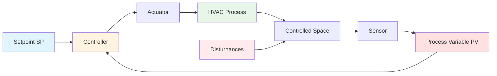

Control theory provides the mathematical and conceptual foundation for understanding and designing effective HVAC control systems. These principles govern how sensors, controllers, and actuators interact to maintain setpoints, reject disturbances, and optimize system performance. Proper application of control theory enables precise environmental control, energy efficiency, and stable system operation across varying loads and conditions.

## Control System Terminology

Understanding standard control terminology enables clear communication and systematic analysis of HVAC control systems.

**Setpoint (SP):** The desired target value for the controlled variable. In a zone temperature control system, the setpoint represents the desired room temperature, typically 72°F for cooling or 70°F for heating.

**Process Variable (PV):** The measured value of the quantity under control. The process variable represents the actual system condition as detected by sensors. For temperature control, the process variable is the measured room temperature from the space sensor.

**Manipulated Variable (MV):** The control system output that influences the process. This represents the actuator position or signal that the controller adjusts to drive the process variable toward the setpoint. Examples include chilled water valve position (0-100%), supply fan speed (%), or damper angle (degrees).

**Control Error (e):** The deviation between setpoint and process variable, calculated as e = SP - PV. The control algorithm processes this error to determine the appropriate manipulated variable adjustment.

**Disturbance:** External influences that affect the process variable without controller action. HVAC disturbances include occupancy loads, solar gains, infiltration, and weather conditions.

## Open-Loop vs. Closed-Loop Control

Control systems operate in fundamentally different configurations that determine their ability to compensate for disturbances and achieve accurate control.

### Open-Loop Control

Open-loop systems execute control actions without measuring the resulting process variable. The controller applies a predetermined output based on inputs or schedules, with no feedback to verify the outcome.

Characteristics of open-loop control:
- No measurement of controlled variable
- Cannot compensate for disturbances automatically
- Simpler implementation with lower cost
- Performance depends entirely on accurate system modeling
- No stability concerns

**HVAC Example:** Time-based morning warm-up that runs the heating system at full capacity for a fixed duration, regardless of actual space temperature. The system operates for the scheduled time without feedback about whether the space has reached the desired temperature.

### Closed-Loop (Feedback) Control

Closed-loop systems continuously measure the process variable, compare it to the setpoint, and adjust the manipulated variable to minimize error. This feedback configuration provides automatic disturbance rejection and self-correction.

Characteristics of closed-loop control:
- Continuous measurement of process variable
- Automatic disturbance rejection
- Achieves accurate setpoint tracking despite modeling errors
- Requires careful design to ensure stability
- Higher implementation complexity

**HVAC Example:** Zone temperature control where a thermostat continuously measures room temperature, compares it to the setpoint, and modulates a reheat valve to maintain the desired temperature regardless of varying occupancy or solar loads.

## Control Modes and Their Applications

HVAC control systems employ different control modes based on process requirements, acceptable error tolerance, and system dynamics. Each mode offers distinct advantages and limitations.

| Control Mode | Description | Advantages | Disadvantages | Typical HVAC Applications |
|--------------|-------------|------------|---------------|---------------------------|
| **Two-Position (On/Off)** | Output switches between fully on and fully off based on error crossing zero | Simple, low cost, no tuning required | Temperature cycling, mechanical wear, comfort fluctuations | Residential furnaces, unit heaters, small package units |
| **Floating** | Output increments up or down based on error magnitude without position feedback | Simple implementation, low cost | Slow response, position drift over time | Electric heating stages, older pneumatic systems |
| **Proportional (P)** | Output proportional to current error: MV = Kp × e | Fast response, smooth control, stable | Steady-state offset (droop), cannot eliminate error | Supply air temperature reset, static pressure control |
| **Proportional-Integral (PI)** | Adds integral action to eliminate offset: MV = Kp × e + Ki × ∫e dt | Zero steady-state error, good disturbance rejection | Can cause overshoot and oscillation if poorly tuned | Zone temperature control, chilled water control, most modulating applications |
| **Proportional-Integral-Derivative (PID)** | Adds derivative action for anticipatory control: MV = Kp × e + Ki × ∫e dt + Kd × de/dt | Faster response, reduced overshoot, better stability margins | Sensitive to measurement noise, more complex tuning | Fast thermal processes, cascade loops, critical control applications |

## PID Control Architecture

Proportional-Integral-Derivative control represents the most widely implemented algorithm in HVAC applications. The control equation combines three terms that respond to different aspects of the error signal:

**MV(t) = Kp × e(t) + Ki × ∫e(t)dt + Kd × de(t)/dt**

Where:
- Kp = Proportional gain (dimensionless)
- Ki = Integral gain (1/time)
- Kd = Derivative gain (time)
- e(t) = Error signal (SP - PV)

**Proportional Action:** Produces output proportional to current error magnitude. Larger errors generate larger control actions. The proportional gain determines how aggressively the controller responds, but proportional action alone cannot eliminate steady-state error—a fundamental limitation called droop or offset.

**Integral Action:** Accumulates error over time, increasing the control output as long as error persists. This action continues until error reaches zero, eliminating steady-state offset. Integral action provides the memory that drives the system to the exact setpoint. Excessive integral gain causes overshooting and sustained oscillations.

**Derivative Action:** Responds to the rate of error change, providing anticipatory control that predicts future error trends. Derivative action dampens oscillations and reduces overshoot, allowing more aggressive proportional and integral gains. However, derivative action amplifies high-frequency measurement noise, requiring filtering in practical implementations.

Each control mode contributes distinct characteristics to system behavior. Proportional control alone produces fast response but leaves a permanent offset between setpoint and actual value. Adding integral action eliminates this offset but can introduce oscillations if poorly tuned. Derivative action dampens oscillations and allows more aggressive proportional and integral gains, but amplifies measurement noise.

Proper tuning of PID parameters determines overall system performance. Aggressive tuning provides fast response but risks instability, while conservative tuning ensures stability at the cost of slow response and poor disturbance rejection. Tuning methods range from empirical rules to analytical techniques based on system identification.

## System Dynamics and Transfer Functions

Transfer functions provide mathematical representations of system dynamics, relating output responses to input changes. These frequency-domain models enable analysis of system stability, steady-state gain, time constants, and frequency response without solving complex differential equations.

First-order systems exhibit exponential response to step inputs, characterized by a single time constant. Most HVAC thermal processes behave approximately as first-order systems over their operating range. Second-order systems can exhibit oscillatory behavior depending on the damping ratio, relevant for analyzing control loops with cascaded dynamics or integral action.

Dead time represents the delay between a control action and its observable effect on the measured variable. Transport delays in piping systems and sensor response lags contribute dead time that fundamentally limits achievable control performance. Systems with significant dead time relative to their time constants require careful controller design to maintain stability.

## Stability and Performance Analysis

Stability represents the most critical requirement for any control system. An unstable system exhibits growing oscillations that can damage equipment and create unsafe conditions. Stability analysis techniques evaluate whether a control system will settle to a steady state following disturbances or setpoint changes.

Gain margin and phase margin quantify how close a stable system operates to instability. Adequate margins ensure the system tolerates variations in process gains, measurement noise, and modeling uncertainties. Conservative margins improve robustness but may sacrifice performance.

Performance metrics evaluate how well a control system meets specifications and occupant requirements:

| Performance Metric | Definition | HVAC Significance | Typical Specification |
|--------------------|------------|-------------------|----------------------|
| **Rise Time** | Time for PV to reach 90% of final value after setpoint change | Determines how quickly zones reach comfort conditions during startup | 5-15 minutes for zone temperature |
| **Settling Time** | Time for PV to remain within ±2% of setpoint | Indicates when system achieves stable control after disturbance | 15-30 minutes for zone temperature |
| **Overshoot** | Maximum PV excursion beyond setpoint expressed as percentage | Affects comfort and energy waste from overcooling/overheating | <5% for critical spaces, <10% for general applications |
| **Steady-State Error** | Permanent deviation between SP and PV at equilibrium | Determines accuracy of temperature, pressure, or flow control | ±0.5°F for temperature, ±0.1 in. w.c. for pressure |
| **Decay Ratio** | Ratio of successive oscillation peak amplitudes | Quantifies damping quality—lower ratios indicate better damping | <0.25 for well-damped systems |

Different applications prioritize different performance aspects based on process requirements and constraints. Critical environments like laboratories or surgical suites require tight specifications for all metrics, while general office spaces tolerate more relaxed performance.

## Advanced Control Strategies

Cascade control employs multiple controllers in a hierarchical structure, with an outer primary controller setting the setpoint for an inner secondary controller. This architecture improves disturbance rejection when disturbances affect the secondary measurement before the primary variable. Common HVAC applications include discharge air temperature control cascaded to valve position control.

Feedforward control measures disturbances directly and compensates before they affect the controlled variable. Unlike feedback control that reacts to errors after they occur, feedforward provides preemptive action that minimizes deviations. Effective feedforward requires accurate disturbance measurement and process models.

Ratio control maintains a fixed relationship between two variables, commonly used for outdoor air and return air damper coordination. Adaptive control adjusts controller parameters based on measured system behavior, accommodating nonlinearities and time-varying dynamics common in HVAC systems.

## Valve and Damper Characteristics

Control valve and damper characteristics determine the relationship between controller output and actual flow. Linear characteristics provide equal flow change per unit actuator movement, while equal-percentage characteristics produce flow changes proportional to current flow. Quick-opening characteristics provide maximum flow change at low positions.

Installed valve characteristics differ from inherent characteristics due to system resistance effects. Valve authority, the ratio of valve pressure drop to total system pressure drop, quantifies how closely installed characteristics match inherent characteristics. Low authority degrades control quality by producing excessive sensitivity at high flows and sluggish response at low flows.

Damper characteristics depend on blade geometry and configuration. Opposed blade dampers provide better flow control than parallel blade dampers, particularly at intermediate positions. Proper actuator sizing ensures sufficient torque to overcome air pressure forces while maintaining accurate position control.

## Applications to HVAC Systems

Control theory principles apply throughout HVAC systems, from individual zone temperature control to central plant optimization. Understanding feedback dynamics explains why some control loops oscillate while others respond sluggishly. Transfer function analysis predicts how system modifications affect stability margins and performance.

PID tuning adapted to specific process characteristics optimizes energy efficiency while maintaining comfort. Cascade and feedforward strategies handle complex interactions in multi-zone systems and variable-load applications. Proper characterization of final control elements ensures consistent performance across the operating range.

These fundamental concepts enable systematic control system design, troubleshooting of performance problems, and optimization of existing installations. Mastery of control theory distinguishes competent HVAC design from trial-and-error approaches.
