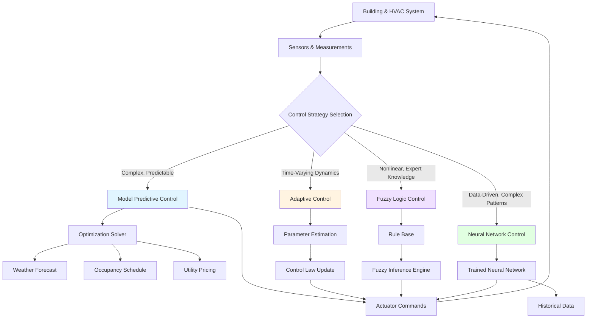

Advanced control theory extends beyond classical feedback control to address complex, multivariable HVAC systems with time-varying dynamics, constraints, and optimization objectives. These methods leverage mathematical models, computational intelligence, and real-time optimization to achieve superior energy efficiency, thermal comfort, and operational performance.

## Model Predictive Control (MPC)

Model Predictive Control represents the most significant advancement in HVAC control technology. MPC uses a dynamic model of the building and HVAC system to predict future behavior over a finite horizon and computes optimal control actions by solving a constrained optimization problem at each time step.

### MPC Operational Principle

The controller solves the following optimization problem:

**Minimize:** J = Σ[k=0 to N] {Q(T_zone[k] - T_setpoint)² + R(u[k])²}

**Subject to:**
- System dynamics: x[k+1] = Ax[k] + Bu[k]
- Constraints: u_min ≤ u[k] ≤ u_max
- Comfort bounds: T_min ≤ T_zone[k] ≤ T_max

Where:
- N = prediction horizon (typically 4-24 hours for HVAC)
- Q = penalty weight on tracking error
- R = penalty weight on control effort
- u[k] = control action (valve position, damper position, etc.)
- x[k] = state vector (temperatures, humidities, thermal masses)

### MPC Advantages in HVAC

**Energy Savings:**
- Anticipates thermal loads from weather forecasts and occupancy schedules
- Pre-cools or pre-heats during low-cost periods (demand response)
- Reduces peak demand by 15-30% compared to conventional control

**Constraint Handling:**
- Explicitly enforces equipment capacity limits
- Maintains comfort bounds during transients
- Coordinates multiple subsystems (chillers, AHUs, terminal units)

**Multivariable Optimization:**
- Handles interactions between temperature, humidity, and air quality
- Balances competing objectives (comfort vs. energy vs. indoor air quality)
- Optimizes system-level performance rather than component-level setpoints

## Adaptive Control Systems

Adaptive control adjusts controller parameters in real time to compensate for system changes, including:
- Seasonal variations in building thermal properties
- Degradation of heat transfer surfaces (fouling)
- Changes in occupancy patterns
- Equipment aging and performance drift

### Model Reference Adaptive Control (MRAC)

MRAC defines a reference model representing desired closed-loop behavior. The adaptation mechanism adjusts controller gains to minimize error between actual system output and reference model output.

**Adaptation Law:**
θ[k+1] = θ[k] + γ·e[k]·φ[k]

Where:
- θ = controller parameter vector
- γ = adaptation gain (0.01-0.1 typical)
- e = tracking error
- φ = regressor vector (past inputs/outputs)

### Self-Tuning Regulators

Self-tuning regulators combine online system identification with control design. The controller:
1. Estimates model parameters from input/output data using recursive least squares
2. Computes optimal control gains based on current model estimate
3. Applies control action and repeats

This approach compensates for seasonal changes in building dynamics without manual retuning.

## Fuzzy Logic Control

Fuzzy logic control translates expert knowledge into mathematical rules, enabling control without precise mathematical models. Particularly effective for HVAC systems with nonlinear behavior and qualitative operational guidelines.

### Fuzzy Controller Structure

**Fuzzification:** Convert crisp inputs (temperature error, rate of change) into fuzzy membership values.

**Rule Base:** IF temperature_error IS large_positive AND rate IS positive THEN cooling_valve IS wide_open

**Inference:** Evaluate all rules and combine outputs using min-max composition.

**Defuzzification:** Convert fuzzy output to crisp control signal using centroid method.

### HVAC Applications

- **Comfort-based control:** Rules like "IF zone is slightly_warm AND people are active THEN increase cooling moderately"
- **Startup optimization:** Aggressive control during large errors, gentle control near setpoint
- **Multi-zone coordination:** Prioritize zones based on occupancy and deviation from comfort

Fuzzy controllers typically reduce energy consumption 5-15% versus PID while improving comfort metrics.

## Neural Network Control

Artificial neural networks learn control policies from historical data, capturing complex nonlinear relationships between inputs and optimal outputs.

### Feedforward Neural Networks

Input layer receives system states (temperatures, flow rates, outdoor conditions), hidden layers extract features, output layer produces control signals. Training uses backpropagation with data from optimal operation periods.

**Architecture:**
- Input nodes: 10-20 (zone temperatures, outdoor air temperature, solar radiation, occupancy)
- Hidden layers: 1-2 layers with 5-15 nodes each
- Output nodes: 2-5 (cooling valve position, supply air temperature setpoint, fan speed)

### Recurrent Neural Networks (RNN)

RNNs incorporate memory of past states, enabling prediction of building thermal dynamics. Long Short-Term Memory (LSTM) networks excel at capturing long-term dependencies like thermal mass effects over 4-12 hour periods.

### Hybrid Approaches

**Neural Network + MPC:** Neural network provides fast approximate model for MPC optimization, reducing computational burden by 10-50x compared to physics-based models.

**Neural Network + PID:** Neural network adjusts PID gains based on operating conditions, combining simplicity of PID with adaptability.

## Advanced Control Architecture

## Control Strategy Comparison

| Strategy | Complexity | Energy Savings | Setup Effort | Computational Load | Robustness | Best Application |
|----------|------------|----------------|--------------|-------------------|------------|------------------|
| **MPC** | Very High | 20-30% | High (requires model) | High (optimization) | Medium | Large commercial buildings, predictable loads |
| **Adaptive Control** | High | 10-20% | Medium | Medium | High | Systems with changing dynamics, aging equipment |
| **Fuzzy Logic** | Medium | 5-15% | Medium (expert rules) | Low | High | Nonlinear systems, qualitative control objectives |
| **Neural Network** | High | 15-25% | High (data collection) | Medium | Low (needs retraining) | Complex patterns, abundant historical data |
| **Classical PID** | Low | Baseline | Low | Very Low | Medium | Simple single-loop control, retrofit applications |

## Implementation Considerations

**Model Predictive Control:**
- Requires validated building thermal model (RC network or physics-based)
- Weather forecast integration essential for performance
- Computational resources: Multi-core processor or cloud computing for buildings >50,000 ft²
- Return on investment: 2-4 years for large commercial buildings

**Adaptive Control:**
- Initialize with conservative parameters to ensure stability during adaptation
- Persistence of excitation required (sufficient input variation for parameter estimation)
- Monitor adaptation rate to detect sensor failures or model structure mismatch

**Fuzzy Logic:**
- Rule base development requires HVAC expertise and iterative tuning
- Membership function shapes significantly affect performance (triangular sufficient for most applications)
- Combine with PID for hybrid fuzzy-PID controllers balancing simplicity and intelligence

**Neural Network:**
- Training data must cover full operating range (all seasons, occupancy levels)
- Overfitting risk with insufficient data (minimum 6-12 months recommended)
- Validation against physics-based constraints prevents unsafe control actions
- Periodic retraining (quarterly) maintains performance as building characteristics change

## Performance Metrics

Evaluate advanced control performance using:

**Energy Metrics:**
- kWh/ft²/year reduction versus baseline
- Peak demand reduction (kW)
- Coefficient of Performance (COP) improvement

**Comfort Metrics:**
- Percentage of time within ASHRAE comfort zone
- Predicted Mean Vote (PMV) distribution
- Overshoot and settling time for setpoint changes

**Economic Metrics:**
- Energy cost savings ($/year)
- Demand charge reduction ($/month)
- Implementation cost payback period (years)

## Key References

Advanced control theory draws from control systems engineering, optimization, and artificial intelligence literature:

- **ASHRAE Guideline 36:** High-Performance Sequences of Operation for HVAC Systems
- **Maciejowski, J.M.:** "Predictive Control with Constraints" - MPC fundamentals
- **Åström, K.J. & Wittenmark, B.:** "Adaptive Control" - comprehensive adaptive control theory
- **Driankov, D., Hellendoorn, H., & Reinfrank, M.:** "An Introduction to Fuzzy Control" - fuzzy logic applications
- **Afram, A. & Janabi-Sharifi, F.:** "Theory and Applications of HVAC Control Systems" - HVAC-specific implementations

Advanced control methods transform HVAC systems from reactive equipment into intelligent, anticipatory systems that optimize energy, comfort, and cost simultaneously. Selection depends on building complexity, available expertise, and performance objectives.
