Control system performance metrics provide quantitative measures for evaluating how effectively an HVAC controller responds to setpoint changes and disturbances. These metrics guide controller tuning, system commissioning, and ongoing performance optimization to ensure energy efficiency, occupant comfort, and equipment protection.

## Transient Response Characteristics

The step response of a control system reveals critical performance attributes. When a controller receives a step change in setpoint, several measurable characteristics define its behavior.

### Rise Time and Settling Time

**Rise time** ($t_r$) represents the duration for the controlled variable to transition from 10% to 90% of its final value. Shorter rise times indicate faster response but may introduce overshoot.

**Settling time** ($t_s$) defines when the controlled variable remains within a specified tolerance band around the final value. Two common criteria exist:

$$t_{s,2\%} = \text{time to remain within } \pm 2\% \text{ of final value}$$

$$t_{s,5\%} = \text{time to remain within } \pm 5\% \text{ of final value}$$

ASHRAE Guideline 36 recommends settling times under 15 minutes for zone temperature control and under 5 minutes for discharge air temperature control to balance responsiveness with stability.

### Overshoot and Peak Response

**Maximum overshoot** quantifies how far the controlled variable exceeds its final value:

$$M_p = \frac{c(t_p) - c_{ss}}{c_{ss}} \times 100\%$$

where $c(t_p)$ is the peak value and $c_{ss}$ is the steady-state value.

Excessive overshoot wastes energy and may cause equipment cycling. For HVAC applications, overshoot should remain below 10% for temperature control and 5% for pressure control to prevent discomfort spikes and equipment stress.

```mermaid
graph TD
    A[Step Response Metrics] --> B[Transient Performance]
    A --> C[Steady-State Performance]
    B --> D[Rise Time tr]
    B --> E[Settling Time ts]
    B --> F[Peak Time tp]
    B --> G[Overshoot Mp]
    C --> H[Steady-State Error ess]
    C --> I[Integral Errors]
    I --> J[IAE]
    I --> K[ISE]
    I --> L[ITAE]

    style A fill:#2c5aa0,color:#fff
    style B fill:#5b9bd5,color:#fff
    style C fill:#5b9bd5,color:#fff
```

## Integral Performance Criteria

Integral error metrics evaluate cumulative control performance over time, providing a single numerical value that characterizes controller effectiveness.

### Integral of Absolute Error (IAE)

$$\text{IAE} = \int_0^{\infty} |e(t)| \, dt$$

where $e(t) = r(t) - c(t)$ is the error between reference and controlled variable.

IAE equally weights all errors regardless of when they occur. It penalizes both large transient errors and persistent steady-state errors.

### Integral of Squared Error (ISE)

$$\text{ISE} = \int_0^{\infty} e^2(t) \, dt$$

ISE heavily penalizes large errors due to the squaring operation, making it sensitive to overshoot and oscillations. This metric prioritizes aggressive control action to minimize peak deviations.

### Integral of Time-weighted Absolute Error (ITAE)

$$\text{ITAE} = \int_0^{\infty} t \cdot |e(t)| \, dt$$

ITAE applies increasing weight to errors that occur later in time, emphasizing rapid settling and minimal steady-state error. This criterion aligns well with HVAC objectives where prolonged deviations from setpoint cause cumulative energy waste and discomfort.

## Performance Criteria Comparison

| Metric | Formula | Primary Focus | HVAC Application |
|--------|---------|---------------|------------------|
| IAE | $\int_0^{\infty} \|e(t)\| dt$ | Overall error magnitude | General controller assessment |
| ISE | $\int_0^{\infty} e^2(t) dt$ | Large error suppression | Systems requiring tight control |
| ITAE | $\int_0^{\infty} t \cdot \|e(t)\| dt$ | Fast settling, minimal overshoot | Energy optimization, comfort |
| Overshoot | $(c_{max} - c_{ss})/c_{ss}$ | Peak deviation | Equipment protection |
| Settling Time | Time to $\pm 2\%$ or $\pm 5\%$ | Response speed | Occupancy-based control |

## Oscillatory Response Metrics

Controllers with insufficient damping exhibit oscillatory behavior characterized by:

**Decay ratio**: The ratio of successive peak amplitudes in an underdamped response:

$$\text{DR} = \frac{A_2}{A_1}$$

where $A_1$ and $A_2$ are consecutive overshoot amplitudes. Decay ratios below 0.25 indicate well-damped systems.

**Period of oscillation** ($T_o$): Time between successive peaks. Extended oscillation periods indicate sluggish control that wastes energy through repeated heating/cooling cycles.

## ASHRAE Performance Requirements

ASHRAE Guideline 36-2021 specifies control performance targets:

| Control Loop | Settling Time | Overshoot | Steady-State Error |
|--------------|---------------|-----------|-------------------|
| Zone Temperature | < 15 min | < 10% | $\pm 0.5°F$ |
| Discharge Air Temp | < 5 min | < 5% | $\pm 1.0°F$ |
| Static Pressure | < 3 min | < 5% | $\pm 0.1 in w.c.$ |
| CO₂ Level | < 20 min | < 15% | $\pm 50$ ppm |

## Controller Performance Assessment

Continuous monitoring of performance metrics enables:

1. **Tuning verification**: Confirm controller parameters meet design specifications
2. **Degradation detection**: Identify deteriorating control due to sensor drift, actuator wear, or process changes
3. **Energy impact quantification**: Correlate control performance with energy consumption
4. **Comparative analysis**: Benchmark multiple controllers or systems

Performance metrics provide objective, quantifiable measures that replace subjective assessments, enabling data-driven optimization of HVAC control systems for improved comfort, efficiency, and equipment longevity.
