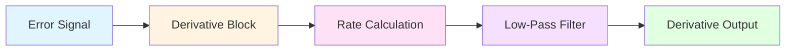

## Derivative Control Fundamentals

Derivative control—also called rate control or anticipatory action—responds to the rate of change of the error signal. This mode predicts future error by extrapolating current error trends, providing corrective action before large deviations occur. In HVAC applications, derivative control reduces overshoot and improves stability for processes with significant lag times, such as air handler discharge temperature control or large thermal mass systems.

The derivative term produces a control output proportional to the rate of change of the process variable:

$$u_D(t) = K_d \frac{de(t)}{dt}$$

where $K_d$ is the derivative gain (also expressed as $K_p \cdot T_d$ in dependent form), $e(t)$ is the error signal, and $u_D(t)$ is the derivative contribution to the control output.

## Derivative Time Constant

The derivative time parameter $T_d$ represents the time interval over which the derivative action "looks ahead." It quantifies how much future error the controller anticipates based on the current rate of change:

$$u_D(t) = K_p \cdot T_d \cdot \frac{de(t)}{dt}$$

A larger $T_d$ increases the derivative contribution, providing stronger damping but also greater sensitivity to noise. The derivative term reaches maximum output when the error changes at a constant rate equal to $1/T_d$ per unit time.

### Ideal vs. Practical Derivative

The ideal derivative transfer function in the Laplace domain:

$$G_D(s) = K_d \cdot s = K_p \cdot T_d \cdot s$$

This ideal form amplifies high-frequency noise infinitely. Practical implementations use a filtered derivative with a first-order lag:

$$G_D(s) = \frac{K_p \cdot T_d \cdot s}{1 + \frac{T_d}{N} \cdot s}$$

where $N$ is the derivative filter coefficient (typically 5-20). This limits high-frequency gain while preserving derivative action at relevant process frequencies.

## Derivative Response Characteristics

### Derivative Action on Setpoint Change

When the setpoint changes abruptly, the error derivative spikes, causing "derivative kick"—a sudden, large control output. This is problematic in HVAC systems with limited actuator authority or valve/damper position limits.

**Derivative on Measurement (DoM):**

Instead of computing the derivative of error, modern controllers calculate the derivative of the process variable:

$$u_D(t) = -K_p \cdot T_d \cdot \frac{d PV(t)}{dt}$$

The negative sign accounts for the relationship between PV and error ($e = SP - PV$). This eliminates derivative kick on setpoint changes while maintaining damping during disturbances.

## Derivative Tuning Guidelines

Derivative settings depend on process dynamics, noise levels, and control objectives. The following table provides starting points for HVAC applications:

| **Application** | **Typical Td/Ti Ratio** | **Td Range (seconds)** | **Notes** |
|----------------|------------------------|----------------------|-----------|
| Air handler discharge temp | 0.1 - 0.25 | 10 - 60 | Moderate lag, smooth PV |
| Zone temperature control | 0 | 0 | High noise, long dead time—avoid D |
| Steam pressure control | 0.2 - 0.4 | 5 - 30 | Fast process, low noise |
| Chilled water supply temp | 0.1 - 0.2 | 15 - 90 | Large thermal mass |
| Hot water reset control | 0 | 0 | Slow process, noisy feedback |
| Duct static pressure | 0.05 - 0.15 | 2 - 10 | Fast actuator, moderate noise |

### Tuning Rules

Classical tuning methods provide $T_d$ estimates based on process characteristics:

| **Method** | **Derivative Time Td** | **Conditions** |
|-----------|----------------------|---------------|
| Ziegler-Nichols (step) | $T_d = 0.5 \cdot L$ | Dead time $L$, time constant $\tau$ known |
| Cohen-Coon | $T_d = L \cdot \frac{0.37 - 0.37(L/\tau)}{1 + 0.185(L/\tau)}$ | Better for $L/\tau < 1$ |
| Lambda tuning | $T_d = \tau$ (if feasible) | Set equal to dominant time constant |
| AMIGO | $T_d = 0.5 \cdot L$ | Similar to Z-N, process specific |

For HVAC systems with sensor noise, reduce $T_d$ by 25-50% from calculated values and increase the filter coefficient $N$ to 10-20.

## Practical Limitations

**Noise Amplification:**

Derivative action amplifies measurement noise, which can cause actuator wear, energy waste, and control instability. High-frequency sensor noise (from quantization, electrical interference, or turbulent flow) becomes magnified in the derivative term. Solutions include:

- Low-pass filtering of the PV before derivative calculation
- Derivative on measurement (DoM) to avoid setpoint-induced spikes
- Reduced derivative gain or time constant
- Sensor selection with lower noise characteristics

**Actuator Limitations:**

Derivative output can demand rapid actuator movements beyond physical capabilities. Dampers and valves have slew rate limits (degrees per second or % open per second) that constrain response. When derivative demands exceed these limits, the control loop becomes effectively PI, negating the benefits of derivative action.

**Dead Time Processes:**

Processes with significant dead time (transportation lag) receive minimal benefit from derivative control. The derivative cannot anticipate disturbances that haven't yet affected the measurement. For systems where $L/\tau > 1$, derivative action provides little improvement and may worsen performance.

## Implementation in HVAC Controllers

Modern HVAC controllers implement filtered derivative on measurement:

$$u_D[k] = \frac{T_d}{T_d + N \cdot T_s} \cdot u_D[k-1] - \frac{K_p \cdot T_d \cdot N}{T_d + N \cdot T_s} \cdot (PV[k] - PV[k-1])$$

where $T_s$ is the sampling interval, $k$ indicates the current sample, and $k-1$ indicates the previous sample. This discrete-time form is suitable for digital controllers with sampling periods of 1-10 seconds typical in BAS systems.

### Derivative Disable Conditions

Controllers often disable derivative action under specific conditions:

- Manual mode operation
- Setpoint tracking mode
- Post-tuning or after large setpoint changes (timed disable)
- High PV noise detection (adaptive algorithms)
- Actuator saturation or limit conditions

## Engineering References

Derivative control theory and tuning methods are established in control engineering literature:

- **Åström & Hägglund**, *PID Controllers: Theory, Design, and Tuning* (ISA, 1995)—foundational text on practical PID implementation
- **ASHRAE Handbook—HVAC Applications**, Chapter 46: Control applications in HVAC systems
- **ISA-5.1-2009**: Instrumentation symbols and identification standard
- **Seborg, Edgar, & Mellichamp**, *Process Dynamics and Control* (Wiley, 2016)—comprehensive treatment of derivative filtering and tuning

Practical HVAC derivative tuning often follows manufacturer-specific guidelines from Johnson Controls, Honeywell, Siemens, and Tridium documentation, which account for typical building system dynamics and sensor characteristics.
