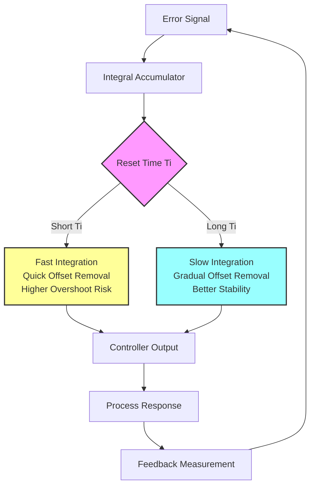

## Integral Control Fundamentals

Integral control, also called reset action, eliminates steady-state offset by continuously accumulating error over time. In HVAC applications, integral action ensures that controlled variables like space temperature or duct static pressure eventually reach their setpoints exactly, not just approximately.

The integral term mathematically represents the area under the error curve. When error persists—even if small—the integral term grows, increasing controller output until the error is eliminated. This makes integral control essential for processes with load disturbances, which describes virtually all HVAC systems.

### Mathematical Representation

The integral contribution to controller output is:

$$u_I(t) = K_i \int_0^t e(\tau) \, d\tau$$

Where:
- $u_I(t)$ = integral contribution to output (%)
- $K_i$ = integral gain (repeats/minute or %/(%·minute))
- $e(t)$ = error signal (setpoint - measurement)
- $\tau$ = integration variable

Alternatively, expressed with reset time $T_i$:

$$u_I(t) = \frac{K_p}{T_i} \int_0^t e(\tau) \, d\tau$$

Where:
- $T_i$ = integral time or reset time (minutes)
- $K_p$ = proportional gain (dimensionless)

The relationship between integral gain and reset time is:

$$K_i = \frac{K_p}{T_i}$$

### Discrete Implementation

In digital HVAC controllers, the integral term is computed at discrete time intervals:

$$u_I[n] = u_I[n-1] + K_i \cdot e[n] \cdot \Delta t$$

Where $\Delta t$ is the sample time interval.

## Reset Action in HVAC Systems

Reset action continuously adjusts the baseline output of a controller. The term "reset" originates from early pneumatic controllers where the integral mechanism would reset the proportional band position over time.

### Key Characteristics

**Offset Elimination**: The primary function of integral action is removing steady-state error. Without integral control, a proportional-only controller maintains a permanent offset between setpoint and measurement.

**Slow Response**: Integral action responds gradually. This slow response provides stability but can cause overshoot if tuned too aggressively.

**Load Compensation**: As loads change (occupancy, solar gain, outdoor conditions), integral action automatically adjusts output to maintain setpoint without operator intervention.

## Reset Time Selection

Reset time ($T_i$) defines how quickly integral action responds to persistent error. Smaller reset times produce faster integral action but risk instability.

### Tuning Guidelines by Application

| HVAC Application | Typical Reset Time (Ti) | Integral Gain (Ki) | Rationale |
|------------------|------------------------|-------------------|-----------|
| Chilled Water Valve Control | 5-15 minutes | 0.067-0.20 repeats/min | Fast thermal response requires moderate reset |
| Hot Water Valve Control | 8-20 minutes | 0.05-0.125 repeats/min | Slower than cooling, higher thermal mass |
| Discharge Air Temperature | 3-10 minutes | 0.10-0.33 repeats/min | Fast airside response permits faster reset |
| Space Temperature Control | 15-30 minutes | 0.033-0.067 repeats/min | Very slow process, requires slow reset |
| Duct Static Pressure | 2-8 minutes | 0.125-0.50 repeats/min | Fast pneumatic response allows aggressive tuning |
| Building Pressure Control | 10-25 minutes | 0.04-0.10 repeats/min | Slow process with large lags |
| Economizer Damper Control | 4-12 minutes | 0.083-0.25 repeats/min | Moderate response for mixed air control |

## Integral Windup

Integral windup occurs when the integral term accumulates to excessive values during sustained error conditions. This happens when the controller output saturates at its limits (0% or 100%) but error persists, causing the integral term to continue growing.

### Windup Consequences

**Excessive Overshoot**: When conditions change and the process variable approaches setpoint, the accumulated integral term drives output to remain at maximum, causing substantial overshoot.

**Delayed Response**: The controller must "unwind" the excessive integral accumulation before it can respond appropriately, creating response delays.

**Instability**: Severe windup can cause sustained oscillations as the controller repeatedly overshoots in both directions.

### Common Windup Scenarios in HVAC

1. **Startup Conditions**: During warmup or cooldown, large temperature errors persist while output is saturated at 100%
2. **Equipment Limitations**: Valve stuck, damper failure, or equipment shutdown while demand continues
3. **Setpoint Changes**: Large setpoint steps cause sustained error during transition
4. **Seasonal Transitions**: Economizer or free cooling modes may limit heating/cooling valve authority

## Anti-Windup Strategies

Effective anti-windup protection is critical for stable HVAC control. Modern digital controllers implement multiple strategies.

### Anti-Windup Implementation Methods

| Method | Description | Advantages | Disadvantages | Best Applications |
|--------|-------------|------------|---------------|-------------------|
| **Output Clamping** | Stop integral accumulation when output reaches limits | Simple, effective for basic control | May not prevent all windup scenarios | Simple valve/damper control |
| **Back-Calculation** | Calculate ideal integral value from saturated output | Sophisticated, smooth recovery | Requires tuning of back-calculation gain | Critical temperature control |
| **Conditional Integration** | Only integrate when error is reducing | Prevents accumulation during saturation | Can slow offset elimination | Applications with frequent saturation |
| **Integral Saturation Limits** | Limit integral term to specific range | Predictable behavior, easy to implement | Requires careful limit selection | Most commercial HVAC controllers |
| **Dynamic Reset Limiting** | Adjust integration rate based on output position | Adaptive to operating conditions | Complex implementation | High-performance VAV or sequence control |

### Back-Calculation Anti-Windup

The most effective anti-windup method for HVAC applications:

$$u_I[n] = u_I[n-1] + K_i \cdot e[n] \cdot \Delta t + \frac{1}{T_{bc}} (u_{sat} - u_{calc})$$

Where:
- $u_{sat}$ = actual saturated output (0% or 100%)
- $u_{calc}$ = calculated output before saturation
- $T_{bc}$ = back-calculation time constant

The difference $(u_{sat} - u_{calc})$ drives the integral term toward a value that produces feasible output.

## Practical Implementation Considerations

### Integral Action During Mode Changes

When HVAC systems switch operating modes (heating to cooling, occupied to unoccupied), the integral term should be managed carefully:

- **Bumpless Transfer**: Initialize integral to maintain current output during mode transitions
- **Integral Reset**: Clear accumulated integral value when switching between incompatible control modes
- **Mode-Specific Tuning**: Apply different integral parameters for heating versus cooling

### Integration with Sequence Logic

In complex HVAC sequences (VAV with reheat, multizone units), integral control interacts with stage transitions:

- Pause integration during stage changes to allow system stabilization
- Use separate integral terms for different control stages
- Coordinate integral action across cascaded control loops

### Monitoring and Diagnostics

Track integral term behavior for system diagnostics:

- Excessive integral accumulation indicates undersized equipment or control authority issues
- Rapid integral oscillations suggest tuning problems or measurement noise
- Persistent integral offset may indicate sensor calibration errors or load imbalances

## Reset Rate Selection Best Practices

1. **Start Conservative**: Begin with slow reset (long $T_i$) and increase speed incrementally while monitoring stability
2. **Match Process Dynamics**: Reset time should be 2-4 times the dominant process time constant
3. **Consider Load Variability**: Processes with highly variable loads benefit from slower reset to maintain stability
4. **Account for Dead Time**: Systems with significant transport delays require slower integral action
5. **Test Under Load**: Verify integral performance during peak heating/cooling conditions, not just at light loads

Proper integral control tuning eliminates offset while maintaining stable, responsive HVAC system operation across all operating conditions.
