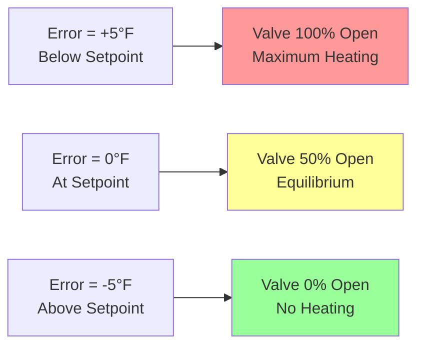

Proportional control represents the fundamental control action where the controller output varies in direct proportion to the control error. This linear relationship between error and output provides immediate response to setpoint deviations while maintaining stability through limited gain. Understanding proportional control characteristics enables effective application and reveals the inherent limitation requiring additional control modes.

## Proportional Gain Concept

The proportional control law defines output as the product of gain and error:

$$CO(t) = K_p \cdot e(t) + CO_0$$

Where $CO(t)$ is controller output at time $t$, $K_p$ is proportional gain, $e(t)$ is control error ($SP - PV$), and $CO_0$ is the output bias at zero error.

Proportional gain determines the sensitivity of controller response to errors. Higher gain produces larger output changes for given errors, resulting in aggressive control action. A controller with $K_p = 2$ produces 2% output change per 1% error. Lower gain yields gentler response, with $K_p = 0.5$ producing only 0.5% output change per 1% error.

The gain value directly affects system behavior. Insufficient gain allows large steady-state errors to persist. Excessive gain causes oscillations or instability as the controller overreacts to small disturbances. Optimal gain balances response speed against stability margins.

For a zone temperature control application, consider a controller with $K_p = 4$%/°F controlling a heating valve. If the zone temperature measures 68°F with a 72°F setpoint:

$$e = 72 - 68 = 4°F$$

$$CO = 4 \frac{\%}{°F} \times 4°F + 50\% = 66\%$$

The valve opens to 66%, increasing heat output to warm the zone. As temperature rises toward setpoint, error decreases and the valve gradually closes.

## Throttling Range and Proportional Band

Throttling range (also called proportional band) represents the error range producing full-scale output change. This alternative specification provides intuitive understanding of control sensitivity:

$$TR = \frac{100\%}{K_p}$$

A controller with $K_p = 5$%/% has a throttling range of 20%. A controller with $K_p = 2$%/% has a 50% throttling range.

For temperature control, throttling range expresses the temperature span causing full valve travel. A heating control valve with 10°F throttling range fully closes at 5°F above setpoint and fully opens at 5°F below setpoint. Intermediate temperatures produce proportional valve positions.

Narrow throttling range (high gain) provides tight control but risks instability. Wide throttling range (low gain) ensures stability but tolerates larger errors. HVAC applications typically employ 5-20°F throttling range for temperature control and 0.5-2 psi for pressure control.

## Offset and Steady-State Error

Proportional control inherently produces steady-state error called offset or droop. This fundamental limitation arises because proportional action requires nonzero error to maintain nonzero output.

Consider a heating system at equilibrium with 70°F setpoint. The zone loses 50,000 Btu/hr to the environment. The heating coil must deliver exactly 50,000 Btu/hr to maintain temperature. If the valve must be 60% open to deliver this heat, proportional control requires sufficient error to produce 60% output.

With $K_p = 5$%/°F and $CO_0 = 50\%$ (assuming 50% output at zero error):

$$60\% = K_p \cdot e + 50\%$$

$$60\% = 5\%/°F \cdot e + 50\%$$

$$e = 2°F$$

The zone stabilizes at 68°F, 2°F below the 70°F setpoint. This 2°F offset represents the steady-state error required to maintain 60% valve position.

Offset increases with load. If heat loss increases to 75,000 Btu/hr requiring 80% valve position:

$$80\% = 5\%/°F \cdot e + 50\%$$

$$e = 6°F$$

The zone now operates at 64°F, 6°F below setpoint. Offset varies proportionally with load deviation from the design condition producing zero error.

The offset problem explains why integral action is necessary for precise setpoint control. Pure proportional control suits applications tolerating steady-state errors, such as space heating where occupants accept temperatures within ±2-3°F of setpoint.

## Direct vs Reverse Acting

Controllers operate in direct or reverse acting modes depending on the required relationship between measurement and output.

**Direct acting** controllers increase output as measurement increases. When controlled variable rises above setpoint (negative error for $SP - PV$), output increases. Cooling applications employ direct acting control: rising temperature increases cooling valve opening or compressor speed.

**Reverse acting** controllers decrease output as measurement increases. When controlled variable rises above setpoint, output decreases. Heating applications employ reverse acting control: rising temperature decreases heating valve opening.

The mathematical representation accommodates both modes through gain sign:

$$CO(t) = \pm K_p \cdot (SP - PV) + CO_0$$

Positive gain produces reverse acting (heating), negative gain produces direct acting (cooling).

| Application | Acting Mode | Error Sign | Output Response |
|-------------|-------------|------------|-----------------|
| Heating valve | Reverse | Temperature below SP (+) | Increase valve opening |
| Heating valve | Reverse | Temperature above SP (-) | Decrease valve opening |
| Cooling valve | Direct | Temperature above SP (-) | Increase valve opening |
| Cooling valve | Direct | Temperature below SP (+) | Decrease valve opening |
| Supply fan | Direct | Pressure below SP (+) | Increase fan speed |
| Return fan | Direct | Pressure above SP (-) | Decrease fan speed |

Incorrect acting mode selection produces positive feedback, driving the system away from setpoint. A reverse-acting controller on a cooling valve opens the valve as temperature rises, increasing cooling and further lowering temperature in runaway fashion.

## Load Regulation and Proportional Gain Selection

Load regulation describes how well a controller maintains setpoint despite load changes. Proportional control exhibits load-dependent offset, with regulation quality determined by gain magnitude.

Higher proportional gain improves load regulation by reducing offset for given load changes. Doubling gain halves the offset. However, stability limits maximum usable gain. The optimal gain maximizes load regulation while maintaining adequate stability margins.

Gain selection considers:

**Process characteristics:**
- Large process gain (high sensitivity to valve position) requires low controller gain
- High process time constant (slow thermal mass) tolerates higher controller gain
- Significant dead time limits maximum stable gain

**Performance requirements:**
- Tight setpoint tolerance demands high gain and integral action
- Applications tolerating offset may use moderate gain without integral
- Fast load changes benefit from higher gain for quick response

**Stability margins:**
- Oscillatory processes require conservative gain
- Well-damped processes accept aggressive gain
- Safety-critical applications mandate conservative tuning

**Typical HVAC proportional gains:**

| Application | Throttling Range | Proportional Gain |
|-------------|------------------|-------------------|
| Zone temperature (heating) | 6-12°F | 8-17%/°F |
| Zone temperature (cooling) | 4-8°F | 12-25%/°F |
| Discharge air temperature | 3-6°F | 17-33%/°F |
| Duct static pressure | 0.5-1.5" w.c. | 67-200%/in w.c. |
| Chilled water temperature | 2-4°F | 25-50%/°F |
| Hot water temperature | 4-8°F | 12-25%/°F |

## Performance Characteristics

Proportional control provides several advantages for HVAC applications:

**Simplicity:** Single parameter (gain) requires tuning, minimizing setup complexity and commissioning time.

**Stability:** Proportional action does not introduce phase lag, maintaining stability even with significant process dead time.

**Smooth operation:** Continuous modulation prevents the cycling and wear associated with on-off control.

**Immediate response:** Output changes instantaneously with error, providing fast initial correction.

Limitations constrain pure proportional control applications:

**Steady-state offset:** Load-dependent droop prevents accurate setpoint maintenance.

**Load sensitivity:** Output varies with load, requiring sufficient error to maintain each operating point.

**No disturbance compensation:** Past errors do not influence current output, allowing disturbances to create new equilibrium offset.

**Tuning compromise:** Single parameter cannot independently optimize response speed and stability.

These limitations led to proportional-integral (PI) and proportional-integral-derivative (PID) algorithms that add integral action to eliminate offset and derivative action to improve transient response. However, understanding proportional control remains essential since it provides the primary control action in compound algorithms.

## Practical HVAC Applications

Pure proportional control suits applications where steady-state offset is acceptable and simplicity is valued:

**Space heating in non-critical areas:** Warehouses, storage facilities, and industrial spaces tolerate ±2-3°F temperature variation. Proportional control maintains acceptable comfort with minimal tuning.

**Pressure control with inherent integration:** Air handler discharge pressure control on volume-limited systems exhibits integrating behavior through air accumulation. The process itself provides integral action, allowing proportional control to achieve zero offset.

**Ratio control:** Maintaining fixed ratios between flows uses proportional control with one flow tracking the other. Offset in absolute values does not affect ratio maintenance.

**Lead-lag sequencing:** Staging multiple units based on loading uses proportional control to modulate the lead unit, with additional units starting based on loading thresholds.

Most modern HVAC applications employ PI or PID control to eliminate offset. However, the proportional term provides the primary control action, with integral and derivative terms supplementing to achieve specific performance objectives. Proper proportional gain selection remains the first and most critical step in PID tuning.
