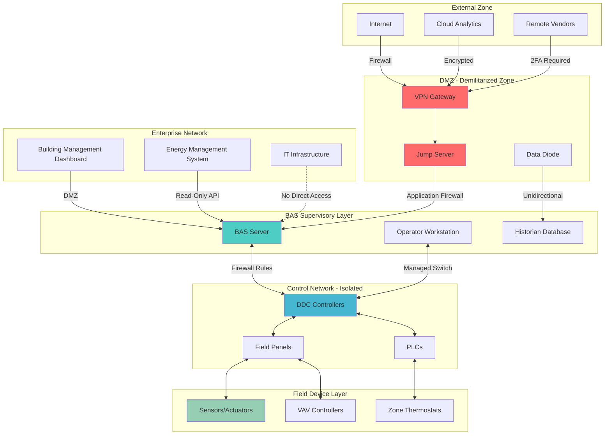

Building Automation Systems (BAS) and HVAC control networks represent critical infrastructure vulnerable to cyber threats. Modern BAS architectures integrate IT and OT (Operational Technology) domains, creating attack surfaces that require layered defense strategies. This content addresses cybersecurity controls essential for protecting climate control systems from unauthorized access, data breaches, and operational disruption.

## Network Segmentation Architecture

Network segmentation isolates BAS components from enterprise networks and the Internet, limiting lateral movement during security incidents. The fundamental principle involves creating distinct security zones with controlled communication pathways.

**Segmentation Zones:**

- **Level 0 (Field Devices):** Sensors, actuators, VAV controllers, zone thermostats
- **Level 1 (Control Layer):** DDC controllers, programmable logic controllers, field panels
- **Level 2 (Supervisory):** BAS servers, operator workstations, HMI (Human-Machine Interface)
- **Level 3 (Enterprise):** Building management systems, energy management platforms
- **Level 4 (External):** Cloud services, remote access, vendor connections

**Segmentation Implementation:**

VLANs (Virtual Local Area Networks) provide logical separation on shared physical infrastructure. Each BAS zone operates on dedicated VLANs with access control lists (ACLs) defining permitted traffic. Firewalls between zones enforce strict ingress/egress rules based on the principle of least privilege.

Physical segmentation using separate network switches offers superior isolation for critical control loops. Unmanaged switches at the field level prevent configuration tampering, while managed switches at supervisory layers enable traffic monitoring and port security.

## Access Control Framework

Access control restricts system interaction to authorized personnel with legitimate operational needs. The framework combines authentication (verifying identity), authorization (granting permissions), and accounting (logging actions).

| Control Type | Implementation | Security Level | Use Case |
|-------------|----------------|----------------|----------|
| Single-Factor | Password only | Low | Non-critical read-only access |
| Two-Factor (2FA) | Password + OTP/token | Medium | Operator workstations |
| Multi-Factor (MFA) | Password + biometric + location | High | Administrative access |
| Certificate-Based | PKI infrastructure | Very High | Service-to-service communication |
| Zero Trust | Continuous verification | Maximum | Cloud-connected systems |

**Role-Based Access Control (RBAC):**

RBAC assigns permissions based on job functions rather than individual users. Typical BAS roles include:

- **Viewer:** Read-only monitoring, no setpoint changes
- **Operator:** Adjust setpoints within defined ranges, acknowledge alarms
- **Technician:** Modify schedules, override controls, local troubleshooting
- **Engineer:** Configure controllers, modify sequences, network changes
- **Administrator:** User management, security settings, system-wide changes

**Authentication Requirements:**

Passwords must meet complexity standards: minimum 12 characters, mixed case, numbers, special symbols. Password rotation every 90 days for standard users, 60 days for privileged accounts. Account lockout after five failed attempts prevents brute-force attacks.

Certificate-based authentication using X.509 certificates provides stronger security for BACnet/SC (Secure Connect) and other encrypted protocols. Public Key Infrastructure (PKI) manages certificate issuance, renewal, and revocation.

## Encryption Protocols

Encryption protects data confidentiality during transmission and storage. BAS implementations require encryption for remote access, inter-zone communication, and cloud connectivity.

**Transport Layer Security (TLS):**

TLS 1.2 or higher encrypts communication channels between BAS components. Deprecated protocols (SSL, TLS 1.0, TLS 1.1) contain known vulnerabilities and must be disabled. Certificate validation prevents man-in-the-middle attacks.

**Protocol-Specific Encryption:**

- **BACnet/SC:** Native encryption using TLS with websockets
- **Modbus:** Modbus/TCP with VPN tunneling or application-layer encryption
- **LonWorks:** IPsec VPN for IP-852 channels
- **OPC UA:** Built-in security modes (Sign, Sign & Encrypt)

**VPN Implementation:**

Virtual Private Networks create encrypted tunnels for remote access. IPsec VPNs operate at the network layer, encrypting all traffic between sites. SSL/TLS VPNs provide application-level access through web browsers or clients.

Split-tunneling must be disabled for vendor remote access to prevent routing BAS traffic through unsecured networks. All VPN sessions require multi-factor authentication and automatic timeout after 30 minutes of inactivity.

## Security Monitoring and Threat Detection

Continuous monitoring identifies anomalous behavior indicative of security incidents. BAS security monitoring encompasses network traffic analysis, log aggregation, and behavioral analytics.

**Monitoring Components:**

| Component | Function | Detection Capability |
|-----------|----------|---------------------|
| Network IDS/IPS | Deep packet inspection | Protocol violations, known attack signatures |
| SIEM Platform | Log correlation | Multi-stage attacks, privilege escalation |
| Network Traffic Analysis | Baseline deviation | Command injection, lateral movement |
| File Integrity Monitoring | Checksum verification | Unauthorized configuration changes |
| Endpoint Detection | Process monitoring | Malware execution, credential theft |

**Critical Log Sources:**

- Authentication attempts (successful/failed)
- Configuration changes with user attribution
- Network connection establishment/termination
- Alarm generation and acknowledgment
- Software/firmware updates
- Database queries and modifications

**Incident Response:**

Security incidents require documented response procedures. Initial response involves containment (isolating affected segments), eradication (removing threats), and recovery (restoring normal operation). Forensic analysis determines root cause and attack vectors.

## Cybersecurity Best Practices

| Practice Area | Requirement | Implementation Frequency |
|--------------|-------------|-------------------------|
| Patch Management | Apply security updates | Within 30 days of release |
| Vulnerability Scanning | Network and application scanning | Quarterly |
| Penetration Testing | Authorized simulated attacks | Annually |
| Security Audits | Configuration review | Semi-annually |
| Backup Verification | Test restore procedures | Monthly |
| User Access Review | Remove inactive accounts | Quarterly |
| Security Training | Staff awareness programs | Annually |

**ASHRAE/NIST Alignment:**

ASHRAE Guideline 36 addresses BAS cybersecurity in high-performance sequences. NIST SP 800-82 provides industrial control system security guidance applicable to BAS networks. NIST Cybersecurity Framework (CSF) offers risk management structure: Identify, Protect, Detect, Respond, Recover.

**Default Configuration Hardening:**

Change all default credentials immediately upon installation. Disable unused services and protocols (Telnet, FTP, SNMPv1/v2). Close unnecessary network ports. Enable audit logging at maximum detail level. Disable USB ports on critical devices to prevent unauthorized data transfer.

**Supply Chain Security:**

Verify firmware authenticity using digital signatures. Maintain software bill of materials (SBOM) for vulnerability tracking. Establish secure vendor access procedures with time-limited credentials and session monitoring.

Cybersecurity for BAS requires continuous vigilance. Threats evolve constantly, demanding regular reassessment of controls, monitoring capabilities, and response procedures to maintain operational integrity and occupant safety.
