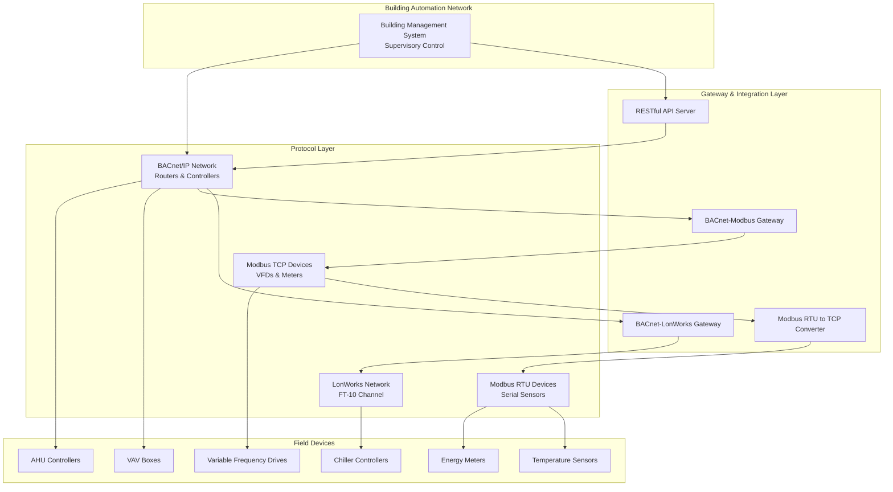

## Protocol Integration Overview

Building automation systems require seamless communication between diverse equipment from multiple manufacturers. Integration and interoperability enable centralized monitoring, control, and optimization of HVAC systems through standardized communication protocols. The primary protocols—BACnet, LonWorks, and Modbus—each serve distinct roles in modern building control architectures.

Successful integration depends on understanding protocol characteristics, selecting appropriate network topologies, and implementing gateways or drivers where native interoperability does not exist. ASHRAE Standard 135 defines BACnet as the industry standard for building automation and control networks, establishing a framework for vendor-neutral integration.

## Primary HVAC Communication Protocols

### BACnet (Building Automation and Control Networks)

BACnet provides object-oriented data representation with standardized services for reading, writing, and subscribing to building automation data. Defined by ASHRAE 135, BACnet supports multiple physical layers including IP, MS/TP (Master-Slave/Token-Passing), and legacy ARCNET.

**Key characteristics:**
- Object-based architecture with standardized object types (analog input, binary output, schedule, etc.)
- Services include ReadProperty, WriteProperty, COV (Change of Value) subscriptions
- Native support for trending, alarming, and scheduling
- Network layer routing enables internetwork communication

**Physical layer options:**
- BACnet/IP: Ethernet-based, leverages existing IT infrastructure, supports large networks
- BACnet MS/TP: RS-485 serial, cost-effective for field device communication, typical baud rates 9600-76,800 bps
- BACnet/SC: Secure Connect over websockets, emerging standard for encrypted communication

### LonWorks (ISO/IEC 14908)

LonWorks utilizes a peer-to-peer architecture with network variables for data exchange. Originally developed by Echelon Corporation, it is standardized as ISO/IEC 14908.

**Key characteristics:**
- Network variables (NVs) enable direct binding between devices
- Neuron chip-based technology with distributed intelligence
- Supports twisted pair (FT-10), power line, IP, and fiber optic media
- Interoperable through standard network variable types (SNVTs)

**Application domains:**
- Legacy building automation systems
- Lighting control networks
- Specialized HVAC equipment with embedded LonMark certification

### Modbus

Modbus is a simple master-slave protocol widely used for industrial automation and HVAC equipment communication. Developed by Modicon in 1979, it remains ubiquitous due to its simplicity and royalty-free implementation.

**Variants:**
- Modbus RTU: Binary serial protocol over RS-232/RS-485, deterministic timing
- Modbus TCP/IP: Modbus application protocol over TCP, port 502
- Modbus ASCII: ASCII-encoded serial variant, less common

**Characteristics:**
- Register-based addressing (holding registers, input registers, coils, discrete inputs)
- Function codes for read/write operations (FC03: Read Holding Registers, FC16: Write Multiple Registers)
- No native object model or standardized data representation
- Requires manufacturer-specific register maps for interpretation

## Protocol Comparison

| Feature | BACnet | LonWorks | Modbus RTU | Modbus TCP |
|---------|--------|----------|------------|------------|
| Architecture | Object-oriented | Peer-to-peer (NVs) | Master-slave | Client-server |
| Standardization | ASHRAE 135 | ISO/IEC 14908 | De facto | De facto |
| Data Model | Objects & Properties | Network Variables | Registers | Registers |
| Discovery | Who-Is/I-Am | Service Pin | Manual config | Manual config |
| Bandwidth | Medium-High | Medium | Low | Medium |
| Typical Speed | 10-100 Mbps (IP) | 78 kbps (FT-10) | 9600-115200 bps | 100 Mbps |
| Native Interoperability | High | Medium | Low | Low |
| Complexity | High | Medium | Low | Low |

## Integration Approaches

### Protocol Gateways

Protocol gateways translate communication between incompatible protocols, enabling integration of multi-vendor equipment. Gateways operate at the application layer, mapping objects, registers, or network variables between protocol domains.

**Gateway functions:**
- Data translation and format conversion
- Protocol-specific service mapping (e.g., BACnet ReadProperty to Modbus FC03)
- Data buffering and caching to optimize polling
- Alarm and event forwarding

**Implementation considerations:**
- Point mapping configuration defines correspondence between source and destination data
- Polling intervals affect update latency and network load
- COV or exception-based reporting reduces unnecessary traffic
- Gateway capacity limits (points, devices, throughput) must accommodate system scale

**Common gateway types:**
- BACnet/IP to Modbus TCP: Exposes Modbus registers as BACnet objects
- BACnet MS/TP to BACnet/IP router: Extends MS/TP field networks to IP backbone
- LonWorks to BACnet: Maps LonMark SNVTs to BACnet standardized objects

### Native Protocol Drivers

Building management systems implement native protocol drivers for direct communication without intermediate gateways. Driver software executes protocol stack operations within the BMS server or controller.

**Driver characteristics:**
- Lower latency compared to gateway-based integration
- Direct access to protocol-specific features (BACnet trending, Modbus exception codes)
- Requires BMS platform support for each protocol
- Configuration includes device addressing, network parameters, and point mapping

**Common driver implementations:**
- BACnet driver: Supports device discovery, object browsing, COV subscriptions
- Modbus driver: Implements master role with configurable polling schedules
- OPC driver: Connects to OPC servers for standardized industrial data access

### API-Based Integration

Modern building automation systems expose RESTful APIs for web services integration, cloud connectivity, and third-party application development.

**API integration benefits:**
- Platform-agnostic access using HTTP/HTTPS protocols
- JSON or XML data serialization for human-readable formats
- Webhook support for event-driven notifications
- OAuth2 or API key authentication mechanisms

**Typical API endpoints:**
- GET /devices: Retrieve device inventory
- GET /points/{id}/value: Read current point value
- POST /points/{id}/command: Write command to controllable point
- GET /alarms: Query active alarms and events

**Integration patterns:**
- Cloud aggregation: Local BMS pushes data to cloud analytics platforms
- Mobile applications: HTTPS access for remote monitoring and control
- Energy management systems: Periodic data retrieval for demand response

## Interoperability Standards and Best Practices

**ASHRAE 135 (BACnet) compliance:**
- Specify BACnet Testing Laboratories (BTL) listed devices for proven interoperability
- Define required BACnet Interoperability Building Blocks (BIBBs) in specifications
- Use standardized object types and properties to maximize vendor flexibility

**Documentation requirements:**
- Maintain protocol implementation conformance statements (PICS for BACnet)
- Document register maps for Modbus devices with data types and scaling
- Provide network variable binding details for LonWorks installations

**Network design:**
- Segment networks by protocol to minimize broadcast traffic
- Implement VLANs for BACnet/IP traffic isolation from IT networks
- Size MS/TP segments to avoid token-passing delays (typically 32 devices maximum)
- Use separate RS-485 channels for Modbus RTU networks to prevent address conflicts

**Security considerations:**
- Enable BACnet/SC for encrypted communication where supported
- Implement firewall rules restricting protocol traffic to authorized subnets
- Use VPN tunnels for remote BMS access rather than exposing protocols to internet
- Apply authentication on Modbus TCP connections where device firmware supports it

Integration and interoperability transform isolated HVAC equipment into cohesive building automation systems capable of optimized performance, energy efficiency, and centralized fault detection.

## Components

- Bacnet Integration
- Bacnet Ip
- Bacnet Mstp
- Bacnet Objects
- Bacnet Services
- Lonworks Integration
- Modbus Rtu Integration
- Modbus Tcp Integration
- Opc Integration
- Haystack Tagging
- Brick Schema
- Api Integration
- Restful Api
- Web Services
