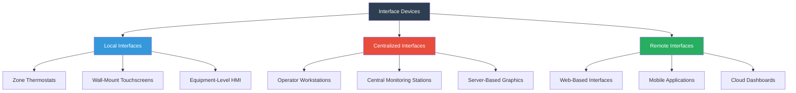

Interface devices serve as the critical connection between building operators and HVAC control systems, enabling monitoring, control, and optimization of climate control equipment. These human-machine interfaces (HMI) range from simple thermostats to sophisticated operator workstations that manage entire building portfolios.

## Interface Device Hierarchy

## Thermostats and Local Controls

Thermostats represent the most ubiquitous HVAC interface device, providing zone-level temperature control and occupant interaction. Modern thermostats have evolved from simple bimetallic switching devices to sophisticated microprocessor-based controllers.

**Thermostat Categories:**

- **Non-programmable thermostats:** Basic setpoint adjustment with manual mode selection
- **Programmable thermostats:** Time-based scheduling with multiple daily periods (wake, day, evening, sleep)
- **Smart thermostats:** Network-connected devices with learning algorithms, occupancy detection, and remote access
- **Communicating thermostats:** Integration with building automation systems via BACnet, Modbus, or proprietary protocols

Wall-mounted touchscreens extend thermostat functionality by displaying multiple system parameters, providing access to advanced settings, and offering graphical representations of system operation. These devices typically feature 3.5-inch to 10-inch capacitive touchscreens with customizable user interfaces.

## Operator Workstations

Operator workstations serve as centralized command centers for building automation systems, providing comprehensive monitoring and control capabilities across multiple buildings or campuses.

### Hardware Requirements

| Component | Minimum Specification | Recommended Specification |
|-----------|----------------------|---------------------------|
| Processor | Intel Core i5 | Intel Core i7 or AMD Ryzen 7 |
| RAM | 8 GB | 16 GB or greater |
| Storage | 256 GB SSD | 512 GB NVMe SSD |
| Display Resolution | 1920 x 1080 (Full HD) | 2560 x 1440 (QHD) or dual monitors |
| Network Interface | 1 Gbps Ethernet | 1 Gbps Ethernet with redundant connection |
| Operating System | Windows 10 Pro | Windows 10/11 Pro or Enterprise |
| Graphics | Integrated graphics | Dedicated GPU for large-scale graphics |

### Software Functionality

Operator workstation software must provide real-time visualization, alarm management, trend analysis, and control functions. ASHRAE Guideline 13-2015 establishes user interface requirements for building automation systems, emphasizing intuitive navigation, consistent graphical representations, and appropriate alarm prioritization.

**Core Workstation Capabilities:**

- **Graphical system representation:** Floor plans, mechanical schematics, and system diagrams with live data overlays
- **Alarm management:** Prioritized alarm display with filtering, acknowledgment, and historical alarm logs
- **Trending and data logging:** Real-time and historical trend displays with customizable time ranges and multiple point overlay
- **Scheduling:** Calendar-based time schedules with exception handling for holidays and special events
- **Report generation:** Automated energy reports, system performance summaries, and maintenance documentation
- **Database management:** Point configuration, system backup, and version control

## Web-Based Interfaces

Web-based interfaces eliminate the need for dedicated workstation software by delivering building automation functionality through standard web browsers. This architecture offers several advantages:

- **Platform independence:** Access from any device with a modern browser (Windows, macOS, Linux, tablets)
- **Simplified deployment:** No client software installation or maintenance required
- **Centralized updates:** Server-side software updates automatically available to all users
- **Scalability:** Support for unlimited concurrent users based on server capacity

Web interfaces utilize HTML5, CSS3, and JavaScript frameworks to deliver responsive designs that adapt to various screen sizes. Real-time data updates typically employ WebSocket connections or server-sent events for efficient communication.

Security considerations for web-based interfaces include HTTPS encryption, multi-factor authentication, role-based access control, and session timeout policies. ASHRAE Standard 135.1-2013 (BACnet secure connect) provides guidance on securing building automation communications.

## Mobile Applications

Mobile applications extend building automation access to smartphones and tablets, enabling remote monitoring and control from any location. Mobile interfaces prioritize essential functions due to limited screen real estate.

**Mobile Application Features:**

- **Dashboard views:** Key performance indicators and system status at a glance
- **Alarm notifications:** Push notifications for critical alarms requiring immediate attention
- **Temperature adjustments:** Remote setpoint changes and mode selection
- **Occupancy management:** Building mode changes for early arrival or extended hours
- **Energy monitoring:** Real-time energy consumption and cost tracking
- **Quick controls:** Frequently used functions accessible within two screen taps

Native applications (iOS/Android) offer superior performance and offline functionality compared to mobile web applications. Hybrid frameworks such as React Native or Flutter enable cross-platform development with shared codebases.

## HMI Design Requirements

ASHRAE Guideline 13 specifies human-machine interface requirements to ensure consistent, intuitive operation across different building automation systems.

### Display Requirements

| Parameter | Specification |
|-----------|--------------|
| Update Rate | 1-5 seconds for dynamic values |
| Color Coding | Consistent across all graphics (red = alarm, yellow = warning, green = normal) |
| Font Size | Minimum 10-point for desktop, 14-point for mobile |
| Contrast Ratio | Minimum 4.5:1 for normal text, 3:1 for large text |
| Resolution Independence | Graphics scalable without quality loss |
| Response Time | <2 seconds for user command execution acknowledgment |

### Navigation Standards

- Maximum three levels of navigation depth to reach any function
- Breadcrumb navigation showing current location in system hierarchy
- Context-sensitive help accessible from any screen
- Consistent icon usage and placement across all interfaces
- Quick access to alarm summary from any screen

## Data Presentation and Analysis

Effective interface devices transform raw sensor data into actionable information through visualization techniques:

- **Real-time graphics:** Animated equipment representations showing operational status
- **Trend charts:** Line graphs displaying parameter changes over time with configurable axes
- **Comparison plots:** Multiple buildings or time periods overlaid for performance analysis
- **Heat maps:** Color-coded floor plans indicating temperature distribution or energy intensity
- **Scatter plots:** Correlation analysis between related parameters (outdoor air temperature vs. energy consumption)

Historical data storage enables forensic analysis of system performance, equipment failures, and energy consumption patterns. Storage requirements scale with point count and logging frequency; typical installations require 1-5 TB of storage for multi-year historical databases.

## Energy Dashboards

Specialized energy dashboards provide building owners and operators with visibility into energy consumption, cost, and efficiency metrics. These interfaces typically integrate utility meter data, equipment runtime hours, and calculated energy use intensity (EUI) values.

Dashboard components include:

- **Real-time demand:** Current electrical demand (kW) compared to peak limits and utility rate thresholds
- **Consumption totals:** Daily, monthly, and annual energy use by fuel type
- **Cost tracking:** Energy costs with rate schedule application and demand charge calculation
- **Benchmarking:** Comparison to previous periods, similar buildings, or ASHRAE Standard 100 performance targets
- **Carbon footprint:** Greenhouse gas emissions calculated from energy consumption

Interface devices represent the operator's window into complex HVAC systems, directly impacting operational efficiency, energy performance, and occupant comfort through their design, functionality, and usability.
