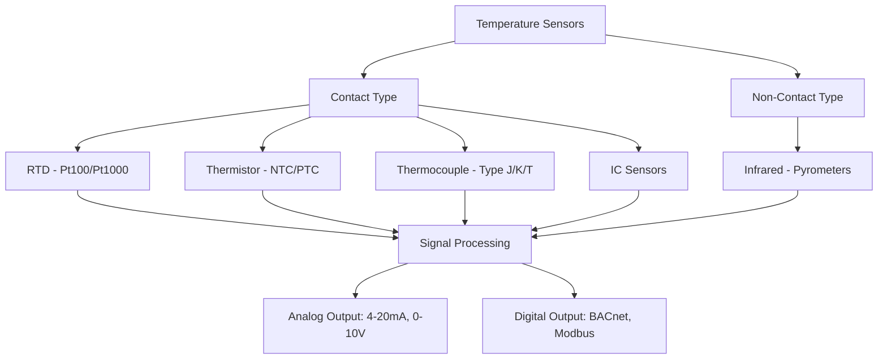
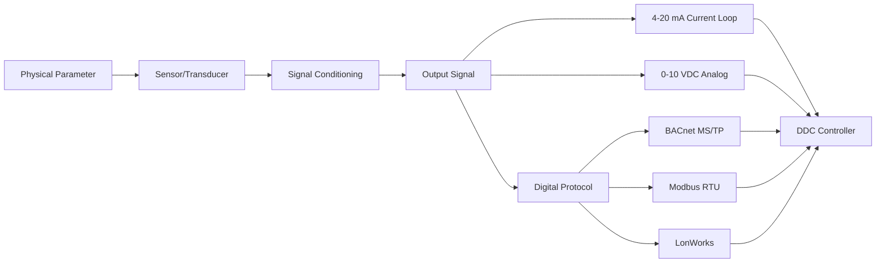

## Overview

Sensors and transducers form the sensory layer of building automation systems, converting physical quantities into electrical signals for monitoring and control. Sensor accuracy, response time, and reliability directly impact system performance, energy efficiency, and occupant comfort.

## Fundamental Sensor Characteristics

### Accuracy and Error Analysis

Sensor accuracy is quantified by total error, combining systematic and random components:

$$E_{total} = \sqrt{E_{systematic}^2 + E_{random}^2}$$

where:
- $E_{systematic}$ = calibration error, linearity error, hysteresis
- $E_{random}$ = noise, repeatability variation

ASHRAE Guideline 36 specifies sensor accuracy requirements:
- Space temperature: ±0.5°F (±0.3°C)
- Outside air temperature: ±1.0°F (±0.6°C)
- Duct static pressure: ±5% of reading or ±0.05 in. w.c., whichever is greater
- Air flow: ±10% of reading
- Relative humidity: ±5% RH

### Dynamic Response

First-order sensor response to step input:

$$T(t) = T_{final}(1 - e^{-t/\tau})$$

where $\tau$ is the time constant (time to reach 63.2% of final value). Response time (95% of final value) equals $3\tau$.

## Temperature Sensors

### Temperature Sensor Comparison

| Sensor Type | Range | Accuracy | Stability | Response Time | Cost |
|-------------|-------|----------|-----------|---------------|------|
| Pt100 RTD | -200°C to 850°C | ±0.1°C | Excellent | 1-10 s | High |
| Pt1000 RTD | -200°C to 850°C | ±0.15°C | Excellent | 1-10 s | High |
| NTC Thermistor | -40°C to 150°C | ±0.2°C | Good | 1-5 s | Low |
| Type K Thermocouple | -200°C to 1350°C | ±0.5°C to ±2°C | Fair | 0.1-1 s | Low |
| IC Sensor (LM35) | -55°C to 150°C | ±0.5°C | Good | 0.5-2 s | Low |

### RTD Resistance-Temperature Relationship

The Callendar-Van Dusen equation describes RTD behavior:

$$R(T) = R_0[1 + AT + BT^2 + C(T-100)T^3]$$

For Pt100 sensors, $R_0 = 100\,\Omega$ at 0°C, $\alpha = 0.00385\,\Omega/\Omega/°C$.

Simplified linear approximation for HVAC range (-40°C to 100°C):

$$R(T) = R_0(1 + \alpha T)$$

## Pressure Sensors and Transducers

Pressure measurement principles:
- **Piezoresistive**: Silicon diaphragm with strain gauges
- **Capacitive**: Deflection changes capacitance
- **Piezoelectric**: Crystal generates charge under stress (dynamic only)

### Pressure Ranges in HVAC

| Application | Typical Range | Required Accuracy |
|-------------|---------------|-------------------|
| Duct Static Pressure | 0-2 in. w.c. | ±5% or ±0.05 in. w.c. |
| Building Pressure | -0.1 to +0.1 in. w.c. | ±0.01 in. w.c. |
| Filter DP | 0-1 in. w.c. | ±10% |
| Refrigerant High Side | 0-500 psig | ±1% FS |
| Refrigerant Low Side | 0-200 psig | ±1% FS |
| Hydronic System | 0-150 psig | ±1% FS |

Pressure sensor output relationship:

$$V_{out} = V_{span} \left(\frac{P - P_{min}}{P_{max} - P_{min}}\right) + V_{offset}$$

For 4-20 mA output: $I_{out} = 4 + 16\left(\frac{P - P_{min}}{P_{max} - P_{min}}\right)$ mA

## Humidity Sensors

Relative humidity is the ratio of actual vapor pressure to saturation vapor pressure:

$$RH = \frac{p_v}{p_{vs}(T)} \times 100\%$$

### Humidity Sensor Technologies

| Type | Principle | Range | Accuracy | Response Time |
|------|-----------|-------|----------|---------------|
| Capacitive | Polymer film dielectric | 0-100% RH | ±2-3% RH | 30-60 s |
| Resistive | Conductive polymer | 10-95% RH | ±3-5% RH | 30-120 s |
| Chilled Mirror | Dew point measurement | 5-95% RH | ±0.5% RH | 60-180 s |

ASHRAE Standard 62.1 requires humidity monitoring for demand-controlled ventilation. Sensor drift necessitates annual recalibration.

## Air Flow Sensors

Flow measurement technologies for HVAC:

### Velocity-Based Sensors

**Differential Pressure Flow Measurement**:

$$Q = K \times A \times \sqrt{2\Delta P / \rho}$$

where:
- $Q$ = volumetric flow rate (CFM)
- $K$ = flow coefficient (depends on measurement device)
- $A$ = duct cross-sectional area
- $\Delta P$ = differential pressure
- $\rho$ = air density

**Thermal Mass Flow Sensors**:

Heat transfer from heated element proportional to mass flow:

$$q = \dot{m} c_p \Delta T$$

Advantages: Direct mass flow measurement, wide turndown ratio (100:1)

### Flow Sensor Comparison

| Sensor Type | Accuracy | Pressure Drop | Turndown Ratio | Cost |
|-------------|----------|---------------|----------------|------|
| Pitot Tube Array | ±5-10% | Low | 5:1 | Low |
| Hot Wire Anemometer | ±3-5% | Negligible | 100:1 | Medium |
| Ultrasonic | ±2-3% | None | 20:1 | High |
| Vortex Shedding | ±1-2% | Medium | 10:1 | Medium |

## Air Quality Sensors

Indoor air quality monitoring includes:

**CO₂ Sensors (NDIR Technology)**:
- Range: 0-2000 ppm typical
- Accuracy: ±50 ppm or ±3% of reading
- ASHRAE 62.1 setpoint: 1000 ppm for DCV

**VOC Sensors (Metal Oxide Semiconductor)**:
- Detect total volatile organic compounds
- Output: relative index or equivalent CO₂
- Applications: demand-controlled ventilation, air purifier control

**Particulate Matter Sensors**:
- PM2.5 and PM10 measurement
- Technologies: light scattering, optical particle counting
- ASHRAE Standard 241 references for infectious aerosol control

## Sensor Selection Criteria

1. **Measurement Range**: Select range to place operating point in middle 70% of span
2. **Accuracy Requirements**: Per ASHRAE Guideline 36 or system-specific needs
3. **Environment**: Temperature, humidity, vibration, contamination exposure
4. **Output Signal**: Match to controller input requirements
5. **Response Time**: Must be faster than controlled process dynamics
6. **Maintenance**: Drift characteristics, calibration interval, accessibility
7. **Installation**: Mounting, wiring, commissioning complexity

## Signal Transmission

**Analog Signals**:
- 4-20 mA: Industry standard, self-powered, noise-immune, wire resistance compensation
- 0-10 VDC: Simple interface, susceptible to noise, short distance (<50 ft recommended)

**Digital Protocols**:
- BACnet: Open standard, interoperability
- Modbus: Simple, widely supported
- Proprietary: Vendor-specific, potential integration challenges

## Calibration and Maintenance

ASHRAE Guideline 36 recommends:
- Temperature sensors: Verify annually
- Pressure sensors: Calibrate every 2 years
- Humidity sensors: Calibrate annually
- Flow sensors: Verify every 2 years
- CO₂ sensors: Calibrate every 2-5 years

Calibration methods:
- **In-situ**: Portable reference standard comparison
- **Laboratory**: Remove sensor, controlled environment calibration
- **Two-point**: Zero and span adjustment
- **Multi-point**: Full-range characterization

## Conclusion

Sensor selection profoundly impacts system performance. Specify sensors that meet ASHRAE accuracy requirements, match environmental conditions, and integrate seamlessly with the control system architecture. Regular calibration maintains accuracy and ensures design intent throughout system life.

