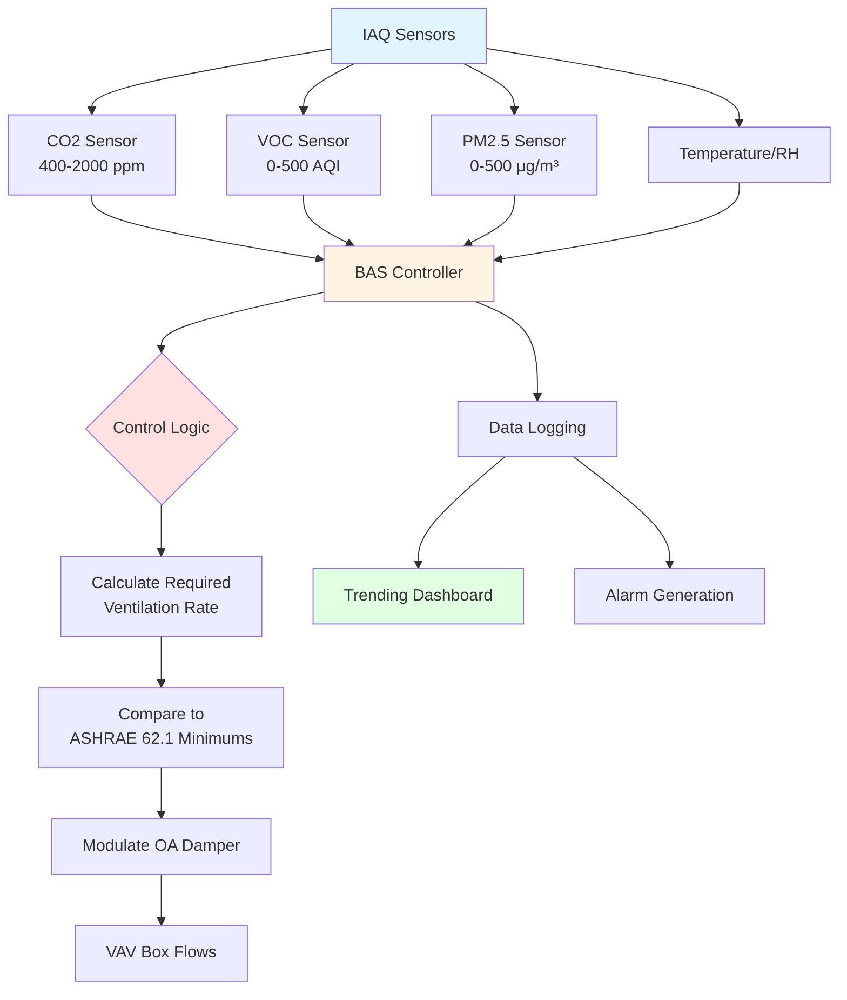

# Air Quality Sensors: Detection Principles and HVAC Integration

Indoor air quality (IAQ) sensors enable demand-controlled ventilation (DCV) systems to optimize outdoor air delivery based on actual occupancy and contaminant levels rather than fixed schedules. ASHRAE Standard 62.1 permits ventilation rate reductions when CO2 sensors demonstrate reduced occupancy, provided proper sensor accuracy and maintenance protocols are followed.

## NDIR CO2 Sensors: Detection Principle

Non-dispersive infrared (NDIR) sensors detect carbon dioxide through selective absorption of infrared radiation at the 4.26 μm wavelength band. The sensor employs a broadband IR source, optical cavity, and detector with an optical filter matched to CO2's absorption spectrum.

**Beer-Lambert Law** governs the relationship between gas concentration and light absorption:

$$I = I_0 e^{-\alpha C L}$$

Where:
- $I$ = transmitted light intensity (W)
- $I_0$ = incident light intensity (W)
- $\alpha$ = absorption coefficient (ppm⁻¹·cm⁻¹)
- $C$ = CO2 concentration (ppm)
- $L$ = optical path length (cm)

The sensor measures the ratio of transmitted to incident intensity, calculating concentration from:

$$C = -\frac{1}{\alpha L} \ln\left(\frac{I}{I_0}\right)$$

Dual-wavelength NDIR designs include a reference channel at a non-absorbed wavelength (typically 3.9 μm) to compensate for source intensity drift, window contamination, and temperature effects. This differential measurement significantly improves long-term stability.

**Typical NDIR CO2 Sensor Specifications:**

| Parameter | Specification | Notes |
|-----------|---------------|-------|
| Measurement range | 0–2000 ppm | Standard for DCV applications |
| Accuracy | ±50 ppm + 3% of reading | At 25°C reference conditions |
| Response time (T90) | 60–120 seconds | Time to reach 90% of step change |
| Calibration stability | <50 ppm drift/5 years | ABC algorithm compensation |
| Operating temperature | 0–50°C | Derate accuracy outside 15–35°C |
| Power consumption | 0.5–3 W | Continuous operation |

## Metal Oxide Semiconductor VOC Sensors

Metal oxide semiconductor (MOX) sensors detect volatile organic compounds through surface reactions on heated metal oxide films, typically tin dioxide (SnO2) or tungsten oxide (WO3). The sensor operates at 200–400°C to promote catalytic oxidation of organic molecules.

**Sensing mechanism:**

In clean air, oxygen molecules adsorb onto the metal oxide surface, capturing free electrons and creating a depletion layer:

$$\text{O}_2(\text{gas}) + e^- \rightarrow \text{O}_2^-(\text{ads})$$

When reducing gases (VOCs, CO) contact the heated surface, they react with adsorbed oxygen, releasing electrons back to the conduction band:

$$\text{VOC} + \text{O}^- \rightarrow \text{CO}_2 + \text{H}_2\text{O} + e^-$$

The sensor resistance decreases with VOC concentration according to a power law relationship:

$$R_s = R_0 \left(\frac{C}{C_0}\right)^{-\beta}$$

Where:
- $R_s$ = sensor resistance in target gas (kΩ)
- $R_0$ = sensor resistance in clean air (kΩ)
- $C$ = VOC concentration (ppm)
- $C_0$ = reference concentration (ppm)
- $\beta$ = sensitivity exponent (0.3–0.7, gas-dependent)

MOX sensors provide broad-spectrum VOC detection but lack compound specificity. Output is typically reported as equivalent ppb or as a dimensionless air quality index (0–500 scale).

## Optical Particle Counters for PM Monitoring

Optical particle counters detect airborne particulate matter by measuring light scattering from individual particles passing through a laser beam. The scattered light intensity correlates with particle size, enabling mass concentration estimation.

**Mie scattering theory** describes light scattering from spherical particles comparable to or larger than the wavelength:

$$I_{\text{scatter}} \propto d^6$$

For particles in the 0.3–10 μm range, scattered intensity scales approximately with the sixth power of particle diameter, providing high sensitivity to size changes.

Mass concentration is calculated from particle counts by size bin:

$$\text{PM}_{2.5} = \sum_{i=1}^{n} N_i \cdot \rho \cdot \frac{\pi d_i^3}{6}$$

Where:
- $N_i$ = particle count in size bin $i$ (particles/L)
- $\rho$ = assumed particle density (typically 1.65 g/cm³)
- $d_i$ = mean diameter for bin $i$ (μm)

**Particulate Matter Sensor Comparison:**

| Technology | Size Range | Accuracy | Response Time | Cost | Application |
|------------|------------|----------|---------------|------|-------------|
| Optical (light scattering) | 0.3–10 μm | ±10% for PM2.5 | 1–10 seconds | $$ | Indoor air quality monitoring |
| Nephelometer | 0.1–10 μm | ±5% for PM2.5 | 1–60 seconds | $$$$ | Research, regulatory compliance |
| Beta attenuation | 2.5–10 μm | ±2% | 1 hour | $$$$$ | EPA reference method |
| MEMS resonator | 1–10 μm | ±15% | 10–30 seconds | $ | Low-cost IoT applications |

## IAQ Sensor Integration in BAS

Modern building automation systems integrate multiple IAQ sensors to control ventilation rates dynamically, reducing energy consumption while maintaining acceptable indoor air quality.

## ASHRAE 62.1 Requirements for DCV

ASHRAE Standard 62.1 Section 6.2.7 permits DCV using CO2 sensors in spaces with variable occupancy, subject to these requirements:

**Sensor placement criteria:**
- Located in the breathing zone (3–6 ft above floor)
- Positioned to represent average space conditions
- Minimum one sensor per control zone
- Avoid direct sunlight, supply air, or contamination sources

**Accuracy and calibration:**
- Initial accuracy: ±75 ppm or 5% of reading
- Field calibration interval: manufacturer recommendation
- Automatic baseline correction (ABC) acceptable for spaces regularly unoccupied

**Control algorithm:**
- Maintain CO2 setpoint at or below outdoor + 600 ppm (typical 1000–1200 ppm absolute)
- Provide minimum code-required ventilation at setpoint
- Proportional control prevents ventilation cycling

**Ventilation rate calculation:**

$$V_{oz} = R_p \cdot P_z + R_a \cdot A_z$$

Where:
- $V_{oz}$ = outdoor air flow rate for zone (cfm)
- $R_p$ = people outdoor air rate (cfm/person)
- $P_z$ = zone population (persons)
- $R_a$ = area outdoor air rate (cfm/ft²)
- $A_z$ = zone floor area (ft²)

DCV systems modulate $P_z$ based on CO2-derived occupancy, while maintaining the minimum $R_a \cdot A_z$ component at all times.

**Sensor Comparison for DCV Applications:**

| Sensor Type | Accuracy | Stability | Response | Cost | Best Application |
|-------------|----------|-----------|----------|------|------------------|
| NDIR CO2 | ±50 ppm | Excellent | Moderate (60 s) | $$$ | Primary DCV control per ASHRAE 62.1 |
| MOX VOC | ±15% equivalent | Good with baseline | Fast (5 s) | $$ | Supplemental IAQ indication, not code-approved |
| Optical PM2.5 | ±10 μg/m³ | Moderate | Fast (10 s) | $$$ | Filtration control, air quality alerts |
| Combined IAQ | Varies | Good | Fast | $$$$ | Comprehensive monitoring, not single-parameter control |

## Practical Implementation Considerations

**Sensor commissioning:**
1. Verify sensor zero calibration in fresh outdoor air before installation
2. Document installation locations with photos and floor plans
3. Establish baseline readings during unoccupied and fully-occupied periods
4. Configure BAS trend logs for concentration, ventilation rate, and energy data

**Maintenance requirements:**
- CO2 sensors: verify zero and span annually, clean optical surfaces
- VOC sensors: baseline reset quarterly in unoccupied periods
- PM sensors: clean optical chamber monthly, replace inlet filters per manufacturer

**Energy savings potential:**
DCV systems typically reduce ventilation energy by 20–40% in variable-occupancy spaces compared to design-occupancy ventilation, with payback periods of 2–5 years depending on climate, energy costs, and operating schedules.

---

*This content provides engineering-level technical guidance for HVAC professionals. Actual sensor selection, placement, and control strategies must comply with applicable codes and standards including ASHRAE 62.1, IMC, and local amendments.*
