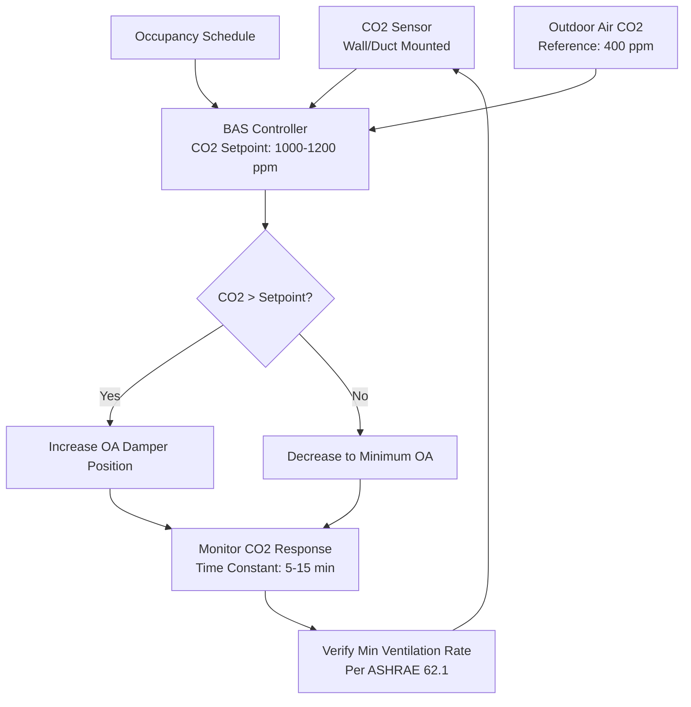

Carbon dioxide sensors serve as the primary feedback mechanism for demand control ventilation (DCV) systems, enabling ventilation rates to adjust dynamically based on occupancy levels. ASHRAE Standard 62.1 permits CO2-based DCV as a ventilation rate procedure alternative when properly implemented with calibrated sensors meeting specific accuracy requirements.

## NDIR Sensor Operating Principles

Nondispersive infrared (NDIR) sensors measure CO2 concentration by exploiting the molecule's characteristic absorption of infrared radiation at 4.26 μm wavelength. The sensor operates on the Beer-Lambert law, which relates light absorption to gas concentration:

$$I = I_0 \cdot e^{-\alpha \cdot L \cdot C}$$

Where:
- $I$ = transmitted light intensity (W)
- $I_0$ = incident light intensity (W)
- $\alpha$ = absorption coefficient (m²/mol)
- $L$ = optical path length (m)
- $C$ = gas concentration (ppm)

The measured CO2 concentration is calculated from the transmittance ratio:

$$C = \frac{1}{\alpha \cdot L} \ln\left(\frac{I_0}{I}\right)$$

Dual-wavelength NDIR sensors employ a reference wavelength (typically 3.9 μm) insensitive to CO2 to compensate for optical path contamination, light source aging, and detector drift. The compensated measurement uses the ratio:

$$C_{compensated} = K \cdot \ln\left(\frac{I_{ref}/I_{CO2,sample}}{I_{ref,0}/I_{CO2,0}}\right)$$

This approach provides superior long-term stability compared to single-wavelength designs.

## CO2 Sensor Integration in DCV Systems

## Sensor Accuracy Classes and Applications

| Accuracy Class | Typical Error | Range | Application | Calibration Interval |
|----------------|---------------|-------|-------------|---------------------|
| Grade A | ±30 ppm ±3% | 0-2000 ppm | Critical environments, laboratories | 12 months |
| Grade B | ±50 ppm ±5% | 0-2000 ppm | Commercial DCV, classrooms | 24 months |
| Grade C | ±75 ppm ±7% | 0-2000 ppm | General monitoring, residential | 36 months |

**ASHRAE 62.1 DCV Requirements:**
- Sensor accuracy: ±75 ppm or 5% of reading (whichever is greater)
- Measurement range: 0-2000 ppm minimum
- Calibration: Manufacturer-specified intervals or every 5 years maximum
- Outdoor air CO2 measurement or fixed reference value (typically 400 ppm)

## Calibration Methods

**1. Fresh Air Calibration (Single-Point ABC)**

Automatic baseline calibration assumes the sensor periodically experiences fresh outdoor air (~400 ppm). The algorithm automatically adjusts the baseline over 7-14 days. This method works for spaces with regular unoccupied periods but fails in continuously occupied or contaminated environments.

**2. Two-Point Span Calibration**

Requires exposure to known reference gases:
- Zero point: Pure nitrogen (0 ppm CO2)
- Span point: Certified calibration gas (typically 1000 ppm)

Calibration factor:

$$K_{span} = \frac{C_{ref}}{C_{measured}}$$

**3. Field Verification**

Compare sensor readings against calibrated portable reference instrument:
- Allow 15-minute stabilization period
- Record ambient temperature and pressure
- Acceptable deviation: within stated accuracy specification

## Mounting Location Requirements

Proper sensor placement directly affects DCV system performance and energy efficiency.

**Space Sensors (Return Air Monitoring):**
- Height: 3-6 ft above floor (breathing zone)
- Distance: >3 ft from doors, >5 ft from supply diffusers
- Avoid: Direct sunlight, heat sources, dead air pockets
- Density: 1 sensor per 10,000 ft² or per air handler zone

**Duct Sensors:**
- Location: Return air duct before mixing with outdoor air
- Mounting: Sensor probe extends into airstream centerline
- Airflow velocity: 400-800 fpm minimum for adequate response
- Protection: Shield from condensation and particulate

**Outdoor Air Reference:**
- Location: Fresh air intake, upstream of economizer
- Height: >8 ft above grade to avoid vehicle exhaust
- Protection: Weather-resistant enclosure with particulate filter

## Response Time Characteristics

Sensor response time affects DCV control loop stability and occupant comfort.

| Parameter | Typical Value | Impact |
|-----------|---------------|--------|
| Sensor T90 response | 60-120 seconds | Time to reach 90% of step change |
| Space time constant | 5-15 minutes | CO2 concentration change rate |
| Control loop update | 1-5 minutes | BAS polling/calculation frequency |
| Damper actuator speed | 30-90 sec/90° | Physical response limitation |

The overall system response time to occupancy changes typically ranges from 8-20 minutes. Control algorithms must account for this lag to prevent oscillation while maintaining adequate ventilation during rapid occupancy increases.

**Optimal Control Parameters:**
- Proportional band: 200-300 ppm above setpoint
- Integral time: 10-20 minutes
- Setpoint: 1000-1200 ppm (600-800 ppm above outdoor baseline)
- Deadband: 50-100 ppm to prevent hunting

## Maintenance and Troubleshooting

**Routine Maintenance:**
- Visual inspection: Quarterly for dust accumulation, physical damage
- Operational verification: Semi-annually against portable reference
- Cleaning: Annual optical chamber cleaning per manufacturer procedure
- Calibration: Per manufacturer specification or every 2-5 years

**Common Issues:**
- Drift below baseline: Failed ABC algorithm, requires manual calibration
- Erratic readings: Contaminated optics, poor mounting location
- No response to occupancy: Insufficient airflow (duct sensors), sensor failure
- Constant high readings: Calibration drift, insufficient outdoor air introduction

Proper CO2 sensor selection, installation, and maintenance directly determines DCV system effectiveness. Grade B accuracy sensors with dual-wavelength NDIR technology and ABC capability provide the optimal balance of performance, reliability, and lifecycle cost for commercial HVAC applications.
