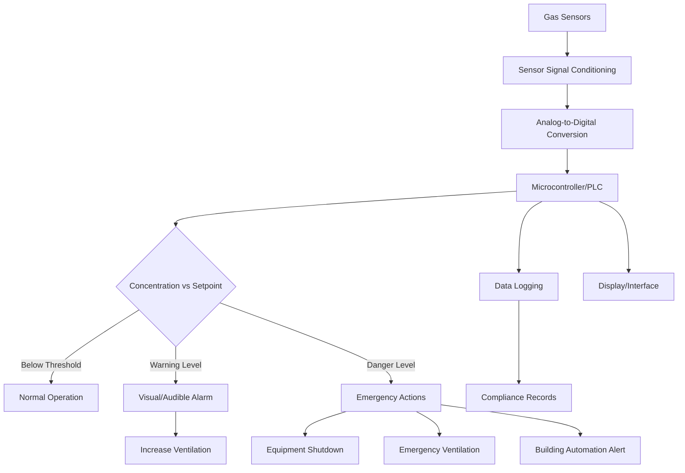

## Gas Detection Sensor Technologies

Gas detection sensors provide critical safety monitoring for HVAC systems, protecting occupants from refrigerant leaks, carbon monoxide exposure, and combustible gas hazards. Modern HVAC installations require gas detection to comply with ASHRAE 15, NFPA 70, and local mechanical codes.

### Electrochemical Sensors

Electrochemical sensors operate through oxidation-reduction reactions at electrode surfaces immersed in an electrolyte solution. When target gas molecules diffuse through a membrane into the sensor, they undergo electrochemical reactions that produce a current proportional to gas concentration.

**Operating Principle:**

The sensor contains three electrodes: working, counter, and reference. Target gas oxidizes at the working electrode, releasing electrons that flow through an external circuit. The counter electrode completes the circuit by reducing oxygen or other species. The resulting current follows a linear relationship with gas concentration across the sensor's specified range.

**Typical Applications:**

- Carbon monoxide detection (0-1000 ppm range)
- Nitrogen dioxide monitoring (0-20 ppm range)
- Refrigerant leak detection (HFC, HCFC specific sensors)
- Ammonia detection in industrial refrigeration

**Performance Characteristics:**

| Parameter | Typical Value | Notes |
|-----------|---------------|-------|
| Response Time | 30-60 seconds | T90 to target concentration |
| Accuracy | ±5% of reading | At calibration conditions |
| Operating Life | 2-3 years | CO sensors, varies by gas |
| Temperature Range | 0°C to 50°C | Performance degrades outside range |
| Cross-Sensitivity | Variable | Requires compensation algorithms |

Electrochemical sensors require periodic calibration and have limited operational lifespans due to electrolyte depletion. Temperature and humidity significantly affect accuracy, necessitating environmental compensation in the sensor circuitry.

### Catalytic Bead Sensors

Catalytic bead sensors detect combustible gases through exothermic oxidation on a heated catalyst surface. The sensor contains two matched beads in a Wheatstone bridge configuration: one coated with active catalyst, the other passivated as a reference.

**Operating Principle:**

Both beads heat to approximately 500°C via embedded platinum coils. When combustible gas contacts the active bead, catalytic oxidation releases heat, increasing bead temperature and resistance. The resistance change creates a bridge imbalance proportional to gas concentration.

**Typical Applications:**

- Natural gas leak detection in mechanical rooms
- Propane monitoring in equipment areas
- Methane detection in combustion air intakes
- General combustible gas detection

**Advantages and Limitations:**

Catalytic sensors provide robust detection across a wide range of combustible gases with excellent long-term stability. However, they consume significant power, generate heat, and can be poisoned by silicones, sulfur compounds, and halogenated hydrocarbons. Installation in oxygen-deficient atmospheres renders them inoperative since combustion requires oxygen.

### Infrared Gas Sensors

Non-dispersive infrared (NDIR) sensors detect gases through absorption of specific infrared wavelengths. These sensors excel at refrigerant leak detection, offering immunity to poisoning and extended service life exceeding 10 years.

NDIR sensors emit infrared radiation through a gas sample chamber to a detector. Target gas molecules absorb specific wavelengths, reducing signal intensity proportional to concentration. Dual-wavelength designs using reference and absorption channels compensate for lamp degradation and optical contamination.

## Combustible Gas Detection Standards

### LEL/UEL Thresholds for Common Gases

| Gas | LEL (% vol) | UEL (% vol) | Typical Alarm Setpoint |
|-----|-------------|-------------|------------------------|
| Natural Gas (Methane) | 5.0 | 15.0 | 25% LEL (1.25% vol) |
| Propane | 2.1 | 9.5 | 20% LEL (0.42% vol) |
| Hydrogen | 4.0 | 75.0 | 25% LEL (1.0% vol) |
| Gasoline Vapor | 1.4 | 7.6 | 20% LEL (0.28% vol) |

Lower explosive limit (LEL) represents the minimum gas concentration supporting combustion. Alarm setpoints typically trigger at 20-25% LEL to provide adequate warning before hazardous conditions develop.

## Refrigerant Leak Detection Requirements

ASHRAE 15-2019 mandates refrigerant detection systems for machinery rooms and occupied spaces containing high-probability systems exceeding refrigerant quantity limits.

### ASHRAE 15 Alarm Setpoints

| Refrigerant Type | Alarm Level | Action Required |
|------------------|-------------|-----------------|
| A1 (Low Toxicity) | RCL × 1.0 | Alarm, increase ventilation |
| A2/A2L (Flammable) | 25% LFL | Alarm, shut down equipment |
| A3 (High Flammability) | 25% LFL | Alarm, emergency shutdown |
| B1/B2 (Higher Toxicity) | TLV-TWA | Alarm, evacuate space |

RCL (Refrigerant Concentration Limit) varies by refrigerant and occupancy classification. Detection systems must activate mechanical ventilation and trigger visual/audible alarms when concentrations exceed setpoints.

### Sensor Placement Guidelines

Position refrigerant sensors based on vapor density relative to air:

- Heavier-than-air refrigerants (R-134a, R-410A): Mount 12-18 inches above floor
- Lighter-than-air refrigerants (Ammonia R-717): Mount near ceiling
- Multiple sensors required for rooms exceeding 1000 ft² or containing obstructions

## Gas Detection System Architecture

## Carbon Monoxide Detection

Carbon monoxide sensors protect occupants from incomplete combustion products in fuel-fired equipment. NFPA 720 and local codes typically require CO detection in mechanical rooms housing combustion appliances.

**Alarm Levels per UL 2034:**

| Concentration | Exposure Time | Required Action |
|---------------|---------------|-----------------|
| 70 ppm | 60-240 minutes | Audible alarm |
| 150 ppm | 10-50 minutes | Audible alarm |
| 400 ppm | 4-15 minutes | Audible alarm |

Position CO sensors 5-20 feet from combustion equipment at breathing height (4-6 feet above floor). Mount away from direct exhaust paths but within the ambient air circulation pattern.

## Maintenance and Calibration

Gas detection systems require systematic maintenance to ensure reliable performance:

1. **Monthly functional testing** - Verify alarm activation and system response
2. **Quarterly bump testing** - Apply target gas to confirm sensor response
3. **Annual calibration** - Adjust sensor output using certified calibration gas
4. **Periodic replacement** - Replace electrochemical sensors per manufacturer schedule (typically 2-3 years)

Maintain calibration records documenting sensor identity, calibration date, gas concentration applied, and technician identification for code compliance and liability protection.

## Selection Criteria

Choose gas detection technology based on application requirements:

- Electrochemical: Toxic gases, low concentrations, moderate cost
- Catalytic bead: Combustible gases, harsh environments, proven reliability
- NDIR: Refrigerants, long service life, minimal maintenance
- Metal oxide semiconductor: General purpose, lowest cost, moderate selectivity

Consider sensor selectivity, cross-sensitivity to interfering gases, environmental conditions, maintenance capabilities, and total cost of ownership including replacement sensors over system lifetime.
