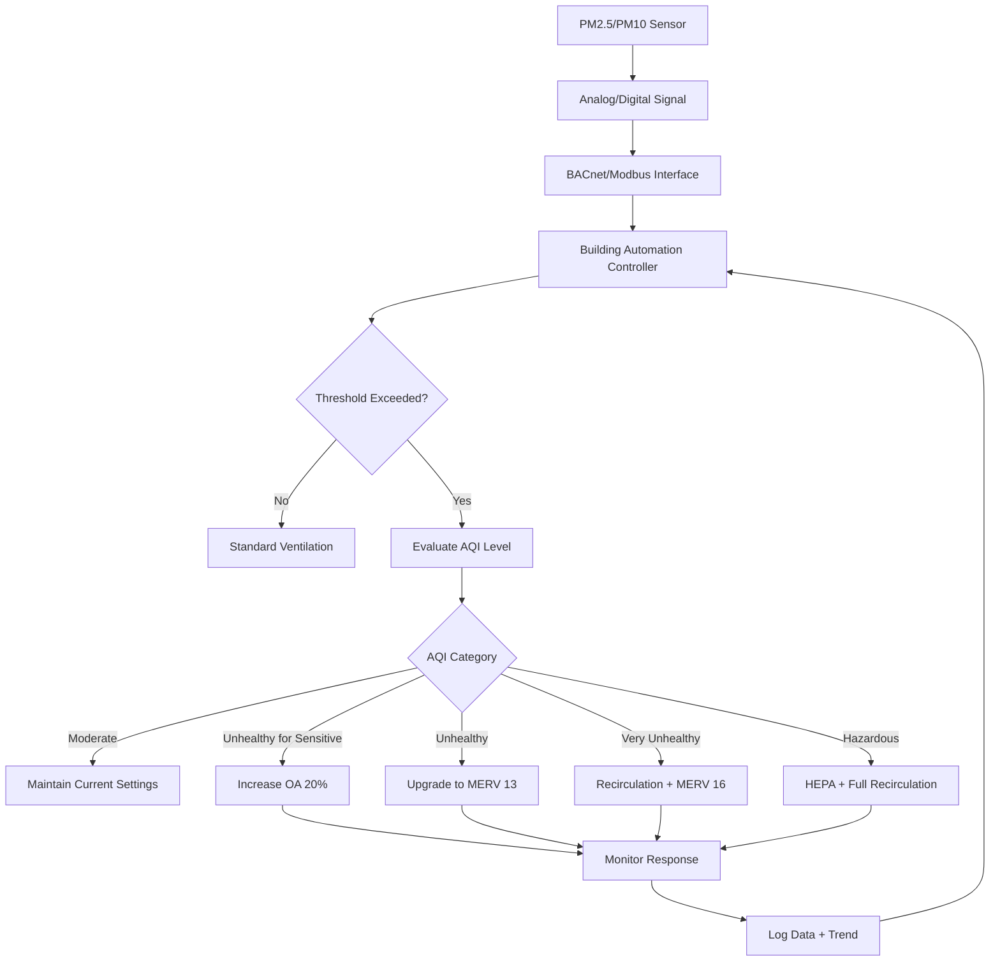

Particulate matter sensors measure airborne particles by size fraction, enabling HVAC systems to respond to indoor air quality degradation. These sensors employ optical detection principles to count and size particles in real-time, providing critical data for ventilation control, filter management, and occupant health protection.

## Optical Sensing Principles

Particulate sensors operate on light scattering physics. When a focused light beam encounters an airborne particle, scattered light intensity correlates with particle size according to Mie scattering theory. The relationship between scattered light intensity I and particle diameter d follows:

**I ∝ d^n**

Where n ranges from 2 to 6 depending on particle size relative to wavelength. For particles <1 μm, Rayleigh scattering dominates (n≈6). For particles >1 μm, geometric scattering applies (n≈2).

### Laser Scattering Method

Laser-based sensors employ a semiconductor laser (typically 650-680 nm wavelength) to create a focused detection volume. Particles pass through this volume via natural air currents or forced aspiration. A photodetector positioned at 90° or forward scatter angle (30-60°) captures scattered light pulses.

**Key advantages:**
- Individual particle detection and sizing
- Real-time concentration measurement
- Size resolution from 0.3 to 10 μm
- Response time <10 seconds

**Operational considerations:**
- Requires optical path cleanliness
- Sensitive to humidity effects on particle size
- Power consumption: 0.5-1.5 W for continuous operation
- Typical lifetime: 20,000-30,000 hours

### Nephelometry

Nephelometers measure total light scattering from a particle ensemble rather than individual particles. These instruments illuminate a larger air volume and integrate scattered light from all particles simultaneously. The output signal represents mass concentration rather than particle count.

**Nephelometer characteristics:**
- Measure bulk scattering coefficient (Mm^-1)
- Less sensitive to individual large particles
- Better stability in high-concentration environments
- Require calibration to mass concentration

## Particle Counting and Sizing

Optical particle counters (OPCs) bin particles into size channels based on pulse height analysis. Each scattered light pulse amplitude corresponds to particle diameter through pre-established calibration. Standard size bins align with health-relevant fractions:

| Size Channel | Diameter Range | Health Significance |
|--------------|----------------|---------------------|
| PM0.3 | 0.3-0.5 μm | Ultrafine particles, deep lung penetration |
| PM0.5 | 0.5-1.0 μm | Fine combustion products |
| PM1.0 | 1.0-2.5 μm | Respirable fraction |
| PM2.5 | ≤2.5 μm | Fine particulates, EPA regulated |
| PM10 | ≤10 μm | Inhalable coarse particles, EPA regulated |

Sensors report mass concentration (μg/m³) by converting particle counts to mass using assumed particle density (typically 1.65 g/cm³ for urban aerosols) and integrating across size bins.

## EPA AQI Standards and Thresholds

The Environmental Protection Agency Air Quality Index categorizes particulate matter health impacts. HVAC controls integrate these thresholds to trigger ventilation increases, filtration mode changes, or occupant notifications.

### PM2.5 AQI Breakpoints

| AQI Category | Range (μg/m³) | Color Code | HVAC Response |
|--------------|---------------|------------|---------------|
| Good | 0-12.0 | Green | Standard operation |
| Moderate | 12.1-35.4 | Yellow | Maintain filtration |
| Unhealthy for Sensitive | 35.5-55.4 | Orange | Increase ventilation 20% |
| Unhealthy | 55.5-150.4 | Red | Increase to MERV 13+ filtration |
| Very Unhealthy | 150.5-250.4 | Purple | Recirculation mode, high filtration |
| Hazardous | >250.5 | Maroon | Full recirculation, HEPA filtration |

### PM10 AQI Breakpoints

| AQI Category | Range (μg/m³) | Health Impact |
|--------------|---------------|---------------|
| Good | 0-54 | Minimal risk |
| Moderate | 55-154 | Acceptable quality |
| Unhealthy for Sensitive | 155-254 | Respiratory symptoms possible |
| Unhealthy | 255-354 | General population effects |
| Very Unhealthy | 355-424 | Serious aggravation |
| Hazardous | >425 | Emergency conditions |

## Filter Weighing Method

Gravimetric analysis provides the reference standard for particulate matter measurement. Air passes through a pre-weighed filter membrane for a defined time period (typically 24 hours). Post-sampling, the filter undergoes conditioning and re-weighing in a controlled environment.

**Mass concentration calculation:**

**C = (m₂ - m₁) / (Q × t)**

Where:
- C = mass concentration (μg/m³)
- m₂ = final filter mass (μg)
- m₁ = initial filter mass (μg)
- Q = volumetric flow rate (m³/min)
- t = sampling duration (min)

**Advantages:**
- Direct mass measurement, no assumptions
- EPA Federal Reference Method (FRM) designation
- Highest accuracy for calibration purposes

**Limitations:**
- No real-time data
- Labor-intensive protocol
- Requires environmental controls (20±2°C, 35±5% RH)
- Not suitable for HVAC feedback control

## PM Sensor Integration in HVAC Systems

## Sensor Selection Criteria

**For general commercial HVAC applications:**
- Measurement range: 0-500 μg/m³ (PM2.5), 0-1000 μg/m³ (PM10)
- Accuracy: ±10% at 100 μg/m³
- Communication: BACnet IP or Modbus RTU
- Calibration interval: Annual verification against reference

**For critical environments (hospitals, laboratories):**
- Expanded range with 0.3 μm channel resolution
- ±5% accuracy requirement
- Continuous data logging capability
- Alarm outputs for immediate notification

Sensor placement must ensure representative sampling: mount in return air stream 3-5 duct diameters downstream of bends, avoid locations near grilles or dampers where stratification occurs, and maintain per manufacturer specifications for temperature and humidity operating ranges.
