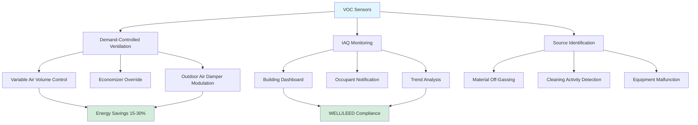

Volatile organic compound (VOC) sensors detect airborne chemicals emitted from building materials, furnishings, cleaning products, and occupants. These sensors enable demand-controlled ventilation strategies that reduce energy consumption while maintaining acceptable indoor air quality levels per ASHRAE 62.1 and international IAQ standards.

## Sensor Technologies

### Metal Oxide Semiconductor (MOX) Sensors

MOX sensors utilize a heated semiconductor film (typically tin dioxide, SnO₂) that changes electrical resistance when exposed to reducing gases. Operating at 200-400°C, the sensor surface facilitates oxidation reactions with VOC molecules, releasing electrons that decrease the film resistance proportionally to VOC concentration.

**Operating Principle:**
- Heater element maintains constant temperature (typically 300°C)
- VOC molecules adsorb onto metal oxide surface
- Catalytic oxidation releases electrons into conduction band
- Resistance decreases logarithmically with gas concentration
- Signal conditioning circuitry converts resistance to voltage output

**Characteristics:**
- Broad spectrum response to multiple VOC species
- Low cost ($10-50 per unit)
- 2-5 year operational life
- Sensitivity drift requiring periodic calibration
- Power consumption 150-500 mW due to heater element

### Photoionization Detector (PID) Sensors

PID sensors ionize VOC molecules using ultraviolet light, then measure the resulting ion current. A UV lamp (typically 10.6 eV) emits photons with sufficient energy to remove electrons from VOC molecules, creating detectable ion pairs collected by electrodes under applied voltage.

**Operating Principle:**
- UV lamp emits high-energy photons (10.6 or 11.7 eV)
- Photons ionize VOC molecules with lower ionization potential
- Electric field separates ions from electrons
- Current measurement proportional to VOC concentration
- Species-specific response based on ionization potential

**Characteristics:**
- Selective detection based on ionization energy
- Linear response over wide concentration range (ppb to ppm)
- Fast response time (1-3 seconds)
- Higher cost ($200-800 per unit)
- Requires lamp replacement every 1-2 years
- Minimal sensitivity drift compared to MOX

### Electrochemical VOC Sensors

Electrochemical sensors oxidize or reduce VOC molecules at electrode surfaces, generating measurable current. These sensors target specific VOC groups (formaldehyde, alcohols) with selective electrodes and electrolyte formulations.

**Application-specific technology:**
- Formaldehyde detection in new construction
- Alcohol vapor monitoring in laboratories
- Limited to specific VOC compounds
- Higher selectivity than MOX or PID

## TVOC Measurement Standards

Total volatile organic compounds (TVOC) represents the aggregate concentration of all detected VOCs, typically expressed as toluene equivalent. Standards define acceptable exposure levels and measurement protocols.

| Standard | TVOC Threshold | Application | Basis |
|----------|----------------|-------------|-------|
| ASHRAE 62.1 | <500 μg/m³ | Commercial buildings | Comfort/acceptability |
| WELL Building | <500 μg/m³ | Health-focused spaces | Long-term exposure |
| German AgBB | <1000 μg/m³ | Material emissions | 28-day testing |
| California Section 01350 | <500 μg/m³ | Schools, offices | Chronic exposure |
| LEED v4 | Monitoring only | Green buildings | Documentation |

**IAQ Categories (EU Standard EN 16798-3):**

| Category | TVOC Range (μg/m³) | Description |
|----------|-------------------|-------------|
| I | <200 | High IAQ, sensitive populations |
| II | 200-500 | Medium IAQ, general buildings |
| III | 500-1000 | Moderate IAQ, minimum acceptable |
| IV | >1000 | Low IAQ, requires remediation |

## Sensor Comparison

| Parameter | MOX | PID | Electrochemical |
|-----------|-----|-----|-----------------|
| Detection range | 0-50 ppm | 0.1-2000 ppm | 0-100 ppm |
| Response time | 30-60 seconds | 1-3 seconds | 30-90 seconds |
| Selectivity | Low (broad) | Medium | High (specific) |
| Operating life | 2-5 years | 3-5 years | 1-3 years |
| Calibration interval | 6-12 months | 12-24 months | 6-12 months |
| Power consumption | 150-500 mW | 2-5 W | 10-50 mW |
| Temperature range | -10 to 50°C | 0 to 45°C | 0 to 50°C |
| Humidity interference | High | Low | Medium |

## Calibration and Maintenance

**Field Calibration Methods:**

1. **Zero calibration** - Exposure to VOC-free air (filtered outdoor air) establishes baseline
2. **Span calibration** - Known concentration gas (typically 10 ppm isobutylene) sets full-scale response
3. **Multi-point calibration** - Three or more concentrations establish linearity curve

**Drift Compensation:**
- MOX sensors drift 10-20% annually due to surface poisoning
- Automatic baseline correction using minimum values during unoccupied periods
- Reference sensor comparison in controlled environment
- Temperature and humidity compensation algorithms

**Maintenance Schedule:**
- MOX: Visual inspection quarterly, calibration every 6 months
- PID: Lamp replacement 12-18 months, calibration annually
- All types: Filter replacement if equipped, electrical connection verification

## HVAC Applications

**Implementation Strategies:**

1. **Zone-level monitoring** - One sensor per 250-500 m² open area
2. **Return air sensing** - Single sensor represents multiple zones
3. **Critical space monitoring** - Dedicated sensors in high-risk areas (copy rooms, labs)
4. **Baseline establishment** - 2-4 weeks of data collection determines normal operating range
5. **Ventilation response** - Increase outdoor air 25-50% when TVOC exceeds 500 μg/m³
6. **Alarm thresholds** - Alert at 800 μg/m³, mechanical override at 1200 μg/m³

**Control Logic Integration:**
- Analog output (0-10 VDC or 4-20 mA) to BAS controller
- Modbus RTU or BACnet communication for digital integration
- Setpoint typically 450-500 μg/m³ to maintain Category II IAQ
- Proportional control between 300-700 μg/m³ prevents hunting

**Energy Impact:**
- VOC-based DCV reduces outdoor air heating/cooling by 15-30%
- Most effective in spaces with variable emissions (conference rooms, multipurpose areas)
- Minimal savings in consistently occupied spaces with steady VOC generation
- ROI typically 2-4 years in commercial applications

VOC sensor selection depends on application requirements: MOX sensors suit general IAQ monitoring with cost constraints, PID sensors provide superior accuracy for compliance documentation, and electrochemical sensors target specific compounds in specialized environments.
