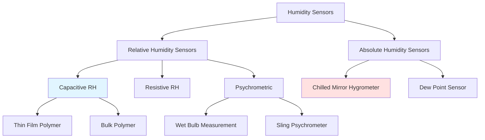

Humidity measurement in HVAC systems relies on transducers that convert water vapor concentration into electrical signals for control and monitoring. Understanding sensor operating principles, accuracy limitations, and application constraints is fundamental to proper system performance.

## Humidity Sensor Classification

## Capacitive Relative Humidity Sensors

Capacitive sensors dominate HVAC applications due to excellent linearity, stability, and temperature compensation capabilities. The sensing element consists of a hygroscopic dielectric material sandwiched between two electrodes.

**Operating Principle:**

The dielectric constant of the polymer film changes with absorbed moisture content. Capacitance varies according to:

C = (ε₀ × εᵣ × A) / d

Where:
- C = capacitance (F)
- ε₀ = permittivity of free space (8.854 × 10⁻¹² F/m)
- εᵣ = relative permittivity of hygroscopic dielectric
- A = electrode area (m²)
- d = dielectric thickness (m)

The relative permittivity εᵣ is a function of moisture content, which correlates to ambient relative humidity. Modern sensors incorporate integrated circuits that convert capacitance changes to 4-20 mA, 0-10 VDC, or digital outputs.

**Response characteristics:**

ΔC/C₀ = k × (RH₂ - RH₁)

Where k is the sensor sensitivity coefficient, typically 0.3 to 0.5 pF/%RH for thin-film designs.

## Resistive Humidity Sensors

Resistive sensors measure conductivity changes in hygroscopic salt or conductive polymer films. Water vapor absorption alters ionic mobility and charge carrier concentration.

**Operating Principle:**

Resistance decreases exponentially with increasing relative humidity:

R = R₀ × e^(-α × RH)

Where:
- R = sensor resistance (Ω)
- R₀ = reference resistance at 0% RH
- α = material-dependent sensitivity coefficient
- RH = relative humidity (%)

Resistive sensors exhibit greater hysteresis and slower response than capacitive types. They find application in lower-cost residential thermostats and humidistats.

## Chilled Mirror Hygrometer

The chilled mirror represents the most accurate humidity measurement method, serving as the primary standard for sensor calibration. Operation involves cooling a mirror surface until condensation forms at the dew point temperature.

**Measurement principle:**

Optical detection identifies the exact temperature where condensation occurs. This directly measures dew point temperature Tₐ, from which other humidity parameters derive:

RH = 100 × (Pᵥₛ(Tₐ) / Pᵥₛ(Tᵈᵦ))

Where:
- Pᵥₛ(Tₐ) = saturation vapor pressure at dew point
- Pᵥₛ(Tᵈᵦ) = saturation vapor pressure at dry bulb temperature

**Accuracy:** ±0.1°C to ±0.2°C dew point, equivalent to ±0.5% RH at 20°C. Laboratory and calibration facility applications only.

## Psychrometric Measurement

Wet bulb temperature measurement provides humidity determination through heat and mass transfer principles.

**Energy balance at wet bulb:**

hc(Tᵈᵦ - Twb) = hfg × kc(Wₛ(Twb) - W)

Where:
- hc = convective heat transfer coefficient (W/m²·K)
- Tᵈᵦ = dry bulb temperature (°C)
- Twb = wet bulb temperature (°C)
- hfg = latent heat of vaporization (2,257 kJ/kg at 100°C)
- kc = mass transfer coefficient (kg/m²·s)
- Wₛ(Twb) = humidity ratio at saturation at wet bulb temperature
- W = actual humidity ratio

Psychrometric charts provide graphical solutions. Accuracy depends on proper wick saturation, air velocity (minimum 3 m/s for sling psychrometers), and barometric pressure correction.

## Sensor Performance Specifications

### Accuracy and Response Time Comparison

| Sensor Type | Accuracy (% RH) | Response Time τ₆₃ | Temperature Range | Cost |
|-------------|-----------------|-------------------|-------------------|------|
| Capacitive thin-film | ±1.5% to ±2% | 8-30 seconds | -40°C to 85°C | Medium |
| Capacitive bulk polymer | ±2% to ±3% | 30-60 seconds | -20°C to 80°C | Low-Medium |
| Resistive | ±3% to ±5% | 20-60 seconds | 0°C to 60°C | Low |
| Chilled mirror | ±0.5% RH equiv. | 1-5 minutes | -75°C to 100°C DP | Very High |
| Wet bulb | ±2% to ±4% | 2-5 minutes | -10°C to 50°C | Low |

### ASHRAE Sensor Accuracy Requirements

Per ASHRAE Guideline 36-2021 and Standard 55-2020:

| Application | Required Accuracy | Calibration Interval |
|-------------|-------------------|----------------------|
| Critical spaces (data centers, labs) | ±3% RH | 12 months |
| Standard comfort control | ±5% RH | 24 months |
| Economizer control | ±5% RH | 24 months |
| Building pressurization control | ±5% RH | 24 months |
| Energy recovery systems | ±5% RH | 24 months |

ASHRAE Standard 41.6 specifies test methods and performance validation for humidity measurement instruments.

## Sensor Drift and Calibration

All humidity sensors experience drift due to contamination, polymer aging, and exposure to temperature extremes or chemical vapors.

**Drift mechanisms:**
- Polymer cross-linking from UV exposure or high temperatures
- Contaminant deposition on sensing surfaces
- Hygroscopic material degradation from chemical exposure
- Electrode corrosion in high humidity environments

**Calibration methods:**
1. Salt solution standards (LiCl, MgCl₂, NaCl) providing known RH at controlled temperatures
2. Two-point calibration at 33% and 75% RH reference points
3. Chilled mirror reference comparison
4. Humidity chamber with transfer standard sensors

Capacitive sensors exhibit typical drift of 0.5% to 1% RH per year in clean environments, 2% to 3% RH per year in contaminated conditions.

## Application Considerations

**Sensor placement:**
- Minimum 2 m above floor in occupied spaces
- Avoid direct airflow from diffusers or return grilles
- Shield from radiant heat sources
- Provide adequate air circulation around sensing element

**Environmental factors affecting accuracy:**
- Temperature compensation required for RH sensors
- Barometric pressure affects psychrometric calculations
- Air velocity must exceed 0.5 m/s for convective heat transfer
- Chemical vapors can permanently damage polymer sensors

**Signal conditioning:**
- 4-20 mA loops provide superior noise immunity over 0-10 VDC
- Digital outputs (Modbus, BACnet) eliminate analog conversion errors
- Transmitter electronics should include temperature compensation
- Dewpoint calculation algorithms improve control performance

Proper sensor selection, installation location, and maintenance protocols ensure accurate humidity control for occupant comfort, process requirements, and equipment protection in HVAC systems.
