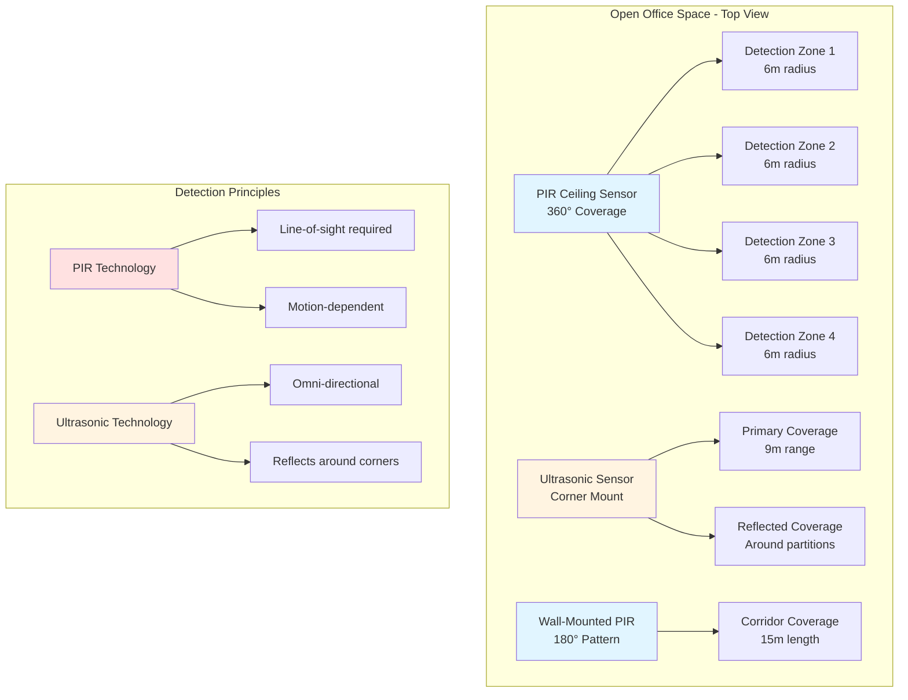

## Overview

Occupancy detection sensors enable demand-controlled HVAC and lighting systems by automatically adjusting operation based on space utilization. These devices deliver substantial energy savings by preventing conditioned air delivery and lighting to unoccupied zones. ASHRAE 90.1 mandates automatic shutoff controls in numerous space types, making occupancy sensing a code-required energy conservation measure.

The fundamental operating principle involves detecting human presence through physical phenomena: thermal radiation (PIR), reflected sound waves (ultrasonic), microwave reflection, or visual analysis (camera-based). Proper sensor selection requires matching detection technology to space geometry, occupant activity levels, and control sequence requirements.

## Sensor Technologies

### Passive Infrared (PIR) Sensors

PIR sensors detect thermal radiation in the 8-14 μm wavelength range emitted by the human body (approximately 9.4 μm peak wavelength at 37°C skin temperature). A pyroelectric element generates voltage when the infrared energy flux changes across segmented detection zones created by Fresnel lens arrays or mirror facets.

**Operating Principle:**
The sensor divides its field of view into multiple zones. When a heat source moves from one zone to another, the differential temperature change across the pyroelectric detector exceeds the threshold (typically 0.5-2°C change), triggering an occupancy signal. Stationary occupants generate no signal—PIR technology is motion-dependent.

**Key Characteristics:**
- Detection range: 6-15 m (20-50 ft) typical, varies with lens design
- Field of view: 90° to 360° depending on application
- Response time: 0.5-2 seconds
- Requires line-of-sight to detect motion
- Susceptible to false triggers from sunlight, heaters, and moving air currents
- Low power consumption (1-5 mW typical)

### Ultrasonic Sensors

Ultrasonic sensors emit high-frequency sound waves (25-40 kHz, above human hearing range) and analyze the Doppler shift in reflected echoes. When an occupant moves, the reflected frequency shifts according to:

Δf = (2v/c) × f₀

Where v is occupant velocity, c is the speed of sound (343 m/s at 20°C), and f₀ is the transmitted frequency.

**Operating Principle:**
A piezoelectric transducer alternates between transmitting ultrasonic pulses and receiving reflections. The control circuit performs frequency analysis to detect Doppler shifts indicating motion. Unlike PIR, ultrasonic sensors can detect minor movements like typing or breathing at a desk.

**Key Characteristics:**
- Detection range: 9-15 m (30-50 ft)
- Coverage pattern: omni-directional, reflects around corners
- Detects small motions (hand/finger movement)
- No line-of-sight requirement—coverage follows air paths
- Susceptible to HVAC airflow noise, moving objects (curtains, plants)
- Higher power consumption than PIR (50-200 mW)

### Dual-Technology Sensors

Dual-technology sensors combine PIR and ultrasonic detection in a single device with AND/OR logic configurations. AND logic requires both technologies to confirm occupancy before switching on (reduces false-on events), while either technology can maintain the occupied state. This configuration minimizes false activations while ensuring reliable detection.

**Advantages:**
- Drastically reduced false triggering (AND logic for activation)
- Enhanced detection reliability (OR logic for maintaining occupied state)
- Suitable for difficult spaces with obstructions or air movement
- Complies with stringent false-activation requirements

**Trade-offs:**
- Higher cost (1.5-2× single-technology sensors)
- Increased complexity and potential failure points
- Higher energy consumption

## Occupancy vs. Vacancy Modes

| Mode | Activation | Deactivation | Energy Savings | User Acceptance | Applications |
|------|------------|--------------|----------------|-----------------|--------------|
| **Occupancy** | Automatic on detection | Automatic after timeout | 30-50% typical | High (convenience) | Restrooms, corridors, storage |
| **Vacancy** | Manual switch required | Automatic after timeout | 50-70% typical | Variable (requires action) | Private offices, classrooms, conference rooms |

Vacancy sensors deliver superior energy savings because they never activate systems unnecessarily—the manual-on requirement ensures intentional use only. ASHRAE 90.1 allows either mode depending on space function, but vacancy mode increasingly becomes the preferred specification for private offices and similar spaces.

## Advanced Technologies

### People Counting Systems

Advanced occupancy systems utilize thermal imaging arrays, stereoscopic cameras, or time-of-flight sensors to count occupants entering and exiting spaces. These systems provide:

- Accurate occupant counts (±1-2 people typical accuracy)
- Directional tracking (in/out differentiation)
- Density mapping for large spaces
- Integration with demand-controlled ventilation (DCV) systems

People counting enables precise outdoor air delivery based on actual occupancy rather than design population, optimizing ventilation energy while maintaining IAQ compliance with ASHRAE 62.1.

### CO₂-Based Occupancy Estimation

Measuring CO₂ concentration rise above outdoor levels provides an indirect occupancy indicator. Each occupant generates approximately 0.3-0.5 L/min CO₂ at sedentary activity levels. Space CO₂ concentration follows:

C(t) = C_outdoor + (N × G)/(Q × ρ)

Where N is occupant count, G is CO₂ generation rate, Q is ventilation rate, and ρ is air density.

This method works for ventilation control but responds too slowly for lighting applications (15-30 minute lag times typical).

## Sensor Coverage Patterns

## Application Selection Guide

| Space Type | Recommended Technology | Mounting | Timeout Setting | Code Requirement |
|------------|----------------------|----------|-----------------|------------------|
| Private offices (<30 m²) | PIR or Dual-tech | Ceiling or wall | 15-20 min | ASHRAE 90.1-2019 |
| Open offices | Dual-tech or ultrasonic | Ceiling grid | 20-30 min | ASHRAE 90.1-2019 |
| Conference rooms | Dual-tech vacancy | Ceiling | 15-20 min | ASHRAE 90.1-2019 |
| Restrooms | PIR occupancy | Ceiling | 10-15 min | ASHRAE 90.1-2019 |
| Corridors | PIR occupancy | Wall or ceiling | 10-15 min | ASHRAE 90.1-2019 |
| Warehouses | Dual-tech | High-bay mount | 20-30 min | ASHRAE 90.1-2019 |
| Classrooms | Vacancy mode | Wall switch | 15-20 min | ASHRAE 90.1-2019 |

## ASHRAE 90.1 Requirements

ASHRAE 90.1-2019 Section 9.4.1.2 requires automatic lighting shutoff in most space types within 20-30 minutes of occupants leaving. Section 6.4.3.3 addresses HVAC controls for zones, requiring:

- Setback controls for unoccupied periods
- Automatic temperature setback/setup based on occupancy or schedule
- Zone-level control for spaces >25 m² (except specific exceptions)

Occupancy sensors satisfy these requirements when properly integrated with HVAC control sequences, typically implementing a 30-60 minute delay before transitioning to unoccupied setback mode (longer than lighting to prevent excessive cycling).

## Installation Considerations

**Critical Factors:**
- Mount height affects coverage pattern (2.4-4.5 m typical ceiling heights)
- Avoid aiming PIR sensors at heat sources or windows
- Position ultrasonic sensors away from HVAC diffusers
- Verify coverage with no dead zones where occupants work
- Set timeout periods appropriate to space function (balance energy savings vs. nuisance shutoffs)
- Commission sensors to verify proper operation and adjust sensitivity

**Common Errors:**
- Insufficient coverage leading to false-vacant conditions
- Timeout periods too short causing frequent shutoffs
- PIR sensors blocked by furniture, partitions, or plants
- Ultrasonic sensors triggering from air movement or mechanical equipment

Proper sensor selection, placement, and commissioning deliver 30-60% energy reduction in HVAC and lighting loads for intermittently occupied spaces while maintaining occupant comfort and code compliance.
