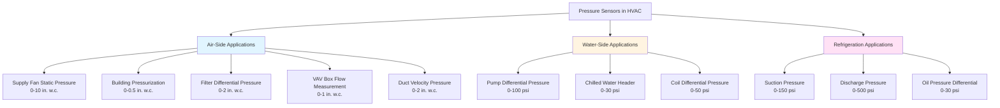

Pressure sensors are fundamental instruments in HVAC systems, measuring static pressure, differential pressure, and velocity pressure for precise control of airflow, filter monitoring, and system optimization. Modern HVAC pressure transducers employ advanced sensing technologies including piezoresistive and capacitive principles to achieve accuracies within ±0.5% of full scale across operating ranges from 0.1 inches water column (in. w.c.) to 30 psi.

## Sensing Technologies

### Piezoresistive Sensors

Piezoresistive pressure sensors utilize the fundamental property of semiconductor materials to change electrical resistance under mechanical stress. When pressure is applied to a silicon diaphragm containing diffused or ion-implanted resistors, the strain induces resistance changes that form a Wheatstone bridge circuit.

The resistance change follows the relationship ΔR/R = GF × ε, where GF is the gauge factor (typically 50-200 for silicon) and ε is the strain. This produces a differential voltage output proportional to applied pressure.

**Advantages:**
- High sensitivity and signal-to-noise ratio
- Excellent linearity across wide pressure ranges
- Fast response time (1-10 ms)
- Compact sensing element size
- Suitable for both low and high pressure applications

**Typical HVAC Applications:**
- Building static pressure measurement (0-5 in. w.c.)
- Duct static pressure monitoring (0-10 in. w.c.)
- Refrigerant pressure measurement (0-500 psi)
- Compressed air systems (0-200 psi)

### Capacitive Sensors

Capacitive pressure sensors measure pressure through changes in capacitance between a movable diaphragm and a fixed electrode. Applied pressure deflects the diaphragm, altering the gap distance and thus the capacitance according to C = εA/d, where ε is permittivity, A is electrode area, and d is the gap.

Capacitive sensors excel at low differential pressure measurement critical for HVAC applications. The capacitance change is converted to a frequency or voltage output through signal conditioning electronics.

**Advantages:**
- Superior performance at low pressures (0.1-10 in. w.c.)
- Exceptional stability and long-term drift characteristics
- Low temperature coefficient
- Minimal power consumption
- Excellent resolution for differential pressure

**Typical HVAC Applications:**
- Filter differential pressure monitoring (0-2 in. w.c.)
- Building pressurization control (0-0.5 in. w.c.)
- Clean room pressure differential (0-0.1 in. w.c.)
- VAV box airflow measurement (0-1 in. w.c.)

## Pressure Measurement Types

### Static Pressure

Static pressure represents the potential energy in the air stream, measured perpendicular to flow direction. HVAC systems use static pressure sensors to monitor:

- Supply fan discharge pressure
- Return fan suction pressure
- Building pressure relative to atmosphere
- Duct system pressure distribution

ASHRAE Standard 111 specifies static pressure measurement locations at least 7.5 duct diameters downstream and 3 diameters upstream of flow disturbances.

### Differential Pressure

Differential pressure sensors measure the pressure difference between two points, critical for:

- Filter loading indication (ASHRAE recommends replacement at 2× initial pressure drop)
- Airflow measurement across flow stations
- Building pressurization (typically +0.02 to +0.05 in. w.c. for commercial buildings)
- VAV terminal unit flow sensing

ASHRAE Standard 62.1 requires maintaining positive building pressure to prevent infiltration, with differential pressure sensors providing the feedback signal.

### Velocity Pressure

Velocity pressure, equal to ρV²/2, represents the kinetic energy of moving air. Pitot tubes combined with differential pressure sensors measure velocity pressure to determine airflow velocity: V = 1096√(VP) for standard air, where V is in fpm and VP in inches w.c.

## Sensor Specifications

### Pressure Range and Accuracy

| Application | Typical Range | Required Accuracy | Sensor Type |
|-------------|---------------|-------------------|-------------|
| Building Pressure | 0-0.5 in. w.c. | ±0.01 in. w.c. | Capacitive |
| Filter Monitoring | 0-2 in. w.c. | ±0.02 in. w.c. | Capacitive |
| Duct Static Pressure | 0-10 in. w.c. | ±0.5% FS | Piezoresistive |
| VAV Box Flow | 0-1 in. w.c. | ±1% FS | Capacitive |
| Fan Inlet/Discharge | 0-15 in. w.c. | ±0.5% FS | Piezoresistive |
| Refrigerant Pressure | 0-500 psi | ±1% FS | Piezoresistive |
| Steam Pressure | 0-30 psi | ±0.5% FS | Piezoresistive |

### Output Signal Standards

| Output Type | Range | Application | Advantages |
|-------------|-------|-------------|------------|
| 4-20 mA | Current loop | Long-distance transmission | Noise immunity, two-wire |
| 0-10 Vdc | Voltage | Short-distance, DDC input | Simple wiring, low cost |
| 0-5 Vdc | Voltage | Legacy systems | Direct interface |
| Digital (Modbus, BACnet) | Varies | Networked systems | Multiple parameters, diagnostics |

## HVAC System Applications

## Selection Criteria

**Pressure Range:** Select sensors with maximum operating range 1.5-2× the expected maximum pressure to ensure accuracy in the operating region and protect against overpressure events.

**Accuracy Requirements:** Determine required accuracy based on control requirements. Building pressurization demands ±0.01 in. w.c., while duct static pressure control accepts ±0.5% of full scale.

**Environmental Conditions:** Consider temperature range, humidity, and media compatibility. Silicon piezoresistive elements require temperature compensation for ranges exceeding 0-50°C. Capacitive sensors offer superior temperature stability.

**Response Time:** Dynamic applications such as VAV control require response times under 1 second. Static applications like filter monitoring accept slower response.

**Installation Requirements:** Ensure proper location per ASHRAE Standard 111, avoiding turbulent flow regions. Use averaging sensors for large ducts exceeding 4 ft² cross-section.

## Calibration and Maintenance

Pressure sensors require annual calibration verification using NIST-traceable reference standards. Zero drift typically remains within ±0.01 in. w.c. per year for quality capacitive sensors. Span drift depends on sensing technology and overpressure exposure.

Inspect pressure tap tubing quarterly for blockage, condensation, or damage. Slope tubing away from sensing points to prevent liquid accumulation. Clean or replace sensing lines annually in dusty environments.
