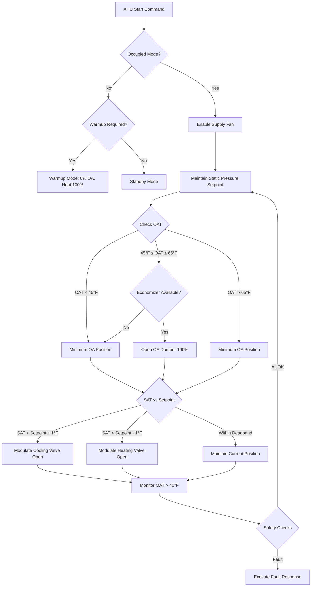

## Overview

Control sequences of operation define the logical step-by-step instructions that govern how HVAC equipment operates under varying conditions. These sequences ensure coordinated control of multiple components to achieve thermal comfort, maintain indoor air quality, and optimize energy consumption. Well-designed sequences integrate sensor inputs, control logic, and actuator outputs to respond dynamically to building loads and environmental conditions.

## ASHRAE Guideline 36 Framework

ASHRAE Guideline 36 provides standardized high-performance sequences of operation for HVAC systems. The guideline establishes sequences based on physical control principles, minimizing simultaneous heating and cooling, optimizing outdoor air economizer operation, and implementing demand-controlled ventilation. Guideline 36 sequences prioritize trim and respond logic for equipment staging, reset schedules based on zone feedback, and fault detection diagnostics integrated into control algorithms.

Key features of Guideline 36 sequences include:

- **Trim and Respond**: Adjusts equipment capacity incrementally based on measured performance rather than fixed schedules
- **Zone-level control**: Individual zone temperature and airflow control with coordination at the system level
- **Outdoor air reset**: Supply air temperature and pressure resets based on outdoor conditions and zone demand
- **Economizer integration**: Prioritizes free cooling when outdoor conditions permit
- **Demand-based staging**: Equipment operation based on actual load requirements

## Air Handling Unit (AHU) Control Sequence

### Operating Modes and Transition Logic

AHU sequences coordinate supply fan operation, outdoor air dampers, heating and cooling coils, and return/exhaust fans to deliver conditioned air at the required temperature and flow rate.

| Operating Mode | Outdoor Air Temperature | Control Action | Cooling Valve | Heating Valve |
|----------------|-------------------------|----------------|---------------|---------------|
| Mechanical Cooling | > 65°F | Cool with DX/CHW | Modulating | Closed |
| Economizer Cooling | 45°F - 65°F | 100% OA damper | Modulating as needed | Closed |
| Minimum OA + Heat | < 45°F | Min OA position | Closed | Modulating |
| Morning Warmup | Any (Unoccupied) | 0% OA, recirculation | Closed | 100% Open |
| Night Setback | Unoccupied | Fan off, dampers closed | Closed | Closed |

### Supply Air Temperature Reset Schedule

Supply air temperature (SAT) resets based on outdoor air temperature (OAT) to reduce energy consumption during partial load conditions:

**Heating Season Reset:**
- OAT ≤ 20°F: SAT setpoint = 95°F
- OAT = 55°F: SAT setpoint = 65°F
- Linear interpolation between 20°F and 55°F

**Cooling Season Reset:**
- OAT ≥ 80°F: SAT setpoint = 55°F
- OAT = 65°F: SAT setpoint = 62°F
- Linear interpolation between 65°F and 80°F

### Control Logic Sequence

The AHU operates through cascaded control loops:

1. **Supply Fan Control**: Modulate VFD to maintain duct static pressure setpoint (typically 1.5 - 2.5 in. wg at 2/3 distance into duct)
2. **Outdoor Air Dampers**: Modulate to maintain minimum outdoor air CFM (per ASHRAE 62.1) or increase to 100% when economizer conditions exist
3. **Cooling Valve**: Modulate to maintain SAT setpoint when cooling required (SAT > setpoint)
4. **Heating Valve**: Modulate to maintain SAT setpoint when heating required (SAT < setpoint) and economizer not active
5. **Mixed Air Temperature Control**: Monitor to prevent freezing (lockout cooling if MAT < 40°F)

### AHU Control Sequence Diagram

## VAV Terminal Unit Control Sequence

VAV boxes control zone temperature through airflow modulation and reheat (if equipped). The sequence prioritizes cooling through airflow increase before activating reheat.

**Cooling Sequence (Zone Temp > Setpoint):**
1. Increase airflow from minimum (typically 30% of design CFM or ventilation requirement) to maximum design CFM
2. Damper modulates linearly as PI loop responds to zone temperature error
3. Reheat valve remains closed throughout cooling operation

**Heating Sequence (Zone Temp < Setpoint):**
1. Decrease airflow to minimum setpoint
2. If zone temperature continues to fall below setpoint - 1°F, modulate reheat valve open
3. Reheat valve modulates from 0-100% based on PI control loop

**Deadband Operation:**
- Maintain 2°F deadband between heating and cooling to prevent simultaneous operation
- During deadband, maintain minimum airflow for ventilation

## Chiller Staging Sequence

Multiple chillers operate in lead-lag configuration with trim and respond logic:

**Staging Up Conditions:**
- Lead chiller at ≥ 85% capacity for 10 minutes → Start lag chiller
- Chilled water supply temperature > setpoint + 2°F for 15 minutes → Add chiller
- Minimum runtime between stages: 15 minutes

**Staging Down Conditions:**
- All operating chillers at ≤ 30% capacity for 20 minutes → Shut down one unit
- Chilled water supply temperature < setpoint - 2°F for 15 minutes → Remove chiller
- Minimum runtime: 30 minutes before shutdown permitted

**Chilled Water Reset:**
- CHW supply temperature resets based on building load or outdoor air temperature
- OAT ≥ 80°F: CHWST = 44°F
- OAT ≤ 60°F: CHWST = 52°F
- Reset reduces compressor lift and improves efficiency at partial loads

## Boiler Staging Sequence

Boiler sequencing maintains hot water supply temperature through modular staging:

**Lead-Lag Rotation:**
- Rotate lead boiler weekly or after 200 operating hours to equalize runtime
- Track starts and runtime for predictive maintenance scheduling

**Firing Rate Control:**
1. Lead boiler modulates from minimum fire (typically 25% capacity) to maximum
2. When lead boiler reaches 90% firing rate for 5 minutes, stage second boiler
3. Distribute load equally across operating boilers
4. Destage when combined load drops below 40% of single boiler capacity for 10 minutes

**Hot Water Temperature Reset:**
- Outdoor air temperature-based reset reduces return water temperature and improves condensing boiler efficiency
- OAT ≤ 0°F: HWST = 180°F
- OAT ≥ 60°F: HWST = 120°F
- Linear reset between temperature points

## Transition Conditions and Interlocks

| Equipment | Start Condition | Stop Condition | Safety Interlock |
|-----------|----------------|----------------|------------------|
| Supply Fan | Occupied schedule OR manual override | Unoccupied AND no override | Smoke detector trip, freezestat |
| Chiller | CHW loop DP > 5 psi AND CHWST > 50°F | No flow OR CHWST < 38°F | Low evaporator temp, flow switch |
| Boiler | HW loop DP > 3 psi AND HWST < setpoint | No flow OR high limit | High temperature limit, low water cutoff |
| Cooling Tower | Chiller running | Chiller off for 15 min | Low basin temp < 40°F |
| CHW Pump | Chiller start command | Chiller off AND flow proven off | Motor overload, VFD fault |

These sequences form the foundation of coordinated HVAC system operation, ensuring equipment operates efficiently while maintaining occupant comfort and system safety. Proper implementation requires detailed point-to-point testing, commissioning verification, and ongoing monitoring to validate sequence performance matches design intent.
