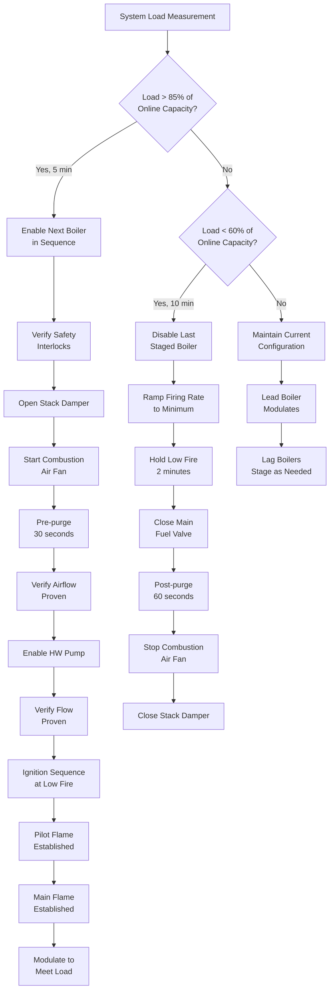

Boiler plant sequences coordinate multiple boilers to meet heating loads efficiently while ensuring safety, equipment longevity, and energy optimization. These sequences manage boiler staging, firing rate modulation, lead-lag rotation, supply water temperature reset, and comprehensive safety interlocks per ASHRAE Guideline 36 and NFPA 85.

## Boiler Staging and Enable Logic

Boiler staging determines how many boilers operate based on heating demand, outdoor air temperature, and system load. The building automation system calculates the required number of boilers using measured system demand versus available capacity.

**Staging Criteria:**

- System load exceeds 85% of online boiler capacity for 5 minutes → enable next boiler
- System load drops below 60% of online boiler capacity for 10 minutes → disable one boiler
- Outdoor air temperature below design heating threshold → force minimum number of boilers online
- Individual boiler firing rate consistently above 90% → stage additional boiler
- Individual boiler firing rate consistently below 30% → evaluate destaging

**Enable Sequence for Each Boiler:**

1. Verify all safety interlocks satisfied (flame safeguard, low water cutoff, high limit, combustion air proven)
2. Open stack damper (if equipped) and verify damper end switch closed
3. Start combustion air fan and establish pre-purge for minimum 30 seconds per NFPA 85
4. Verify combustion airflow proven via differential pressure switch
5. Enable hot water pump serving boiler and verify flow via differential pressure switch
6. Initiate ignition sequence at low fire position
7. Verify pilot flame established within 10 seconds
8. Open main fuel valve and verify main flame within 5 seconds
9. Transition to modulating control after flame proven for 30 seconds
10. Ramp firing rate to meet load demand

## Lead-Lag Rotation and Sequencing

Lead-lag control rotates boiler priority to equalize runtime and wear across multiple boilers. The lead boiler modulates first to meet load, with lag boilers staging as demand increases.

**Rotation Logic:**

- Rotate lead boiler designation weekly or after 100 runtime hours
- Override rotation if individual boiler requires maintenance or shows fault condition
- Designate lead boiler based on lowest cumulative runtime or starts
- During shoulder seasons, operate single boiler in rotation to minimize cycling

**Operating Priority:**

1. **Lead Boiler:** Modulates from minimum to maximum firing rate to meet load
2. **First Lag Boiler:** Enables when lead exceeds 85% capacity, then modulates
3. **Second Lag Boiler:** Enables when combined capacity of lead and first lag exceeds 85%
4. **Standby Boiler:** Remains offline but ready for automatic start if primary boiler faults

## Firing Rate Control and Modulation

Firing rate control adjusts burner output to match heating demand while maintaining efficient combustion. Modern boilers use modulating burners with turndown ratios of 4:1 to 10:1.

**Modulation Strategy:**

- PID control loop calculates firing rate based on supply water temperature error
- Minimum firing rate: 10-25% of full capacity (manufacturer specified)
- Maximum firing rate: 100% of rated capacity
- Firing rate ramp limit: 10% per minute to prevent thermal shock
- Anti-short cycle timer: minimum 5-minute runtime before shutdown permitted

**Control Algorithm:**

Firing Rate (%) = KP × Error + KI × ∫Error dt + KD × (dError/dt)

Where:
- Error = Supply Water Temperature Setpoint - Measured Supply Water Temperature
- KP (Proportional gain) = 2.0 to 5.0
- KI (Integral gain) = 0.1 to 0.5
- KD (Derivative gain) = 0.05 to 0.2

## Supply Water Temperature Reset

Supply water temperature reset reduces boiler supply temperature based on outdoor air temperature or building load, improving condensing boiler efficiency and reducing distribution losses.

**Reset Schedule:**

| Outdoor Air Temperature | Supply Water Setpoint | Firing Rate Strategy |
|------------------------|----------------------|---------------------|
| ≥ 65°F | 120°F | Minimum, evaluate shutdown |
| 50°F | 140°F | Modulate per load |
| 35°F | 160°F | Modulate per load |
| 20°F | 170°F | Stage boilers as needed |
| ≤ 0°F | 180°F | Maximum capacity |

**Reset Equation:**

SWSP = SWmax - [(SWmax - SWmin) × (OAT - OATmin) / (OATmax - OATmin)]

Where:
- SWSP = Supply water setpoint (°F)
- SWmax = Maximum supply water temperature, 180°F at design conditions
- SWmin = Minimum supply water temperature, 120°F at warm conditions
- OAT = Outdoor air temperature (°F)
- OATmax = 65°F (warm weather shutdown threshold)
- OATmin = 0°F (design heating condition)

## Safety Interlocks and Limits

Boiler safety interlocks prevent operation under unsafe conditions per NFPA 85 combustion safety standards and ASME CSD-1 boiler controls.

**Mandatory Safety Interlocks:**

| Interlock | Function | Action on Fault |
|-----------|----------|-----------------|
| Low Water Cutoff | Monitors boiler water level | Immediate fuel shutoff, lockout |
| High Temperature Limit | Monitors supply water temp > 200°F | Fuel shutoff, alarm |
| Flame Safeguard | Verifies flame presence | Fuel shutoff within 4 seconds |
| Combustion Airflow Proven | Verifies fan operation via ΔP | Prevent ignition sequence |
| Stack Over-Temperature | Monitors flue gas temp > 500°F | Fuel shutoff, alarm |
| Low Gas Pressure | Monitors fuel supply pressure | Prevent ignition, alarm |
| High Gas Pressure | Monitors fuel supply pressure | Fuel shutoff, lockout |
| Hot Water Flow Proven | Verifies pump flow via ΔP | Prevent ignition sequence |
| Vent Damper Proven | Verifies damper open position | Prevent ignition sequence |

**Fault Response:**

- Manual reset required after safety lockout
- Automatic restart permitted after soft alarm conditions cleared
- Fault condition logged with timestamp for diagnostic analysis
- Critical faults disable affected boiler and stage backup unit

## Anti-Condensation and Low-Temperature Protection

Anti-condensation control prevents flue gas condensation in non-condensing boilers by maintaining minimum return water temperature.

**Protection Strategy:**

- Maintain return water temperature above 130°F for non-condensing boilers
- Use three-way mixing valve to bypass cold return water during warmup
- Bypass valve modulates to maintain 140°F minimum boiler inlet temperature
- Once system warmed up, transition to full flow through boiler
- Protect cast iron boilers from thermal shock by limiting temperature rise rate to 50°F/hour

## Operating Modes and Optimization

**Warm Weather Shutdown:**
- Disable all boilers when outdoor air temperature exceeds 65°F for 4 hours
- Maintain boiler pumps in exercise mode (weekly 5-minute run)

**Condensing Boiler Optimization:**
- Target return water temperature below 130°F to maximize condensing operation
- Prioritize condensing boilers as lead units during low-load conditions
- Monitor flue gas temperature to verify condensing operation (< 140°F indicates condensing)

**Runtime Equalization:**
- Track cumulative runtime hours and start cycles for each boiler
- Rotate lead designation to equalize wear and maintenance intervals
- Generate maintenance alerts based on runtime thresholds (2000 hours or 1 year)

## Performance Monitoring

Monitor these parameters continuously to verify proper boiler plant operation:

- Supply and return water temperatures
- Individual boiler firing rates
- Combustion air temperature and CO₂ levels
- Flue gas temperature
- System differential pressure
- Individual boiler runtime hours and cycle counts
- Fuel consumption per boiler
- Overall plant efficiency (output BTU / input BTU)
