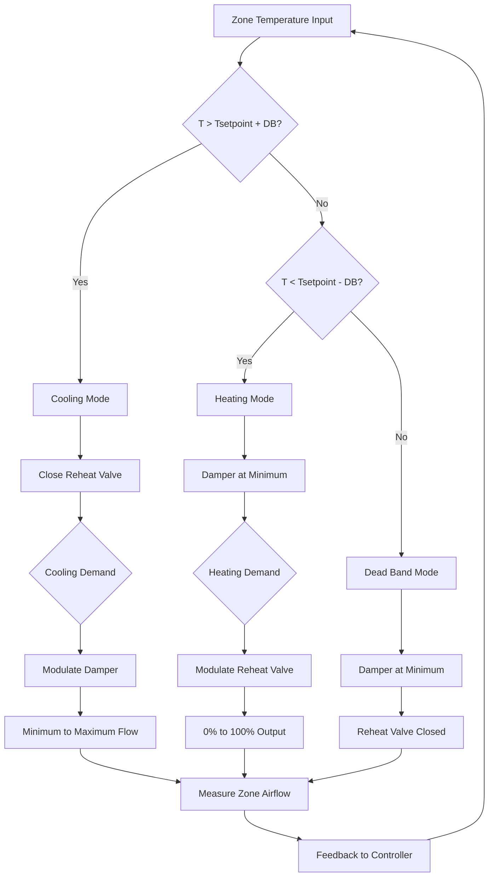

## VAV Box Control Sequences

Variable air volume (VAV) terminal units provide zone-level temperature control by modulating airflow delivered to individual spaces. Control sequences define how dampers, reheat coils, and fan-powered box fans respond to zone conditions to maintain comfort while optimizing energy efficiency.

## Cooling-Only VAV Box Sequence

Cooling-only VAV boxes contain a single damper actuator and no heating capability. The control sequence operates as follows:

**Normal Cooling Mode:**
1. Zone temperature above setpoint triggers damper to open
2. Damper modulates from minimum to maximum position proportionally based on temperature error
3. At minimum cooling load, damper maintains minimum airflow setpoint
4. As cooling demand increases, damper opens linearly to maximum airflow
5. Maximum airflow typically sized at 1.2-1.3 times peak load for turndown capability

**Minimum Airflow Requirements:**
The damper never closes below the minimum airflow setpoint, which satisfies ventilation requirements per ASHRAE Standard 62.1. Minimum flow typically ranges from 30-50% of design maximum flow for exterior zones and 20-30% for interior zones.

**Dead Band Operation:**
When zone temperature falls within the cooling dead band (typically 1-2°F below setpoint), the damper maintains minimum position. This prevents unnecessary airflow cycling and reduces fan energy.

## VAV Box with Reheat Sequence

Reheat VAV boxes add heating capability through electric resistance coils, hot water coils, or steam coils. The sequence coordinates damper and reheat operation:

**Cooling Sequence (Zone Temperature Above Setpoint):**
1. Reheat valve fully closed (0% output)
2. Damper modulates from minimum to maximum position
3. Airflow increases proportionally with cooling demand
4. Maximum cooling provided at 100% damper position

**Dead Band (Zone Temperature at Setpoint ±0.5°F):**
1. Damper maintains minimum airflow position
2. Reheat valve remains closed
3. No active heating or cooling

**Heating Sequence (Zone Temperature Below Setpoint):**
1. Damper remains at minimum airflow position
2. Reheat valve modulates from 0-100% based on heating demand
3. Supply air temperature increases as reheat output increases
4. Maximum heating provided at 100% reheat valve position with minimum airflow

This sequence structure minimizes simultaneous heating and cooling, reducing energy waste while maintaining proper ventilation.

## ASHRAE Guideline 36 VAV Sequences

ASHRAE Guideline 36 provides standardized, high-performance sequences for VAV systems. Key features include:

**Dual Maximum Logic:**
Guideline 36 implements separate maximum airflow limits for cooling and ventilation modes. During peak cooling, the box can deliver up to the cooling maximum. During economizer or mild weather operation, the maximum reduces to prevent overcooling.

**Trim and Respond Logic:**
Rather than fixed minimum airflows, Guideline 36 uses dynamic minimum adjustment based on actual zone CO2 levels or calculated outdoor airflow requirements, improving energy efficiency.

**Damper Position Limits:**
The sequence includes provisions for pressure-independent control with airflow tracking. The damper position adjusts to maintain target airflow regardless of duct static pressure variations.

## Minimum Airflow Setpoint Table

| Zone Type | Minimum % of Design | Typical CFM Range | Ventilation Basis |
|-----------|-------------------|------------------|-------------------|
| Interior Office | 20-30% | 50-150 CFM | Occupant density |
| Perimeter Office | 30-40% | 75-200 CFM | Envelope loads + ventilation |
| Conference Room | 40-50% | 150-400 CFM | High occupant density |
| Classroom | 40-50% | 200-500 CFM | High occupant density |
| Laboratory | 50-70% | 300-800 CFM | Safety + process requirements |
| Data Center | 60-80% | 500-2000 CFM | Equipment cooling loads |

## Damper Control Characteristics

**Pressure-Independent Operation:**
Modern VAV boxes include airflow measurement via velocity sensors or differential pressure across the inlet. The controller adjusts damper position to maintain target airflow despite upstream static pressure variations, providing stable zone control.

**Damper Authority:**
Proper control requires 50:1 turndown ratio minimum. A box with 1000 CFM design maximum should control accurately down to 20 CFM minimum. Linear dampers with characterized actuators provide better low-flow control than opposed-blade dampers.

**Response Time:**
Damper actuators typically require 60-120 seconds for full stroke. Control loops must account for this response time to prevent oscillation. PID loop tuning should use proportional bands of 2-4°F with minimal integral action.

## Reheat Staging and Control

**Electric Reheat:**
Electric coils stage in steps (typically 2-3 stages for SCR control or step control). Each stage activates sequentially as heating demand increases. Cycling frequency limits prevent excessive contactor wear.

**Hot Water Reheat:**
Two-way modulating valves provide proportional control. Valve authority (ratio of valve pressure drop to coil pressure drop) should exceed 0.5 for stable control. Minimum water velocity requirements prevent coil stratification.

**Control Valve Sizing:**
Reheat valves sized with equal percentage characteristics provide linear heat output across the operating range. Proper valve Cv selection ensures the valve operates between 20-80% open at design conditions, maximizing control authority.

## VAV Control Sequence Diagram

## Occupied and Unoccupied Modes

**Occupied Mode:**
- Full sequence operation as described above
- Minimum airflow maintained for ventilation
- Zone temperature maintained at occupied setpoints
- Reheat available for morning warm-up

**Unoccupied Mode:**
- Setpoint widened to setback temperatures (heating setback 60-65°F, cooling setup 80-85°F)
- Damper closed to zero flow unless temperature exceeds setback limits
- Reheat disabled unless temperature falls below freeze protection setpoint
- Significant energy savings from reduced airflow and eliminated reheat

**Warm-Up Mode:**
- Pre-occupancy sequence brings space to occupied setpoint
- Damper at minimum position
- Reheat at maximum output
- Optimum start algorithms calculate warm-up time based on outdoor temperature and building thermal mass

## Implementation Considerations

Proper VAV box sequence implementation requires attention to sensor placement, actuator selection, and control loop tuning. Zone temperature sensors should locate away from supply diffusers and heat sources. Airflow sensors require straight duct runs for accuracy. Control parameters must be commissioned and adjusted based on actual system performance to achieve stable, energy-efficient operation.
