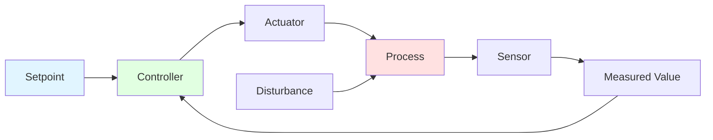
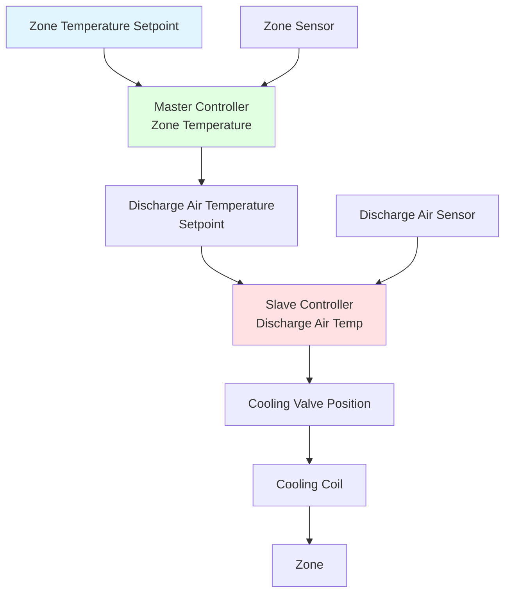
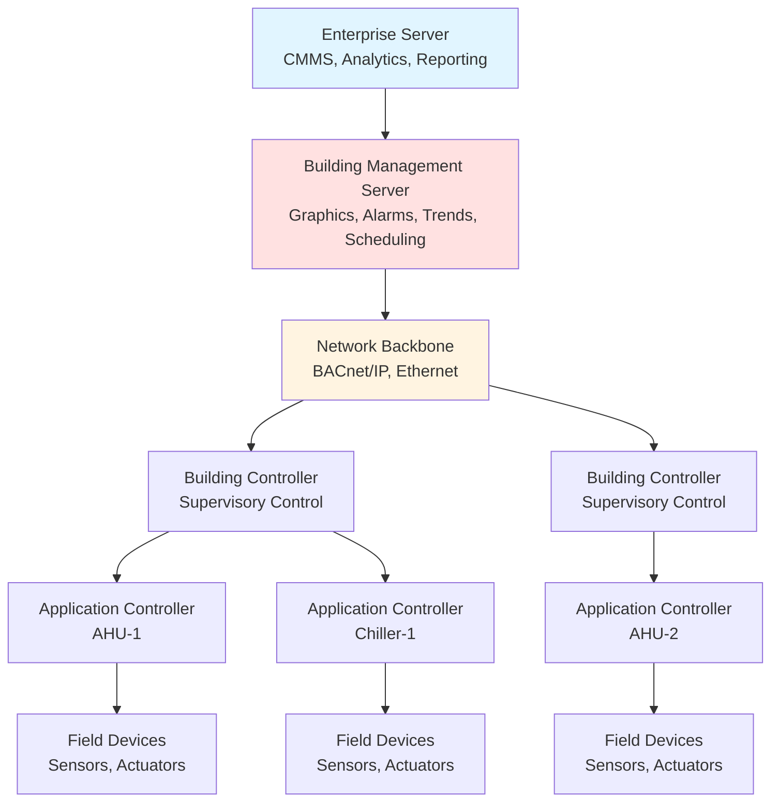

# HVAC Controls & Automation Systems

Modern HVAC systems rely on sophisticated control strategies to maintain occupant comfort, minimize energy consumption, and ensure reliable operation. Control systems measure process variables through sensors, compare measured values against setpoints, and adjust actuators to eliminate control errors. Understanding control fundamentals, instrumentation, and automation architectures enables engineers to design responsive, efficient, and maintainable systems.

## Control Theory Fundamentals

### Feedback Control Principles

Feedback control forms the foundation of HVAC automation. A closed-loop control system continuously monitors a controlled variable (process variable), compares it to a desired value (setpoint), and manipulates an output to eliminate the difference (error).

The control error at any time $t$ is:

$$e(t) = SP - PV$$

Where:
- $SP$ = setpoint (desired value)
- $PV$ = process variable (measured value)

The controller output $CO(t)$ is a function of this error:

$$CO(t) = f(e(t))$$

Control system performance is evaluated by:
- **Rise time:** Time to reach setpoint
- **Settling time:** Time to remain within acceptable tolerance
- **Overshoot:** Maximum deviation beyond setpoint
- **Steady-state error:** Persistent offset from setpoint

### PID Control Algorithm

The Proportional-Integral-Derivative (PID) algorithm is the most common control strategy in HVAC applications. The controller output combines three control actions:

$$CO(t) = K_p \cdot e(t) + K_i \int_0^t e(\tau) \, d\tau + K_d \frac{de(t)}{dt}$$

Where:
- $K_p$ = proportional gain (dimensionless or %/unit)
- $K_i$ = integral gain (1/time)
- $K_d$ = derivative gain (time)

**Proportional (P) Action:**
- Output is proportional to current error
- Fast response to load changes
- Creates steady-state offset (droop)
- Throttling range $TR = 100/K_p$ (percentage)
- Example: 10% throttling range → $K_p = 10$

**Integral (I) Action:**
- Output based on accumulated error over time
- Eliminates steady-state offset
- Slower response, potential for overshoot
- Reset time $T_i = 1/K_i$ (minutes)

**Derivative (D) Action:**
- Output based on rate of error change
- Anticipates future error trends
- Reduces overshoot and improves stability
- Sensitive to sensor noise
- Rate time $T_d = K_d$ (minutes)

| Control Mode | Response Speed | Offset Elimination | Stability | HVAC Application |
|--------------|----------------|-------------------|-----------|------------------|
| P only | Fast | No (droop) | Good | Two-position dampers |
| PI | Moderate | Yes | Good | Most HVAC loops |
| PID | Fast | Yes | Best | Critical temperature control |
| PD | Fast | No | Better than P | Rare in HVAC |

**Tuning Methods:**

1. **Ziegler-Nichols Ultimate Cycle Method:**
   - Set $K_i = 0$ and $K_d = 0$
   - Increase $K_p$ until sustained oscillation occurs
   - Record critical gain $K_u$ and oscillation period $P_u$
   - Calculate tuning parameters:

$$K_p = 0.6 K_u$$
$$K_i = \frac{1.2 K_u}{P_u}$$
$$K_d = 0.075 K_u P_u$$

2. **Lambda Tuning:**
   - Specify desired closed-loop time constant $\lambda$
   - More conservative, reduces overshoot
   - Suitable for slow processes (temperature control)

### Advanced Control Strategies

**Cascade Control:**

A master controller's output becomes the setpoint for a slave controller. This configuration improves disturbance rejection and response time.

Example: Room temperature (master) controls discharge air temperature setpoint, which controls cooling valve position (slave).

**Feedforward Control:**

Measures disturbances before they affect the process variable and adjusts the manipulated variable preemptively.

$$CO(t) = K_{ff} \cdot D(t) + CO_{feedback}(t)$$

Where:
- $K_{ff}$ = feedforward gain
- $D(t)$ = measured disturbance
- $CO_{feedback}(t)$ = feedback controller output

Example: Outdoor air temperature directly adjusts preheat valve position before affecting discharge air temperature.

**Reset Schedules:**

Supply temperature or pressure setpoints vary based on system conditions to minimize energy consumption while maintaining comfort.

Supply water temperature reset based on outdoor air temperature:

$$T_{supply} = T_{design} - m \cdot (OAT - OAT_{design})$$

Where:
- $m$ = reset ratio (°F supply / °F outdoor)
- Typical heating: $m = -1.5$ (supply decreases 1.5°F per 1°F OAT increase)
- Typical cooling: $m = 0.5$ (supply increases 0.5°F per 1°F OAT increase)

## Sensors and Instrumentation

### Temperature Measurement

Temperature sensors convert thermal energy into an electrical signal for controller input.

**Resistance Temperature Detectors (RTDs):**
- Platinum element (Pt100, Pt1000 most common)
- Linear resistance-temperature relationship
- Accuracy: ±0.15°C (±0.27°F) for Class A
- Range: -200°C to 850°C
- Applications: Critical measurements, laboratories, pharmaceutical facilities

Resistance change with temperature (simplified):

$$R(T) = R_0[1 + \alpha(T - T_0)]$$

Where:
- $R_0$ = resistance at reference temperature (100 Ω at 0°C for Pt100)
- $\alpha$ = temperature coefficient (0.00385 Ω/Ω/°C for platinum)

**Thermistors:**
- Negative Temperature Coefficient (NTC) most common in HVAC
- Nonlinear, high sensitivity
- Accuracy: ±0.1°C to ±0.2°C
- Range: -40°C to 150°C
- Applications: Room sensors, duct sensors, outdoor sensors

Steinhart-Hart equation for NTC thermistors:

$$\frac{1}{T} = A + B \ln(R) + C (\ln(R))^3$$

Where $A$, $B$, and $C$ are calibration constants.

**Thermocouples:**
- Voltage generated at junction of dissimilar metals (Seebeck effect)
- Self-powered, no excitation required
- Type T (copper-constantan): -270°C to 400°C, ±0.5°C
- Type J (iron-constantan): -210°C to 1200°C
- Applications: Flue gas, boiler exhaust, high-temperature processes

| Sensor Type | Accuracy | Range | Cost | HVAC Application |
|-------------|----------|-------|------|------------------|
| RTD | ±0.15°C | -200 to 850°C | High | Critical processes |
| Thermistor | ±0.2°C | -40 to 150°C | Low | Standard HVAC |
| Thermocouple | ±1°C | -200 to 1200°C | Medium | High temperature |
| Infrared | ±2°C | -50 to 500°C | High | Non-contact measurement |

### Pressure Sensors

Pressure measurement enables airflow calculation, filter monitoring, and system diagnostics.

**Differential Pressure Transmitters:**

Measure pressure difference across filters, coils, duct sections, or flow elements. Diaphragm deflection creates capacitance or resistance change.

Airflow calculation from differential pressure:

$$Q = K \sqrt{\Delta P}$$

Where:
- $Q$ = volumetric flow rate (CFM)
- $K$ = flow coefficient (depends on duct size and element geometry)
- $\Delta P$ = differential pressure (in. w.c.)

For averaging Pitot tube arrays:

$$K = 4005 \times A \times C$$

Where:
- $A$ = duct cross-sectional area (ft²)
- $C$ = calibration coefficient (typically 0.95-1.05)

**Pressure Sensor Types:**
- **Gauge pressure:** Measures relative to atmospheric pressure
- **Absolute pressure:** Measures relative to perfect vacuum
- **Differential pressure:** Measures difference between two points

Range selection for HVAC applications:
- Filter status: 0-2 in. w.c.
- Duct static pressure: 0-10 in. w.c.
- Airflow stations: 0-0.5 in. w.c.
- Hydronic systems: 0-100 psi

### Humidity Sensors

Relative humidity sensors measure moisture content in air for humidity control and economizer operation.

**Capacitive RH Sensors:**
- Polymer film capacitance varies with moisture absorption
- Accuracy: ±2% RH (typical), ±1% RH (precision)
- Range: 0-100% RH
- Response time: 15-30 seconds
- Applications: Room humidity, duct humidity, outdoor air

**Dew Point Sensors:**
- Chilled mirror (optical detection, ±0.2°C accuracy)
- Capacitive polymer (±2°C dew point accuracy)
- Applications: Compressed air dryers, critical process control

Relationship between relative humidity and moisture content:

$$W = 0.622 \frac{RH \cdot P_{ws}}{P_{atm} - RH \cdot P_{ws}}$$

Where:
- $W$ = humidity ratio (lb water/lb dry air)
- $RH$ = relative humidity (decimal)
- $P_{ws}$ = saturation pressure at dry-bulb temperature
- $P_{atm}$ = atmospheric pressure

### Flow Measurement

**Differential Pressure Flow Measurement:**

Averaging Pitot tubes, flow grids, or venturi sections create pressure drop proportional to flow squared.

$$v = C \sqrt{\frac{2 \Delta P}{\rho}}$$

Where:
- $v$ = velocity (ft/min)
- $C$ = discharge coefficient
- $\Delta P$ = differential pressure (lb/ft²)
- $\rho$ = air density (lb/ft³)

**Thermal Dispersion Flow Sensors:**
- Heated element loses heat proportional to mass flow
- Suitable for low velocities (50-4000 fpm)
- Applications: Fume hood face velocity, lab exhaust verification

**Ultrasonic Flow Meters:**
- Transit time difference between upstream and downstream signals
- Non-invasive (clamp-on) or inline installation
- Accuracy: ±1-2% of reading
- Applications: Chilled water, condenser water, heating hot water

### Air Quality Sensors

**CO₂ Sensors:**
- Non-Dispersive Infrared (NDIR) technology
- Range: 0-2000 ppm (typical HVAC applications)
- Accuracy: ±50 ppm
- Applications: Demand-controlled ventilation per ASHRAE Standard 62.1

Outdoor air requirement based on CO₂:

$$V_{oa} = \frac{N \cdot G \cdot 10^6}{C_{space} - C_{oa}}$$

Where:
- $V_{oa}$ = outdoor air ventilation rate (CFM)
- $N$ = number of occupants
- $G$ = CO₂ generation rate (0.005 CFM/person typical office)
- $C_{space}$ = space CO₂ setpoint (1000 ppm)
- $C_{oa}$ = outdoor CO₂ concentration (400 ppm typical)

**VOC Sensors:**
- Metal Oxide Semiconductor (MOS) sensors
- Detects total volatile organic compounds
- Applications: IAQ monitoring, demand ventilation in residential

**Particulate Matter Sensors:**
- Laser scattering technology
- Measures PM2.5 and PM10 concentrations
- Applications: Filter performance verification, IAQ display

## Actuators and Final Control Elements

### Electric Modulating Actuators

Electric actuators position dampers and valves based on analog control signals (0-10 VDC or 4-20 mA).

**Key Specifications:**
- Torque rating: 35-8000 in-lb for dampers
- Actuation time: 30-180 seconds for 90° rotation
- Position feedback: 0-10 VDC or 4-20 mA
- Power: 24 VAC typical

**Spring Return vs. Non-Spring Return:**
- **Spring return:** Returns to fail-safe position (open or closed) on power loss
- **Non-spring return:** Maintains last position on power loss

Damper sizing requires torque calculation:

$$T = A \cdot P \cdot L \cdot K$$

Where:
- $T$ = required torque (in-lb)
- $A$ = damper area (ft²)
- $P$ = differential pressure (in. w.c.)
- $L$ = damper length perpendicular to shaft (in.)
- $K$ = blade shape factor (1.5-3.0)

### Control Valves

Control valves modulate fluid flow in hydronic systems.

**Valve Characteristics:**

Linear valve: Flow proportional to stem position

$$Q = C_v \cdot x \sqrt{\frac{\Delta P}{SG}}$$

Equal percentage valve: Each equal increment of travel produces a percentage change in existing flow

$$Q = Q_{max} \cdot R^{(x-1)}$$

Where:
- $Q$ = flow rate (GPM)
- $C_v$ = valve flow coefficient
- $x$ = valve position (0-1)
- $\Delta P$ = pressure drop across valve (psi)
- $SG$ = specific gravity
- $R$ = rangeability ratio (typically 50:1)

**Valve Authority:**

Ratio of valve pressure drop to total system pressure drop at design flow:

$$\beta = \frac{\Delta P_{valve}}{\Delta P_{total}}$$

Optimal valve authority: 0.3-0.5 for stable control. Low authority (<0.25) causes unstable control.

## Control Sequences and Strategies

### VAV System Control

**Single-Zone VAV with Reheat:**

1. **Cooling mode:** Airflow increases from minimum to maximum
2. **Dead band:** Airflow at minimum
3. **Heating mode:** Reheat valve modulates (airflow remains at minimum)

Zone airflow calculation:

$$CFM_{zone} = \frac{Q_{sensible}}{1.08 \times (T_{supply} - T_{zone})}$$

Where:
- $Q_{sensible}$ = sensible cooling load (Btu/h)
- $T_{supply}$ = supply air temperature (°F)
- $T_{zone}$ = zone temperature (°F)

**Static Pressure Reset:**

Reduce supply fan static pressure setpoint when VAV dampers are not fully open:

- Monitor all VAV damper positions
- If no damper >90% open, reduce static pressure setpoint
- Typical range: 1.0-2.5 in. w.c.
- Energy savings: Fan power ∝ (pressure)^1.5 approximately

### Economizer Control Strategies

Air-side economizers use outdoor air for free cooling when conditions are favorable.

**Control Strategies Comparison:**

| Strategy | Enable Condition | Advantages | Disadvantages |
|----------|-----------------|------------|---------------|
| Fixed dry-bulb | OAT < 55°F | Simple, no humidity sensor | May introduce high humidity |
| Differential dry-bulb | OAT < RAT | Prevents heating outdoor air | Ignores humidity |
| Fixed enthalpy | $h_{oa}$ < 28 Btu/lb | Controls moisture | Requires enthalpy calculation |
| Differential enthalpy | $h_{oa}$ < $h_{ra}$ | Most efficient | Complex, requires sensors |

Enthalpy calculation from temperature and humidity:

$$h = 0.24 \times T_{db} + W(1061 + 0.444 \times T_{db})$$

Where:
- $h$ = enthalpy (Btu/lb dry air)
- $T_{db}$ = dry-bulb temperature (°F)
- $W$ = humidity ratio (lb water/lb dry air)

### Chilled Water Plant Optimization

**Primary-Only Variable Flow:**

Modulate pump speed to maintain differential pressure at critical (farthest) coil.

Pump affinity laws relate speed, flow, pressure, and power:

$$\frac{Q_2}{Q_1} = \frac{N_2}{N_1}$$
$$\frac{H_2}{H_1} = \left(\frac{N_2}{N_1}\right)^2$$
$$\frac{P_2}{P_1} = \left(\frac{N_2}{N_1}\right)^3$$

Where:
- $Q$ = flow rate
- $N$ = pump speed (RPM)
- $H$ = head (pressure)
- $P$ = power

Reducing pump speed to 70% design:
- Flow: 70% of design
- Pressure: 49% of design
- Power: 34% of design (66% energy savings)

## Building Automation System Architecture

Modern BAS systems employ distributed intelligence with hierarchical control.

**System Layers:**

1. **Management layer:** Operator interface, graphics, trending, alarming
2. **Automation layer:** Building controllers, supervisory control, scheduling
3. **Field layer:** Application controllers (AHU, VAV, chiller), local control loops
4. **Device layer:** Sensors, actuators, variable frequency drives

### BACnet Protocol

ASHRAE Standard 135 defines BACnet (Building Automation and Control Networks) as an open, interoperable protocol.

**BACnet Objects:**
- Analog Input (AI): Temperature sensor, pressure sensor
- Analog Output (AO): Valve position command, damper position command
- Binary Input (BI): Status switch, alarm contact
- Binary Output (BO): Start/stop command, enable/disable
- Analog Value (AV): Calculated value, virtual point
- Schedule: Time-based control sequences

**BACnet Services:**
- ReadProperty: Request current value
- WriteProperty: Change setpoint or command
- COV (Change of Value): Automatic notification when value changes
- Trend Log: Historical data storage

## Energy Optimization Strategies

**Optimal Start/Stop:**

Calculate equipment start time to reach setpoint exactly at occupancy:

$$t_{start} = t_{occupancy} - \frac{T_{desired} - T_{current}}{R_{heating}}$$

Where:
- $t_{start}$ = equipment start time
- $R_{heating}$ = heating rate (°F/hour), learned from previous starts

**Demand Limiting:**

Shed non-critical loads when approaching peak demand threshold:

1. Monitor building electrical demand
2. Compare to target limit (e.g., 90% of contract demand)
3. Shed loads in priority order: lighting, plug loads, HVAC setback
4. Restore loads when demand decreases

**Trim and Respond Chiller Sequencing:**

Adjust chiller loading based on efficiency curves:

- Load most efficient chiller first
- "Trim": Incrementally load/unload chillers
- "Respond": React to rapid load changes
- Minimize total kW/ton across all operating chillers

## Reference Standards

- **ASHRAE Standard 135:** BACnet Protocol
- **ASHRAE Guideline 13:** Specifying Building Automation Systems
- **ASHRAE Guideline 36:** High-Performance Sequences of Operation for HVAC Systems
- **NIST SP 800-82:** Guide to Industrial Control Systems Security
- **ISA-95:** Enterprise-Control System Integration

---

*Effective HVAC control transforms mechanical systems into intelligent, responsive environments that adapt to occupant needs while minimizing energy consumption and operational costs.*
