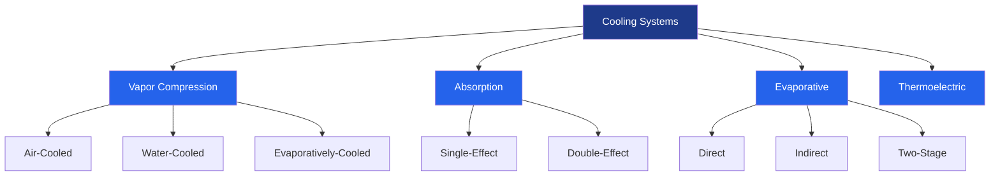

# HVAC Cooling Systems

Cooling systems remove thermal energy from conditioned spaces through various thermodynamic processes. The fundamental principle governing all cooling systems is the second law of thermodynamics, which requires energy input to transfer heat from a lower temperature region to a higher temperature region.

## Thermodynamic Fundamentals

The cooling capacity of any system is quantified by the rate of heat removal:

$$Q_c = \dot{m} \times c_p \times (T_{in} - T_{out})$$

Where:
- $Q_c$ = cooling capacity (Btu/hr or kW)
- $\dot{m}$ = mass flow rate of refrigerant or coolant (lb/hr or kg/s)
- $c_p$ = specific heat at constant pressure (Btu/lb·°F or kJ/kg·K)
- $T_{in}$ = inlet temperature (°F or °C)
- $T_{out}$ = outlet temperature (°F or °C)

The efficiency of cooling systems is measured by the Coefficient of Performance (COP):

$$COP = \frac{Q_c}{W_{input}}$$

Where $W_{input}$ represents the work or energy input required to achieve the cooling effect $Q_c$. For vapor compression systems, COP typically ranges from 2.5 to 4.5, meaning the system removes 2.5 to 4.5 units of heat for every unit of electrical energy consumed.

## Primary Cooling System Types

### Vapor Compression Refrigeration

The vapor compression cycle is the most widely used cooling technology in HVAC applications. The cycle consists of four fundamental processes:

1. **Compression**: Refrigerant vapor is compressed, increasing both pressure and temperature
2. **Condensation**: High-pressure vapor releases heat and condenses to liquid
3. **Expansion**: Liquid refrigerant undergoes throttling, reducing pressure and temperature
4. **Evaporation**: Low-pressure liquid absorbs heat and evaporates to vapor

The ideal vapor compression cycle approximates the Carnot cycle reversed. The enthalpy change across the evaporator determines cooling capacity:

$$Q_{evap} = \dot{m}_r \times (h_1 - h_4)$$

Where $h_1$ is the enthalpy of saturated vapor leaving the evaporator and $h_4$ is the enthalpy of liquid-vapor mixture entering the evaporator.

### Absorption Cooling

Absorption systems substitute thermal energy for mechanical compression work. These systems use a refrigerant-absorbent pair (typically water-lithium bromide or ammonia-water) and are particularly advantageous when waste heat or solar thermal energy is available.

The COP of absorption chillers is lower than vapor compression systems but is calculated based on thermal input:

$$COP_{abs} = \frac{Q_{evap}}{Q_{generator} + W_{pump}}$$

Single-effect absorption chillers achieve COP values of 0.6 to 0.8, while double-effect units reach 1.0 to 1.3.

### Evaporative Cooling

Evaporative cooling exploits the latent heat of vaporization of water. When water evaporates into an airstream, it absorbs approximately 1,050 Btu/lb (2,442 kJ/kg) of sensible heat from the air, converting it to latent heat. The process follows a constant wet-bulb temperature line on the psychrometric chart.

The cooling effectiveness is defined as:

$$\epsilon = \frac{T_{db,in} - T_{db,out}}{T_{db,in} - T_{wb,in}}$$

Where $T_{db}$ is dry-bulb temperature and $T_{wb}$ is wet-bulb temperature. Direct evaporative coolers achieve effectiveness of 70-90%, while indirect systems range from 50-70%.

## Cooling System Comparison

| System Type | COP Range | Typical Applications | Heat Rejection | Initial Cost |
|-------------|-----------|---------------------|----------------|--------------|
| Air-Cooled Vapor Compression | 2.5-3.5 | Residential, Small Commercial | Air-cooled condenser | Low-Medium |
| Water-Cooled Vapor Compression | 3.5-6.5 | Large Commercial, Industrial | Cooling tower | High |
| Single-Effect Absorption | 0.6-0.8 | District cooling, Waste heat recovery | Cooling tower | High |
| Double-Effect Absorption | 1.0-1.3 | Large facilities with thermal source | Cooling tower | Very High |
| Direct Evaporative | 10-20* | Dry climates, Industrial ventilation | Atmospheric | Very Low |
| Indirect Evaporative | 6-12* | Dry climates, Data centers | Atmospheric | Low-Medium |

*COP for evaporative systems calculated using fan power only

## Design Considerations Per ASHRAE Standards

ASHRAE Standard 90.1 establishes minimum efficiency requirements for cooling equipment. Key design parameters include:

**Capacity Sizing**: Per ASHRAE Fundamentals, cooling loads must account for:
- Sensible heat gain through building envelope (conduction, solar radiation)
- Internal heat generation (occupants, lighting, equipment)
- Latent heat gain (moisture from occupants, ventilation air, infiltration)
- Ventilation load based on ASHRAE Standard 62.1 requirements

**Efficiency Metrics**:
- **EER (Energy Efficiency Ratio)**: Steady-state efficiency at ARI standard conditions
- **SEER (Seasonal Energy Efficiency Ratio)**: Seasonal average for residential equipment
- **IEER (Integrated Energy Efficiency Ratio)**: Part-load performance for commercial equipment
- **kW/ton**: Power input per ton of cooling (lower is better; 0.6-1.2 kW/ton typical for chillers)

**Temperature Parameters**:
- Standard indoor design conditions: 75°F (24°C) DB, 50% RH per ASHRAE Standard 55
- Outdoor design conditions: 1% or 2.5% design values from ASHRAE climatic data
- Chilled water supply temperature: typically 42-45°F (6-7°C)
- Condenser water temperature: 85-95°F (29-35°C) for water-cooled systems

## Heat Rejection Methods

Heat extracted from the conditioned space plus the energy input to the cooling system must be rejected to a heat sink. The condensing temperature directly affects system efficiency; lower condensing temperatures yield higher COP.

**Air-Cooled Condensers**:
- Condensing temperature typically 15-25°F (8-14°C) above ambient
- No water consumption
- Performance degrades at high ambient temperatures
- Subject to fouling from airborne particulates

**Water-Cooled Condensers with Cooling Towers**:
- Condensing temperature approaches wet-bulb temperature
- Superior efficiency compared to air-cooled systems
- Water consumption through evaporation (approximately 3 gpm/100 tons)
- Requires water treatment to prevent scaling and biological growth

**Evaporatively-Cooled Condensers**:
- Combines principles of air and water cooling
- Intermediate efficiency between air-cooled and water-cooled
- Reduced water consumption versus cooling towers
- Freeze protection required in cold climates

The selection among these methods involves analysis of climate data, water availability, initial cost, operating cost, and maintenance requirements. In arid climates with high dry-bulb but low wet-bulb temperatures, evaporative systems demonstrate significant advantages. Humid climates favor vapor compression with appropriate dehumidification strategies.

## Refrigerant Selection

Refrigerant choice impacts system performance, environmental footprint, and regulatory compliance. Critical properties include:

- **Thermodynamic properties**: Pressure-temperature relationship, latent heat, specific volume
- **Environmental impact**: Ozone Depletion Potential (ODP) and Global Warming Potential (GWP)
- **Safety classification**: ASHRAE Standard 34 classifies refrigerants by toxicity and flammability
- **Material compatibility**: Effect on lubricants, elastomers, and metals

The transition from high-GWP refrigerants (R-410A, R-134a) to low-GWP alternatives (R-32, R-454B, R-1234yf) is ongoing, driven by regulations including the AIM Act and international protocols.

Understanding the thermodynamic principles, equipment characteristics, and design standards enables proper selection, sizing, and optimization of cooling systems for specific applications and climatic conditions.
