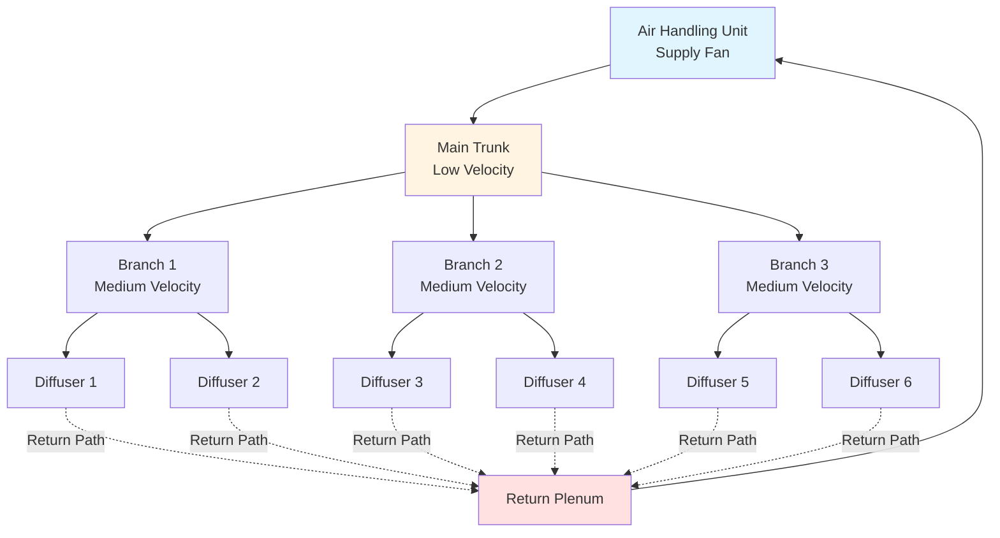
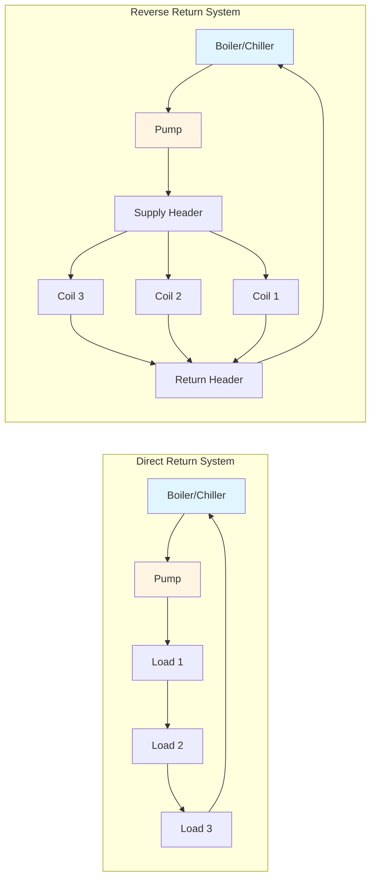

# Ductwork and Piping Systems

Distribution systems form the circulatory network of HVAC installations, delivering conditioned air and hydronic fluids from central equipment to occupied spaces. Proper design requires mastery of fluid mechanics, thermodynamics, material properties, and construction standards to achieve efficient, quiet, and reliable operation.

## Air Distribution Fundamentals

Air distribution systems convey conditioned air through sheet metal, fiberglass, fabric, or plastic ductwork. Design priorities include minimizing pressure drop, controlling noise transmission, preventing air leakage, and maintaining proper velocity profiles.

### Duct Sizing Methods

**Equal Friction Method**: Maintains constant pressure drop per unit length throughout the system. For a given friction rate $f$ (Pa/m or in. w.g./100 ft):

$$
\Delta P = f \cdot L
$$

where $L$ is duct length. Duct diameter follows from the Darcy-Weisbach relationship:

$$
\Delta P = f_D \cdot \frac{L}{D_h} \cdot \frac{\rho V^2}{2}
$$

where:
- $f_D$ = Darcy friction factor (dimensionless)
- $D_h$ = hydraulic diameter (m or ft)
- $\rho$ = air density (kg/m³ or lb/ft³)
- $V$ = velocity (m/s or ft/min)

**Static Regain Method**: Sizes ducts so velocity pressure reduction downstream converts to static pressure, offsetting friction losses. At each fitting:

$$
\Delta P_s = \Delta P_v - \Delta P_f
$$

where $\Delta P_s$ is static pressure change, $\Delta P_v$ is velocity pressure reduction, and $\Delta P_f$ is friction loss.

### Pressure Drop Components

Total system pressure drop combines multiple resistances:

$$
\Delta P_{total} = \Delta P_{straight} + \sum \Delta P_{fittings} + \Delta P_{equipment}
$$

Fitting losses use loss coefficients:

$$
\Delta P_{fitting} = C \cdot \frac{\rho V^2}{2}
$$

SMACNA provides comprehensive $C$ values for elbows, transitions, dampers, and diffusers based on geometry and velocity.

### Duct System Architecture

## Hydronic Distribution Fundamentals

Hydronic systems transport thermal energy through liquid media, typically water or glycol solutions. Design considerations include pump sizing, pipe material selection, expansion accommodation, and air elimination.

### Pipe Sizing and Pressure Drop

The Darcy-Weisbach equation governs pipe pressure drop:

$$
\Delta P = f \cdot \frac{L}{D} \cdot \frac{\rho V^2}{2}
$$

For turbulent flow (Re > 4000), the Colebrook-White equation relates friction factor to roughness:

$$
\frac{1}{\sqrt{f}} = -2 \log_{10} \left( \frac{\epsilon/D}{3.7} + \frac{2.51}{Re \sqrt{f}} \right)
$$

where $\epsilon$ is absolute roughness and $Re$ is Reynolds number.

Practical design uses velocity limits to control erosion and noise:
- Chilled water: 1.2-2.4 m/s (4-8 ft/s)
- Hot water: 1.2-3.0 m/s (4-10 ft/s)
- Steam: velocity depends on pressure and condensate return method

### Hydronic System Configurations

Reverse return systems provide inherent hydraulic balance by equalizing pipe lengths to each load.

## Material Selection and Standards

**Ductwork Materials** (SMACNA HVAC Duct Construction Standards):
- Galvanized steel: most common, ASTM A653 specification
- Stainless steel: corrosive environments, ASTM A480
- Aluminum: coastal/chemical exposure, ASTM B209
- Fiberglass ductboard: internal insulation, NAIMA standards

**Piping Materials** (ASME B31.9, ASTM specifications):
- Steel pipe: Schedule 40 for most applications, black or galvanized
- Copper: Type L for building services, ASTM B88
- CPVC: chilled water up to 93°C (200°F), ASTM F441
- PEX: hydronic heating, ASTM F876/F877

## Design Standards and References

**ASHRAE Fundamentals**: Chapter 21 (Duct Design), Chapter 22 (Pipe Sizing)

**SMACNA Publications**:
- HVAC Duct Construction Standards - Metal and Flexible
- Duct Design
- Seismic Restraint Manual

**Pressure Class Requirements**: SMACNA defines duct construction based on static pressure and dimensions, ranging from ±500 Pa (±2 in. w.g.) to ±2500 Pa (±10 in. w.g.).

## System Integration Considerations

Effective distribution design integrates with architectural, structural, and other MEP systems:

1. **Coordination**: Maintain clearances for installation and service access
2. **Acoustics**: Size for velocity limits preventing noise generation
3. **Thermal Performance**: Insulate to prevent condensation and energy loss
4. **Seismic Restraint**: SMACNA/ASCE 7 requirements for bracing and support
5. **Life Safety**: Fire/smoke dampers per NFPA 90A/90B at rated assemblies

Distribution system design directly impacts equipment sizing, energy consumption, occupant comfort, and long-term operational costs. Proper application of fundamental principles and industry standards ensures systems meet performance requirements throughout their service life.

---

*Reference: ASHRAE Handbook - Fundamentals (2021), SMACNA HVAC Duct Construction Standards (2005), ASME B31.9 Building Services Piping*
