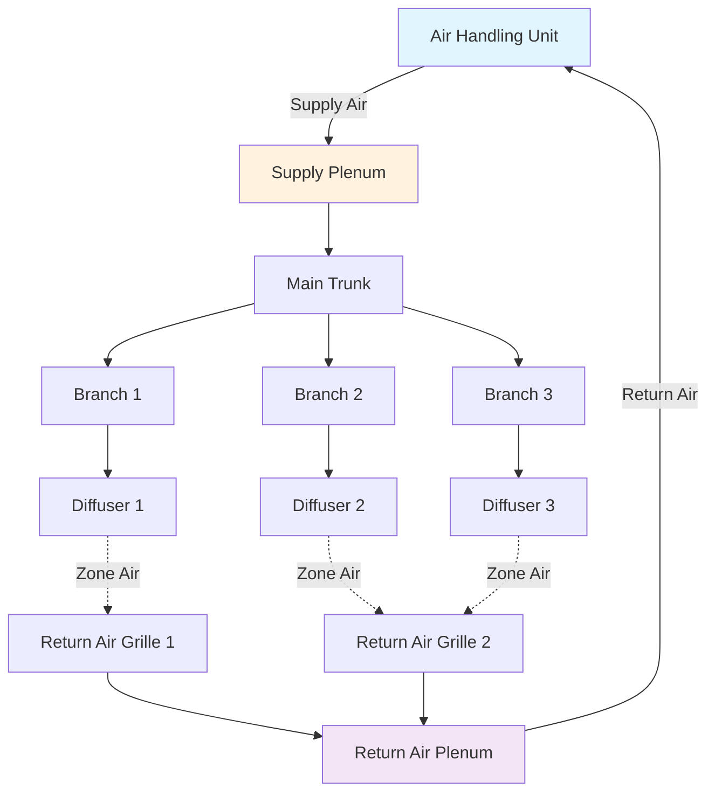

## Overview

Ductwork serves as the circulatory system of HVAC installations, delivering conditioned air to occupied spaces and returning air to equipment for reconditioning. Proper duct design ensures adequate airflow, minimized energy consumption, acceptable noise levels, and system longevity. This section addresses the fundamental principles governing supply, return, and exhaust ductwork systems.

## Duct System Components

## Duct Sizing Fundamentals

### Velocity Method

The velocity method sizes ducts based on target air velocity to control noise and pressure drop:

$$Q = A \times V$$

$$A = \frac{Q}{V}$$

Where:
- $Q$ = airflow rate (CFM)
- $A$ = duct cross-sectional area (ft²)
- $V$ = air velocity (FPM)

For rectangular ducts, the equivalent diameter for pressure drop calculations:

$$D_e = 1.30 \times \frac{(a \times b)^{0.625}}{(a + b)^{0.25}}$$

Where $a$ and $b$ are duct dimensions in inches.

### Equal Friction Method

This method maintains constant pressure loss per unit length throughout the system. The Darcy-Weisbach equation adapted for ductwork:

$$\Delta P_f = \frac{f \times L \times \rho \times V^2}{2 \times D_h}$$

Simplified for standard air at sea level:

$$\Delta P = \frac{0.109 \times Q^{1.9}}{D^{5.02}}$$

Where:
- $\Delta P$ = pressure loss (in. w.g. per 100 ft)
- $f$ = friction factor (dimensionless)
- $L$ = duct length (ft)
- $D$ = duct diameter (in.)
- $D_h$ = hydraulic diameter (in.)
- $\rho$ = air density (lb/ft³)

### Recommended Duct Velocities

| System Type | Main Ducts | Branch Ducts | Notes |
|-------------|------------|--------------|-------|
| **Supply - Residential** | 700-900 FPM | 500-700 FPM | Low velocity for noise control |
| **Supply - Commercial** | 1200-1800 FPM | 800-1200 FPM | Balance between size and noise |
| **Return - Low Velocity** | 800-1000 FPM | 600-800 FPM | Reduces regenerated noise |
| **Return - High Velocity** | 1500-2000 FPM | 1200-1500 FPM | Industrial applications |
| **Exhaust Systems** | 1000-1500 FPM | 800-1200 FPM | Depends on contaminant type |

## Duct Material Selection

Material selection depends on application requirements, code compliance, and economic factors.

| Material | Applications | Advantages | Limitations | SMACNA Class |
|----------|-------------|------------|-------------|--------------|
| **Galvanized Steel** | General HVAC, commercial | Durable, fire-resistant, rigid | Corrosion in humid environments | 1"-10" w.g. |
| **Aluminum** | Coastal, corrosive environments | Corrosion-resistant, lightweight | Higher cost, lower strength | 1"-6" w.g. |
| **Stainless Steel** | Exhaust, high-temp, corrosive | Excellent corrosion resistance | High material cost | 1"-10" w.g. |
| **Fiberglass Duct Board** | Low-pressure residential/commercial | Sound attenuation, insulated | Limited to 2" w.g., moisture sensitive | Max 2" w.g. |
| **Flexible Duct** | Final connections, tight spaces | Easy installation, pre-insulated | High pressure drop if compressed | Max 1" w.g. |
| **PVC/FRP** | Fume exhaust, chemical environments | Chemical-resistant | Not for general HVAC | Varies |

## Supply Ductwork Systems

Supply ductwork delivers conditioned air from the air handler to occupied spaces. Design considerations:

**Pressure Classification:** ASHRAE 90.1 and IMC require duct sealing based on static pressure class:
- Low pressure: ≤ 2" w.g.
- Medium pressure: 2" to 6" w.g.
- High pressure: 6" to 10" w.g.

**Insulation Requirements:** Supply ducts in unconditioned spaces require insulation to prevent thermal losses. R-6 minimum for ducts in unconditioned spaces per IECC.

**Air Distribution Devices:** Terminal devices (diffusers, registers, grilles) should be selected for:
- Required throw distance
- Acceptable noise criteria (NC 25-40 depending on space)
- Proper mixing and avoiding stagnant zones

## Return Ductwork Systems

Return systems collect air from conditioned spaces and route it back to the air handler. Critical design factors:

**Sizing:** Return ducts are typically sized for lower velocities than supply to minimize noise regeneration near occupied spaces. Undersized return systems create excessive static pressure, reducing system capacity and efficiency.

**Central vs. Distributed Returns:** Distributed return systems provide better pressure balance and temperature control but increase installation cost. Central returns are economical but may create pressure imbalances between rooms.

**Transfer Ducts and Grilles:** Required when doors separate supply and return air paths to prevent pressure buildup. Minimum 1 CFM per square foot of room area through transfer openings.

## Exhaust Ductwork Systems

Exhaust systems remove contaminated, heated, or humid air from buildings. Applications include:

**General Exhaust:** Building ventilation air removed to maintain positive/negative pressure relationships.

**Kitchen Exhaust:** Grease-laden vapor removal per NFPA 96. Requires:
- 18-gauge welded black or stainless steel
- Minimum 500 FPM duct velocity
- Listed grease duct construction

**Bathroom/Toilet Exhaust:** Dedicated exhaust prevents odor migration. Typical rate: 50 CFM per water closet, 20 CFM per urinal.

**Fume Hood Exhaust:** Laboratory and industrial exhaust for hazardous contaminants. Requires corrosion-resistant materials and constant volume or VAV control.

## Pressure Loss Considerations

Total system pressure loss includes:

$$\Delta P_{total} = \Delta P_{friction} + \Delta P_{fittings} + \Delta P_{equipment}$$

**Fitting Loss Coefficients:** Each elbow, tee, transition, and damper introduces additional pressure loss expressed as velocity pressure multiples:

$$\Delta P_{fitting} = C \times VP$$

$$VP = \frac{V^2}{4005}$$

Where $C$ is the fitting loss coefficient from ASHRAE Fundamentals or SMACNA HVAC Systems Duct Design.

Typical fitting loss coefficients:
- 90° mitered elbow (no vanes): C = 1.2
- 90° radius elbow (R/D = 1.5): C = 0.27
- Straight tee (branch): C = 0.9-1.5
- Abrupt contraction: C = 0.5
- Abrupt expansion: C = 1.0

## Standards and References

**SMACNA Standards:**
- HVAC Systems Duct Design: Friction loss charts, fitting loss coefficients, construction standards
- Duct Construction Standards: Material gauges, sealing requirements, reinforcement

**ASHRAE Standards:**
- ASHRAE Handbook - Fundamentals: Psychrometrics, fluid mechanics, duct design equations
- ASHRAE 90.1: Energy efficiency requirements including duct sealing and insulation
- ASHRAE 62.1: Ventilation requirements affecting duct system design

**Code Requirements:**
- International Mechanical Code (IMC): Duct construction, materials, support, clearances
- NFPA 90A/90B: Installation of air conditioning and ventilating systems
- Local amendments and jurisdictional requirements

## Conclusion

Effective ductwork design balances multiple competing objectives: adequate airflow delivery, energy efficiency, acoustic performance, constructability, and lifecycle cost. Adherence to SMACNA fabrication standards and ASHRAE design methodology ensures systems meet performance expectations while complying with applicable codes.
