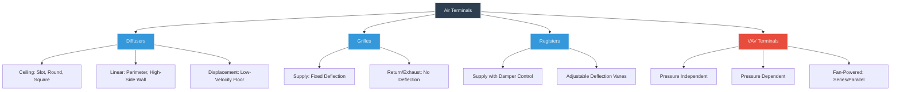

# Air Terminals: Diffusers, Grilles & Registers

Air terminals are the final components in an air distribution system, delivering conditioned air from ductwork into occupied spaces. Proper terminal selection directly impacts occupant comfort, energy efficiency, and acoustic performance. This guide covers terminal types, selection methodology, and the physics governing air jet behavior.

## Terminal Unit Classification

Air terminals fall into four primary categories based on function and airflow control:

## Throw and Drop Physics

Air jet throw represents the horizontal distance air travels from the terminal to a point where velocity decreases to a specified terminal velocity (typically 50 fpm for cooling, 100 fpm for heating). Drop quantifies the vertical deflection caused by buoyancy and gravitational effects.

### Throw Calculation

Throw distance follows empirical relationships derived from Albertson's jet equation for turbulent free jets:

**T₅₀ = K × √(Q / V₀)**

Where:
- T₅₀ = throw to 50 fpm terminal velocity (ft)
- K = throw coefficient (dimensionless, manufacturer-specific)
- Q = airflow rate (cfm)
- V₀ = initial outlet velocity (fpm)

For rectangular diffusers, the relationship simplifies to:

**T₅₀ = K × (Q / L)**

Where L = active length (ft) of the diffuser.

### Drop Calculation

Drop results from density differences between supply air and room air. For isothermal jets, drop is negligible. For non-isothermal conditions:

**D = 0.00027 × ΔT × T₅₀**

Where:
- D = drop distance (ft)
- ΔT = temperature difference, supply minus room (°F)
- T₅₀ = throw distance (ft)

**Critical consideration:** Cooling jets drop due to negative buoyancy (ρ_supply > ρ_room). Heating jets rise. Maximum acceptable drop is 2-3 ft for ceiling diffusers to prevent drafts in the occupied zone.

## Diffuser Selection Criteria

Selection requires balancing airflow delivery, acoustic performance, and architectural constraints. Reference ASHRAE Standard 70 (Method of Testing for Rating the Performance of Air Outlets and Inlets) for performance data standardization.

| Parameter | Ceiling Diffusers | Linear Slot | Displacement | High Sidewall |
|-----------|-------------------|-------------|--------------|---------------|
| **Typical Throw (ft)** | 8-20 | 10-30 | 3-6 | 15-40 |
| **Supply Velocity (fpm)** | 400-800 | 500-1000 | 50-100 | 600-1200 |
| **NC Level @ 10 ft** | 25-35 | 30-40 | <20 | 35-45 |
| **Throw/Drop Ratio** | 4:1 typical | 6:1 typical | N/A | 10:1 typical |
| **Application** | General office | Perimeter zones | Labs, clean rooms | Gymnasiums, lobbies |
| **Spread Pattern** | 2-4 way | Linear | 360° radial | 1-way horizontal |

### Acoustic Performance

Sound generation at terminals stems from turbulence at vanes and pressure drop across the device. ADC (Air Diffusion Council) standards provide NC (Noise Criteria) ratings:

**NC ≈ 10 × log₁₀(Δp) + C**

Where Δp = pressure drop (in. w.g.) and C = constant based on terminal geometry.

**Design target:** NC 25-35 for offices, NC 30-40 for retail, NC 20-25 for conference rooms.

## VAV Terminal Units

VAV terminals modulate airflow while maintaining space temperature setpoints. Two fundamental types exist:

### Pressure Independent (PI) vs. Pressure Dependent (PD)

| Feature | Pressure Independent | Pressure Dependent |
|---------|---------------------|-------------------|
| **Flow Control** | Integral flow sensor + controller | Damper position only |
| **Duct Pressure Sensitivity** | Compensates for pressure variation | Flow varies with pressure |
| **Cost** | 30-50% higher | Base cost |
| **Application** | Systems >10 terminals | Small systems, budget constraints |
| **Accuracy** | ±10% of setpoint | ±20-30% of setpoint |

### Fan-Powered VAV Terminals

Fan-powered units blend primary (cooled) air with plenum air, maintaining constant volume delivery during low-load conditions:

**Series Fan:** Fan operates continuously, mixing primary and induced air before discharge.

**Parallel Fan:** Fan operates only when primary airflow drops below minimum, operating in parallel with primary air.

**Heating capacity (series):**

**Q_heat = 1.08 × (CFM_total) × (T_discharge - T_primary)**

Where CFM_total includes both primary and induced airflow.

## Selection Methodology

1. **Determine zone load:** Calculate sensible cooling load (Btu/hr).
2. **Calculate required airflow:** CFM = Q_sensible / (1.08 × ΔT).
3. **Establish throw requirement:** T₅₀ = 0.75 × (room length or width, whichever is critical).
4. **Select terminal type:** Based on architectural constraints and application.
5. **Verify performance:** Check manufacturer data for throw at calculated CFM.
6. **Confirm pressure drop:** Ensure Δp < system available static pressure, typically 0.05-0.15 in. w.g.
7. **Validate acoustics:** Verify NC rating meets space requirements.

## Standards and References

- **ASHRAE Standard 70:** Method of Testing for Rating the Performance of Air Outlets and Inlets
- **ASHRAE Fundamentals Handbook:** Chapter 20, Space Air Diffusion
- **ADC (Air Diffusion Council):** Diffuser performance testing standards
- **SMACNA:** HVAC Systems Duct Design, Section 6, Terminal Devices

## Installation Considerations

**Ceiling diffusers:** Install minimum 6 in. from walls to prevent staining. Maintain 4× neck diameter upstream straight duct length.

**Linear diffusers:** Align slots perpendicular to window wall for perimeter heating. Seal plenum boxes to prevent bypass leakage.

**Displacement terminals:** Locate in occupied zone (floor or low wall). Requires stratified temperature profile; not suitable for spaces <9 ft ceiling height.

**VAV terminals:** Mount with service clearance for damper and controller access. Install minimum 3× diameter upstream straight duct for accurate flow measurement.

Proper terminal selection and installation ensures effective air distribution, minimizes energy consumption, and maintains occupant comfort throughout the conditioned space.

