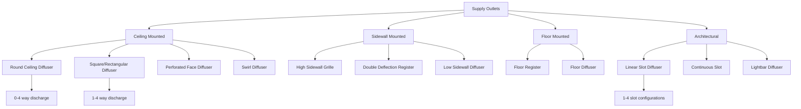

Supply outlets distribute conditioned air into occupied spaces while controlling airflow patterns, velocity, temperature differential, and acoustic performance. Proper selection requires analyzing throw distance, drop characteristics, spread patterns, and room air motion to achieve thermal comfort and air quality objectives.

## Fundamental Performance Parameters

Supply outlet performance depends on three primary characteristics that define the air pattern:

**Throw** represents the horizontal or vertical distance from the outlet face to where the air jet velocity decreases to 50 feet per minute (fpm) terminal velocity. This determines coverage distance.

**Drop** quantifies the vertical distance the air stream falls below the horizontal plane before reaching terminal velocity. Critical for cooling applications where cold air drops more rapidly.

**Spread** defines the divergence angle of the air pattern, typically measured at the point where velocity reduces to 50 fpm. Determines coverage width.

### Throw Calculation

Throw distance calculations use manufacturer performance data based on ASHRAE Standard 70 or ADC (Air Diffusion Council) test procedures:

```
T = K × (Q / Ak)^0.5
```

Where:
- T = Throw distance to 50 fpm terminal velocity (ft)
- K = Manufacturer's performance coefficient
- Q = Airflow rate (cfm)
- Ak = Effective area coefficient (dimensionless)

For preliminary sizing, the throw-to-ceiling height ratio typically ranges from 1.5:1 to 2.5:1 for ceiling outlets, with lower ratios for low-velocity applications and higher ratios for high-velocity systems.

### Drop Prediction

Drop depends on temperature differential and throw distance:

```
D = C × ΔT × (T / 10)^1.5
```

Where:
- D = Drop distance (ft)
- C = Drop coefficient (0.1 to 0.3 depending on outlet type)
- ΔT = Supply-to-room temperature differential (°F)
- T = Throw distance (ft)

Maximum recommended temperature differentials:

| Outlet Type | Cooling ΔT | Heating ΔT |
|-------------|-----------|-----------|
| Ceiling diffuser | 15-20°F | 25-30°F |
| High sidewall | 10-15°F | 30-40°F |
| Low sidewall | 5-8°F | 15-20°F |
| Floor | 8-12°F | Not applicable |

## Diffuser Types and Applications



### Ceiling Diffusers

Round and square ceiling diffusers provide horizontal radial air patterns ideal for standard ceiling heights (8-12 ft). Performance characteristics:

- **Discharge pattern**: 1-way, 2-way, 3-way, or 4-way adjustable patterns
- **Throw range**: 6-30 ft depending on size and airflow
- **NC ratings**: NC 25-35 at design airflow
- **Application**: General office, retail, residential

Perforated face diffusers offer superior performance in high-capacity applications with reduced pressure drop and improved air mixing. The perforation pattern creates numerous small jets that entrain room air rapidly, reducing temperature stratification.

Swirl diffusers generate a rotating air pattern with high induction ratios (10:1 to 15:1), providing excellent mixing with minimal temperature differential in the occupied zone. Optimal for variable air volume (VAV) systems where turndown ratios reach 4:1.

### Sidewall Grilles and Registers

High sidewall mounting (7-9 ft above floor) enables long throws suitable for perimeter zones and large open spaces:

- **Throw**: 15-50 ft with adjustable deflection
- **Vertical spread**: 15-30 degrees
- **Horizontal spread**: 30-60 degrees
- **Application**: Perimeter heating/cooling, gymnasiums, warehouses

Double deflection registers provide independent horizontal and vertical blade control, allowing precise air pattern adjustment. Select with opposed blade dampers for improved flow control and reduced noise.

### Floor Diffusers

Floor outlets provide upward air distribution for underfloor air distribution (UFAD) systems and displacement ventilation:

- **Discharge velocity**: 50-100 fpm at floor level
- **Throw height**: 4-6 ft to occupied zone
- **Temperature differential**: 8-12°F cooling maximum
- **Application**: UFAD, raised access floors, displacement ventilation

### Linear Slot Diffusers

Architectural slot diffusers integrate into building design while providing controlled air distribution:

- **Slot width**: 0.5-2.0 inches
- **Pattern**: 1-slot, 2-slot, 3-slot, or 4-slot configurations
- **Airflow per foot**: 25-150 cfm/ft of length
- **Throw**: 8-25 ft depending on slot configuration
- **Application**: Perimeter zones, lobbies, architectural spaces

## Selection Criteria

| Parameter | Recommended Range | Notes |
|-----------|------------------|-------|
| Room air change rate | 4-8 ACH cooling, 2-4 ACH heating | Higher for internal loads |
| Terminal velocity | 50 fpm standard, 25-35 fpm critical | Lower for laboratories, cleanrooms |
| Throw-to-ceiling ratio | 1.5:1 to 2.5:1 | Ensures proper mixing |
| Neck velocity | 500-800 fpm standard, 400-600 fpm quiet | Controls pressure drop and noise |
| NC rating | NC 25-30 offices, NC 35-40 retail | Per ASHRAE Standard 55 |
| ADPI (Air Diffusion Performance Index) | >80 for occupied zones | Measures thermal comfort |

### ADC Performance Ratings

The Air Diffusion Council establishes standardized test procedures for outlet performance certification. ADC-1000 series ratings provide:

- Certified throw data at multiple airflow rates
- Sound power levels in octave bands
- Pressure drop characteristics
- Temperature differential performance

Specify ADC-certified products for projects requiring verified performance data and consistent installation results.

## Installation Considerations

Outlet effectiveness depends on proper installation practices:

1. **Locate diffusers** based on throw calculations to ensure air pattern overlap of 10-20% for uniform coverage
2. **Verify ceiling plenum depth** provides adequate distance (6-12 inches minimum) from duct connection to outlet back for proper air distribution
3. **Install balancing dampers** in ductwork upstream of outlets, not at neck connections where they generate excessive noise
4. **Maintain clearances** from walls, partitions, and obstructions per manufacturer requirements (typically 12-24 inches)
5. **Coordinate with lighting and ceiling grid** to avoid conflicts and maintain architectural symmetry

Proper outlet selection and installation directly impacts occupant comfort, energy efficiency, and acoustic performance throughout the building lifecycle.
