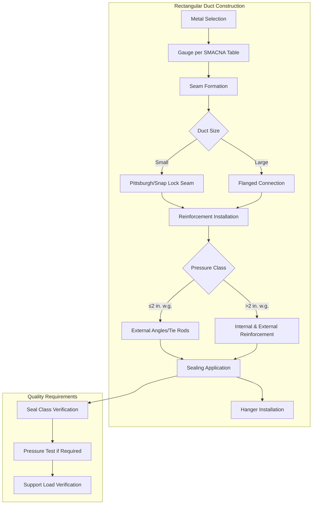

## Overview

HVAC duct construction standards establish the minimum requirements for fabricating sheet metal ductwork to ensure structural integrity, air tightness, and safe operation under design pressures. The Sheet Metal and Air Conditioning Contractors' National Association (SMACNA) publishes the industry-standard specifications that govern duct gauge selection, reinforcement spacing, sealing methods, and support requirements based on pressure class and duct dimensions.

## SMACNA Pressure Classes

Duct systems are classified by their maximum operating pressure, measured in inches of water column (in. w.g.). The pressure class determines construction requirements including metal thickness, reinforcement type, and sealing methods.

### Pressure Class Definitions

| Pressure Class | Static Pressure Range | Typical Applications |
|----------------|----------------------|---------------------|
| **½ in. w.g.** | Up to 0.5 in. w.g. | Residential systems, low-velocity commercial |
| **1 in. w.g.** | 0.5 to 1.0 in. w.g. | Standard commercial HVAC, small VAV systems |
| **2 in. w.g.** | 1.0 to 2.0 in. w.g. | Medium-pressure VAV, larger commercial systems |
| **3 in. w.g.** | 2.0 to 3.0 in. w.g. | High-pressure systems, lab exhaust |
| **4 in. w.g.** | 3.0 to 4.0 in. w.g. | Industrial ventilation, specialized applications |
| **6 in. w.g.** | 4.0 to 6.0 in. w.g. | High-velocity systems, process exhaust |
| **10 in. w.g.** | 6.0 to 10.0 in. w.g. | Very high-pressure industrial applications |

## Metal Gauge Requirements

Sheet metal thickness varies with duct size and pressure class. Rectangular duct gauge selection follows SMACNA tables based on the longest side dimension and static pressure class.

### Rectangular Duct Gauge Table (Galvanized Steel)

For 2 in. w.g. pressure class:

| Duct Side Dimension | Minimum Gauge | Thickness (inches) |
|---------------------|---------------|-------------------|
| Up to 12 inches | 26 gauge | 0.0187 |
| 13 to 30 inches | 24 gauge | 0.0239 |
| 31 to 54 inches | 22 gauge | 0.0299 |
| 55 to 84 inches | 20 gauge | 0.0359 |
| 85 to 96 inches | 18 gauge | 0.0478 |

Higher pressure classes require heavier gauges, while lower pressure classes permit thinner materials. Consult SMACNA tables for complete specifications across all pressure classes.

### Round Duct Gauge Requirements

Round and oval duct construction uses spiral seam or longitudinal seam fabrication:

| Diameter | ½ in. w.g. | 2 in. w.g. | 4 in. w.g. |
|----------|------------|------------|------------|
| Up to 12" | 26 gauge | 24 gauge | 22 gauge |
| 13-24" | 24 gauge | 22 gauge | 20 gauge |
| 25-36" | 22 gauge | 20 gauge | 18 gauge |
| 37-60" | 20 gauge | 18 gauge | 16 gauge |

## Reinforcement Requirements

Transverse reinforcement prevents duct collapse under negative pressure and lateral deflection under positive pressure. Reinforcement type and spacing depend on duct dimensions and pressure class.

### Reinforcement Types

- **Tie rods**: Threaded rods with angle or channel frames
- **Angles and channels**: Structural members attached to duct exterior
- **Beads and cross-breaks**: Formed into duct surface for smaller ducts
- **Internal angles**: For larger ducts requiring internal stiffening

### Maximum Reinforcement Spacing

For 2 in. w.g. rectangular duct:

| Duct Dimension | Reinforcement Spacing |
|----------------|----------------------|
| 19-30 inches | 60 inches |
| 31-42 inches | 48 inches |
| 43-60 inches | 40 inches |
| 61-84 inches | 30 inches |
| 85-96 inches | 24 inches |

Spacing decreases with higher pressure classes and increases with lower classes.

## Sealing Requirements

Air leakage classification follows SMACNA Leakage Class standards or ASHRAE Standard 90.1 seal class requirements.

### SMACNA Seal Classes

| Seal Class | Maximum Leakage (CFM per 100 sq ft at 1 in. w.g.) | Applications |
|------------|--------------------------------------------------|--------------|
| **Unsealed** | 48 CFM | Return air systems below 3 in. w.g. |
| **Seal Class A** | 24 CFM | Low-pressure supply ducts |
| **Seal Class B** | 12 CFM | Medium-pressure supply, outdoor air ducts |
| **Seal Class C** | 6 CFM | High-pressure systems, energy recovery |

### Sealing Methods

- **Unsealed**: Longitudinal seams and connections mechanically fastened without sealant
- **Seal Class A**: Transverse joints sealed with tape or mastic
- **Seal Class B**: All joints and seams sealed
- **Seal Class C**: All joints, seams, and penetrations sealed; includes gaskets at flanged connections

Mastic, pressure-sensitive tape, and gasketed connections are acceptable sealing materials. Cloth-backed duct tape is not permitted for permanent sealing.

## Support Spacing Requirements

Duct hangers and supports must prevent sagging while allowing for thermal expansion. Maximum support spacing depends on duct construction and location.

### Maximum Hanger Spacing

| Duct Type | Maximum Spacing |
|-----------|-----------------|
| **Rectangular duct** | 10 feet (horizontal) |
| **Round duct up to 24"** | 10 feet |
| **Round duct over 24"** | 8 feet |
| **Vertical risers** | Each floor, maximum 16 feet |
| **At elbows/transitions** | Within 4 feet of fitting |

Support systems must be designed for the total weight of ductwork, insulation, and airborne load. Trapeze hangers, clevis hangers, and strap hangers are common configurations.

## Duct Construction Details

## Joint and Connection Types

- **Pittsburgh seam**: Standard longitudinal seam for rectangular duct
- **Snap-lock seam**: Alternative for smaller rectangular duct
- **Flanged connections**: Required for ducts with sides exceeding 24 inches at transverse joints
- **Slip-and-drive**: Permitted for round duct up to 2 in. w.g.
- **Welded seams**: Required for high-temperature or special applications

## Special Construction Requirements

### High-Pressure Ductwork (>4 in. w.g.)

- Requires continuous welded or bolted flanged connections
- Internal reinforcement typically required
- Seal Class C sealing mandatory
- Engineering review recommended for structural adequacy

### Negative Pressure Systems

Exhaust and return ductwork under negative pressure requires additional reinforcement to prevent collapse. Intermediate reinforcement spacing decreases by 33% for negative pressure applications.

### Outdoor Ductwork

- Minimum 22 gauge galvanized steel or stainless steel
- All seams and joints sealed to Seal Class B minimum
- Pitched for drainage with drain provisions at low points
- Protected from standing water and corrosion

## Compliance and Inspection

Proper duct construction ensures:

- Structural integrity under design operating pressures
- Minimal air leakage for energy efficiency
- Safe operation throughout system life
- Code compliance per IMC and local amendments

Contractors should verify construction details against SMACNA standards during fabrication and installation. Third-party testing may be required for critical applications or high-performance buildings to verify seal class compliance.

