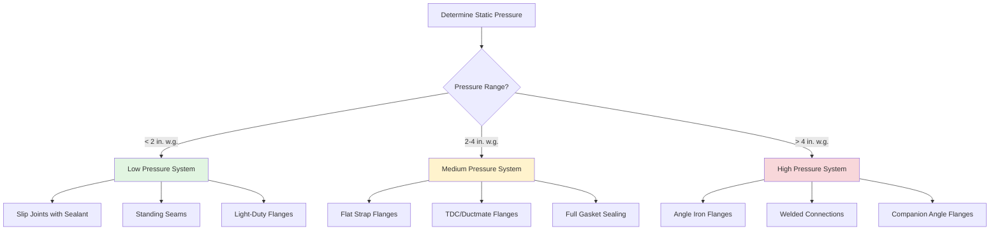

# Duct Joint Types and Connection Methods

Duct joints represent critical points in air distribution systems where proper construction directly impacts system performance, energy efficiency, and air leakage rates. Selection of appropriate joint types depends on operating pressure class, duct material, accessibility requirements, and structural loading conditions.

## Joint Classification by Construction Method

### Slip Joints

Slip joints represent the most common transverse connection method for rectangular and round ductwork in low-pressure applications. The male end of one duct section inserts into the female end of the adjacent section, creating an overlapping connection.

**Construction requirements:**
- Minimum 1.5-inch overlap for ducts up to 24 inches in diameter
- 2-inch overlap for ducts 25 to 48 inches in diameter
- 2.5-inch overlap for ducts over 48 inches in diameter

**Pressure limitations:**
Slip joints are typically limited to static pressures below 2 inches w.g. (water gauge) unless specifically reinforced. The joint relies on sealant application and mechanical fasteners (sheet metal screws or rivets) spaced per SMACNA standards.

### Standing Seam Joints

Standing seam construction creates longitudinal joints in rectangular duct fabrication. Two duct edges are folded together and compressed to form a mechanical lock without requiring additional fasteners.

**Key characteristics:**
- Provides structural rigidity along duct length
- Eliminates need for sealant in the seam itself when properly formed
- Common seam types include Pittsburgh seam, snap-lock seam, and button-punch snap-lock
- Spacing between seams depends on duct gauge and aspect ratio

### Flanged Connections

Flanged joints provide the most robust connection method for medium and high-pressure duct systems. Flanges are attached to duct ends and bolted together with a gasket to create an airtight seal.

**Flange types:**

| Flange Type | Pressure Range | Typical Application |
|-------------|----------------|---------------------|
| Angle iron flanges | Up to 10 in. w.g. | Large rectangular ducts, high-pressure systems |
| Ductmate/TDC flanges | Up to 6 in. w.g. | Commercial systems requiring field assembly |
| Flat strap flanges | Up to 4 in. w.g. | Medium-pressure rectangular ducts |
| Companion angle flanges | Up to 10 in. w.g. | Heavy-duty industrial applications |

**Gasket materials:**
- Closed-cell neoprene foam for most applications (0.5 to 0.75 inches thick)
- EPDM rubber for higher temperature applications
- Solid neoprene for high-pressure systems requiring compression resistance

### Welded Connections

Welded joints provide permanent, airtight connections for round spiral duct and specialized high-pressure applications. Welding eliminates mechanical fastener requirements and achieves the lowest leakage rates of any joint type.

**Applications:**
- Spiral round duct in exposed architectural installations
- Stainless steel exhaust systems
- High-pressure industrial ventilation (above 10 in. w.g.)
- Contamination-controlled environments requiring absolute air tightness

## Joint Sealing Requirements

SMACNA defines three seal classes based on static pressure and application:

| Seal Class | Static Pressure Range | Sealing Requirement |
|------------|----------------------|---------------------|
| Seal Class A | Up to 2 in. w.g. | Pressure-sensitive tape or mastic at transverse joints only |
| Seal Class B | 2 to 3 in. w.g. | Mastic, gaskets, or tapes at all joints and seams |
| Seal Class C | 3 to 10 in. w.g. | Gaskets at all joints; mastic or tape at longitudinal seams |

**Sealant properties:**
All sealants must maintain adhesion and flexibility across the operating temperature range, resist ultraviolet degradation if exposed, and remain vapor-impermeable after curing.

## Duct Leakage Classifications

SMACNA establishes leakage classes defining maximum allowable air loss per unit surface area:

- **Leakage Class 3:** 3 CFM per 100 sq. ft. at 1 in. w.g. (unsealed ductwork)
- **Leakage Class 6:** 6 CFM per 100 sq. ft. at 1 in. w.g.
- **Leakage Class 12:** 12 CFM per 100 sq. ft. at 1 in. w.g.
- **Leakage Class 24:** 24 CFM per 100 sq. ft. at 1 in. w.g.

Energy codes increasingly mandate leakage testing, particularly for ducts outside conditioned space. Testing typically uses duct blaster equipment to pressurize sections and measure actual leakage rates.

## Joint Selection by Pressure Class

## Field Installation Considerations

**Joint spacing and support:**
Transverse joints should not coincide with hanger locations. Position joints between supports with minimum 6-inch clearance to allow proper assembly access.

**Fastener requirements:**
Sheet metal screws or rivets at slip joints require specific spacing:
- 3-inch maximum spacing for ducts above 10 in. w.g.
- 6-inch spacing for 2 to 10 in. w.g.
- 12-inch spacing for pressures below 2 in. w.g.

**Gasket installation:**
Ensure gasket material is continuous around entire flange perimeter without gaps or compression voids. Bolt tightening should progress in a crossing pattern to distribute compression uniformly.

## Standards References

This content follows SMACNA HVAC Duct Construction Standards - Metal and Flexible, 4th Edition. Local code authorities may impose additional requirements beyond SMACNA minimums, particularly for leakage testing protocols and seal class specifications in energy-efficiency jurisdictions.
