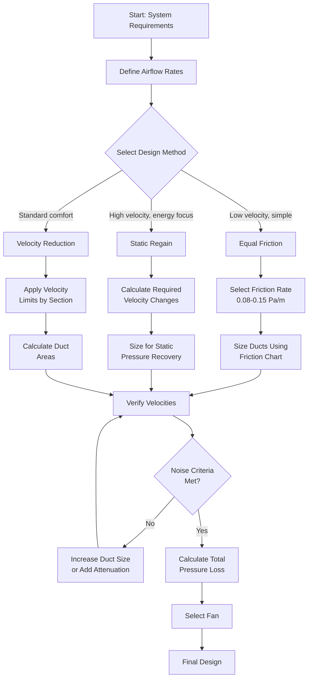

## Overview of Duct Design Methods

Duct system design requires systematic selection of duct sizes to deliver specified airflow rates while maintaining acceptable pressure losses, noise levels, and construction costs. Three primary methods dominate modern HVAC practice: equal friction, static regain, and velocity reduction. Each method applies specific physical principles to balance performance requirements with practical constraints.

The selection of design method depends on system characteristics, performance requirements, and economic considerations. ASHRAE Fundamentals Chapter 21 (Duct Design) provides the authoritative framework for these methodologies.

## Equal Friction Method

The equal friction method maintains constant pressure loss per unit length throughout the duct system. This approach simplifies balancing and provides consistent performance across all branches.

### Design Principle

Friction rate remains constant:

$$\frac{\Delta P}{L} = \text{constant}$$

Where:
- $\Delta P$ = pressure loss (Pa or in. w.g.)
- $L$ = duct length (m or ft)

The relationship between airflow, duct size, and friction rate derives from the Darcy-Weisbach equation:

$$\Delta P = f \cdot \frac{L}{D} \cdot \frac{\rho V^2}{2}$$

For circular ducts, velocity relates to flow rate:

$$V = \frac{4Q}{\pi D^2}$$

Combining these yields the equal friction sizing relationship:

$$D = \left(\frac{8fLQ^2}{\pi^2 \Delta P \rho}\right)^{1/5}$$

### Application Procedure

1. **Select friction rate** (typically 0.08-0.15 Pa/m or 0.1 in. w.g./100 ft)
2. **Size main trunk** using total airflow and selected friction rate
3. **Size branches** maintaining same friction rate per unit length
4. **Calculate velocity** for each section to verify noise criteria
5. **Determine fitting losses** and total system pressure

### Advantages and Limitations

**Advantages:**
- Simple calculation procedure
- Self-balancing characteristics
- Predictable performance
- Suitable for low-velocity systems

**Limitations:**
- May produce excessive velocities in larger ducts
- Does not optimize for static pressure recovery
- Can result in oversized equipment in distributed systems

## Static Regain Method

Static regain converts velocity pressure to static pressure at each diverging junction through controlled expansion. This method maintains approximately constant static pressure at all takeoff points.

### Governing Equations

At each branch point, the velocity reduction creates static pressure recovery:

$$\Delta P_s = P_{v1} - P_{v2} - \Delta P_f$$

Where:
- $\Delta P_s$ = static regain (Pa)
- $P_{v1}$ = velocity pressure upstream (Pa)
- $P_{v2}$ = velocity pressure downstream (Pa)
- $\Delta P_f$ = friction loss in section (Pa)

The velocity pressure is:

$$P_v = \frac{\rho V^2}{2}$$

For complete static regain:

$$\Delta P_s = \Delta P_f$$

This yields the design criterion:

$$\frac{\rho}{2}(V_1^2 - V_2^2) = f \cdot \frac{L}{D} \cdot \frac{\rho V_{avg}^2}{2}$$

### Design Procedure

1. **Calculate required velocity reduction** at each junction
2. **Size downstream section** to achieve target velocity
3. **Verify static regain** equals friction loss plus fitting losses
4. **Design transition geometry** for efficient pressure recovery
5. **Iterate** until static pressure remains constant

### Performance Characteristics

Static regain optimizes fan energy by recovering velocity pressure. This method suits high-velocity systems and long distribution runs where energy costs dominate initial construction costs.

**Design Requirements:**
- Gradual transitions (7-10° included angle)
- Proper aspect ratios (<4:1)
- Adequate straight duct lengths downstream
- Careful fitting design

## Velocity Reduction Method

The velocity reduction method decreases air velocity in discrete steps through the system, typically maintaining velocities within predefined ranges for each section type.

### Standard Velocity Ranges

| Duct Section | Velocity Range (fpm) | Velocity Range (m/s) |
|--------------|----------------------|----------------------|
| Main trunk | 1200-1800 | 6.1-9.1 |
| Branch ducts | 800-1200 | 4.1-6.1 |
| Final runouts | 500-800 | 2.5-4.1 |

### Sizing Approach

For each section:

$$A = \frac{Q}{V_{target}}$$

Where:
- $A$ = duct cross-sectional area (m² or ft²)
- $Q$ = airflow rate (m³/s or cfm)
- $V_{target}$ = target velocity (m/s or fpm)

Select standard duct dimensions nearest to calculated area while maintaining velocity within acceptable range.

## Comparison of Design Methods

| Method | Best Application | Fan Power | Balancing | Complexity |
|--------|-----------------|-----------|-----------|------------|
| Equal Friction | Low-velocity systems, short runs | Moderate | Simple | Low |
| Static Regain | High-velocity, long distribution | Lowest | Moderate | High |
| Velocity Reduction | General purpose, comfort systems | Moderate-High | Moderate | Low |

## Duct Design Workflow

## Practical Design Considerations

**Friction Rate Selection:**
- Residential: 0.06-0.10 Pa/m (0.08 in. w.g./100 ft)
- Commercial: 0.10-0.15 Pa/m (0.12 in. w.g./100 ft)
- Industrial: 0.15-0.25 Pa/m (0.18 in. w.g./100 ft)

**Velocity Limits for Noise Control:**
- Residences: 500-700 fpm (2.5-3.6 m/s)
- Private offices: 700-1000 fpm (3.6-5.1 m/s)
- General offices: 1000-1300 fpm (5.1-6.6 m/s)

**Aspect Ratio Constraints:**
Maintain rectangular duct aspect ratios below 4:1 to prevent flow separation and excessive pressure loss. Convert equivalent circular diameter using:

$$D_e = 1.30 \frac{(ab)^{0.625}}{(a+b)^{0.25}}$$

Where $a$ and $b$ are rectangular duct dimensions.

## References

ASHRAE Handbook—Fundamentals, Chapter 21: Duct Design provides comprehensive coverage of design methods, friction factors, fitting loss coefficients, and sizing charts essential for all duct design calculations.

