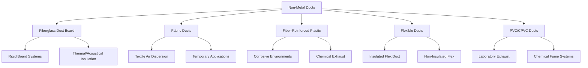

## Overview

Non-metal ducts provide alternatives to traditional galvanized steel ductwork, offering advantages in specific applications including thermal performance, weight reduction, acoustical control, and installation flexibility. These systems encompass fiberglass duct board, fabric air dispersion systems, fiber-reinforced plastic (FRP), flexible ducts, and specialized polymer materials.

Selection criteria depend on application requirements including temperature range, pressure class, environmental conditions, acoustical performance, and installation constraints.

## Non-Metal Duct Types

## Material Properties Comparison

### Performance Characteristics

| Material | Max Temp (°F) | Pressure Class | Thermal R-Value | Weight (lb/ft²) | Fire Rating |
|----------|---------------|----------------|-----------------|-----------------|-------------|
| Fiberglass Board 1.5" | 250 | 2" w.g. | 6.0 | 0.38 | Class 1 |
| Fabric (Polyester) | 160 | 4" w.g. | N/A (uninsulated) | 0.15 | NFPA 701 |
| FRP (Polyester) | 200 | 10" w.g. | Varies | 1.2 | Class 1 |
| Flexible (Insulated) | 250 | 1" w.g. | 4.2-8.0 | 0.60 | UL 181 Class 1 |
| PVC Schedule 40 | 140 | 15" w.g. | None | 2.1 | Limited |

### Application Matrix

| Material | Supply Air | Return Air | Exhaust | High Humidity | Corrosive |
|----------|-----------|-----------|---------|---------------|-----------|
| Fiberglass Board | Excellent | Excellent | Limited | Fair | Poor |
| Fabric Ducts | Excellent | Fair | No | Good | Fair |
| FRP | Good | Good | Excellent | Excellent | Excellent |
| Flexible Ducts | Good | Fair | Limited | Good | Fair |
| PVC/CPVC | Poor | Poor | Excellent | Excellent | Excellent |

## Fiberglass Duct Board Systems

Fiberglass duct board consists of rigid, resin-bonded glass fibers with a reinforced foil-scrim-kraft (FSK) or aluminum foil vapor barrier facing. The material functions as both duct structure and thermal insulation.

**Key Properties:**
- Density: 3-6 lb/ft³ depending on pressure class
- Thermal conductivity: 0.23-0.26 BTU·in/(hr·ft²·°F)
- Acoustical absorption: NRC 0.70-0.90
- Compressive strength: 5-15 psi minimum

**Fabrication Requirements (SMACNA HVAC Duct Construction Standards):**
- V-groove cutting depth: leave 1/4" minimum material thickness
- Closure methods: staples and pressure-sensitive tape for low pressure; mechanical fasteners for 2" w.g.
- Maximum aspect ratio: 4:1 for rectangular ducts
- Support spacing: 10 ft maximum for horizontal runs

**Advantages:**
- Integral thermal insulation (eliminates external wrap)
- Superior acoustical attenuation (reduces fan noise transmission)
- Lightweight (reduces structural loading)
- No condensation on exterior surfaces in cooling applications

**Limitations:**
- Cannot be used outdoors or in high-humidity spaces without protection
- Not suitable for exhaust systems with potential chemical exposure
- Requires careful handling during installation
- Maximum velocity: 2,500 fpm for supply air

**Standards Compliance:**
- UL 181: Factory-made air ducts and connectors
- ASTM C1338: Standard test method for pressure rating of duct board
- NFPA 90A: Standard for installation of air-conditioning and ventilating systems

## Fabric Duct Systems

Fabric ducts, also called textile air dispersion systems, distribute conditioned air through engineered porous or perforated fabric materials. The fabric acts as both duct and air diffuser.

**Material Options:**
- Polyester (most common): washable, durable, wide temperature range
- Nylon: higher strength, chemical resistance
- Polypropylene: moisture resistance, lower cost

**Dispersion Methods:**
- Porous fabric: air diffuses through material weave (low velocity)
- Laser-cut orifices: directional airflow patterns
- Combination systems: mix of porous and orifice dispersion

**Design Considerations:**
- Static pressure at fabric: 0.08-0.20" w.g. typical
- Supply air velocity in fabric: 400-2,500 fpm
- Throw distance: 3-20 ft depending on orifice design
- Support cable sizing: per manufacturer specifications

**Advantages:**
- Uniform air distribution over entire duct length
- Eliminates traditional diffusers and registers
- Washable and cleanable (critical for food processing)
- Lightweight and aesthetic appearance
- Rapid installation

**Typical Applications:**
- Food processing and preparation facilities
- Sports arenas and gymnasiums
- Temporary cooling for events
- Clean rooms (special antistatic materials)
- Warehouses and distribution centers

**Standards:**
- NFPA 701: Standard methods of fire tests for flame propagation
- ASHRAE 70: Method of testing diffusion effectiveness
- Factory Mutual approval for specific applications

## Fiber-Reinforced Plastic (FRP) Ducts

FRP ductwork consists of fiberglass reinforcement embedded in thermosetting resin (polyester, vinyl ester, or epoxy). These systems excel in corrosive environments where metal ducts fail rapidly.

**Resin Selection:**
- Polyester: general chemical resistance, lowest cost
- Vinyl ester: superior corrosion resistance, higher temperature
- Epoxy: maximum chemical resistance, highest cost

**Construction Methods:**
- Hand lay-up: custom shapes, field fabrication possible
- Filament winding: cylindrical ducts, high strength
- Pultrusion: constant cross-section profiles

**Mechanical Properties:**
- Tensile strength: 10,000-25,000 psi
- Flexural strength: 15,000-40,000 psi
- Maximum continuous temperature: 180-250°F depending on resin

**Applications:**
- Chemical process exhaust systems
- Laboratory fume hood exhaust
- Plating and metal finishing operations
- Wastewater treatment facilities
- Marine environments

**Installation Requirements:**
- Support spacing: calculate based on span loading (typically 8-10 ft)
- Joining methods: flanged connections with gasketing, adhesive bonds
- Expansion compensation: 0.5-1.0 in per 100 ft per 100°F temperature change
- Grounding: non-conductive; requires bonding jumpers for static dissipation

**Standards:**
- SMACNA FRP Duct Construction Manual
- ASTM D2996: Standard specification for filament-wound fiberglass pipe
- Factory Mutual 4910: Approval standard for ducts

## Installation Best Practices

**Fiberglass Duct Board:**
1. Store flat in dry location, off ground
2. Cut using sharp knives; seal all joints with UL 181-rated tapes
3. Install hangers at 10 ft spacing maximum
4. Protect exposed ends during construction

**Fabric Ducts:**
1. Install support cables with proper tensioning (per manufacturer)
2. Ensure minimum clearance to combustibles (36" typical)
3. Provide access for periodic removal and cleaning
4. Verify air balance matches design dispersion pattern

**FRP Systems:**
1. Follow manufacturer torque specifications for flange bolts
2. Use compatible gasket materials (EPDM, Viton, PTFE)
3. Provide adequate structural support (FRP has lower stiffness than metal)
4. Ground system if handling flammable vapors

## Selection Criteria

Choose non-metal ductwork when:
- **Fiberglass Board**: Low-pressure HVAC systems requiring thermal and acoustical performance
- **Fabric Ducts**: Uniform air distribution required over large spaces or cleanability is critical
- **FRP**: Corrosive chemical exposure makes metal ducts unsuitable
- **Flexible Ducts**: Short connection runs from rigid ductwork to terminals
- **PVC/CPVC**: Chemical exhaust at moderate temperatures with acid/alkali exposure

Consider metal ductwork when higher pressures, temperatures above material limits, outdoor exposure, or structural rigidity requirements exist.

