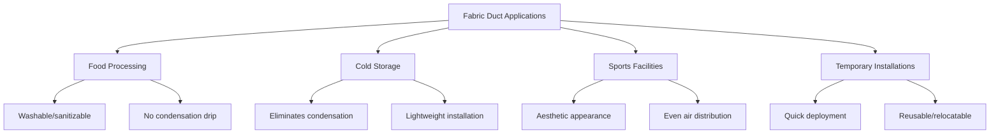
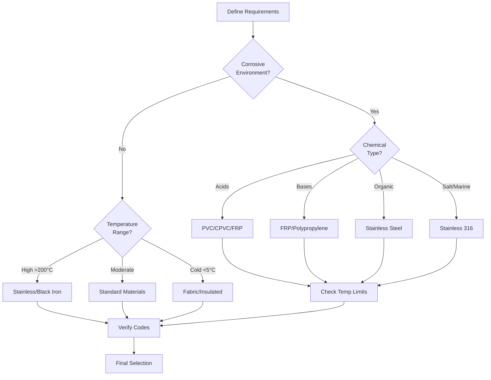

## Overview

Specialty duct materials address applications where standard galvanized steel or aluminum ducts fail due to corrosive environments, extreme temperatures, hygiene requirements, or unique installation constraints. Material selection requires analysis of chemical compatibility, thermal limits, structural strength, and long-term durability under operating conditions.

## Stainless Steel Ductwork

### Material Properties

Stainless steel ducts provide superior corrosion resistance and temperature capability for demanding environments.

**Thermal expansion coefficient:**
$$\alpha_{ss} = 17.3 \times 10^{-6} \text{ m/m°C}$$

**Allowable stress for 304 stainless:**
$$\sigma_{allow} = \frac{\sigma_{yield}}{SF} = \frac{215 \text{ MPa}}{1.5} = 143 \text{ MPa}$$

### Applications

- Commercial kitchen exhaust systems (grease-laden air)
- Laboratory fume exhaust (chemical exposure)
- Pharmaceutical cleanrooms (hygiene and cleaning requirements)
- High-temperature process exhaust (up to 816°C for Type 309)
- Coastal installations (salt air corrosion)

**Key considerations:**
- Type 304 for general corrosion resistance
- Type 316 for chloride environments
- Type 430 for cost-sensitive non-structural applications
- Welded seams required for grease ducts per NFPA 96
- Surface finish affects cleanability (2B standard, electropolished for pharmaceutical)

## Fiberglass and FRP Ductwork

### Fiberglass Reinforced Plastic (FRP)

FRP ducts combine corrosion resistance with structural strength through fiber reinforcement in thermosetting resin matrices.

**Flexural modulus:**
$$E_f = \frac{FL^3}{48I\delta}$$

Where:
- F = applied load (N)
- L = span length (m)
- I = moment of inertia (m⁴)
- δ = deflection (m)

**Chemical resistance factor:**
$$CRF = \frac{\sigma_{exposed}}{\sigma_{control}}$$

A CRF greater than 0.8 indicates acceptable chemical resistance.

### Applications

- Acid fume exhaust systems
- Wastewater treatment plants
- Industrial scrubber connections
- Coastal or marine environments
- Underground duct runs (corrosion immunity)

## PVC and CPVC Ductwork

### Material Comparison

| Property | PVC | CPVC | Unit |
|----------|-----|------|------|
| Max continuous temp | 60°C | 93°C | - |
| Tensile strength | 52 MPa | 55 MPa | ASTM D638 |
| Flame spread | 15-20 | 10-15 | ASTM E84 |
| Chemical resistance | Excellent | Excellent | - |
| UV resistance | Poor | Poor | - |
| Cost factor | 1.0× | 1.3× | Relative |

### Temperature Derating

PVC and CPVC duct pressure ratings decrease with temperature:

$$P_{rated}(T) = P_{rated,20°C} \times \left(1 - \frac{T - 20}{T_{max} - 20} \times 0.5\right)$$

### Applications

**PVC ducts:**
- Laboratory fume exhaust (acids, solvents)
- Plating shop exhaust
- Battery charging rooms
- Semiconductor fab exhaust

**CPVC ducts:**
- Higher temperature chemical exhaust
- Hot acid fume applications
- Chlorine gas handling

## Polypropylene Ductwork

Polypropylene offers excellent chemical resistance with higher temperature capability than PVC.

**Properties:**
- Maximum temperature: 100°C continuous
- Density: 0.90-0.91 g/cm³
- Tensile strength: 32-40 MPa
- Outstanding resistance to acids, bases, and organic solvents

**Joining methods:**
- Butt fusion welding (heated plate method)
- Extrusion welding for field joints
- Flanged connections with gaskets

## Fabric Duct Systems

Fabric ducts provide unique advantages for specific applications through permeable or semi-permeable textile construction.

### Airflow Distribution

**Discharge area calculation:**
$$A_{discharge} = \frac{Q}{V_{discharge}}$$

**Pressure drop through fabric:**
$$\Delta P = \frac{8\mu LQ}{\pi r^4} + \frac{\rho V^2}{2C_d^2}$$

Where Cd represents the discharge coefficient of the fabric material.

### Applications and Benefits

**Performance characteristics:**
- Air velocity: 5-15 m/s internal
- Operating pressure: 50-400 Pa static
- Materials: polyester, nylon, fiberglass
- Cleaning: machine washable or in-place vacuum
- Fire ratings: Class 1 or A available per ASTM E84

## Material Selection Framework

### Selection Criteria Matrix

### Decision Factors

**Environmental exposure:**
- Chemical concentration and temperature
- Continuous vs. intermittent exposure
- Maintenance accessibility

**Structural requirements:**
- Static pressure class per SMACNA
- Span lengths and support spacing
- Seismic and wind loads

**Code compliance:**
- IMC Chapter 6 requirements
- NFPA 96 for grease ducts
- Local amendments and approvals

**Economic analysis:**
- Material cost per linear meter
- Installation labor requirements
- Expected service life
- Maintenance costs

## Installation and Joining

### Specialty Material Connections

| Material | Joint Method | Sealant | Standard |
|----------|--------------|---------|----------|
| Stainless steel | Welded | N/A | SMACNA HVAC |
| FRP | Adhesive bonded | Resin | Manufacturer |
| PVC/CPVC | Solvent cement | Integral | ASTM D2564 |
| Polypropylene | Fusion welded | N/A | DVS 2207 |
| Fabric | Zippered/Velcro | N/A | Manufacturer |

### Support Spacing

Maximum hanger spacing varies by material stiffness:

$$L_{max} = \sqrt[4]{\frac{384EI}{5w_{max}\delta_{allow}}}$$

Where:
- E = elastic modulus (Pa)
- I = moment of inertia (m⁴)
- w = distributed load (N/m)
- δallow = allowable deflection (typically L/200)

## Standards and References

**SMACNA Standards:**
- HVAC Duct Construction Standards
- Rectangular Industrial Duct Construction
- Round Industrial Duct Construction

**ASHRAE Guidelines:**
- ASHRAE Handbook - HVAC Systems and Equipment
- Chapter 19: Duct Design

**Material Standards:**
- ASTM A480: Stainless steel
- ASTM D1784: PVC compounds
- ASTM F441: CPVC pipe and fittings
- ASTM E84: Surface burning characteristics

---

**Selection of specialty duct materials requires thorough analysis of operating conditions, chemical exposure, temperature extremes, and structural demands to ensure long-term system performance and code compliance.**
