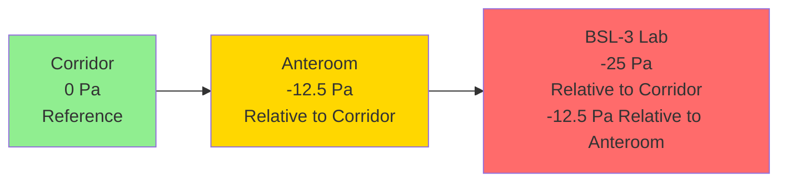

Negative pressure systems maintain a controlled environment at lower pressure than surrounding spaces, preventing the escape of contaminants, pathogens, or hazardous materials. This air distribution strategy finds critical applications in healthcare isolation rooms, biosafety laboratories, pharmaceutical manufacturing, and industrial containment facilities.

## Physical Principles of Negative Pressure

Negative pressure results from exhausting more air from a space than is supplied. The pressure differential creates directional airflow from higher-pressure adjacent areas into the controlled space, establishing a containment barrier.

**Fundamental relationship:**

ΔP = P_adjacent - P_room > 0

Where:
- ΔP = pressure differential (Pa or in. w.g.)
- P_adjacent = pressure in surrounding corridor or space
- P_room = pressure in negative pressure room

**Airflow balance:**

Q_exhaust = Q_supply + Q_infiltration + ΔQ

Where ΔQ represents the differential airflow creating the pressure gradient, typically 10-15% of supply airflow for healthcare applications.

## Pressure Differential Requirements by Application

| Application | Minimum ΔP | Typical ΔP | Standard Reference |
|-------------|-----------|------------|-------------------|
| Airborne Infection Isolation (AII) | 2.5 Pa (0.01 in. w.g.) | 2.5-8 Pa (0.01-0.03 in. w.g.) | CDC Guidelines, FGI |
| Protective Environment (PE) Anteroom | 2.5 Pa | 2.5-8 Pa | ASHRAE 170 |
| BSL-2 Laboratory | 5-10 Pa | 12.5 Pa (0.05 in. w.g.) | NIH, CDC/BMBL |
| BSL-3 Laboratory | 12.5 Pa (0.05 in. w.g.) | 25-37.5 Pa (0.1-0.15 in. w.g.) | CDC/NIH BMBL |
| BSL-4 Laboratory | 37.5 Pa (0.15 in. w.g.) | 50+ Pa (0.2+ in. w.g.) | CDC/NIH BMBL |
| Pharmaceutical Clean Room (negative) | 5-15 Pa | 10-15 Pa | USP 797/800 |
| Hazardous Material Storage | 12.5-25 Pa | 25 Pa | NFPA, Local Codes |

## Design Parameters for Healthcare Isolation Rooms

Healthcare facilities require precise pressure control to protect patients, staff, and visitors from airborne infectious diseases.

**ASHRAE 170 Requirements for AII Rooms:**

- Minimum pressure differential: 2.5 Pa (0.01 in. w.g.) negative to corridor
- Minimum air change rate: 12 ACH (existing), 12 ACH (new construction)
- Minimum outdoor air changes: 2 ACH
- All air exhausted directly outdoors (no recirculation)
- Exhaust air discharge location: minimum 25 ft from air intakes
- Pressure monitoring and alarming required
- Anteroom recommended but not required

**Calculating Required Exhaust Offset:**

For a standard 12 ft × 12 ft × 9 ft isolation room (1,296 ft³):

At 12 ACH: Q_total = (1,296 ft³ × 12) / 60 min = 259.2 CFM

Exhaust offset for 2.5 Pa differential:
Q_exhaust = Q_supply + ΔQ

Where ΔQ ≈ 50-150 CFM depending on door undercut, room tightness, and transfer grille sizing.

Typical design: Supply = 250 CFM, Exhaust = 300 CFM (Offset = 50 CFM)

## Laboratory Biosafety Applications

Biosafety laboratories employ negative pressure cascades to prevent pathogen escape, with increasing negative pressure from lower to higher containment levels.

**Pressure Cascade Example (BSL-3 Suite):**

**Airflow direction:** Corridor → Anteroom → Laboratory

This cascade ensures that if a door opens between spaces, airflow always moves toward higher containment, preventing pathogen migration.

## Exhaust System Design Considerations

Negative pressure systems require dedicated exhaust systems with specific performance characteristics.

**Critical exhaust system components:**

1. **Exhaust fans:** Redundant, constant-volume fans sized for maximum static pressure at minimum airflow degradation
2. **HEPA filtration:** Required for BSL-3/4 and certain healthcare applications before outdoor discharge
3. **Ductwork:** Negatively pressurized, sealed construction, accessible for decontamination
4. **Stack discharge:** Elevated discharge point with adequate dilution and dispersion
5. **Pressure monitoring:** Continuous differential pressure monitoring with visual/audible alarms

**Exhaust fan sizing equation:**

BHP = (Q × ΔP_total) / (6356 × η_fan)

Where:
- BHP = brake horsepower
- Q = exhaust airflow (CFM)
- ΔP_total = total static pressure (in. w.g.)
- η_fan = fan total efficiency (decimal)

For a BSL-3 laboratory exhausting 2,000 CFM through HEPA filters with 5.5 in. w.g. total static pressure and 65% fan efficiency:

BHP = (2,000 × 5.5) / (6356 × 0.65) = 2.66 HP

Select a 3 HP motor with service factor for reliability.

## Pressure Control and Monitoring

Maintaining stable pressure differentials requires active control systems and continuous monitoring.

**Control strategies:**

- **Direct pressure control:** Modulating exhaust dampers based on differential pressure sensor feedback
- **Airflow tracking:** Supply air tracks exhaust with fixed offset (e.g., exhaust = supply + 75 CFM)
- **Cascade control:** Nested control loops maintaining multiple pressure differentials in suite arrangements

**Monitoring requirements:**

| Parameter | Monitoring Frequency | Alarm Setpoint | Response |
|-----------|---------------------|----------------|----------|
| Pressure differential | Continuous | < 2.5 Pa (AII) | Visual/audible alarm |
| Airflow (supply/exhaust) | Continuous | ±10% of setpoint | Alarm and trend |
| Room air changes | Calculated/displayed | < 12 ACH | Alarm |
| HEPA filter pressure drop | Continuous | > 2× initial ΔP | Service alert |

## Containment Integrity and Testing

Negative pressure systems require commissioning verification and periodic retesting.

**Commissioning tests:**

1. **Pressure differential verification:** Measure ΔP at design conditions with doors closed
2. **Door swing test:** Door should swing into negative space when cracked open
3. **Smoke visualization:** Visible smoke flow under door or through transfer grille toward negative space
4. **Pressure decay test:** Monitor pressure recovery time after door opening (typically < 30 seconds to 90% setpoint)
5. **Airflow measurement:** Verify supply and exhaust quantities match design

**Operational testing frequency:**
- Healthcare AII rooms: Daily visual monitoring, quarterly certification
- BSL-3 laboratories: Daily pressure checks, annual certification
- Pharmaceutical facilities: Continuous monitoring per cGMP requirements

## System Failure Modes and Redundancy

Critical applications require fail-safe design to maintain containment during equipment failures or power loss.

**Redundancy strategies:**

- Dual exhaust fans with automatic switchover
- Emergency power for exhaust systems (not supply) to maintain negative pressure during outages
- Pressure-independent control valves resistant to drift
- Alarming to building automation system and local annunciators

**Failure mode analysis:**

If exhaust fan fails: Room pressure rises toward neutral/positive—CRITICAL FAILURE
If supply fan fails: Room pressure becomes more negative—Safe failure mode but may exceed structural limits

This analysis dictates that exhaust systems receive higher reliability priority than supply systems in negative pressure applications.

---

Negative pressure ventilation systems provide essential containment for healthcare, research, and industrial applications where preventing contaminant escape is paramount. Proper design requires understanding pressure differential physics, selecting appropriate equipment, implementing robust controls, and maintaining systems through regular testing and monitoring.
