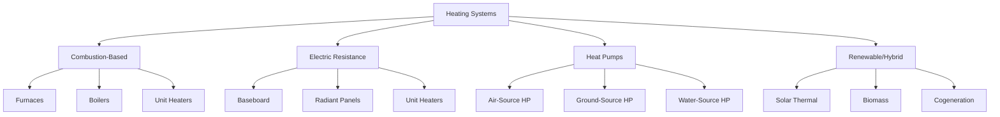
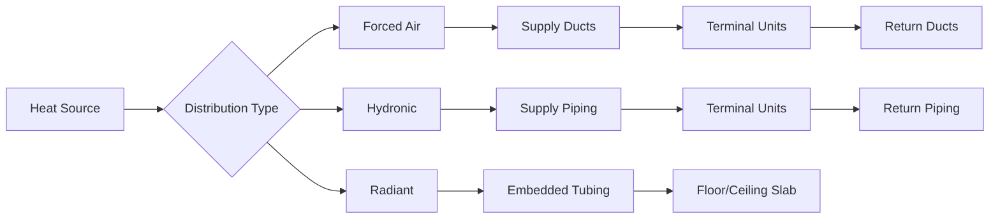

# Heating Systems: Principles and Technologies

Heating systems transfer thermal energy to building spaces through combustion, electrical resistance, or heat pump vapor compression cycles. Understanding the thermodynamic principles and heat transfer mechanisms enables proper system selection, sizing, and operation.

## Fundamental Heat Transfer Mechanisms

All heating systems rely on three primary heat transfer modes:

**Conduction** - Heat transfer through solid materials following Fourier's law:

$$Q = -kA\frac{dT}{dx}$$

where $Q$ is heat transfer rate (W), $k$ is thermal conductivity (W/m·K), $A$ is area (m²), and $dT/dx$ is temperature gradient (K/m).

**Convection** - Heat transfer between surfaces and fluids:

$$Q = hA(T_s - T_\infty)$$

where $h$ is convection coefficient (W/m²·K), $T_s$ is surface temperature (K), and $T_\infty$ is fluid temperature (K).

**Radiation** - Electromagnetic energy transfer:

$$Q = \varepsilon\sigma A(T_1^4 - T_2^4)$$

where $\varepsilon$ is emissivity, $\sigma$ is Stefan-Boltzmann constant (5.67×10⁻⁸ W/m²·K⁴), and temperatures are in Kelvin.

## Primary Heating Technologies

## Heating System Comparison

| Technology | Efficiency Range | Operating Temp | Distribution | Capital Cost | Operating Cost |
|-----------|------------------|----------------|--------------|--------------|----------------|
| Gas Furnace | 80-98% AFUE | 120-160°F | Forced air | Low | Low-Medium |
| Oil Furnace | 80-90% AFUE | 120-160°F | Forced air | Medium | Medium-High |
| Gas Boiler | 80-99% AFUE | 120-180°F | Hydronic | Medium-High | Low-Medium |
| Electric Resistance | 100% | Varies | Air/Hydronic | Low | High |
| Air-Source Heat Pump | 200-400% COP | 90-120°F | Forced air | Medium | Low-Medium |
| Ground-Source Heat Pump | 300-500% COP | 90-130°F | Hydronic/Air | High | Low |

## Combustion Heating Systems

### Combustion Fundamentals

Complete combustion of hydrocarbon fuels follows stoichiometric relationships. For natural gas (primarily methane):

$$\text{CH}_4 + 2\text{O}_2 \rightarrow \text{CO}_2 + 2\text{H}_2\text{O} + \text{Heat}$$

Theoretical air requirement:

$$A_{theoretical} = \frac{m_{air}}{m_{fuel}} = 17.2 \text{ kg air/kg CH}_4$$

Actual combustion requires excess air (typically 10-50%) to ensure complete oxidation. Combustion efficiency depends on excess air levels and stack temperature:

$$\eta_{combustion} = 100 - \left[\frac{K(T_{stack} - T_{ambient})}{CO_2\%}\right]$$

where $K$ is a fuel-dependent constant.

### Furnace Performance

ASHRAE Standard 103 defines Annual Fuel Utilization Efficiency (AFUE) as the ratio of annual output to annual input energy. High-efficiency condensing furnaces achieve AFUE values exceeding 95% by recovering latent heat from water vapor in combustion products.

Heat exchanger effectiveness determines delivered capacity:

$$\varepsilon = \frac{Q_{actual}}{Q_{maximum}} = \frac{T_{air,out} - T_{air,in}}{T_{flue} - T_{air,in}}$$

## Electric Resistance Heating

Electric heating converts electrical energy directly to thermal energy with 100% efficiency at the point of use. However, when accounting for power generation and transmission losses, source energy efficiency typically ranges from 30-40%.

Power requirement for electric baseboard heating:

$$P = \frac{Q}{\eta} = \frac{UA(T_{indoor} - T_{outdoor})}{1.0}$$

where $U$ is overall heat loss coefficient (W/m²·K) and $A$ is building envelope area (m²).

## Heat Pump Systems

### Vapor Compression Cycle

Heat pumps transfer thermal energy from low-temperature sources to higher-temperature sinks using the vapor compression refrigeration cycle operating in reverse.

Carnot Coefficient of Performance (ideal maximum):

$$COP_{Carnot} = \frac{T_{hot}}{T_{hot} - T_{cold}}$$

Actual heat pump COP:

$$COP_{actual} = \frac{Q_{heating}}{W_{compressor}} = \frac{\dot{m}(h_2 - h_3)}{W_{comp}}$$

where $h$ represents specific enthalpy (kJ/kg) at cycle state points.

### Heating Seasonal Performance Factor

ASHRAE Standard 116 defines HSPF (Heating Seasonal Performance Factor) for regional climate assessment:

$$HSPF = \frac{\sum Q_{heating}}{\sum E_{electrical}}$$

HSPF values range from 7.5 to 13 Btu/Wh for modern air-source heat pumps. Region IV (moderate climate) provides standardized testing conditions.

## Distribution System Integration

### Forced Air Systems

Furnace output capacity must account for duct heat losses and fan energy:

$$Q_{delivered} = Q_{furnace} - Q_{duct,loss} = \dot{m}c_p\Delta T - UA_{duct}(T_{supply} - T_{ambient})$$

ASHRAE Standard 152 provides duct efficiency calculation methods.

### Hydronic Systems

Boiler sizing requires accurate load calculation and consideration of system heat losses:

$$Q_{boiler} = Q_{design} + Q_{piping,loss} + Q_{pickup}$$

where pickup factor typically ranges from 1.10 to 1.25 for heating-up thermal mass.

## Control Strategies

Modern heating systems employ multiple control strategies:

- **On-Off Control** - Simple thermostat cycling for residential furnaces
- **Staged Heating** - Multiple capacity levels for improved efficiency
- **Modulating Burners** - Continuous capacity adjustment matching load
- **Outdoor Reset** - Supply temperature adjustment based on outdoor conditions

Proportional-Integral-Derivative (PID) control minimizes temperature deviation:

$$u(t) = K_p e(t) + K_i \int_0^t e(\tau)d\tau + K_d \frac{de(t)}{dt}$$

where $e(t)$ is error between setpoint and measured temperature.

## System Selection Criteria

Selection of appropriate heating technology depends on multiple factors:

1. **Climate** - Heating degree days and design temperatures per ASHRAE Standard 169
2. **Fuel Availability** - Natural gas, propane, oil, or electricity infrastructure
3. **Efficiency Requirements** - Energy codes and utility incentive programs
4. **Building Type** - Residential, commercial, or industrial loads
5. **Distribution Compatibility** - Existing or planned distribution systems
6. **Economic Analysis** - Life cycle cost including capital, operating, and maintenance expenses

ASHRAE Standard 90.1 establishes minimum efficiency requirements for commercial buildings, while residential systems follow Department of Energy standards.

## Emerging Technologies

Advanced heating technologies include:

- **Condensing Technology** - Recovers latent heat for AFUE >95%
- **Variable Capacity Heat Pumps** - Inverter-driven compressors with COP improvements of 20-30%
- **Air-to-Water Heat Pumps** - Low-temperature hydronic distribution
- **Hybrid Systems** - Dual fuel with automatic switchover based on efficiency and cost

Integration with building automation systems enables demand response, load shedding, and predictive maintenance strategies.

## Browse Topics

Explore detailed subtopics within heating systems:

- **[Boilers](./boilers/)** - Fire-tube, water-tube, cast iron, condensing, electric
- **[Heat Pumps](./heat-pumps/)** - Air-source, ground-source, water-source, mini-split
- **[Furnaces](./furnaces/)** - Gas, oil, electric, heat exchangers, controls
- **[Combustion](./combustion/)** - Burners, fuels, efficiency, flue gas analysis
- **[Radiant Heating](./radiant-heating/)** - Floor, ceiling, wall systems, panels
- **[CHP/Cogeneration](./chp-cogeneration/)** - Prime movers, heat recovery, economics
- **[Hydronic Distribution](./hydronic-distribution/)** - Piping, pumps, terminal units, controls
- **[Residential Heating](./residential-heating/)** - Systems, equipment, comfort, efficiency

## Standards and References

- ASHRAE Standard 62.1 - Ventilation for Acceptable Indoor Air Quality
- ASHRAE Standard 90.1 - Energy Standard for Buildings Except Low-Rise Residential
- ASHRAE Standard 103 - Method of Testing for Annual Fuel Utilization Efficiency of Residential Central Furnaces and Boilers
- ASHRAE Standard 116 - Methods of Testing for Rating Seasonal Efficiency of Unitary Air Conditioners and Heat Pumps
- NFPA 54 - National Fuel Gas Code
- NFPA 31 - Standard for Installation of Oil-Burning Equipment

Understanding heating system thermodynamics, proper sizing methodology, and control strategies ensures occupant comfort while minimizing energy consumption and operating costs.
