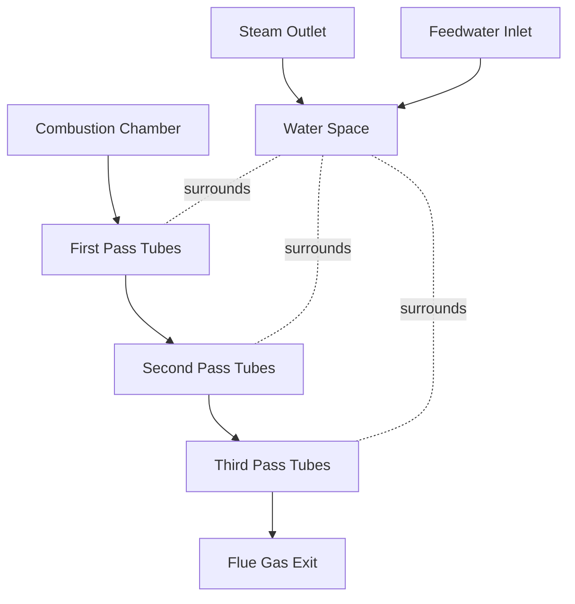
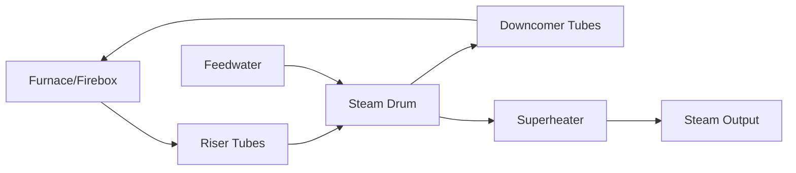
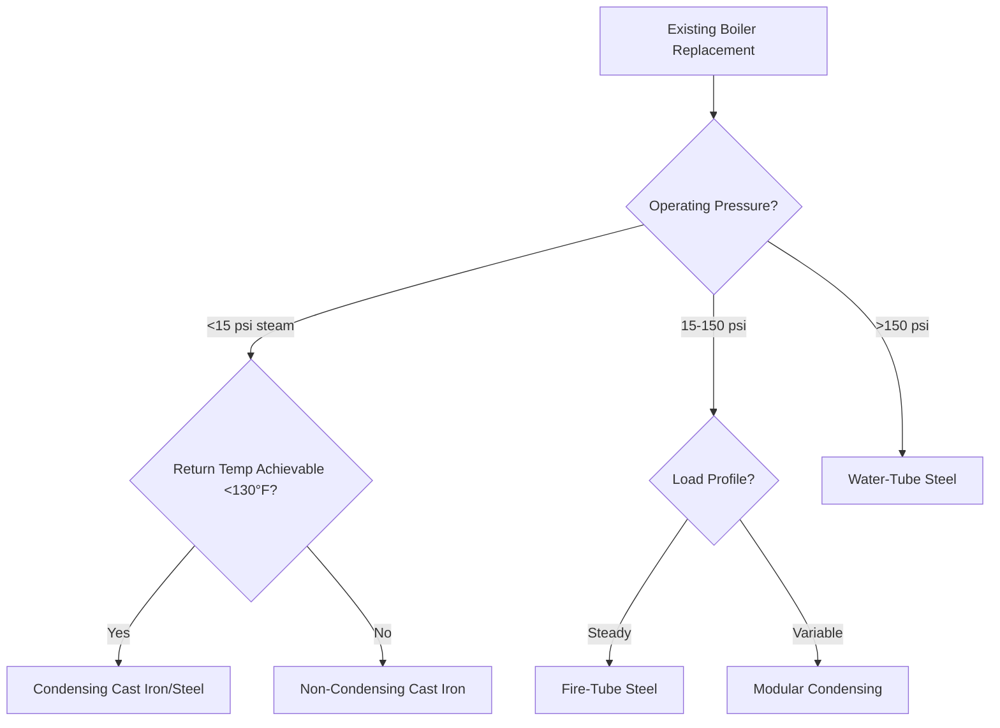

## Fundamental Classification Systems

Boilers are classified by construction methodology, heat transfer configuration, materials, and thermodynamic operating principles. Understanding these classifications enables proper selection based on capacity requirements, operating pressures, efficiency targets, and application constraints.

### Fire-Tube vs Water-Tube Configuration

The fundamental distinction between fire-tube and water-tube boilers lies in the relative position of combustion products and water within the pressure vessel.

#### Fire-Tube Boilers

In fire-tube designs, hot combustion gases pass through tubes surrounded by water. The pressure vessel contains water with tubes penetrating through the water space.

**Heat Transfer Mechanism:**

The heat flux through tube walls follows:

$$q = \frac{T_g - T_w}{\frac{1}{h_g} + \frac{t}{k} + \frac{1}{h_w}}$$

Where:
- $q$ = heat flux (W/m²)
- $T_g$ = gas temperature (K)
- $T_w$ = water temperature (K)
- $h_g$ = gas-side convection coefficient (W/m²·K)
- $h_w$ = water-side convection coefficient (W/m²·K)
- $t$ = tube wall thickness (m)
- $k$ = tube thermal conductivity (W/m·K)

**Characteristics:**
- Capacity range: 15 to 800 boiler horsepower (500 kW to 27 MW)
- Maximum pressure: typically 150 psi (1,035 kPa) per ASME Section IV
- Higher water volume provides thermal inertia
- Slower response to load changes
- Simpler construction, lower initial cost
- Easier to clean water-side

#### Water-Tube Boilers

Water-tube boilers circulate water through tubes heated externally by combustion gases. The tubes form the pressure boundary.

**Circulation Principles:**

Natural circulation develops from density differences:

$$\Delta P_{circ} = g \cdot H \cdot (\rho_{down} - \rho_{up})$$

Where:
- $\Delta P_{circ}$ = circulation driving pressure (Pa)
- $g$ = gravitational acceleration (9.81 m/s²)
- $H$ = vertical height difference (m)
- $\rho_{down}$ = downcomer water density (kg/m³)
- $\rho_{up}$ = riser two-phase mixture density (kg/m³)

**Characteristics:**
- Capacity range: 500 kW to 1,000+ MW
- Pressures up to 3,200 psi (22 MPa) for utility boilers
- Lower water volume, faster response
- Higher efficiency potential through larger heating surfaces
- Better suited for high pressure applications
- ASME Section I construction requirements

### Material Construction: Cast Iron vs Steel

#### Cast Iron Sectional Boilers

Cast iron boilers consist of individual cast sections bolted together with gasketed joints.

**Thermal Stress Considerations:**

Cast iron accommodates thermal expansion through section joints. Thermal stress in individual sections:

$$\sigma_{thermal} = E \cdot \alpha \cdot \Delta T$$

Where:
- $\sigma_{thermal}$ = thermal stress (Pa)
- $E$ = modulus of elasticity (110 GPa for cast iron)
- $\alpha$ = coefficient of thermal expansion (11 × 10⁻⁶ /K for cast iron)
- $\Delta T$ = temperature change (K)

**Advantages:**
- Excellent resistance to thermal shock
- Expandable/reducible capacity through sections
- Long service life (30-50 years typical)
- Field repairable
- Lower water velocity reduces erosion

**Limitations:**
- Maximum pressure: 15 psi steam, 160 psi water
- Not suitable for high-temperature operation
- Potential gasket leakage points
- Heavier per unit capacity

#### Steel Boilers

Steel boilers are welded or tube-expanded assemblies operating at higher pressures.

**Advantages:**
- Higher operating pressures and temperatures
- Lighter weight per capacity
- More compact footprint
- Suitable for high-capacity applications
- Required for ASME Section I installations

**Limitations:**
- More susceptible to thermal shock
- Requires water treatment to prevent corrosion
- Lower thermal mass
- Not field-expandable

### Condensing vs Non-Condensing Operation

The distinction between condensing and non-condensing boilers relates to flue gas exit temperature relative to the water vapor dew point.

#### Thermodynamic Efficiency Analysis

Combustion efficiency considering latent heat recovery:

$$\eta_{comb} = \frac{Q_{input} - Q_{flue}}{Q_{input}} \times 100\%$$

For condensing operation:

$$Q_{flue} = m_{gas} \cdot c_{p,gas} \cdot (T_{flue} - T_{ref}) - m_{vapor} \cdot h_{fg,cond}$$

Where:
- $m_{vapor}$ = mass of water vapor condensed (kg/s)
- $h_{fg,cond}$ = latent heat recovered (kJ/kg)

Natural gas combustion produces approximately 1.1 kg water vapor per m³ burned. The latent heat at atmospheric pressure is 2,442 kJ/kg.

#### Non-Condensing Boilers

**Operating Characteristics:**
- Flue gas exit temperature: 300-450°F (150-230°C)
- Combustion efficiency: 78-85% (HHV basis)
- Return water temperature maintained above 130°F (54°C)
- Stack condensation avoided to prevent acidic corrosion

#### Condensing Boilers

**Operating Principles:**

Condensing boilers extract latent heat by cooling flue gases below the dew point (approximately 135°F/57°C for natural gas).

**Efficiency Advantage:**

The efficiency gain from condensing operation:

$$\Delta \eta = \frac{m_{vapor} \cdot h_{fg}}{Q_{input}} \times 100\%$$

For natural gas, this represents 8-11% efficiency improvement.

**Design Requirements:**
- Flue gas exit temperature: 90-120°F (32-49°C)
- Return water temperature: 80-130°F (27-54°C) for optimal condensing
- Corrosion-resistant heat exchangers (stainless steel, aluminum)
- Condensate drainage and neutralization systems
- Annual fuel utilization efficiency (AFUE): 90-98%

**Condensate Treatment:**

Condensate pH ranges from 3.5 to 5.0 due to carbonic acid formation:

$$CO_2 + H_2O \leftrightarrow H_2CO_3$$

Neutralization required before drainage per local codes.

## Selection Criteria Comparison

| Criterion | Fire-Tube | Water-Tube | Cast Iron | Steel | Condensing | Non-Condensing |
|-----------|-----------|------------|-----------|-------|------------|----------------|
| **Capacity Range** | 500kW-27MW | 500kW-1000+MW | 15-3,000kW | 300kW-1000+MW | 15-6,000kW | 15-100+MW |
| **Max Pressure** | 150 psi | 3,200+ psi | 15/160 psi | 150-3,200 psi | 150 psi | 150-3,200 psi |
| **Efficiency (HHV)** | 80-88% | 82-88% | 80-85% | 82-88% | 90-98% | 78-85% |
| **Response Time** | Slow | Fast | Slow | Medium-Fast | Medium | Medium |
| **First Cost** | Medium | High | Low-Medium | Medium-High | High | Low-Medium |
| **Operating Cost** | Medium | Medium | Medium-High | Medium | Low | High |
| **Footprint** | Large | Medium | Large | Small-Medium | Medium | Medium |
| **Service Life** | 20-30 yrs | 25-40 yrs | 30-50 yrs | 20-35 yrs | 15-25 yrs | 20-30 yrs |
| **Maintenance** | Low | Medium-High | Low | Medium | Medium | Low-Medium |

## Application-Based Selection

### Commercial Buildings (Office, Retail)
- **Recommendation:** Condensing fire-tube or cast iron sectional
- **Rationale:** Lower operating temperatures compatible with condensing, moderate capacity requirements, priority on operating cost

### Industrial Process (High Pressure Steam)
- **Recommendation:** Water-tube steel boiler
- **Rationale:** High pressure capability, fast response to process loads, ASME Section I compliance

### District Heating Systems
- **Recommendation:** Water-tube steel boilers, multiple units
- **Rationale:** Large capacity, high reliability through redundancy, elevated temperature requirements

### Institutional (Schools, Hospitals)
- **Recommendation:** Condensing fire-tube or modular condensing
- **Rationale:** Variable loads, efficiency requirements, compatibility with lower temperature distribution

### Existing System Replacement
- **Decision Flow:**

## Code and Standard Requirements

- **ASME Section I:** Power boilers operating above 15 psi steam or high-temperature water above 160 psi and/or 250°F
- **ASME Section IV:** Heating boilers below Section I thresholds
- **ASHRAE Standard 155:** Method of testing for rating boilers
- **DOE 10 CFR 431:** Commercial and industrial boiler efficiency standards
- **UL 726/795:** Standards for gas-fired and oil-fired boilers

## Conclusion

Boiler selection requires systematic evaluation of capacity requirements, operating pressure, efficiency targets, space constraints, and lifecycle costs. Condensing technology offers significant operating cost advantages in applications with compatible return temperatures. Water-tube designs serve high-pressure and large-capacity needs, while fire-tube and cast iron configurations excel in commercial heating applications. Proper selection aligned with load characteristics ensures optimal performance and economic operation.
