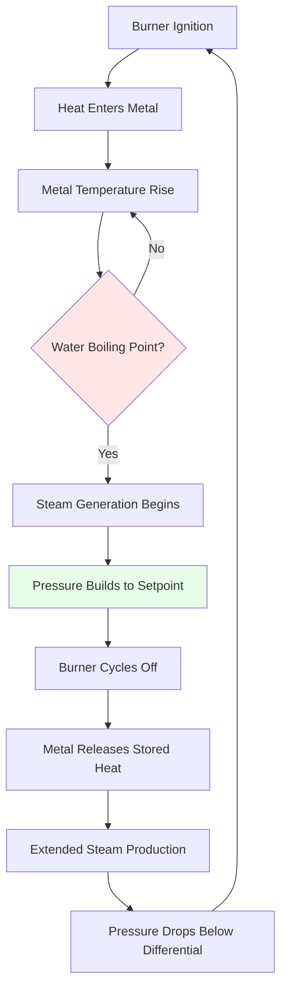

## Overview

Cast iron sectional boilers dominate residential and light commercial heating due to their unique assembly method, exceptional corrosion resistance, and operational longevity exceeding 30 years. Unlike welded steel boilers, cast iron units consist of individual sections joined through threaded nipples, allowing field assembly and repair flexibility. The material's inherent properties—low thermal expansion coefficient ($\alpha_{Fe} = 11.8 \times 10^{-6}$ K$^{-1}$), resistance to oxygen corrosion, and high thermal mass—make it ideal for low-pressure applications below 15 psig steam or 160 psig water.

## Section Assembly Mechanics

### Push Nipple Construction

Individual cast iron sections connect through push nipples—short threaded rods with gaskets at each end that create watertight joints. The assembly process relies on compression:

$$F_{seal} = P \cdot A_{gasket} + F_{compression}$$

where $F_{seal}$ is the required sealing force, $P$ is maximum operating pressure, and $A_{gasket}$ is the gasket contact area. Typical residential boilers use 3-12 sections depending on heating capacity.

Tie rods running the boiler length maintain compression as the unit undergoes thermal cycling. The differential expansion stress is:

$$\sigma_{thermal} = E \cdot \alpha \cdot \Delta T$$

For cast iron with Young's modulus $E = 100$ GPa, a temperature rise from 20°C to 80°C generates approximately 66 MPa internal stress, well below the material's 200 MPa tensile strength.

### Section Geometry

Each section contains vertical waterways with flue gas passages between them. Heat transfer occurs through conduction across the iron wall:

$$q = \frac{k \cdot A \cdot \Delta T}{t}$$

where $k = 52$ W/(m·K) for cast iron, $A$ is surface area, and $t$ is wall thickness (typically 6-12 mm). The vertical waterway design promotes natural circulation:

$$\dot{m} = \rho \cdot v \cdot A = \rho \cdot A \sqrt{2 \cdot g \cdot h \cdot \beta \cdot \Delta T}$$

where $\beta$ is the thermal expansion coefficient and $h$ is the vertical height, typically 600-900 mm.

## Wet Base vs. Dry Base Design

| Design Feature | Wet Base | Dry Base |
|----------------|----------|----------|
| Combustion chamber | Surrounded by water | Insulated, above water |
| Thermal efficiency | 80-84% AFUE | 83-87% AFUE |
| Startup time | Slower (higher thermal mass) | Faster (less water volume) |
| Condensation risk | Lower (higher base temp) | Higher (requires protection) |
| Applications | Residential, hot water | Commercial, steam |
| Section count typical | 4-8 | 6-12 |

### Wet Base Configuration

Wet base boilers immerse the combustion chamber in water, providing 360° heat transfer. The increased water volume elevates thermal mass:

$$Q_{stored} = m \cdot c_p \cdot \Delta T$$

For a 40-gallon wet base unit, $Q_{stored} = 151$ kg $\times$ 4.18 kJ/(kg·K) $\times$ 60 K = 37.9 MJ, providing substantial thermal inertia that reduces cycling frequency.

### Dry Base Configuration

Dry base designs position the combustion chamber above water level with refractory insulation. This reduces standby losses but requires careful combustion control to prevent overheating. The heat flux through the insulated base:

$$q_{loss} = \frac{\Delta T}{R_{total}} = \frac{\Delta T}{\frac{t_{ins}}{k_{ins}} + \frac{1}{h_{conv}}}$$

With 50 mm ceramic fiber insulation ($k_{ins} = 0.12$ W/(m·K)), standby losses drop by 15-25% compared to wet base designs.

## Corrosion Resistance

Cast iron's superior corrosion resistance stems from its high silicon content (1.5-3%) and graphite microstructure. When exposed to water, a protective magnetite layer ($Fe_3O_4$) forms:

$$3Fe + 4H_2O \rightarrow Fe_3O_4 + 4H_2$$

This passive layer is stable above pH 8.5, standard for boiler water treatment. Corrosion rates remain below 0.025 mm/year—negligible over a 30-year service life.

### pH Control Requirements

Maintaining pH between 8.5-10.5 prevents both acidic corrosion and alkaline embrittlement:

| pH Range | Corrosion Rate | Notes |
|----------|----------------|-------|
| < 7.0 | > 0.5 mm/yr | Severe acidic attack |
| 7.0-8.5 | 0.1-0.5 mm/yr | Moderate corrosion |
| 8.5-10.5 | < 0.025 mm/yr | Optimal range |
| > 11.0 | 0.05-0.2 mm/yr | Alkaline embrittlement |

Treatment with sodium hydroxide or filming amines maintains proper pH while inhibiting oxygen corrosion.

## Thermal Mass and Efficiency

The high thermal mass of cast iron (specific heat capacity $c_p = 460$ J/(kg·K)) affects boiler dynamics. A 200 kg cast iron boiler stores:

$$Q_{metal} = 200 \text{ kg} \times 460 \text{ J/(kg·K)} \times 60 \text{ K} = 5.52 \text{ MJ}$$

Combined with water content, total thermal mass reaches 40-50 MJ, creating:

**Advantages:**
- Reduced short cycling (longer run times improve efficiency)
- Stable output temperature (±2°C variation)
- Reduced thermal shock to components

**Disadvantages:**
- Extended warm-up period (15-25 minutes to operating temperature)
- Higher standby losses (0.5-1.5% of input per hour)
- Slower response to thermostat calls

## Low-Pressure Applications

Cast iron boilers operate in ASME Section IV low-pressure ranges:
- **Steam**: Maximum 15 psig (103 kPa gauge)
- **Hot water**: Maximum 160 psig (1103 kPa gauge) and 250°F (121°C)

The pressure limitation stems from sectional construction. Joint integrity depends on gasket compression and tie rod tension. Maximum allowable working pressure (MAWP) calculation:

$$P_{max} = \frac{F_{tie-rod} \cdot n_{rods}}{A_{section}}$$

For typical residential units with four 12 mm tie rods (tensile strength 400 MPa), MAWP remains below 25 psig, providing adequate safety margin for 15 psig steam service.

## Residential and Light Commercial Use

### Sizing Guidelines (ASHRAE Fundamentals)

Boiler selection follows heating load calculations per ASHRAE Handbook—Fundamentals, Chapter 18. For cast iron units:

$$Q_{output} = Q_{heat-loss} \times 1.15 + Q_{DHW}$$

where the 1.15 factor accounts for piping losses and pickup load. Typical residential capacities:

| Application | Input (MBH) | Sections | Weight (kg) |
|-------------|-------------|----------|-------------|
| Small residential | 60-100 | 3-5 | 180-280 |
| Medium residential | 100-175 | 5-8 | 280-420 |
| Large residential | 175-300 | 8-10 | 420-600 |
| Light commercial | 300-800 | 10-15 | 600-1200 |

### Installation Considerations

1. **Floor loading**: Cast iron weight requires structural evaluation (15-25 psf typical)
2. **Clearances**: NFPA 54 requires 6-inch clearances to combustibles
3. **Venting**: Natural draft or induced draft per ASHRAE Standard 62.2
4. **Water quality**: Total dissolved solids < 500 ppm, hardness < 150 ppm

## Longevity Factors

Properly maintained cast iron boilers regularly achieve 30-50 year service lives due to:

1. **Material stability**: No welded joints to stress-crack
2. **Repairability**: Individual sections replaceable without complete unit replacement
3. **Corrosion resistance**: Passive magnetite layer formation
4. **Mechanical simplicity**: Fewer failure-prone components than condensing units

Expected component lifetimes:

| Component | Service Life (years) |
|-----------|---------------------|
| Cast iron sections | 40-60 |
| Push nipples/gaskets | 25-35 |
| Burner assembly | 15-25 |
| Controls | 10-20 |
| Circulator pump | 12-18 |

## References

- ASHRAE Handbook—HVAC Systems and Equipment, Chapter 32: Boilers
- ASHRAE Handbook—Fundamentals, Chapter 18: Nonresidential Cooling and Heating Load Calculations
- ASME Boiler and Pressure Vessel Code, Section IV: Heating Boilers
- NFPA 54: National Fuel Gas Code
