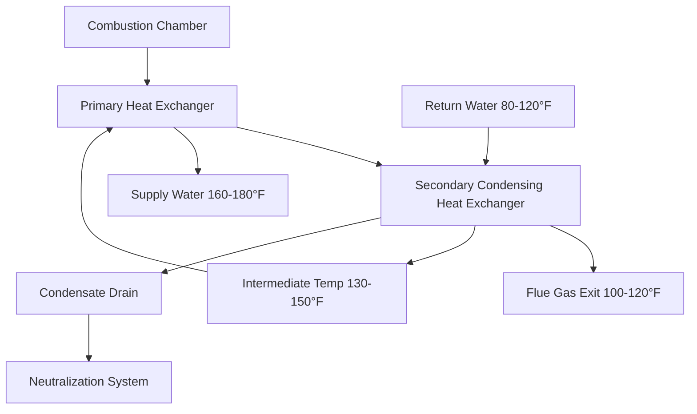

## Fundamental Operating Principle

Condensing boilers achieve thermal efficiencies exceeding 90% by recovering latent heat from water vapor in combustion products. Unlike conventional boilers that discharge flue gases above the water vapor dew point (approximately 135°F for natural gas), condensing boilers intentionally cool exhaust gases below this threshold to extract the enthalpy of vaporization.

The thermodynamic advantage stems from the phase change of water vapor to liquid, releasing approximately 970 Btu/lb at atmospheric pressure. For natural gas combustion, approximately 11% of the fuel's higher heating value (HHV) exists as latent heat in water vapor. Conventional boilers waste this energy; condensing boilers capture it.

### Energy Balance Equation

The total heat recovered in a condensing boiler:

$$Q_{total} = Q_{sensible} + Q_{latent} = \dot{m}_{fg} c_{p,fg} (T_{fg,in} - T_{fg,out}) + \dot{m}_{H_2O} h_{fg}$$

Where:
- $Q_{total}$ = total heat recovery (Btu/hr)
- $\dot{m}_{fg}$ = flue gas mass flow rate (lb/hr)
- $c_{p,fg}$ = specific heat of flue gases (Btu/lb·°F)
- $T_{fg,in}$ = flue gas inlet temperature (°F)
- $T_{fg,out}$ = flue gas outlet temperature (°F)
- $\dot{m}_{H_2O}$ = mass flow rate of condensed water vapor (lb/hr)
- $h_{fg}$ = latent heat of vaporization (Btu/lb)

## Condensation Physics and Dew Point

The dew point temperature of combustion products depends on fuel composition and excess air. For natural gas (primarily methane), each cubic foot produces approximately 0.11 lb of water vapor at complete combustion.

**Dew Point Temperatures by Fuel:**

| Fuel Type | Dew Point (°F) | Water Vapor Content |
|-----------|----------------|---------------------|
| Natural Gas | 135-140 | 18-20% by volume |
| Propane | 125-130 | 14-16% by volume |
| No. 2 Fuel Oil | 110-120 | 10-12% by volume |

The partial pressure of water vapor in flue gases determines condensation onset:

$$T_{dp} = \frac{B}{\ln(A/P_{H_2O}) - C}$$

Where $P_{H_2O}$ is the partial pressure of water vapor, and A, B, C are empirical constants from the Antoine equation.

## Heat Exchanger Design

### Material Requirements

Condensate from flue gases contains dissolved CO₂, forming carbonic acid with pH 3.5-5.0. Sulfur compounds (even in "clean" natural gas) produce sulfurous acid. Materials must resist this corrosive environment.

**Heat Exchanger Material Comparison:**

| Material | Max Temp (°F) | Corrosion Resistance | Thermal Conductivity | Cost Factor |
|----------|---------------|----------------------|----------------------|-------------|
| Stainless Steel 316L | 1400 | Excellent | 9.4 Btu/(hr·ft·°F) | 2.5-3.0x |
| Stainless Steel 439 | 1400 | Very Good | 14.4 Btu/(hr·ft·°F) | 2.0-2.5x |
| Aluminum Silicon (Al-Si) | 1200 | Good | 94 Btu/(hr·ft·°F) | 1.5-2.0x |
| Cast Iron (conventional) | 550 | Poor in acidic | 32 Btu/(hr·ft·°F) | 1.0x |

Stainless steel (particularly 316L with 2-3% molybdenum) provides superior resistance to chloride pitting and crevice corrosion. Aluminum-silicon alloys (8-12% Si) offer excellent thermal conductivity but require careful pH control.

### Heat Exchanger Configuration

The secondary heat exchanger operates in the condensing zone, extracting sensible heat down to approximately 100-120°F flue gas temperature and recovering latent heat as vapor condenses.

## Return Water Temperature Requirements

Condensing operation occurs only when return water temperature permits flue gas cooling below the dew point. This creates a critical relationship between system design and efficiency.

### Efficiency vs. Return Water Temperature

$$\eta_{condensing} = \eta_{base} + \eta_{latent} \cdot f(T_{return})$$

Where $f(T_{return})$ represents the fraction of condensing operation:

$$f(T_{return}) = \begin{cases}
1.0 & T_{return} \leq 110°F \\
\frac{135 - T_{return}}{25} & 110°F < T_{return} < 135°F \\
0 & T_{return} \geq 135°F
\end{cases}$$

**Efficiency Performance Table:**

| Return Water Temp (°F) | Condensing Mode | AFUE (%) | Thermal Efficiency (%) |
|------------------------|-----------------|----------|------------------------|
| 80 | Full | 96-98 | 95-97 |
| 100 | Full | 94-96 | 93-95 |
| 120 | Partial | 90-92 | 89-91 |
| 140 | Minimal | 86-88 | 85-87 |
| 160 | None | 82-84 | 81-83 |

ASHRAE 90.1-2022 recognizes this relationship in Section 6.5.4, requiring condensing boilers in applications with return water temperatures below 120°F.

## System Design Considerations

### Low-Temperature Distribution Systems

Condensing boilers achieve optimal performance with:

- Radiant floor heating (supply 90-120°F, return 70-100°F)
- Low-temperature radiators (supply 120-140°F, return 90-110°F)
- High-efficiency fan coils with large coil areas
- Weather-responsive reset controls reducing supply temperature

### Temperature Reset Strategy

Outdoor air reset maximizes condensing operation:

$$T_{supply} = T_{design} - (T_{design} - T_{min}) \cdot \frac{T_{outdoor} - T_{design,outdoor}}{T_{balance} - T_{design,outdoor}}$$

Typical reset schedule: 180°F at 0°F outdoor, 110°F at 60°F outdoor.

## Condensate Management

### Condensate Production Rate

Condensate volume depends on fuel input and condensing efficiency:

$$\dot{V}_{condensate} = \frac{Q_{input} \cdot 0.11 \cdot f_{condensing}}{8.33 \cdot 60}$$

Where $\dot{V}_{condensate}$ is in gallons per minute, $Q_{input}$ in Btu/hr.

A 1 million Btu/hr boiler in full condensing mode produces approximately 13 gallons per hour of condensate.

### Neutralization Requirements

Condensate pH ranges from 3.5-5.0, requiring neutralization before drainage to meet plumbing codes (typically pH > 5.5-6.0).

**Neutralization Methods:**

| Method | Media | Capacity | Replacement |
|--------|-------|----------|-------------|
| Limestone Chips | CaCO₃ | 2-3 lb per 100k Btu/hr | 6-12 months |
| Magnesia | MgO | 1.5-2 lb per 100k Btu/hr | 12-18 months |
| Inline Injection | NaOH solution | Variable | Continuous |

The neutralization reaction:

$$\text{CaCO}_3 + 2\text{H}^+ \rightarrow \text{Ca}^{2+} + \text{H}_2\text{O} + \text{CO}_2$$

## Combustion Air and Venting

Condensing boilers commonly use sealed combustion with direct vent systems. The reduced flue gas temperature (100-120°F) permits PVC, CPVC, or polypropylene venting materials, significantly reducing installation costs compared to stainless steel flues.

ASHRAE 62.2-2022 and IMC Chapter 7 govern combustion air requirements. Direct vent systems eliminate building depressurization concerns and improve safety.

## Performance Standards

ASHRAE 90.1-2022 establishes minimum thermal efficiency requirements:
- Gas-fired boilers <300k Btu/hr: 90% thermal efficiency (condensing required)
- Gas-fired boilers >300k Btu/hr: 92% combustion efficiency or 90% thermal efficiency

DOE efficiency standards mandate AFUE ≥95% for residential gas boilers <300k Btu/hr (effective 2028).

## Applications and Limitations

**Optimal Applications:**
- Hydronic radiant heating systems
- Low-temperature heating distribution
- High annual run-time installations
- New construction with integrated design

**Limitations:**
- Reduced efficiency with high return water temperatures
- Condensate disposal requirements
- Higher first cost (1.5-2.0x conventional boilers)
- Mineral buildup in heat exchangers in hard water areas

Condensing boilers represent the current efficiency standard for hydronic heating, achieving annual fuel utilization efficiency (AFUE) of 95-98% through latent heat recovery. Proper system design maintaining low return water temperatures ensures maximum efficiency realization.

---

*References: ASHRAE 90.1-2022, ASHRAE HVAC Systems and Equipment 2020, DOE 10 CFR 430, IMC 2021*